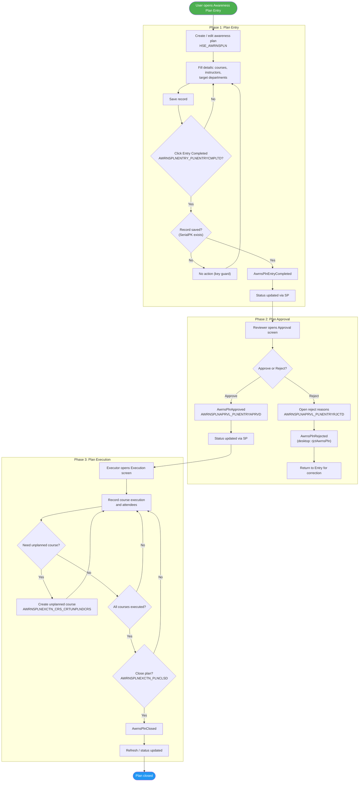
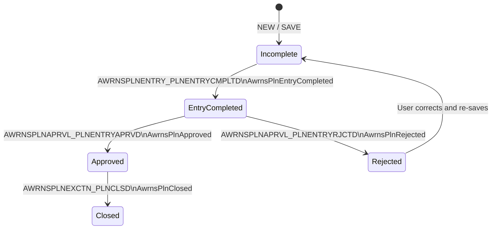
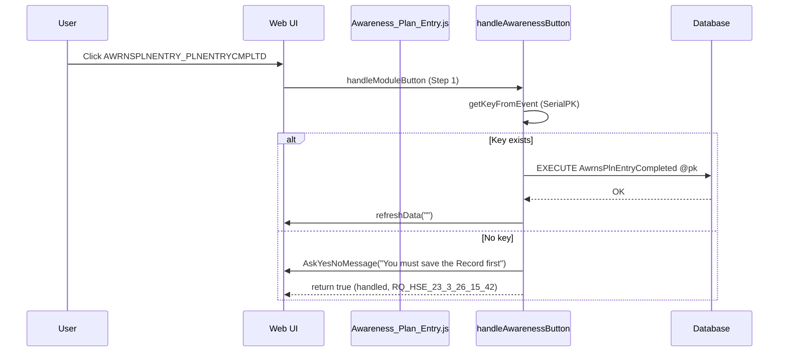
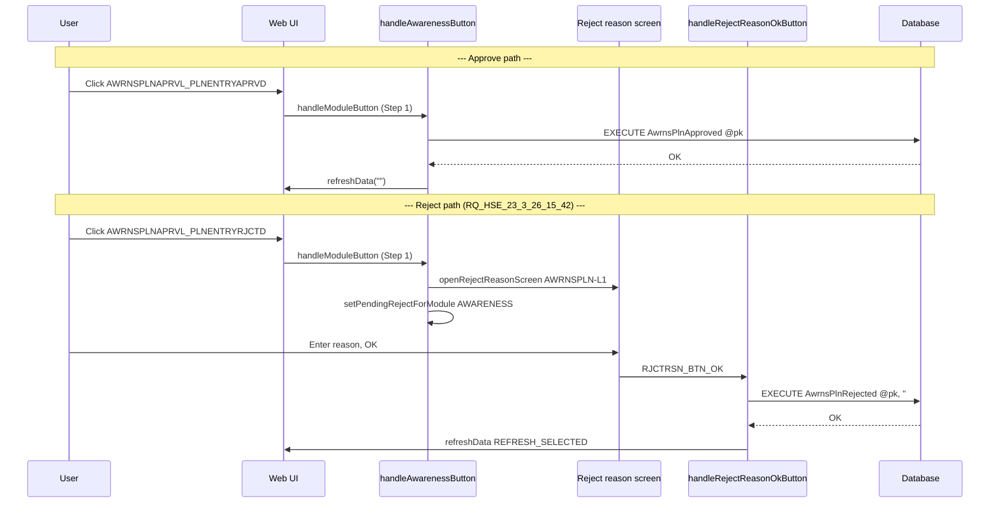
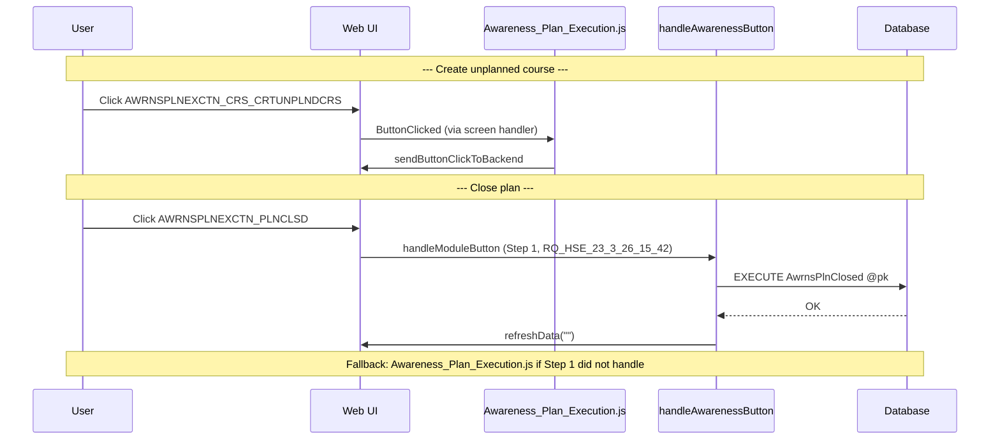
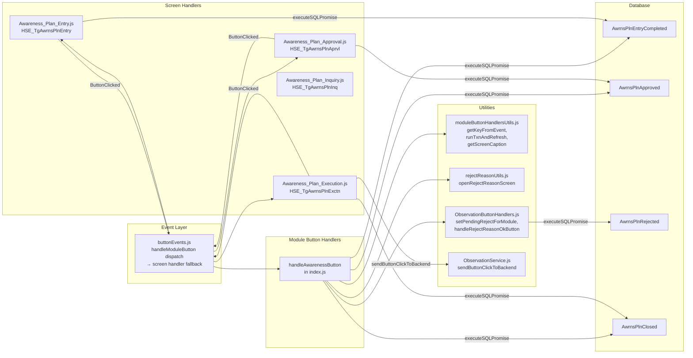

# Awareness / Training Plan Process – UML Documentation

<!-- RQ_HSE_23_3_26_15_42 -->

> **Source**: HSEMS C++ Desktop (`HSEMS-Win`) + Web (`hse` module)
> **Scope**: Awareness Plan lifecycle (`HSE_AWRNSPLN`): Entry → Approval → Execution → Close, with Reject path
> **Date**: March 2026
> **See also**: [`HSEMS_Use_Cases_From_Desktop_Code.md`](./HSEMS_Use_Cases_From_Desktop_Code.md) §2.8

---

## 1. Process overview

The **Awareness / Training Plan** track covers: **Entry → Entry Completed → Approval (Approve / Reject) → Execution → Close**.

The lifecycle manages training/awareness course plans including courses, instructors, and target departments. Once a plan is entered and completed, it goes through an approval gate. Approved plans move to execution where actual course delivery is recorded. After execution, the plan is closed.

**Screens and tags:**

| Screen | Web screen tag | C++ Category | Primary SPs | Screen handler |
|--------|----------------|--------------|-------------|----------------|
| Entry | `HSE_TgAwrnsPlnEntry` | `AwrnsPlnEntryCategory` | `AwrnsPlnEntryCompleted` | `Awareness_Plan_Entry.js` |
| Approval | `HSE_TgAwrnsPlnAprvl` | `AwrnsPlnAprvlCategory` | `AwrnsPlnApproved`, `AwrnsPlnRejected` | `Awareness_Plan_Approval.js` |
| Execution | `HSE_TgAwrnsPlnExctn` | `AwrnsPlnExctnCategory` | `AwrnsPlnClosed` | `Awareness_Plan_Execution.js` |
| Inquiry | `HSE_TgAwrnsPlnInq` | (read-only) | — | `Awareness_Plan_Inquiry.js` |

**Custom buttons** (desktop):

| Button | Description |
|--------|-------------|
| `AWRNSPLNENTRY_PLNENTRYCMPLTD` | Entry completed — submit for approval |
| `AWRNSPLNAPRVL_PLNENTRYAPRVD` | Approve plan |
| `AWRNSPLNAPRVL_PLNENTRYRJCTD` | Reject plan (with reasons) |
| `AWRNSPLNEXCTN_CRS_CRTUNPLNDCRS` | Create unplanned course during execution |
| `AWRNSPLNEXCTN_PLNCLSD` | Close plan after execution |

**Table**: `HSE_AWRNSPLN`; key field: `SerialPK`

---

## 2. Activity diagram – Awareness / Training Plan (end-to-end)

---

## 3. State machine

Status transitions enforced by stored procedures:

---

## 4. Sequence diagram – Entry Completed

> **Note**: Both `handleAwarenessButton` (module handler, Step 1) and `Awareness_Plan_Entry.js` (screen handler, Step 2) implement this SP call when a key exists. The module handler runs first; if it succeeds the screen handler is skipped. If there is no key, the module handler shows **save first** and returns `true` so Step 2 does not run (**RQ_HSE_23_3_26_15_42**).

---

## 5. Sequence diagram – Approval and Reject

---

## 6. Sequence diagram – Execution and Close

---

## 7. Component diagram – Web architecture

---

## 8. Setup screens (master data)

| Screen | Tag | Purpose | Handler |
|--------|-----|---------|---------|
| Awareness Courses | `HSE_TgAwrnsCrs` | Define available training courses | `Awareness_Courses.js` (toolbar only) |

---

## 9. Button dispatch — dual handler analysis

The Awareness module has an unusual pattern: some buttons are handled by **both** the centralized `handleAwarenessButton` (Step 1 in `buttonEvents.js`) **and** the screen-specific `ButtonClicked` (Step 2). Since Step 1 runs first and returns `true` on success, Step 2 only fires as a fallback.

| Button | handleAwarenessButton (Step 1) | Screen handler (Step 2) | Effective path |
|--------|-------------------------------|-------------------------|----------------|
| `AWRNSPLNENTRY_PLNENTRYCMPLTD` | `AwrnsPlnEntryCompleted` → `runTxnAndRefresh` | `AwrnsPlnEntryCompleted` → `executeSQLPromise` | Step 1 (module handler) |
| `AWRNSPLNAPRVL_PLNENTRYAPRVD` | `AwrnsPlnApproved` → `runTxnAndRefresh` | `AwrnsPlnApproved` → `executeSQLPromise` | Step 1 (module handler) |
| `AWRNSPLNAPRVL_PLNENTRYRJCTD` | `openRejectReasonScreen` + `setPendingRejectForModule('AWARENESS')` → `AwrnsPlnRejected` (**RQ_HSE_23_3_26_15_42**) | `sendButtonClickToBackend` (fallback if Step 1 skipped) | Step 1 (module handler) |
| `AWRNSPLNEXCTN_CRS_CRTUNPLNDCRS` | Not handled | `sendButtonClickToBackend` | Step 2 (screen handler) |
| `AWRNSPLNEXCTN_PLNCLSD` | `AwrnsPlnClosed` → `runTxnAndRefresh` (**RQ_HSE_23_3_26_15_42**) | `AwrnsPlnClosed` → `executeSQLPromise` | Step 1 (module handler) |

---

## 10. Workflow buttons – implementation status

| Button | Desktop behaviour | Web implementation | Status |
|--------|-------------------|--------------------|--------|
| `AWRNSPLNENTRY_PLNENTRYCMPLTD` | `AwrnsPlnEntryCompleted` | Module handler + screen handler both call SP | **OK** |
| `AWRNSPLNAPRVL_PLNENTRYAPRVD` | `AwrnsPlnApproved` | Module handler + screen handler both call SP | **OK** |
| `AWRNSPLNAPRVL_PLNENTRYRJCTD` | `OpenReasonsScr` → `rjctAwrnsPln` (`AwrnsPlnRejected`) | Reject reason screen + `handleRejectReasonOkButton` `case 'AWARENESS'` → `EXECUTE AwrnsPlnRejected` (**RQ_HSE_23_3_26_15_42**) | **OK** |
| `AWRNSPLNEXCTN_CRS_CRTUNPLNDCRS` | `createUnPlndCrs` (backend) | Screen handler: `sendButtonClickToBackend` | **OK** (backend delegation) |
| `AWRNSPLNEXCTN_PLNCLSD` | `AwrnsPlnClosed` | Module handler `runTxnAndRefresh`; screen handler fallback (**RQ_HSE_23_3_26_15_42**) | **OK** |

---

## 11. Known gaps vs desktop

| # | Gap | Impact | Resolution |
|---|-----|--------|------------|
| 1 | ~~**Reject has no reasons popup**~~ | ~~Medium~~ | **Resolved (RQ_HSE_23_3_26_15_42):** `openRejectReasonScreen('AWRNSPLN-L1', key)` + `setPendingRejectForModule('AWARENESS', …)` + `handleRejectReasonOkButton` → `EXECUTE AwrnsPlnRejected`. Reason text stored in `HSE_RJCTRSN`; SP second parameter `''` (desktop passes dialog text). |
| 2 | ~~**Close button not in module handler**~~ | ~~Low~~ | **Resolved (RQ_HSE_23_3_26_15_42):** `AWRNSPLNEXCTN_PLNCLSD` handled in `handleAwarenessButton` via `runTxnAndRefresh` / `AwrnsPlnClosed`. |
| 3 | ~~**No key guard message on Entry Complete**~~ | ~~Low~~ | **Resolved (RQ_HSE_23_3_26_15_42):** `AskYesNoMessage('You must save the Record first')` when no `SerialPK` on `AWRNSPLNENTRY_PLNENTRYCMPLTD`. |

**Screen captions for tracing:** `getScreenCaption` maps for `HSE_TGAWRNSPLNENTRY`, `HSE_TGAWRNSPLNAPRVL`, `HSE_TGAWRNSPLNEXCTN` in [`moduleButtonHandlersUtils.js`](hse/src/services/ModuleButtonHandlers/moduleButtonHandlersUtils.js) (**RQ_HSE_23_3_26_15_42**).

---

*End of Awareness / Training Plan UML documentation*
<!-- RQ_HSE_23_3_26_15_42 -->
