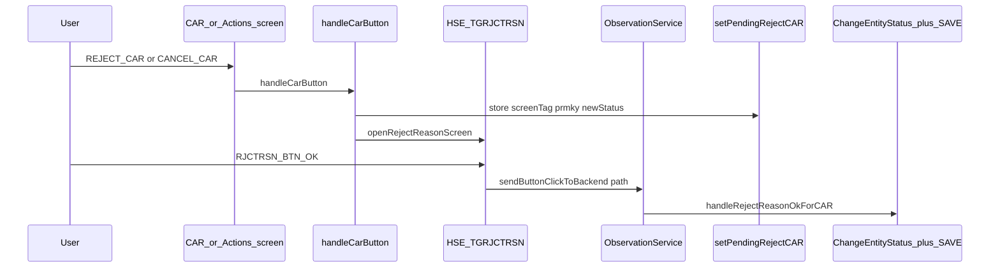

# CAR — Lifecycle process (activity view)

**Status:** Draft — *Under review → Approved (date, reviewer)*  
**Inputs:** [CAR_Desktop_Behaviour_Spec.md](./CAR_Desktop_Behaviour_Spec.md) (approved)  
**Next document:** [CAR_Web_Implementation_Map.md](./CAR_Web_Implementation_Map.md) (after approval)

---

## 1. Narrative

The CAR header (`HSE_CRENTRY` / `CRENTRY_CRSTT`) progresses through **multi-stage** steps: entry and completion, **review** (accept / reject), **approval** (approve / cancel / reject), **actions** (entry completion, review accept, close), and **follow-up** (reject / close). **Reject** and **cancel** flows open the **reject reason** screen; on OK, web runs `ChangeEntityStatus` and sets a **screen-specific** status code.

Corrective actions are edited in **popups** and sub-tabs; **Actions Under Execution** assigns line serials on **NEW** (toolbar), matching desktop tab behaviour.

---

## 2. Header status flow (web-implemented values)

Values below are set in [hse/src/utils/carCustomButtons.js](hse/src/utils/carCustomButtons.js).

```mermaid
flowchart TB
  subgraph entry [CAR Entry]
    E1[ENTRY_COMPLETED]
  end
  subgraph review [CAR Review]
    R1[ACCEPT_CAR]
    R2[REJECT_CAR]
  end
  subgraph appr [CAR Approval]
    A1[APPROVE_CAR]
    A2[CANCEL_CAR]
    A3[REJECT_CAR]
  end
  subgraph act [Actions Entry / Review]
    N1[ENTRY_COMPLETED Actions Entry]
    N2[ACCEPT_CAR Actions Review]
    N3[CLOSE_CAR]
    N4[REJECT_CAR]
  end
  subgraph flo [CAR Follow-up]
    F1[CLOSE_CAR]
    F2[REJECT_CAR]
  end
  E1 -->|CRENTRY_CRSTT 05| S05[Status 05]
  R1 -->|CRENTRY_CRSTT 10| S10[Status 10]
  R2 -->|CRENTRY_CRSTT 02| S02[Status 02]
  A1 -->|CRENTRY_CRSTT 15| S15[Status 15]
  A2 -->|CRENTRY_CRSTT 20| S20[Status 20]
  A3 -->|CRENTRY_CRSTT 06| S06[Status 06]
  N1 -->|CRENTRY_CRSTT 16| S16[Status 16]
  N2 -->|CRENTRY_CRSTT 19| S19[Status 19]
  N3 -->|CRENTRY_CRSTT 25| S25[Status 25]
  N4 -->|CRENTRY_CRSTT 12| S12[Status 12]
  F1 -->|CRENTRY_CRSTT 25| S25
  F2 -->|CRENTRY_CRSTT 15| S15b[Status 15]
```

---

## 3. Reject / cancel pipeline

---

## 4. Corrective actions popups (by screen)

| Screen tag | Button | Popup tag |
|------------|--------|-----------|
| `HSE_TGCRAPRVL`, `HSE_TGCREDTNG` | `CORRECTIVE_ACTIONS` | `HSE_TGCRRCTVACTNS` |
| `HSE_TGACTNSRVIW` | `CORRECTIVE_ACTIONS` | `HSE_TgCrrctvActns_Rvw` |
| `HSE_TGCRFLOUP` | `CORRECTIVE_ACTIONS` | `HSE_TgCrrctvActnsFlwUp` |
| `HSE_TGACTNSENTRY` | `CORRECTIVE_ACTIONS` | `HSE_TgCrrctvActns_ActEnt` |

---

## 5. Document control

| Version | Date | Notes |
|---------|------|--------|
| 0.1 | 2026-03-28 | Derived from `carCustomButtons.js`; desktop diagram node IDs can be aligned in a future revision |
