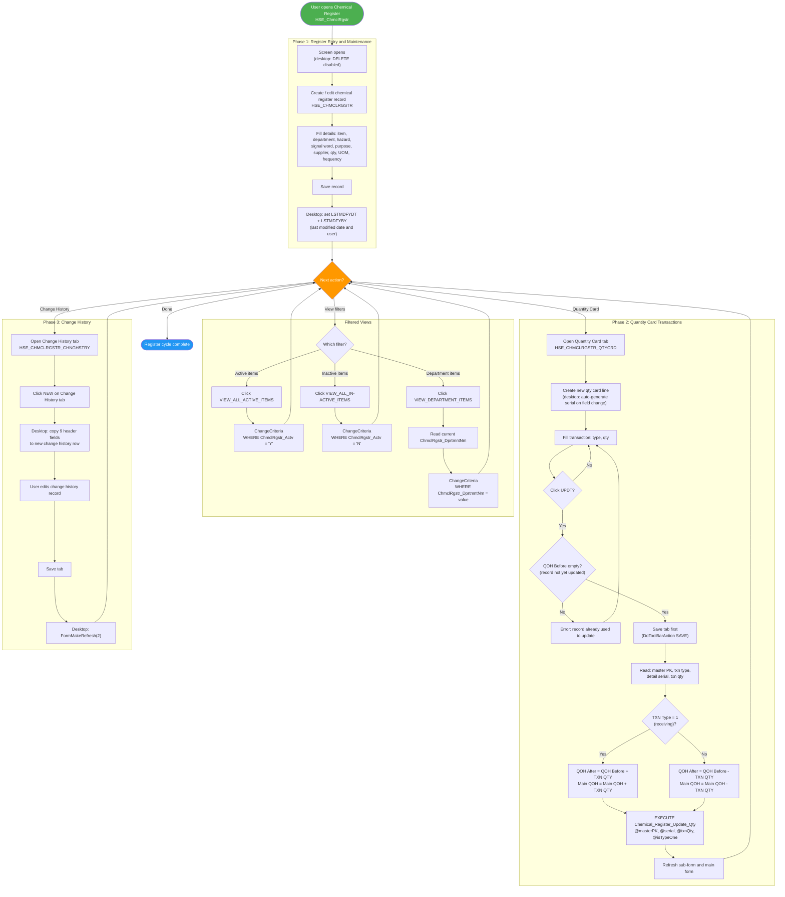
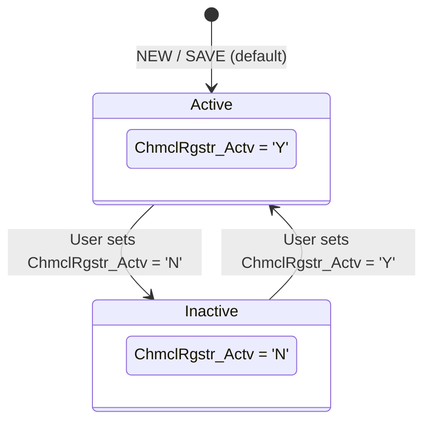
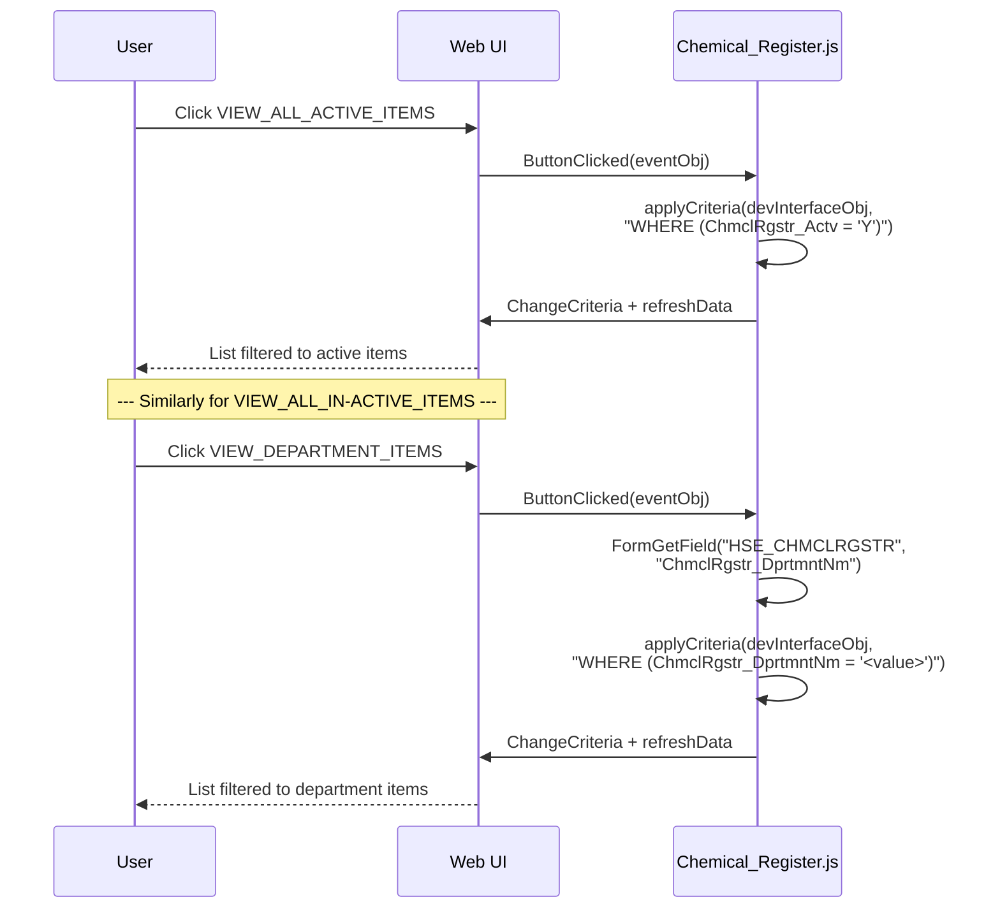
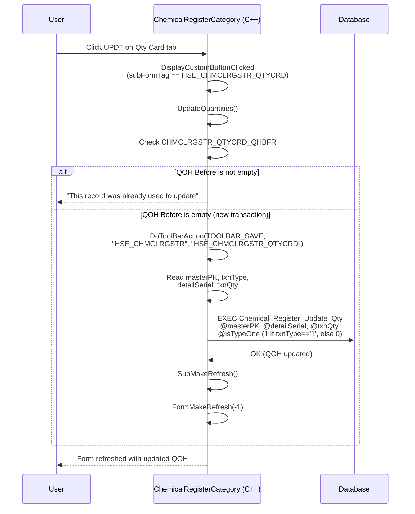
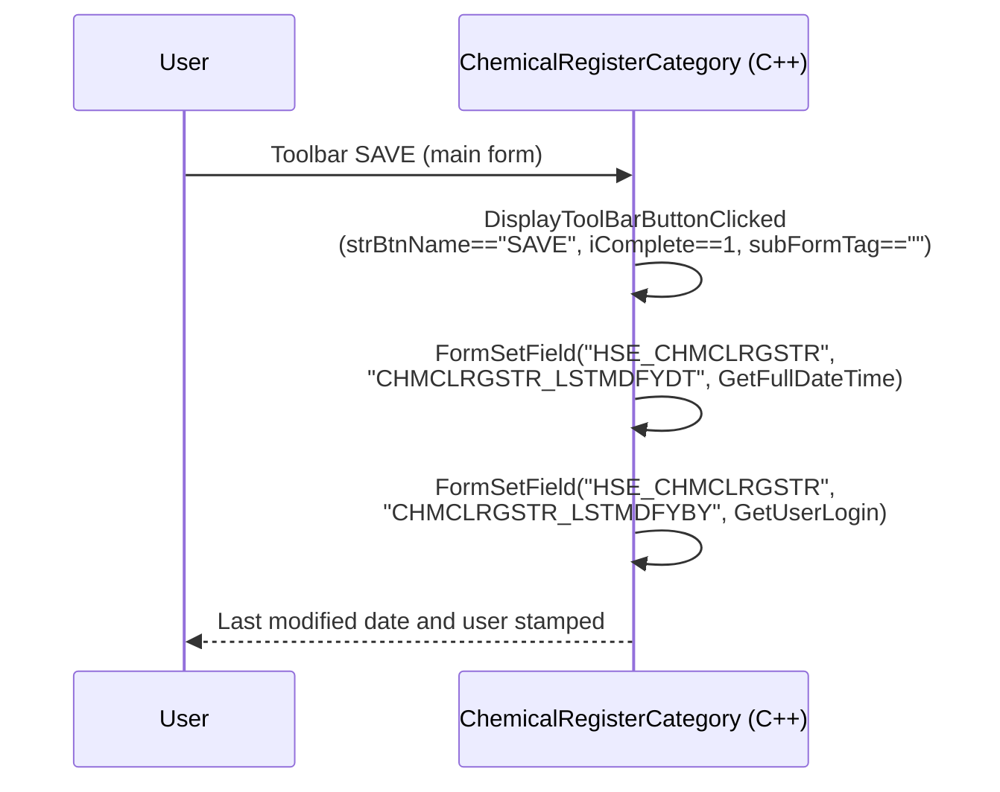
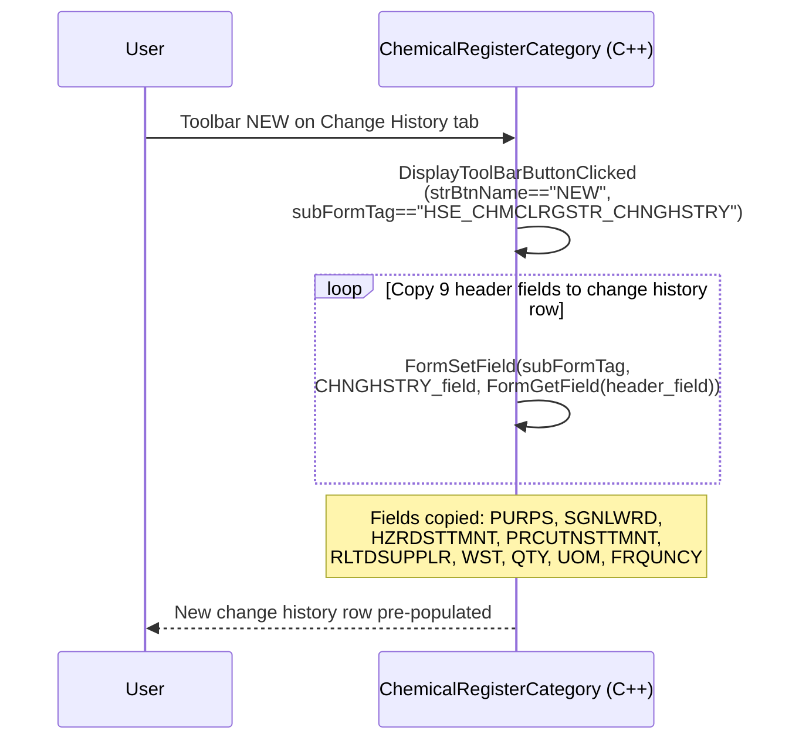
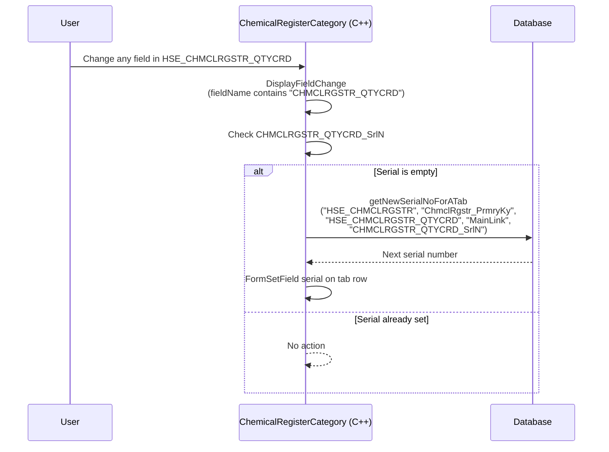
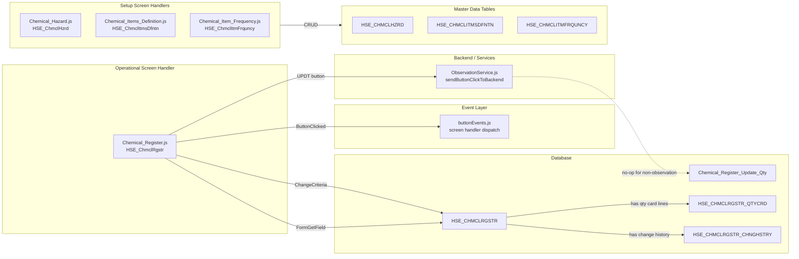
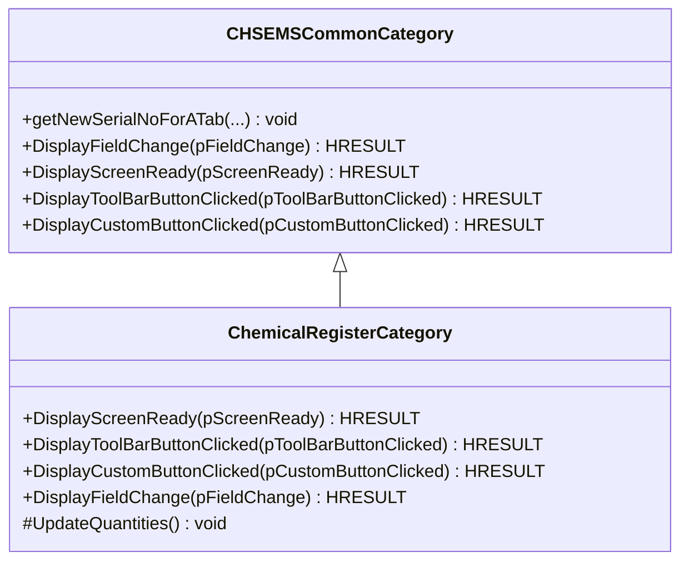

# Chemical Register Process -- UML Documentation

<!-- RQ_HSE_23_3_26_20_48 -->

> **Source**: HSEMS C++ Desktop (`HSEMS-Win`, `ChemicalRegisterCategory.cpp`) + Web (`hse` module)
> **Scope**: Chemical Register lifecycle from **Setup** through **Register Entry**, **Quantity Card Transactions**, **Change History**, and **Filtered Views**
> **Date**: March 2026
> **See also**: [`HSEMS_Use_Cases_From_Desktop_Code.md`](./HSEMS_Use_Cases_From_Desktop_Code.md) §3.2

---

## 1. Process overview

The **Chemical Register** module manages chemical materials on-site under **Environment -> Chemical Register**, supported by three **Setup** master-data screens under **Setup -> Chemical**.

Unlike PTW or Waste Management, the Chemical Register does **not** follow a status-based workflow with completion/approval phases. It is a **register/CRUD** module with:
- An **Active/Inactive** flag for filtering views
- A **Quantity Card** sub-form (`HSE_CHMCLRGSTR_QTYCRD`) for recording quantity transactions (receiving, dispensing, etc.)
- A **Change History** sub-form (`HSE_CHMCLRGSTR_CHNGHSTRY`) for tracking field-level changes over time
- Custom buttons for **filtered views** (active, inactive, by department)

### 1.1 Setup screens (master data)

| Screen | Tag | Table / Entity | Purpose |
|--------|-----|----------------|---------|
| Chemical Hazard | `HSE_ChmclHzrd` | `HSE_CHMCLHZRD` | Define chemical hazard classifications |
| Chemical Items Definition | `HSE_ChmclItmsDfntn` | `HSE_CHMCLITMSDFNTN` | Define the catalogue of chemical items |
| Chemical Item Frequency | `HSE_ChmclItmFrquncy` | `HSE_CHMCLITMFRQUNCY` | Define usage/inspection frequency for chemical items |

### 1.2 Operational screen

| Screen | Tag | C++ Category | Table | Key field | Handler |
|--------|-----|--------------|-------|-----------|---------|
| Chemical Register | `HSE_ChmclRgstr` | `ChemicalRegisterCategory` | `HSE_CHMCLRGSTR` | `ChmclRgstr_PrmryKy` | `Chemical_Register.js` |

### 1.3 Sub-forms (tabs)

| Tab | Tag | Table | Purpose |
|-----|-----|-------|---------|
| Quantity Card | `HSE_CHMCLRGSTR_QTYCRD` | `HSE_CHMCLRGSTR_QTYCRD` | Record quantity transactions (type, qty, QOH before/after) |
| Change History | `HSE_CHMCLRGSTR_CHNGHSTRY` | `HSE_CHMCLRGSTR_CHNGHSTRY` | Snapshot of header fields at time of change |

### 1.4 Stored procedures

| SP | Purpose |
|----|---------|
| `Chemical_Register_Update_Qty` | Update QOH on main record and QOH After on qty card line based on transaction type |

### 1.5 Custom buttons

| Button | Behaviour (desktop) |
|--------|---------------------|
| `VIEW_ALL_ACTIVE_ITEMS` | `ChangeCriteria` WHERE `ChmclRgstr_Actv = 'Y'` |
| `VIEW_ALL_IN-ACTIVE_ITEMS` | `ChangeCriteria` WHERE `ChmclRgstr_Actv = 'N'` |
| `VIEW_DEPARTMENT_ITEMS` | `ChangeCriteria` WHERE `ChmclRgstr_DprtmntNm = <current department>` |
| `UPDT` (on Qty Card tab) | Save tab, then `EXECUTE Chemical_Register_Update_Qty` to adjust QOH |

### 1.6 Desktop toolbar behaviour

| Event | Condition | Action |
|-------|-----------|--------|
| Screen Ready | Always | Disable DELETE toolbar button |
| SAVE (main form, iComplete==1) | Main form | Set `CHMCLRGSTR_LSTMDFYDT` = current date, `CHMCLRGSTR_LSTMDFYBY` = current user |
| NEW on Change History tab | `subFormTag == HSE_CHMCLRGSTR_CHNGHSTRY` | Copy 9 header fields to new change history row |
| SAVETAB on Change History tab | iComplete==1 | `FormMakeRefresh(2)` |
| Field change on Qty Card | Any field in `HSE_CHMCLRGSTR_QTYCRD` | Auto-generate serial number if blank |

---

## 2. Activity diagram -- Chemical Register (end-to-end)

<!-- RQ_HSE_23_3_26_20_48 -->



---

## 3. State machine -- Active/Inactive (register record)

The Chemical Register does not use a numeric status workflow. Instead, it uses an **Active/Inactive** flag (`ChmclRgstr_Actv`) for filtering.



---

## 4. Sequence diagram -- Filtered Views (Active / Inactive / Department)



---

## 5. Sequence diagram -- Quantity Card Update (UPDT button, desktop)

<!-- RQ_HSE_23_3_26_20_48 -->



---

## 6. Sequence diagram -- SAVE on main form (desktop audit fields)



---

## 7. Sequence diagram -- NEW on Change History tab (desktop field copy)



---

## 8. Sequence diagram -- Field change on Qty Card (desktop serial auto-generation)



---

## 9. Component diagram -- Web architecture

<!-- RQ_HSE_23_3_26_20_48 -->



---

## 10. Desktop toolbar and field-change logic

### 10.1 DisplayScreenReady

```cpp
EnableToolbar("", TOOLBAR_DELETE, FALSE);
```

DELETE button is disabled when the Chemical Register screen first opens. The user cannot delete chemical register records from the toolbar.

### 10.2 DisplayToolBarButtonClicked -- SAVE (main form)

| Trigger | Condition | Action |
|---------|-----------|--------|
| SAVE | `iComplete==1`, `subFormTag==""` | `FormSetField("HSE_CHMCLRGSTR", "CHMCLRGSTR_LSTMDFYDT", GetFullDateTime("%d/%m/%Y"))` |
| | | `FormSetField("HSE_CHMCLRGSTR", "CHMCLRGSTR_LSTMDFYBY", GetUserLogin())` |

### 10.3 DisplayToolBarButtonClicked -- NEW (Change History tab)

When a new row is created on the Change History tab, 9 fields are copied from the current header:

| Source (header) | Target (change history row) |
|-----------------|----------------------------|
| `CHMCLRGSTR_PURPS` | `CHMCLRGSTR_CHNGHSTRY_PURPS` |
| `CHMCLRGSTR_SGNLWRD` | `CHMCLRGSTR_CHNGHSTRY_SGNLWRD` |
| `CHMCLRGSTR_HZRDSTTMNT` | `CHMCLRGSTR_CHNGHSTRY_HZRDSTTMNT` |
| `CHMCLRGSTR_PRCUTNSTTMNT` | `CHMCLRGSTR_CHNGHSTRY_PRCUTNSTTMNT` |
| `CHMCLRGSTR_RLTDSUPPLR` | `CHMCLRGSTR_CHNGHSTRY_RLTDSUPPLR` |
| `CHMCLRGSTR_WST` | `CHMCLRGSTR_CHNGHSTRY_WST` |
| `CHMCLRGSTR_QTY` | `CHMCLRGSTR_CHNGHSTRY_QTY` |
| `CHMCLRGSTR_UOM` | `CHMCLRGSTR_CHNGHSTRY_UOM` |
| `CHMCLRGSTR_FRQUNCY` | `CHMCLRGSTR_CHNGHSTRY_FRQUNCY` |

### 10.4 DisplayToolBarButtonClicked -- SAVETAB

| Tab | Condition | Action |
|-----|-----------|--------|
| Change History (`HSE_CHMCLRGSTR_CHNGHSTRY`) | `iComplete==1` | `FormMakeRefresh(2)` |
| Qty Card (`HSE_CHMCLRGSTR_QTYCRD`) | `iComplete==1` | *Commented out* (`//UpdateQuantities()`) |

### 10.5 DisplayFieldChange -- Qty Card serial auto-generation

When any field in `HSE_CHMCLRGSTR_QTYCRD` is changed and `CHMCLRGSTR_QTYCRD_SrlN` is empty, `getNewSerialNoForATab` generates the next serial number for the qty card line.

### 10.6 UpdateQuantities -- UPDT custom button

| Step | Action |
|------|--------|
| 1 | Check `CHMCLRGSTR_QTYCRD_QHBFR` -- if not empty, show error "This record was already used to update" |
| 2 | `DoToolBarAction(TOOLBAR_SAVE, "HSE_CHMCLRGSTR", "HSE_CHMCLRGSTR_QTYCRD")` -- save the qty card tab |
| 3 | Read `strMasterPK`, `strTxnType`, `strDtlSrial`, `strTxnQty` from form fields |
| 4 | `EXEC Chemical_Register_Update_Qty @masterPK, @detailSerial, @txnQty, @isTypeOne` |
| 5 | `SubMakeRefresh()` + `FormMakeRefresh(-1)` |

The SP logic (inferred from C++ comment):
- If TXN Type = 1 (receiving): `QOH After = QOH Before + TXN QTY`, `Main QOH += TXN QTY`
- If TXN Type > 1 (dispensing/etc.): `QOH After = QOH Before - TXN QTY`, `Main QOH -= TXN QTY`

---

## 11. Workflow buttons -- implementation status

<!-- RQ_HSE_23_3_26_20_48 -->

### 11.1 Custom buttons

| Button | Desktop behaviour | Web implementation | Status |
|--------|-------------------|--------------------|--------|
| `VIEW_ALL_ACTIVE_ITEMS` | `ChangeCriteria` WHERE `Actv = 'Y'` | `applyCriteria(devInterfaceObj, "WHERE (ChmclRgstr_Actv = 'Y')")` in `Chemical_Register.js` line 44-45 | **OK** |
| `VIEW_ALL_IN-ACTIVE_ITEMS` | `ChangeCriteria` WHERE `Actv = 'N'` | `applyCriteria(devInterfaceObj, "WHERE (ChmclRgstr_Actv = 'N')")` in `Chemical_Register.js` line 48-49 | **OK** |
| `VIEW_DEPARTMENT_ITEMS` | `ChangeCriteria` WHERE `DprtmntNm = <value>` | `FormGetField` + `applyCriteria` in `Chemical_Register.js` line 51-56 | **OK** |
| `UPDT` (Qty Card tab) | `UpdateQuantities()` -> `Chemical_Register_Update_Qty` SP | `sendButtonClickToBackend()` in `Chemical_Register.js` line 59 -- **effectively a no-op** (ObservationService ignores non-observation screens) | **MISSING** |

### 11.2 Toolbar behaviour

| Event | Desktop behaviour | Web implementation | Status |
|-------|-------------------|--------------------|--------|
| Screen Ready | `EnableToolbar("", TOOLBAR_DELETE, FALSE)` | `ShowScreen` calls `setScreenDisableBtn(false, false, false)` -- DELETE remains **enabled** | **MISSING** |
| SAVE (main form) | Set `LSTMDFYDT` + `LSTMDFYBY` | Not implemented; no `toolBarButtonClicked` export | **MISSING** |
| NEW on Change History tab | Copy 9 header fields to new row | Not implemented; no `toolBarButtonClicked` export | **MISSING** |
| SAVETAB on Change History tab | `FormMakeRefresh(2)` | Not implemented; no `toolBarButtonClicked` export | **MISSING** |
| Field change on Qty Card | Auto-generate serial if blank | Not implemented; no `SubFieldChanged` export | **MISSING** |

---

## 12. Known gaps vs desktop

<!-- RQ_HSE_23_3_26_20_48 -->

| # | Gap | Impact | Resolution |
|---|-----|--------|------------|
| 1 | **DELETE toolbar not disabled on screen ready** -- desktop `DisplayScreenReady` disables DELETE; web `ShowScreen` enables all three | **Low-Medium** -- user could delete chemical register records from toolbar; backend constraints may prevent actual deletion | Requires `ShowScreen` to call `setScreenDisableBtn(false, false, true)` |
| 2 | **Last modified date/user not set on SAVE** -- desktop sets `CHMCLRGSTR_LSTMDFYDT` and `CHMCLRGSTR_LSTMDFYBY` on main form save | **Medium** -- audit trail fields remain blank or stale | Requires `toolBarButtonClicked` export for SAVE on main form |
| 3 | **Change History NEW does not copy header fields** -- desktop copies 9 fields from header to new change history row | **Medium** -- user must manually re-enter values or leave them blank, losing the snapshot purpose of change history | Requires `toolBarButtonClicked` export for NEW on Change History tab |
| 4 | **Change History SAVETAB does not refresh** -- desktop calls `FormMakeRefresh(2)` after saving change history tab | **Low** -- display may be stale until user navigates away | Requires `toolBarButtonClicked` export for SAVETAB on Change History tab |
| 5 | **UPDT button is a no-op** -- web dispatches to `sendButtonClickToBackend` which only handles observation screens; `Chemical_Register_Update_Qty` SP is never called | **High** -- quantity transactions are saved but QOH fields are never updated; QOH on main record stays stale | Requires direct `executeSQLPromise` call to `Chemical_Register_Update_Qty` with pre-check for QOH Before |
| 6 | **Qty Card serial auto-generation missing** -- desktop auto-generates `CHMCLRGSTR_QTYCRD_SrlN` on any field change in qty card tab | **Medium** -- serial number must be entered manually or left blank | Requires `SubFieldChanged` export or `toolBarButtonClicked` for NEW on qty card tab |

---

## 13. Setup screens -- implementation status

| Screen | Tag | Web handler | Exports | Status |
|--------|-----|-------------|---------|--------|
| Chemical Hazard | `HSE_ChmclHzrd` | `Chemical_Hazard.js` | `ShowScreen` (toolbar enable) | **OK** (minimal, matches desktop) |
| Chemical Items Definition | `HSE_ChmclItmsDfntn` | `Chemical_Items_Definition.js` | `ShowScreen` (toolbar enable) | **OK** (minimal, matches desktop) |
| Chemical Item Frequency | `HSE_ChmclItmFrquncy` | `Chemical_Item_Frequency.js` | `ShowScreen` (toolbar enable) | **OK** (minimal, matches desktop) |

---

## 14. Database entity relationships

<!-- RQ_HSE_23_3_26_20_48 -->

```mermaid
erDiagram
    HSE_CHMCLRGSTR {
        string ChmclRgstr_PrmryKy PK "Primary key"
        string ChmclRgstr_Actv "Active flag (Y/N)"
        string ChmclRgstr_DprtmntNm "Department name"
        string CHMCLRGSTR_PURPS "Purpose"
        string CHMCLRGSTR_SGNLWRD "Signal word"
        string CHMCLRGSTR_HZRDSTTMNT "Hazard statement"
        string CHMCLRGSTR_PRCUTNSTTMNT "Precaution statement"
        string CHMCLRGSTR_RLTDSUPPLR "Related supplier"
        string CHMCLRGSTR_WST "Waste"
        float CHMCLRGSTR_QTY "Quantity (QOH)"
        string CHMCLRGSTR_UOM "Unit of measure"
        string CHMCLRGSTR_FRQUNCY "Frequency"
        string CHMCLRGSTR_LSTMDFYDT "Last modified date"
        string CHMCLRGSTR_LSTMDFYBY "Last modified by"
    }

    HSE_CHMCLRGSTR_QTYCRD {
        string MainLink FK "Link to register PK"
        string CHMCLRGSTR_QTYCRD_SrlN "Serial number"
        string CHMCLRGSTR_QTYCRD_TXNTYP "Transaction type (1=receive, >1=dispense)"
        float CHMCLRGSTR_QtyCrd_TxnQty "Transaction quantity"
        float CHMCLRGSTR_QTYCRD_QHBFR "QOH before"
        float CHMCLRGSTR_QTYCRD_QHAFTR "QOH after"
    }

    HSE_CHMCLRGSTR_CHNGHSTRY {
        string MainLink FK "Link to register PK"
        string CHMCLRGSTR_CHNGHSTRY_PURPS "Purpose (snapshot)"
        string CHMCLRGSTR_CHNGHSTRY_SGNLWRD "Signal word (snapshot)"
        string CHMCLRGSTR_CHNGHSTRY_HZRDSTTMNT "Hazard statement (snapshot)"
        string CHMCLRGSTR_CHNGHSTRY_PRCUTNSTTMNT "Precaution statement (snapshot)"
        string CHMCLRGSTR_CHNGHSTRY_RLTDSUPPLR "Related supplier (snapshot)"
        string CHMCLRGSTR_CHNGHSTRY_WST "Waste (snapshot)"
        float CHMCLRGSTR_CHNGHSTRY_QTY "Quantity (snapshot)"
        string CHMCLRGSTR_CHNGHSTRY_UOM "UOM (snapshot)"
        string CHMCLRGSTR_CHNGHSTRY_FRQUNCY "Frequency (snapshot)"
    }

    HSE_CHMCLHZRD {
        string PK PK "Hazard code"
    }

    HSE_CHMCLITMSDFNTN {
        string PK PK "Item definition code"
    }

    HSE_CHMCLITMFRQUNCY {
        string PK PK "Frequency code"
    }

    HSE_CHMCLRGSTR ||--o{ HSE_CHMCLRGSTR_QTYCRD : "has qty card lines"
    HSE_CHMCLRGSTR ||--o{ HSE_CHMCLRGSTR_CHNGHSTRY : "has change history"
    HSE_CHMCLRGSTR }o--o| HSE_CHMCLITMSDFNTN : "chemical item"
    HSE_CHMCLRGSTR }o--o| HSE_CHMCLHZRD : "hazard classification"
    HSE_CHMCLRGSTR }o--o| HSE_CHMCLITMFRQUNCY : "frequency"
```

---

## 15. Class hierarchy (desktop C++)

<!-- RQ_HSE_23_3_26_20_48 -->



---

## 16. Validation -- Activity diagram §2 vs web implementation (post-gap)

<!-- RQ_HSE_23_3_26_20_48 -->

Each node in the §2 activity diagram was traced against the web source after
implementing gaps G1-G6 in `Chemical_Register.js`:

- `Chemical_Register.js` (screen handler -- `ShowScreen`, `ButtonClicked`, `toolBarButtonClicked`, `SubFieldChanged`)
- `buttonEvents.js` (event dispatch -- delegates `toolBarButtonClicked` to handler)
- `screenHandlers/index.js` (registration -- `HSE_ChmclRgstr` mapped)
- `screenEvents.js` (field change / reposition dispatch -- `SubFieldChanged` delegation added in prior Waste Management work)

### 16.1 Phase 1: Register Entry and Maintenance

| Node | Activity | Web evidence | Status |
|------|----------|-------------|--------|
| **A1** | Screen opens (desktop: DELETE disabled) | `ShowScreen` calls `setScreenDisableBtn(false, false, true)` -- G1 resolved | **COVERED** |
| **A2** | Create / edit chemical register record | Platform CRUD; `ShowScreen` enables NEW + SAVE | **COVERED** |
| **A3** | Fill details: item, department, hazard, etc. | Platform form fields | **COVERED** |
| **A4** | Save record | Platform SAVE toolbar | **COVERED** |
| **A5** | Set LSTMDFYDT + LSTMDFYBY | `toolBarButtonClicked` SAVE complete=1 tab='' sets both fields -- G2 resolved | **COVERED** |

### 16.2 Filtered Views

| Node | Activity | Web evidence | Status |
|------|----------|-------------|--------|
| **F2** | Click VIEW_ALL_ACTIVE_ITEMS | `ButtonClicked` → `applyCriteria` | **COVERED** |
| **F3** | ChangeCriteria WHERE Actv = 'Y' | `applyCriteria` | **COVERED** |
| **F4** | Click VIEW_ALL_IN-ACTIVE_ITEMS | `ButtonClicked` → `applyCriteria` | **COVERED** |
| **F5** | ChangeCriteria WHERE Actv = 'N' | `applyCriteria` | **COVERED** |
| **F6** | Click VIEW_DEPARTMENT_ITEMS | `ButtonClicked` → `FormGetField` + `applyCriteria` | **COVERED** |
| **F7** | Read current ChmclRgstr_DprtmntNm | `FormGetField` in `ButtonClicked` | **COVERED** |
| **F8** | ChangeCriteria WHERE DprtmntNm = value | `applyCriteria` | **COVERED** |

### 16.3 Phase 2: Quantity Card Transactions

| Node | Activity | Web evidence | Status |
|------|----------|-------------|--------|
| **Q1** | Open Quantity Card tab | Platform tab navigation | **COVERED** |
| **Q2** | Create new qty card line (desktop: auto-serial) | `SubFieldChanged` auto-generates serial via SQL MAX+1 -- G4 resolved | **COVERED** |
| **Q3** | Fill transaction: type, qty | Platform form fields | **COVERED** |
| **Q4** | Click UPDT? | `ButtonClicked` detects UPDT on SUBFORM_QTYCRD -- G3 resolved | **COVERED** |
| **Q5** | QOH Before empty? (not yet updated) | `updateQuantities` checks `CHMCLRGSTR_QTYCRD_QHBFR` -- G3 resolved | **COVERED** |
| **Q5a** | Error: record already used to update | `updateQuantities` shows message via `AskYesNoMessage` -- G3 resolved | **COVERED** |
| **Q6** | Save tab first | `updateQuantities` calls `DoToolBarAction('SAVE', main, subform)` -- G3 resolved | **COVERED** |
| **Q7** | Read master PK, txn type, detail serial, txn qty | `updateQuantities` reads 4 fields via `FormGetField` -- G3 resolved | **COVERED** |
| **Q8** | TXN Type = 1 (receiving)? | `updateQuantities` checks `strTxnType === '1'` -- G3 resolved | **COVERED** |
| **Q9** | QOH After = QOH Before + TXN QTY | Handled by `Chemical_Register_Update_Qty` SP (isTypeOne=1) -- G3 resolved | **COVERED** |
| **Q10** | QOH After = QOH Before - TXN QTY | Handled by `Chemical_Register_Update_Qty` SP (isTypeOne=0) -- G3 resolved | **COVERED** |
| **Q11** | EXECUTE Chemical_Register_Update_Qty | `updateQuantities` calls `executeSQLPromise('exec Chemical_Register_Update_Qty ...')` -- G3 resolved | **COVERED** |
| **Q12** | Refresh sub-form and main form | `updateQuantities` calls `refreshData('')` -- G3 resolved | **COVERED** |

### 16.4 Phase 3: Change History

| Node | Activity | Web evidence | Status |
|------|----------|-------------|--------|
| **H1** | Open Change History tab | Platform tab navigation | **COVERED** |
| **H2** | Click NEW on Change History tab | Platform NEW on tab | **COVERED** |
| **H3** | Copy 9 header fields to new row | `toolBarButtonClicked` NEW complete=1 tab=CHNGHSTRY copies via `CHANGE_HISTORY_FIELD_MAP` -- G5 resolved | **COVERED** |
| **H4** | User edits change history record | Platform form fields | **COVERED** |
| **H5** | Save tab | Platform SAVE on tab | **COVERED** |
| **H6** | FormMakeRefresh(2) | `toolBarButtonClicked` SAVE complete=1 tab=CHNGHSTRY calls `refreshData('')` -- G6 resolved | **COVERED** |

### 16.5 Summary (post-gap implementation)

| Metric | Count |
|--------|-------|
| Total activity nodes in §2 diagram | **28** |
| Nodes fully **COVERED** by web | **28** |
| Nodes **PARTIAL** | **0** |
| Nodes **MISSING** | **0** |

### 16.6 Gap resolution summary

| # | Category | Nodes resolved | Resolution |
|---|----------|----------------|------------|
| **G1** | DELETE toolbar disabled on screen ready | A1 | `ShowScreen` → `setScreenDisableBtn(false, false, true)` |
| **G2** | Last modified date/user set on SAVE | A5 | `toolBarButtonClicked` SAVE + complete=1 + tab='' → `FormSetField` LSTMDFYDT / LSTMDFYBY |
| **G3** | UPDT button calls Chemical_Register_Update_Qty SP | Q4-Q12 | `ButtonClicked` UPDT → `updateQuantities()` → `DoToolBarAction` SAVE, read fields, `executeSQLPromise` SP, `refreshData` |
| **G4** | Qty Card serial auto-generation on field change | Q2 | `SubFieldChanged` detects CHMCLRGSTR_QTYCRD fields → SQL MAX+1 → `FormSetField` SrlN |
| **G5** | Change History NEW copies 9 header fields | H3 | `toolBarButtonClicked` NEW + complete=1 + tab=CHNGHSTRY → loop `CHANGE_HISTORY_FIELD_MAP` |
| **G6** | Change History SAVETAB refreshes screen | H6 | `toolBarButtonClicked` SAVE + complete=1 + tab=CHNGHSTRY → `refreshData('')` |

---

*End of Chemical Register UML documentation -- RQ_HSE_23_3_26_20_48*
