# Emissions / Aspects Tracking Process -- UML Documentation

<!-- RQ_HSE_23_3_26_22_02 -->

> **Source**: HSEMS C++ Desktop (`HSEMS-Win`, `EnvrnmntAspctCategory.cpp`, `EnvrnmntAspctReviewCategory.cpp`, `HSEMSCommonCategory.cpp`) + Web (`hse` module)
> **Scope**: Emissions/Aspects lifecycle from **Setup** through **Aspects Entry**, **Risk Significance Assessment**, **Completion**, **HSE Review**, and **Accept/Reject**, covering both Entry and Review tracks
> **Date**: March 2026
> **See also**: [`HSEMS_Use_Cases_From_Desktop_Code.md`](./HSEMS_Use_Cases_From_Desktop_Code.md) §3.4
> **§2 web validation (node-by-node)**: [`Emissions_Aspects_Section2_Web_Validation_RQ_HSE_23_3_26_22_02.md`](./Emissions_Aspects_Section2_Web_Validation_RQ_HSE_23_3_26_22_02.md) <!-- RQ_HSE_23_3_26_22_02 -->

---

## 1. Process overview

The **Emissions / Aspects Tracking** module manages environmental aspect records (emissions, waste generation, resource consumption, etc.) under **Environment -> Aspects Register**, supported by five **Setup** master-data screens under **Setup -> Aspect**.

Unlike Chemical Register (CRUD-only) or Waste Management (simple Entry→Complete), Aspects Tracking follows a **three-stage status workflow** with policy-gated access and a dual risk-significance assessment (before and after mitigation):

```
In-Complete (1) → Completed (5) → AcceptedByHSE (10)
                                 → RejectedByHSE (2) → returns to In-Complete (1)
```

Key distinguishing features:
- **Policy-gated entry**: HSE Policy (`HSE_HSEPLC`) controls whether entry and review are allowed, and pre-sets the reporting year/month
- **Department-scoped records**: Non-admin users are restricted to their own department; admin users can view/create for any department
- **Dual risk significance**: Each aspect line captures Consequence × Likelihood before and after mitigation, with automatic Risk Rank/Level lookups and cross-validation
- **Tracing tab** for full audit trail of status transitions

### 1.1 Setup screens (master data)

| Screen | Tag | Table / Entity | Purpose |
|--------|-----|----------------|---------|
| Aspect Type | `HSE_AspctTyp` | `HSE_ASPCTTYP` | Define emission/aspect type classifications with default hazard, impact, state, UOM, and mitigation controls |
| Aspect Activity | `HSE_AspctActvty` | `HSE_ASPCTACTVTY` | Define activities/processes that generate aspects |
| Aspect Frequency | `HSE_AspctFrquncy` | `HSE_ASPCTFRQUNCY` | Define measurement/reporting frequencies |
| Aspect UOM | `HSE_AspctUOM` | `HSE_ASPCTUOM` | Define units of measure for aspect quantities |
| Aspect State | `HSE_AspctStt` | `HSE_ASPCTSTT` | Define physical states of the aspect (solid, liquid, gas, etc.) |

### 1.2 Operational screens

| Screen | Tag | C++ Category | View / Table | Key field | Handler |
|--------|-----|--------------|--------------|-----------|---------|
| Aspects Entry | `HSE_AspctsEntryAtEntry` | `EnvrnmntAspctCategory` | `HSE_ASPCTS_VIEW` / `HSE_ASPCTSENTRYATENTRY` | `PrmryKy` | `Aspects_Entry.js` |
| Aspects Review | `HSE_AspctsRvwAtRvw` | `EnvrnmntAspctReviewCategory` | `HSE_ASPCTS_VIEW` / `HSE_ASPCTSRVWATRVW` | `PrmryKy` | `Aspects_Review.js` |

### 1.3 Sub-forms (tabs)

| Tab | Tag | Table | Purpose |
|-----|-----|-------|---------|
| Aspects (detail lines) | `HSE_Aspcts_Aspcts` | `HSE_ASPCTS_ASPCTS` | Individual aspect/emission line items with type, quantity, risk assessment, location |
| Tracing | `HSE_Aspcts_Trcng` | `HSE_ASPCTS_TRCNG` | Audit trail: action date, description, source screen, user, entry status |

### 1.4 Stored procedures

| SP | Purpose |
|----|---------|
| `EnvAspctEntryComplete` | Complete aspects entry: status 1 → 5, records tracing |
| `EnvAspctRvwAccpt` | Accept review: status 5 → 10, records tracing |
| `EnvAspctRjct` | Reject review: status 5 → 2, records tracing |

### 1.5 Custom buttons

| Button | Screen | Behaviour (desktop) |
|--------|--------|---------------------|
| `VIEW_HISTORY` | Entry | `ChangeCriteria` to show all records for user's department(s) -- admin sees all |
| `VIEW_CURRENT_MONTH` | Entry | `ChangeCriteria` filtered to current year + month from header (+ department for non-admin) |
| `ENTRY_COMPLETED` | Entry | `EXECUTE EnvAspctEntryComplete`, `RefreshScreen` |
| `ACCEPTED` | Review | `EXECUTE EnvAspctRvwAccpt`, `RefreshScreen` |
| `REJECTED` | Review | `EXECUTE EnvAspctRjct`, `RefreshScreen` |

### 1.6 HSE Policy configuration (`HSE_HSEPLC`)

| Column | Purpose | Used by |
|--------|---------|---------|
| `HSEPLC_ASPCTYR` | Current reporting year (auto-set on NEW) | `EnvrnmntAspctCategory.getAspctYr()` |
| `HSEPLC_ASPCTMNTH` | Current reporting month (auto-set on NEW) | `EnvrnmntAspctCategory.getAspctMonth()` |
| `HSEPLC_ALWASPCTENTRY` | Allow aspect entry (Y/N) -- gates entry screen | `EnvrnmntAspctCategory.allowAspctEntry()` |
| `HSEPLC_EDTASPCTRVWSCR` | Allow aspect review editing (Y/N) -- gates review screen | `EnvrnmntAspctReviewCategory.allowAspctReview()` |

### 1.7 Unique key

Each aspects header record is uniquely identified by the combination: **Department + Year + Month** (`UniqueFields: ["Aspcts_Dprtmnt","Aspcts_Yr","Aspcts_Mnth"]`).

### 1.8 Desktop toolbar and record reposition behaviour

| Event | Condition | Action |
|-------|-----------|--------|
| Screen Ready (Entry) | `allowAspctEntry() == "N"` | Disable DELETE, NEW, SAVE (if screenMode=1); disable Aspects + Tracing tabs |
| Screen Ready (Review) | Always | Disable DELETE, NEW |
| Screen Ready (Review) | `allowAspctReview() == "N"` | Additionally disable SAVE on main + all tab toolbar buttons |
| Record Reposition (Entry) | `ASPCTS_ASPCTSTTUS >= 5` | Disable DELETE |
| Record Reposition (Entry) | `ASPCTS_ASPCTSTTUS == 10` | Lock main form + Aspects tab (AcceptedByHSE) |
| NEW (Entry, main form) | `iComplete==1` | Read policy year/month; if empty → cancel NEW; set ASPCTS_YR + ASPCTS_MNTH; admin → department MUST; non-admin → auto-set department + lock |
| NEW (Aspects tab) | `iComplete==1` | Auto-generate next `ASPCTS_ASPCTS_SRLNO` via `getNxtSrl` |

---

## 2. Activity diagram -- Emissions/Aspects Tracking (end-to-end)

<!-- RQ_HSE_23_3_26_22_02 -->

```mermaid
flowchart TD
    Start(["User selects Environment\n-> Aspects Register"]) --> ScreenChoice

    ScreenChoice{"Which screen?"}
    ScreenChoice -- Entry --> E1
    ScreenChoice -- Review --> R1

    subgraph ENTRY ["Track 1: Aspects Entry (HSE_AspctsEntryAtEntry)"]
        E1["Open Aspects Entry screen\nCriteria: WHERE ASPCTS_ASPCTSTTUS < 5"]
        E1 --> E2{"Policy: allowAspctEntry()\n= HSEPLC_ALWASPCTENTRY?"}
        E2 -- "N" --> E2a["Disable DELETE, NEW, SAVE\nDisable Aspects + Tracing tabs"]
        E2a --> E2b["Read-only mode\n(view existing records only)"]
        E2 -- "Y" --> E3["Click NEW on toolbar"]
        E3 --> E4{"Policy Year/Month\navailable?"}
        E4 -- "No (empty)" --> E4a["Cancel NEW\n(policy not configured)"]
        E4a --> EntryActions
        E4 -- "Yes" --> E5["Auto-set ASPCTS_YR and ASPCTS_MNTH\nfrom HSE_HSEPLC"]
        E5 --> E6{"Admin user?"}
        E6 -- Yes --> E6a["Set ASPCTS_DPRTMNT\nattribute = MUST\n(admin selects department)"]
        E6 -- No --> E6b["Auto-set ASPCTS_DPRTMNT\nfrom employee record\n+ ALWAYSLOCKED"]
        E6a --> E7
        E6b --> E7

        E7["Fill header:\nDepartment, Year, Month\n(auto-set Created DT/By)"]
        E7 --> E8["Open Aspects tab\nHSE_ASPCTS_ASPCTS"]
        E8 --> E9["Add aspect line\n(auto-serial via getNxtSrl)"]
        E9 --> E10["Fill aspect details:\nActivity, Aspect Type, Description,\nQTY, UOM, State, Hazard, Frequency,\nImpact, Mitigation Controls"]
        E10 --> E11["Fill Location:\nSite, Location"]
        E11 --> E12["Fill Significance\n(Before Mitigation):\nConsequence, Likelihood"]
        E12 --> E12a["Risk Rank = Consequence × Likelihood\n(auto-calculated, locked)\nRisk Level = lookup from HSE_RSKLVL"]
        E12a --> E13["Fill Significance\n(Post Mitigation):\nf-Consequence, f-Likelihood"]
        E13 --> E14{"f-Risk Rank >\npre-mitigation Risk Rank?"}
        E14 -- Yes --> E14a["Error: Invalid risk\nClear f-Consequence, f-Likelihood,\nf-Risk Rank; set Risk Accepted = N"]
        E14a --> E13
        E14 -- No --> E15["f-Risk Level = lookup\nfrom HSE_RSKLVL\nRisk Accepted = Y"]
        E15 --> E16["Fill Final Product:\nf-State, f-UOM, QTY on Hand,\nf-Description, Waste flag"]
        E16 --> E17["Save aspect line"]
        E17 --> E18{"Add more\naspect lines?"}
        E18 -- Yes --> E9
        E18 -- No --> EntryActions
    end

    EntryActions{"Next action?"}
    EntryActions -- "View History" --> VH1
    EntryActions -- "View Current Month" --> VC1
    EntryActions -- "Entry Completed" --> EC1
    EntryActions -- Done --> EndNode(["Cycle continues\nat Review screen"])

    subgraph VIEWHIST ["View History"]
        VH1{"Admin user?"}
        VH1 -- Yes --> VH2["ChangeCriteria\nWHERE ASPCTS_DPRTMNT LIKE '%'"]
        VH1 -- No --> VH3["ChangeCriteria\nWHERE ASPCTS_DPRTMNT IN (empDepartments)"]
    end
    VH2 --> EntryActions
    VH3 --> EntryActions

    subgraph VIEWCURR ["View Current Month"]
        VC1{"Admin user?"}
        VC1 -- Yes --> VC2["ChangeCriteria\nWHERE ASPCTS_YR='year'\nAND ASPCTS_MNTH='month'"]
        VC1 -- No --> VC3["ChangeCriteria\nWHERE ASPCTS_DPRTMNT IN (empDeps)\nAND ASPCTS_YR='year'\nAND ASPCTS_MNTH='month'"]
    end
    VC2 --> EntryActions
    VC3 --> EntryActions

    subgraph COMPLETE ["Entry Completion"]
        EC1["Read PrmryKy from header"]
        EC1 --> EC2["EXECUTE EnvAspctEntryComplete\n@PrmryKy"]
        EC2 --> EC3["Status: 1 (In-Complete)\n→ 5 (Completed)"]
        EC3 --> EC4["RefreshScreen\n(record moves out of entry criteria)"]
    end
    EC4 --> EndNode

    subgraph REVIEW ["Track 2: Aspects Review (HSE_AspctsRvwAtRvw)"]
        R1["Open Aspects Review screen\nCriteria: WHERE ASPCTS_ASPCTSTTUS = 5"]
        R1 --> R2["Disable DELETE, NEW\n(always on review)"]
        R2 --> R3{"Policy: allowAspctReview()\n= HSEPLC_EDTASPCTRVWSCR?"}
        R3 -- "N" --> R3a["Additionally disable SAVE\non main + all tab buttons"]
        R3a --> R4
        R3 -- "Y" --> R4
        R4["HSE Reviewer examines\ncompleted aspects record"]
        R4 --> R5["Review aspect lines:\nrisk significance, quantities,\nlocations, mitigation controls"]
        R5 --> R6{"Optional: edit\nf-Risk Rank on review?"}
        R6 -- Yes --> R7{"f-Risk Rank >\npre-mitigation?"}
        R7 -- Yes --> R7a["Clear f-Risk Rank,\nf-Consequence, f-Likelihood"]
        R7a --> R5
        R7 -- No --> R7b["Set Risk Accepted = Y"]
        R7b --> R5
        R6 -- No --> ReviewDecision
    end

    ReviewDecision{"HSE decision?"}
    ReviewDecision -- Accept --> RA1
    ReviewDecision -- Reject --> RJ1

    subgraph ACCEPT ["Accept"]
        RA1["Read PrmryKy"]
        RA1 --> RA2["EXECUTE EnvAspctRvwAccpt\n@PrmryKy"]
        RA2 --> RA3["Status: 5 (Completed)\n→ 10 (AcceptedByHSE)"]
        RA3 --> RA4["RefreshScreen\n(record moves out of review criteria)"]
    end

    subgraph REJECT ["Reject"]
        RJ1["Read PrmryKy"]
        RJ1 --> RJ2["EXECUTE EnvAspctRjct\n@PrmryKy"]
        RJ2 --> RJ3["Status: 5 (Completed)\n→ 2 (RejectedByHSE)"]
        RJ3 --> RJ4["RefreshScreen\n(record returns to entry criteria)"]
    end

    RA4 --> ClosedEnd(["Aspect record cycle complete\nStatus = AcceptedByHSE (10)\nRecord locked on entry screen"])
    RJ4 --> RejEnd(["Record returns to\nAspects Entry for correction\nStatus = RejectedByHSE (2)"])
    RejEnd -.-> E1

    style Start fill:#4CAF50,color:white
    style EndNode fill:#FF9800,color:white
    style ClosedEnd fill:#2196F3,color:white
    style RejEnd fill:#f44336,color:white
    style EntryActions fill:#FF9800,color:white
    style ReviewDecision fill:#FF9800,color:white
```

---

## 3. State machine -- Aspect record lifecycle

<!-- RQ_HSE_23_3_26_22_02 -->

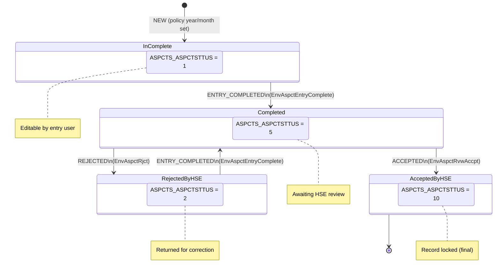

---

## 4. Sequence diagram -- NEW record on Aspects Entry (policy + department auto-set)

<!-- RQ_HSE_23_3_26_22_02 -->

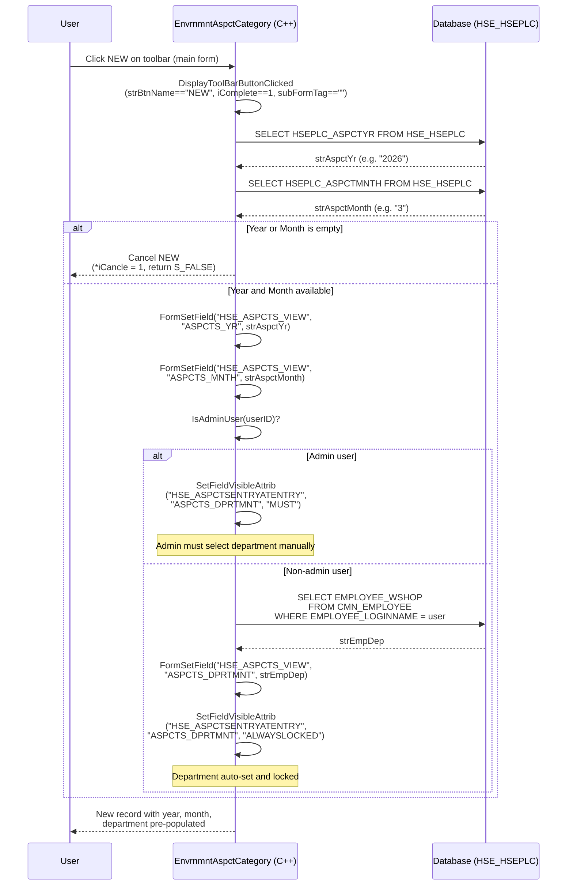

---

## 5. Sequence diagram -- Entry Completed (ENTRY_COMPLETED button)

<!-- RQ_HSE_23_3_26_22_02 -->

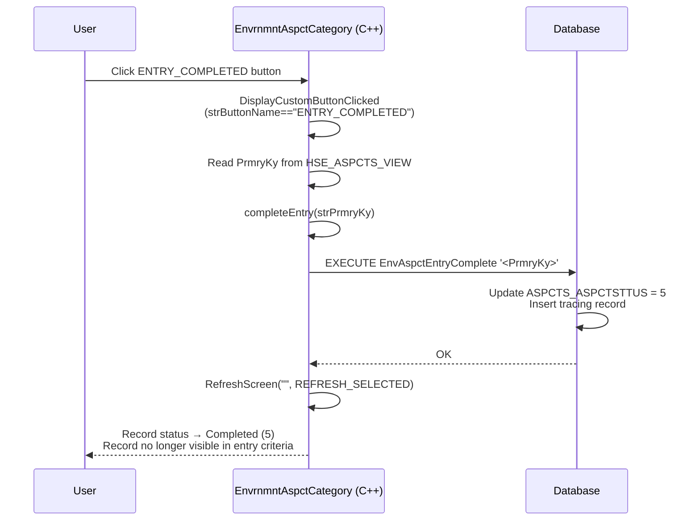

---

## 6. Sequence diagram -- Accept / Reject on Aspects Review

<!-- RQ_HSE_23_3_26_22_02 -->

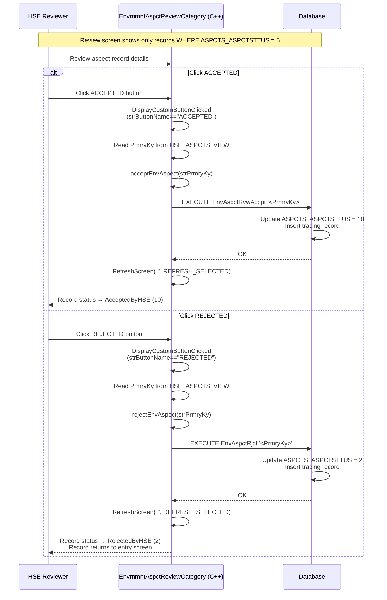

---

## 7. Sequence diagram -- Risk significance field change validation (Entry)

<!-- RQ_HSE_23_3_26_22_02 -->

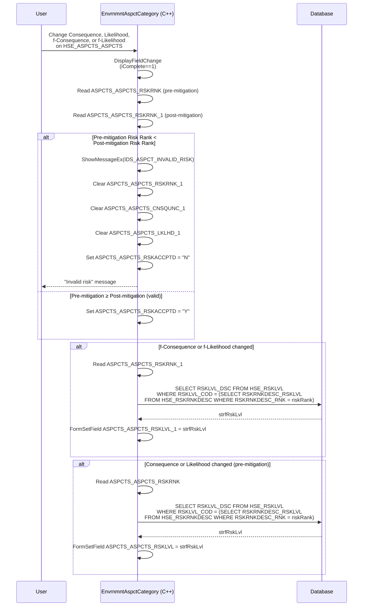

---

## 8. Sequence diagram -- View History / View Current Month (Entry)

<!-- RQ_HSE_23_3_26_22_02 -->

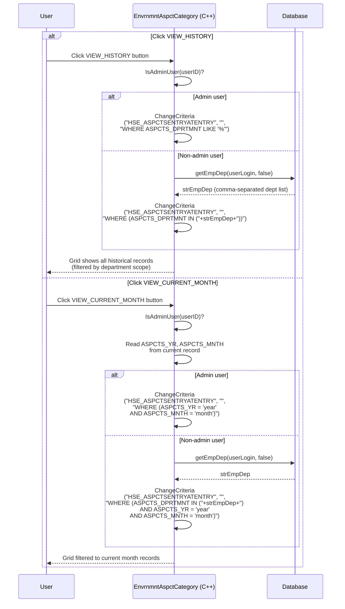

---

## 9. Sequence diagram -- Record reposition (Entry screen, status-based locking)

<!-- RQ_HSE_23_3_26_22_02 -->

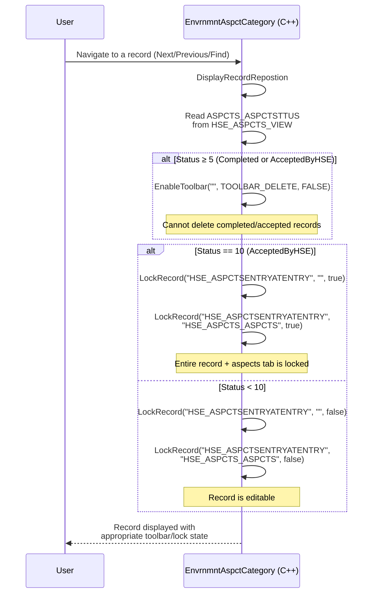

---

## 10. Sequence diagram -- Aspects tab NEW (auto-serial generation)

<!-- RQ_HSE_23_3_26_22_02 -->

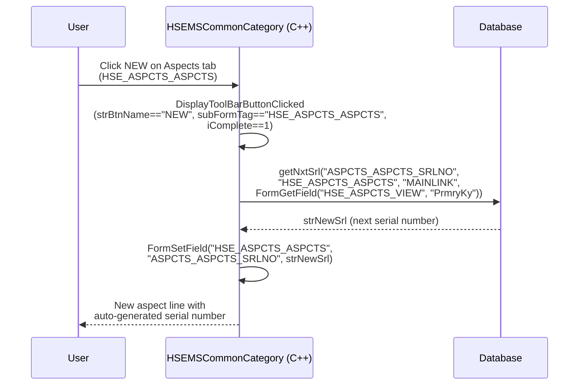

---

## 11. Component diagram -- Web architecture

<!-- RQ_HSE_23_3_26_22_02 -->

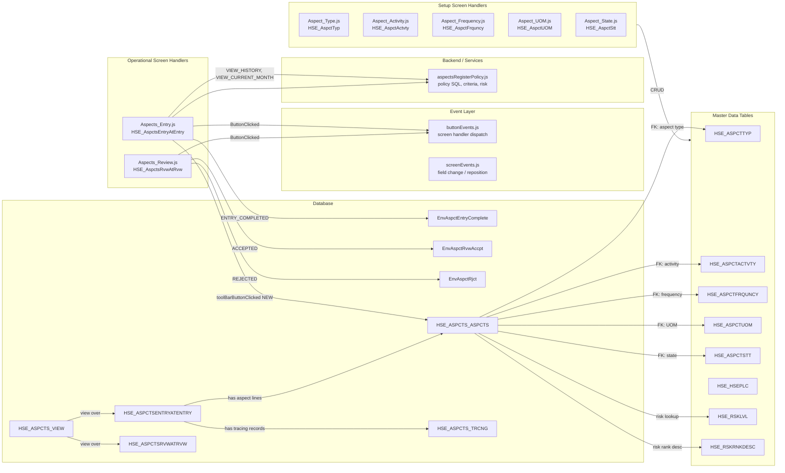

---

## 12. Database entity relationships

<!-- RQ_HSE_23_3_26_22_02 -->

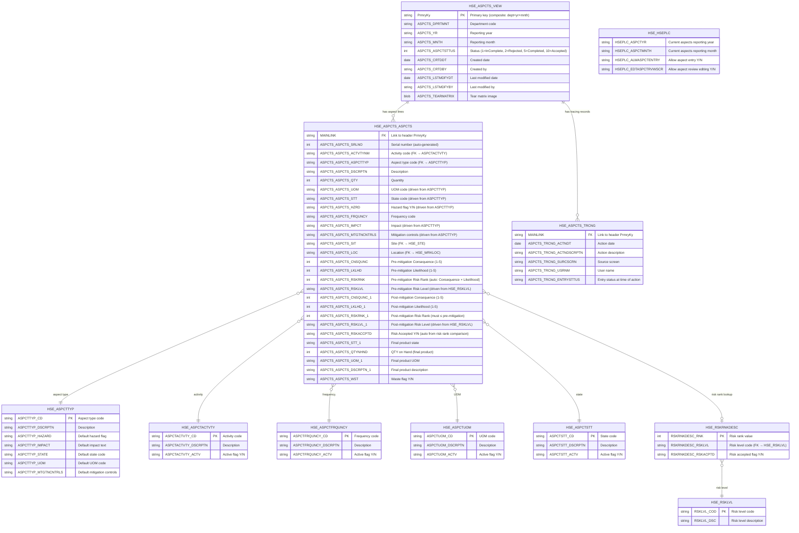

---

## 13. Class hierarchy (desktop C++)

<!-- RQ_HSE_23_3_26_22_02 -->

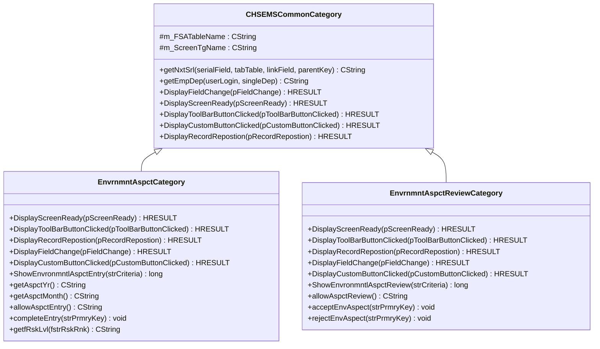

---

## 14. Desktop toolbar and field-change logic (detailed)

<!-- RQ_HSE_23_3_26_22_02 -->

### 14.1 Entry screen -- DisplayScreenReady

```cpp
if(allowAspctEntry() == "N"){
    EnableToolbar("",TOOLBAR_DELETE,FALSE);
    EnableToolbar("",TOOLBAR_NEW,FALSE);
    if(iScreenMode == 1) {
        EnableToolbar("",TOOLBAR_SAVE,FALSE);
    }
    EnableTab("HSE_ASPCTS_ASPCTS",false);
    EnableTab("HSE_ASPCTS_TRCNG",false);
}
```

When the HSE Policy does not allow aspect entry (`HSEPLC_ALWASPCTENTRY = 'N'`), the entry screen becomes effectively read-only: DELETE, NEW are disabled; SAVE is disabled in edit mode; both the Aspects and Tracing tabs are disabled.

### 14.2 Entry screen -- DisplayToolBarButtonClicked (NEW, main form)

| Step | Condition | Action |
|------|-----------|--------|
| 1 | `iComplete==1 && strBtnName=="NEW" && strSubFormTag==""` | Enter NEW handling |
| 2 | `getAspctYr()` and `getAspctMonth()` | Read policy year/month from `HSE_HSEPLC` |
| 3 | Both empty | `*iCancle = 1; return S_FALSE` (cancel NEW) |
| 4 | Either set | `FormSetField` ASPCTS_YR and ASPCTS_MNTH |
| 5 | `IsAdminUser` check | Admin → `SetFieldVisibleAttrib("ASPCTS_DPRTMNT", "MUST")`; Non-admin → auto-set department + `"ALWAYSLOCKED"` |

### 14.3 Entry screen -- DisplayRecordRepostion

| Condition | Action |
|-----------|--------|
| `ASPCTS_ASPCTSTTUS >= 5` | `EnableToolbar("", TOOLBAR_DELETE, FALSE)` |
| `ASPCTS_ASPCTSTTUS == 10` | `LockRecord` on main form + Aspects tab |
| `ASPCTS_ASPCTSTTUS < 10` | `LockRecord(..., false)` -- unlock |

### 14.4 Entry screen -- DisplayFieldChange (risk significance validation)

When any of the four risk fields change (`ASPCTS_ASPCTS_CNSQUNC`, `ASPCTS_ASPCTS_LKLHD`, `ASPCTS_ASPCTS_CNSQUNC_1`, `ASPCTS_ASPCTS_LKLHD_1`):

| Step | Action |
|------|--------|
| 1 | Read pre-mitigation `RSKRNK` and post-mitigation `RSKRNK_1` |
| 2 | If `RSKRNK < RSKRNK_1` → show `IDS_ASPCT_INVALID_RISK` error, clear post-mitigation fields, set `RSKACCPTD = "N"` |
| 3 | If valid → set `RSKACCPTD = "Y"` |
| 4 | If post-mitigation fields changed → lookup f-Risk Level from `HSE_RSKLVL` via `HSE_RSKRNKDESC` |
| 5 | If pre-mitigation fields changed → lookup Risk Level similarly |

### 14.5 Review screen -- DisplayScreenReady

```cpp
EnableToolbar("",TOOLBAR_DELETE,FALSE);
EnableToolbar("",TOOLBAR_NEW,FALSE);
if(allowAspctReview() == "N"){
    EnableToolbar("",TOOLBAR_SAVE,FALSE);
    EnableToolbar("HSE_ASPCTS_ASPCTS",TOOLBAR_SAVE,FALSE);
    EnableToolbar("HSE_ASPCTS_ASPCTS",TOOLBAR_DELETE,FALSE);
    EnableToolbar("HSE_ASPCTS_ASPCTS",TOOLBAR_NEW,FALSE);
}
```

DELETE and NEW are always disabled on the review screen. When `HSEPLC_EDTASPCTRVWSCR = 'N'`, SAVE is also disabled on both main form and Aspects tab.

### 14.6 Review screen -- DisplayFieldChange (risk validation)

Simplified version: only triggers on `ASPCTS_ASPCTS_RSKRNK_1` change. Same validation logic -- if post-mitigation risk rank exceeds pre-mitigation, the post-mitigation fields are cleared.

### 14.7 Aspects tab NEW -- serial auto-generation (HSEMSCommonCategory)

When a new row is added to `HSE_ASPCTS_ASPCTS`, `getNxtSrl` generates the next serial number scoped to the parent record's `PrmryKy`.

---

## 15. Workflow buttons -- implementation status

<!-- RQ_HSE_23_3_26_22_02 -->

### 15.1 Custom buttons

| Button | Desktop behaviour | Web implementation | Status |
|--------|-------------------|--------------------|--------|
| `ENTRY_COMPLETED` | `completeEntry(PrmryKy)` → `EXECUTE EnvAspctEntryComplete`, `RefreshScreen` | `handleEntryCompleted` → `executeSQLPromise`, `refreshData` in `Aspects_Entry.js` | **OK** |
| `VIEW_HISTORY` | Admin: `ChangeCriteria` all depts; Non-admin: filter by employee depts | `handleViewHistory` → `applyAspectsListCriteria` + `getEmployeeDepartmentClause` / `isAdminUserDev` in `Aspects_Entry.js` / `aspectsRegisterPolicy.js` | **OK** (requires host `ChangeCriteria` on `devInterface`) |
| `VIEW_CURRENT_MONTH` | Read year/month from form + admin/dept filter → `ChangeCriteria` | `handleViewCurrentMonth` → same helper | **OK** (requires host `ChangeCriteria`) |
| `ACCEPTED` | `acceptEnvAspect(PrmryKy)` → `EXECUTE EnvAspctRvwAccpt`, `RefreshScreen` | `handleAccept` → `executeSQLPromise`, `refreshData` in `Aspects_Review.js` | **OK** |
| `REJECTED` | `rejectEnvAspect(PrmryKy)` → `EXECUTE EnvAspctRjct`, `RefreshScreen` | `handleReject` → `executeSQLPromise`, `refreshData` in `Aspects_Review.js` | **OK** |

### 15.2 Toolbar behaviour

| Event | Desktop behaviour | Web implementation | Status |
|-------|-------------------|--------------------|--------|
| Screen Ready (Entry) | Policy-gate: disable NEW/DELETE/SAVE + tabs if `allowAspctEntry()=="N"` | `ShowScreen` → `fetchHseplcAspectFlags`; if `'N'` → `setScreenDisableBtn(true,true,true)` + `TabEnable` false on Aspects/Tracing tabs | **OK** |
| Screen Ready (Review) | Always disable DELETE+NEW; policy-gate SAVE on main+tab if `allowAspctReview()=="N"` | `ShowScreen` → `setScreenDisableBtn(true,false,true)`; if policy `'N'` → `(true,true,true)` | **PARTIAL** — main toolbar matches; desktop also disables **tab** SAVE/NEW/DELETE (`FormEnableButton` is a no-op stub in WebInfra) |
| NEW (main form, Entry) | Auto-set year/month from policy; admin/non-admin department logic; cancel if policy empty | `toolBarButtonClicked`: `complete===0` cancels NEW if both YR/MNTH empty; `complete===1` + main → `applyNewHeaderDefaults` | **OK** |
| NEW (Aspects tab) | `getNxtSrl` auto-serial via `HSEMSCommonCategory` | `toolBarButtonClicked` → `setNextSerialOnNewTab` in `Aspects_Entry.js` | **OK** |
| Record Reposition (Entry) | Status ≥ 5 → disable DELETE; status == 10 → lock record+tab | `MainSubReposition` → `setScreenDisableBtn` by `ASPCTS_ASPCTSTTUS` (≥10 all off; ≥5 delete off) | **OK** (uses toolbar lock; not `setScrLockedAttrb`) |
| Field Change (Entry) | Risk significance cross-validation; Risk Level lookup | `SubFieldChanged` → `applyAspectLineRiskValidation` + `lookupRiskLevelDescription` | **OK** |
| Field Change (Review) | Simplified risk rank validation | `SubFieldChanged` on `Aspects_Review.js` (review mode, no popup) | **OK** |

---

## 16. Known gaps vs desktop (post RQ_HSE_23_3_26_22_02)

<!-- RQ_HSE_23_3_26_22_02 -->

| # | Gap | Status |
|---|-----|--------|
| 1 | Core gaps G1–G6 (policy, NEW, views, risk, reposition, `isAdminUser` on `devInterface`) | **Addressed** in `Aspects_Entry.js`, `Aspects_Review.js`, `aspectsRegisterPolicy.js`, `hse.js` |
| 2 | Review screen **tab** toolbar (SAVE/NEW/DELETE on Aspects tab when `HSEPLC_EDTASPCTRVWSCR = 'N'`) | **PARTIAL** — `FormEnableButton` in WebInfra is currently empty; main-form SAVE is disabled |
| 3 | `ChangeCriteria` on `devInterface` | **Dependency** — if the host does not attach `ChangeCriteria`, view buttons show a prompt (`applyAspectsListCriteria`) |
| 4 | `setScrLockedAttrb` for status 10 (desktop `LockRecord`) | **PARTIAL** — parity uses `setScreenDisableBtn(true,true,true)` on navigation instead |

---

## 17. Setup screens -- implementation status

<!-- RQ_HSE_23_3_26_22_02 -->

| Screen | Tag | Web handler | Exports | Status |
|--------|-----|-------------|---------|--------|
| Aspect Type | `HSE_AspctTyp` | `Aspect_Type.js` | `ShowScreen` (toolbar enable) | **OK** (minimal, matches desktop) |
| Aspect Activity | `HSE_AspctActvty` | `Aspect_Activity.js` | `ShowScreen` (toolbar enable) | **OK** (minimal, matches desktop) |
| Aspect Frequency | `HSE_AspctFrquncy` | `Aspect_Frequency.js` | `ShowScreen` (toolbar enable) | **OK** (minimal, matches desktop) |
| Aspect UOM | `HSE_AspctUOM` | `Aspect_UOM.js` | `ShowScreen` (toolbar enable) | **OK** (minimal, matches desktop) |
| Aspect State | `HSE_AspctStt` | `Aspect_State.js` | `ShowScreen` (toolbar enable) | **OK** (minimal, matches desktop) |

---

## 18. Reports

<!-- RQ_HSE_23_3_26_22_02 -->

The Aspects Entry screen defines three Crystal Reports:

| # | Report name | File |
|---|-------------|------|
| 1 | Aspects Register | `21-01 Aspects Register.rpt` |
| 2 | Aspects Summary Totals | `21-02 Aspects Summary Totals.rpt` |
| 3 | Individual Aspect Report | `21-03 Individual Aspect Report.rpt` |

---

## 19. Validation -- Activity diagram §2 vs web implementation (post-gap)

<!-- RQ_HSE_23_3_26_22_02 -->

Each node in the §2 activity diagram was traced against the web source:

- `Aspects_Entry.js` — `ShowScreen`, `ButtonClicked`, `toolBarButtonClicked`, `SubFieldChanged`, `MainSubReposition`
- `Aspects_Review.js` — `ShowScreen`, `ButtonClicked`, `SubFieldChanged`
- `aspectsRegisterPolicy.js` — shared policy, criteria, risk SQL
- `hse.js` — `isAdminUser` on `devInterfaceObj`
- `buttonEvents.js` / `screenEvents.js` (event dispatch)
- `screenHandlers/index.js` (registration)

### 19.1 Track 1: Aspects Entry

| Node | Activity | Web evidence | Status |
|------|----------|-------------|--------|
| **E1** | Open Aspects Entry screen (criteria: status < 5) | Platform loads with `WhereClause` from `header.json` | **COVERED** |
| **E2** | Policy: allowAspctEntry()? | `ShowScreen` → `fetchHseplcAspectFlags` | **COVERED** |
| **E2a** | Disable DELETE, NEW, SAVE + tabs | `setScreenDisableBtn(true,true,true)` + `TabEnable` false | **COVERED** |
| **E3** | Click NEW on toolbar | Platform NEW | **COVERED** |
| **E4** | Policy Year/Month available? | `toolBarButtonClicked` `complete===0` + `fetchHseplcAspectFlags` | **COVERED** |
| **E5** | Auto-set ASPCTS_YR and ASPCTS_MNTH | `applyNewHeaderDefaults` on main NEW `complete===1` | **COVERED** |
| **E6** | Admin user check + department | `isAdminUserDev` / `devInterface.isAdminUser` | **COVERED** |
| **E6a/E6b** | Department attribute set | `changeFldAttrb` MUST/LOCKED + `FormSetField` / `getEmployeeDepartmentClause` | **PARTIAL** if `changeFldAttrb` unsupported |
| **E7** | Fill header (Created DT/By auto-set) | Platform defaults (`DefaultValue: "TODAY"`, `"LOGIN"`) | **COVERED** |
| **E8** | Open Aspects tab | Platform tab navigation | **COVERED** |
| **E9** | Add aspect line (auto-serial) | `toolBarButtonClicked` NEW → `setNextSerialOnNewTab` | **COVERED** |
| **E10** | Fill aspect details | Platform form fields + driven fields from ASPCTTYP | **COVERED** |
| **E11** | Fill Location (Site, Location) | Platform form fields with cascading browse | **COVERED** |
| **E12** | Fill Significance (Before Mitigation) | Platform form fields with validation rules | **COVERED** |
| **E12a** | Risk Rank auto-calc, Risk Level lookup | Driven field in JSON (`CNSQUNC*LKLHD` SQL expression) | **COVERED** |
| **E13** | Fill Significance (Post Mitigation) | Platform form fields | **COVERED** |
| **E14** | Cross-validation: f-Risk > pre-Risk? | `SubFieldChanged` → `applyAspectLineRiskValidation` | **COVERED** |
| **E14a** | Error + clear post-mitigation fields | `AskYesNoMessage` + clears in policy helper | **COVERED** |
| **E15** | f-Risk Level lookup + Risk Accepted | `lookupRiskLevelDescription` + `FormSetField` RSKLVL / RSKACCPTD | **COVERED** |
| **E16** | Fill Final Product | Platform form fields | **COVERED** |
| **E17** | Save aspect line | Platform SAVE | **COVERED** |
| **EC1-EC4** | Entry Completed flow | `handleEntryCompleted` → `executeSQLPromise` + `refreshData` | **COVERED** |

### 19.2 View filters

| Node | Activity | Web evidence | Status |
|------|----------|-------------|--------|
| **VH1-VH3** | VIEW_HISTORY (admin/dept filter) | `handleViewHistory` + `applyAspectsListCriteria` | **COVERED** (needs `ChangeCriteria`) |
| **VC1-VC3** | VIEW_CURRENT_MONTH (admin/dept filter) | `handleViewCurrentMonth` | **COVERED** (needs `ChangeCriteria`) |

### 19.3 Track 2: Aspects Review

| Node | Activity | Web evidence | Status |
|------|----------|-------------|--------|
| **R1** | Open Review screen (criteria: status = 5) | Platform loads with `WhereClause` from `header.json` | **COVERED** |
| **R2** | Disable DELETE, NEW | `ShowScreen` → `setScreenDisableBtn(true,false,true)` | **COVERED** |
| **R3** | Policy: allowAspctReview()? | `fetchHseplcAspectFlags` | **COVERED** |
| **R3a** | Disable SAVE on main + tab | Main SAVE off when policy `'N'`; tab toolbar **PARTIAL** (see §16) | **PARTIAL** |
| **R4-R5** | Reviewer examines record | Platform form display + Aspects tab | **COVERED** |
| **R6-R7b** | Risk rank validation on review | `SubFieldChanged` review mode | **COVERED** |
| **RA1-RA4** | ACCEPTED flow | `handleAccept` → `executeSQLPromise` + `refreshData` | **COVERED** |
| **RJ1-RJ4** | REJECTED flow | `handleReject` → `executeSQLPromise` + `refreshData` | **COVERED** |

### 19.4 Summary

| Metric | Count |
|--------|-------|
| Total unique activity nodes in §2 diagram | **38** |
| Nodes fully **COVERED** by web | **~34** |
| Nodes **PARTIAL** | **~4** (E6a/E6b attrib API, VH/VC if no `ChangeCriteria`, R3a tab toolbar, ClosedEnd vs `LockRecord`) |
| Nodes **MISSING** | **0** (core flow) |

### 19.5 Gap resolution roadmap (implemented — RQ_HSE_23_3_26_22_02)

| # | Category | Implementation |
|---|----------|----------------|
| **G1** | Policy-gated entry | `Aspects_Entry.js` `ShowScreen` + `TabEnable` |
| **G2** | Policy-gated review | `Aspects_Review.js` `ShowScreen` |
| **G3** | NEW year/month/dept | `toolBarButtonClicked` `complete` 0/1 + `applyNewHeaderDefaults` |
| **G4** | Record reposition | `MainSubReposition` on Entry |
| **G5** | Risk validation | `SubFieldChanged` + `aspectsRegisterPolicy.js` |
| **G6** | View filters | `ButtonClicked` + `applyAspectsListCriteria` |
| **G7** | `isAdminUser` | `hse.js` `devInterfaceObj.isAdminUser` |

---

*End of Emissions / Aspects Tracking UML documentation -- RQ_HSE_23_3_26_22_02*
