# Environmental Monitoring Process -- UML Documentation

<!-- RQ_HSE_23_3_26_21_14 -->

> **Source**: HSEMS C++ Desktop (`HSEMS-Win`: `EnvMntrPlanCategory.cpp`, `EnvMntrExctnCategory.cpp`, `EnvMntrMsrPopupCategory.cpp`, `EnvMsrEntryCategory.cpp`, `EnvMsrAprvlCategory.cpp`) + Web (`hse` module)
> **Scope**: Environmental Monitoring lifecycle from **Setup** through **Monitoring Plan**, **Plan Approval**, **Execution** (activity management & measures entry), **Plan Closure**, and the parallel **Environment Measurement Entry → Approval** track
> **Date**: March 2026
> **See also**: [`HSEMS_Use_Cases_From_Desktop_Code.md`](./HSEMS_Use_Cases_From_Desktop_Code.md) §3.3

---

## 1. Process overview

The **Environmental Monitoring** module manages two interconnected operational tracks under **Environment -> Environment Measures**, supported by two **Setup** master-data screens under **Setup -> Environment Measures**.

**Track A -- Monitoring Plan & Execution** follows a plan-based lifecycle:

```
Plan (Incomplete) → Approve → Execute Activities → Close Plan
                 ↗           ↓ (per activity)
        Re-open          Pending → Completed / Cancelled → Re-open
```

**Track B -- Environment Measurement Entry** follows a status-based entry workflow:

```
Entry (Incomplete) → Complete → Approve
                            ↓
                          Reject → Return to Incomplete
```

### 1.1 Setup screens (master data)

| Screen | Tag | Table / Entity | Purpose |
|--------|-----|----------------|---------|
| Environmental Monitoring Activities | `HSE_TgEnvMntrActvts` | `HSE_ENVMNTRACTVTS` | Define monitoring activities (code, description, frequency, conducted by, default location) |
| Environmental Measures | `HSE_TgEnvrnmntlMsrs` | `HSE_ENVMSRTYPS` | Define measurement types with associated pollutants (min/max permissible limits, UOM) |

### 1.2 Operational screens

| Screen | Tag | C++ Category | Table | Key field | Handler |
|--------|-----|--------------|-------|-----------|---------|
| Environmental Monitoring Plan | `HSE_TgEnvMntrPlan` | `EnvMntrPlanCategory` | `HSE_ENVMNTRPLAN` | `EnvMntrPlan_Yr` | `Environmental_Monitoring_Plan.js` |
| Environmental Measures (Execution) | `HSE_TgEnvMntrExctn` | `EnvMntrExctnCategory` | `HSE_ENVMNTRPLAN` | `EnvMntrPlan_Yr` | `Environmental_Measures.js` |
| Environmental Measures Entry | `HSE_TgEnvMsrEntry` | `EnvMsrEntryCategory` | `HSE_ENVMSRENTRY` | `EnvMsrEntry_PrmKy` | `handleEnvironmentButton` (centralized) |
| Environmental Measures Approval | `HSE_TgEnvMsrAprvl` | `EnvMsrAprvlCategory` | `HSE_ENVMSRENTRY` | `EnvMsrEntry_PrmKy` | `handleEnvironmentButton` (centralized) |
| Measures Popup | `HSE_TgEnvMntrActvtsPltnt` | `EnvMntrMsrPopupCategory` | `HSE_ENVMNTRACTVTSPLTNT` | `EnvMntrActvtsPltnt_PrmKy` | (popup, no dedicated web handler) |

### 1.3 Sub-forms (tabs)

| Parent Screen | Tab | Tag | Table | Purpose |
|---------------|-----|-----|-------|---------|
| Monitoring Plan | Activities | `HSE_TgEnvMntrPlanActvts` | `HSE_ENVMNTRPLANACTVTS` | Planned activities per year (activity, site, location, area, target month, frequency) |
| Monitoring Plan | Tracing | `HSE_TgEnvMntrPlanTrc` | `HSE_ENVMNTRPLANTRC` | Audit trail (locked, no add/delete) |
| Execution | Activities | `HSE_TgEnvMntrExctnActvts` | `HSE_ENVMNTRPLANACTVTS` | Same activities table, with execution fields (remarks, done by, verified by, completion date, activity status) |
| Execution | Tracing | `HSE_TgEnvMntrExctnTrc` | `HSE_ENVMNTRPLANTRC` | Audit trail (locked, no add/delete) |
| Msr Entry | Pollutants | `HSE_TgEnvMsrEntryPoltant` | `HSE_ENVMSRENTRYPOLTANT` | Pollutant measurement values (measured value, deviation, result accepted, require CAR) |
| Msr Entry | Tracing | `HSE_TgEnvMsrEntryTrc` | `HSE_ENVMSRENTRYTRC` | Audit trail (locked, no add/delete) |
| Msr Approval | Pollutants | `HSE_TgEnvMsrAprvlPoltant` | `HSE_ENVMSRENTRYPOLTANT` | Same pollutants table (locked on approval screen) |
| Msr Approval | Tracing | `HSE_TgEnvMsrAprvlTrc` | `HSE_ENVMSRENTRYTRC` | Audit trail (locked, no add/delete) |
| Measures Popup | Measure Area | `HSE_TGEnvmntrActvtsPltntMsrArea` | `HSE_ENVMNTRACTVTSPLTNTMSRAREA` | Measurement areas with actual values, NCR flag |

### 1.4 Stored procedures

| SP | Track | Purpose |
|----|-------|---------|
| `approveEnvMntrPlan` | Plan | Set plan status to Approved (5) |
| `reOpnEnvMntrPlan` | Plan | Set plan status to Re-opened (2) |
| `reloadEnvMntrPlnActvty` | Plan | Reload activity records from master data |
| `closeEnvMntrPlan` | Execution | Set plan status to Closed (10) |
| `changeEnvMsrActvtStat` | Execution | Change activity status (1=Pending, 2=Cancelled, 5=Completed) |
| `completeEnvMsrEntry` | Msr Entry | Mark measurement entry as completed (status -> 5) |
| `rejectEnvMsr` | Msr Approval | Reject measurement entry (status -> 2) |
| `approveEnvMsr` | Msr Approval | Approve measurement entry (status -> 10) |
| `reldPoltnts` | Msr Entry | Reload pollutant records for a measurement entry |

### 1.5 Custom buttons

| Button | Screen | Track | Behaviour |
|--------|--------|-------|-----------|
| `ENVMNTRPLAN_APRVPLAN` | Plan | A | `EXECUTE approveEnvMntrPlan @yr`, refresh |
| `ENVMNTRPLAN_REOPNPLN` | Plan | A | `EXECUTE reOpnEnvMntrPlan @yr`, refresh |
| `ENVMNTRPLAN_RELOADACTVTS` | Plan | A | Confirm prompt, then `EXECUTE reloadEnvMntrPlnActvty @yr`, refresh (only when plan status < 5) |
| `ENVMNTRPLANACTVTS_PLTNTS` | Plan Activities tab | A | Open Measures popup (read-only from plan) |
| `ENVMNTRPLAN_CLSPLAN` | Execution | A | `EXECUTE closeEnvMntrPlan @yr`, refresh |
| `ENVMNTREXCTNACTVTS_PLTNTS` | Execution Activities tab | A | Open Measures popup (editable from execution) |
| `ENVMNTREXCTNACTVTS_CMPLTACTVTY` | Execution Activities tab | A | `EXECUTE changeEnvMsrActvtStat 5, @activityPrmKy`, lock if completed |
| `ENVMNTREXCTNACTVTS_CNCLACTVTY` | Execution Activities tab | A | `EXECUTE changeEnvMsrActvtStat 2, @activityPrmKy` |
| `ENVMNTREXCTNACTVTS_REOPNACTVTY` | Execution Activities tab | A | `EXECUTE changeEnvMsrActvtStat 1, @activityPrmKy` |
| `ENVMSRENTRY_ENTRYCMPLTD` | Msr Entry | B | `EXECUTE completeEnvMsrEntry @prmKy`, refresh |
| `ENVMSRENTRYPOLTANT_PRPRCARS` | Msr Entry Pollutants tab | B | Open Recommended CARs popup (`HSE_TgEnvMsrEntryPoltantPrpCAR`) |
| `ENVMSRENTRYPOLTANT_RELDPOLTNTS` | Msr Entry Pollutants tab | B | Confirm prompt, then `EXECUTE reldPoltnts @prmKy`, refresh |
| `ENVMSRENTRY_REJECT` | Msr Approval | B | `EXECUTE rejectEnvMsr @prmKy`, refresh |
| `ENVMSRENTRY_APPROVE` | Msr Approval | B | `EXECUTE approveEnvMsr @prmKy`, refresh |
| `ENVMNTRACTVTSPLTNTMSRAREA_RQRDACTN` | Measures Popup → Measure Area tab | A | Open Required Actions popup (only if `RQRNCR = 'Y'`) |

### 1.6 Desktop toolbar and record behaviour

| Event | Screen | Condition | Action |
|-------|--------|-----------|--------|
| Record reposition | Plan | `ENVMNTRPLAN_PLNSTTS >= 5` | Disable NEW/SAVE/DELETE, lock record |
| Record reposition | Plan | `ENVMNTRPLAN_PLNSTTS < 5` | Enable NEW/SAVE/DELETE, unlock record |
| Record reposition | Plan Activities tab | `ENVMNTRPLANACTVTS_ACTVSTTS >= 5` | Disable DELETE on activities tab |
| Record reposition | Execution Activities tab | `ENVMNTRPLANACTVTS_ACTVSTTS >= 5` | Disable NEW/SAVE/DELETE on tab, disable custom buttons (Enter Measures, Complete, Cancel), lock tab record |
| Record reposition | Execution Activities tab | `ENVMNTRPLANACTVTS_ACTVSTTS < 5` | Enable all toolbar + custom buttons, unlock tab |
| Record reposition | Msr Entry | `ENVMSRENTRY_ENTRYSTTS >= 5` | Disable NEW/SAVE/DELETE, lock record |
| Record reposition | Msr Entry | `ENVMSRENTRY_ENTRYSTTS < 5` | Enable NEW/SAVE/DELETE, unlock record |
| Record reposition | Measures Popup | `ActivityStatusHolder >= 5` | Disable NEW/SAVE/DELETE on sub-form, lock sub-form |
| Toolbar NEW | Msr Entry | `iComplete == 1`, main form | Auto-generate `ENVMSRENTRY_MSRNO` via `SELECT MAX+1` for current year |
| Toolbar SAVETAB | Msr Entry | Pollutants tab (`HSE_TGENVMSRENTRYPOLTANT`) | Set `ENVMSRENTRY_LSTMDFYDT` + `ENVMSRENTRY_LSTMDFYBY`, then SAVE main form |
| Toolbar SAVETAB | Execution | `iComplete == 1` | `RefreshScreen` |
| Field change | Plan Activities | Any `ENVMNTRPLANACTVTS` field | Auto-generate serial `ENVMNTRPLANACTVTS_SRIL` if blank |
| Field change | Execution Activities | Any `ENVMNTRPLANACTVTS` field | Auto-generate serial `ENVMNTRPLANACTVTS_SRIL` if blank |
| Field change | Msr Entry Pollutants | `ENVMSRENTRYPOLTANT_MSRDVAL` | Calculate deviation and result accepted (see §11) |
| ShowScreen | Execution | Always | `ParentManage(FALSE, FALSE, FALSE)` -- header NEW/SAVE/DELETE disabled; only activities tab is editable |
| ShowScreen | Msr Approval | Always | `ParentManage(FALSE, FALSE, FALSE)` -- read-only; only Reject/Approve buttons available |
| ShowScreen | Measures Popup | `comeFrom == HSE_TGENVMNTRPLAN` | Read-only: Update=FALSE, AddNew=FALSE, Delete=FALSE, ShowDetails disabled |
| ShowScreen | Measures Popup | `comeFrom == HSE_TGENVMNTREXCTN` | Editable: Update=TRUE, AddNew=FALSE, Delete=FALSE |

---

## 2. Activity diagram -- Track A: Monitoring Plan & Execution (end-to-end)

<!-- RQ_HSE_23_3_26_21_14 -->

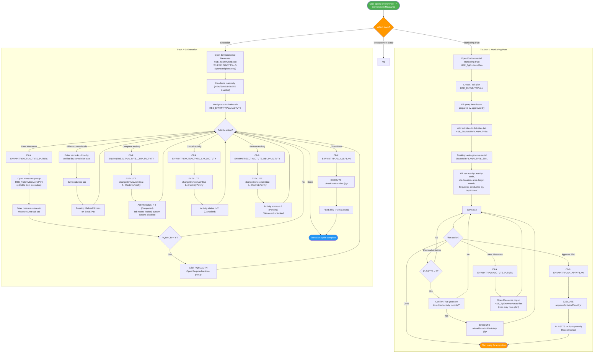

---

## 3. Activity diagram -- Track B: Environment Measurement Entry & Approval

<!-- RQ_HSE_23_3_26_21_14 -->

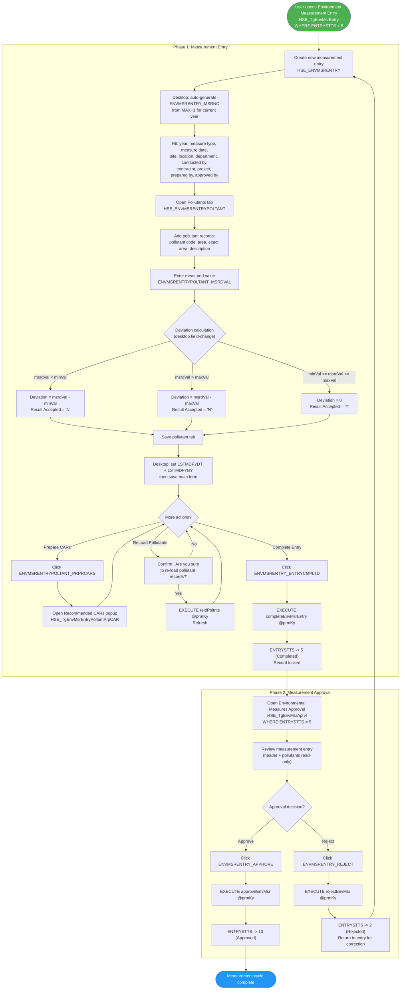

---

## 4. State machine -- Plan status (`ENVMNTRPLAN_PLNSTTS`)

<!-- RQ_HSE_23_3_26_21_14 -->

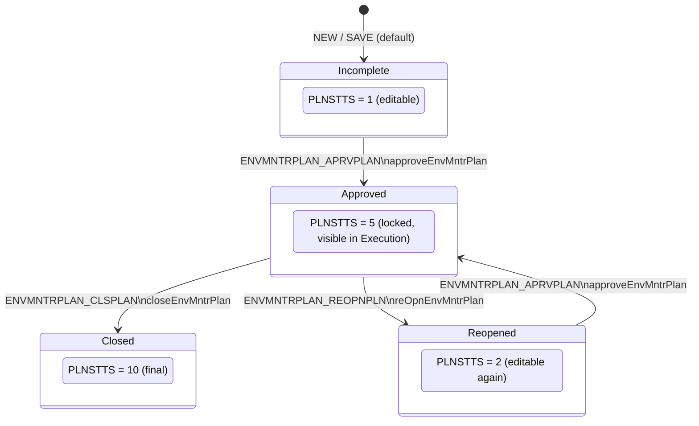

### 4.1 Record behaviour by plan status (desktop)

| Plan Status | Value | Toolbar NEW | Toolbar SAVE | Toolbar DELETE | Record Lock |
|-------------|-------|-------------|--------------|----------------|-------------|
| Incomplete | 1 | Enabled | Enabled | Enabled | Unlocked |
| Re-opened | 2 | Enabled | Enabled | Enabled | Unlocked |
| Approved | 5 | **Disabled** | **Disabled** | **Disabled** | **Locked** |
| Closed | 10 | **Disabled** | **Disabled** | **Disabled** | **Locked** |

---

## 5. State machine -- Activity status (`ENVMNTRPLANACTVTS_ACTVSTTS`)

<!-- RQ_HSE_23_3_26_21_14 -->

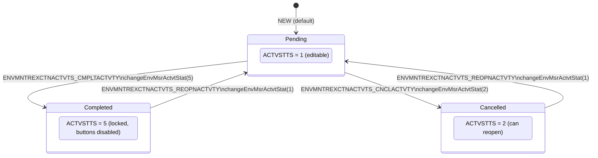

---

## 6. State machine -- Measurement entry status (`ENVMSRENTRY_ENTRYSTTS`)

<!-- RQ_HSE_23_3_26_21_14 -->

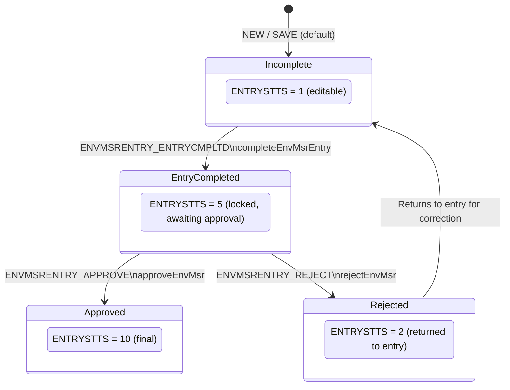

---

## 7. Sequence diagram -- Monitoring Plan: Approve Plan

<!-- RQ_HSE_23_3_26_21_14 -->

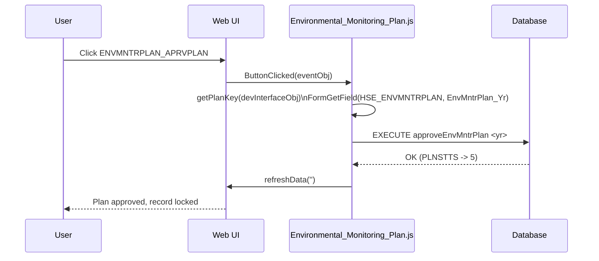

---

## 8. Sequence diagram -- Monitoring Plan: Reopen Plan

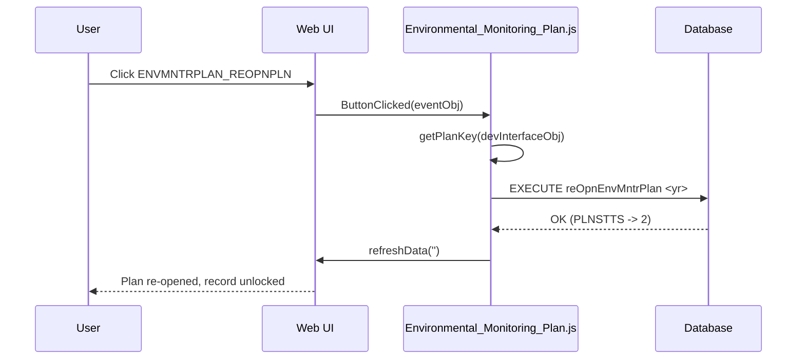

---

## 9. Sequence diagram -- Monitoring Plan: Reload Activities

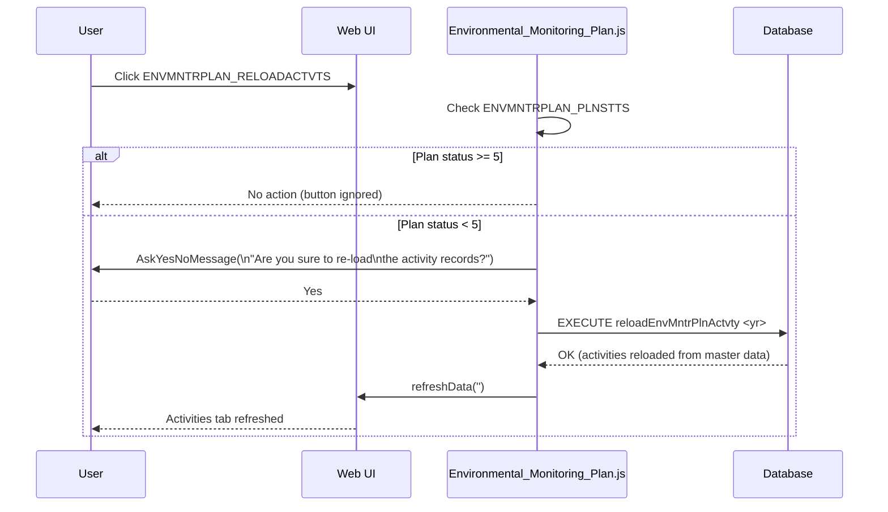

---

## 10. Sequence diagram -- Execution: Activity Status Change (Complete / Cancel / Reopen)

<!-- RQ_HSE_23_3_26_21_14 -->

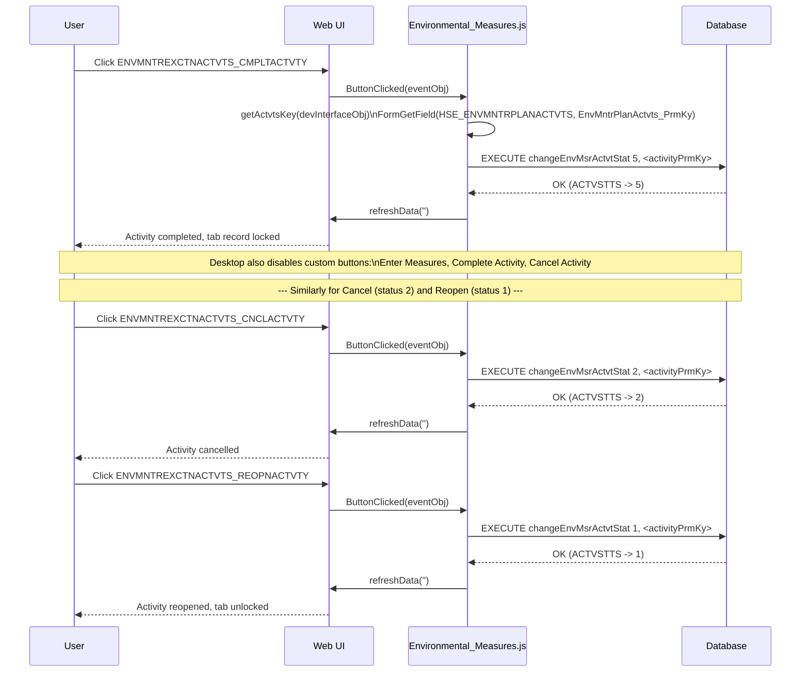

---

## 11. Sequence diagram -- Execution: Close Plan

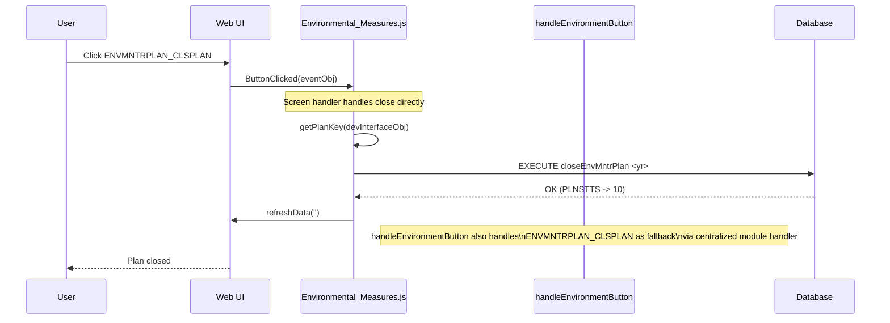

---

## 12. Sequence diagram -- Measurement Entry: Complete Entry

<!-- RQ_HSE_23_3_26_21_14 -->

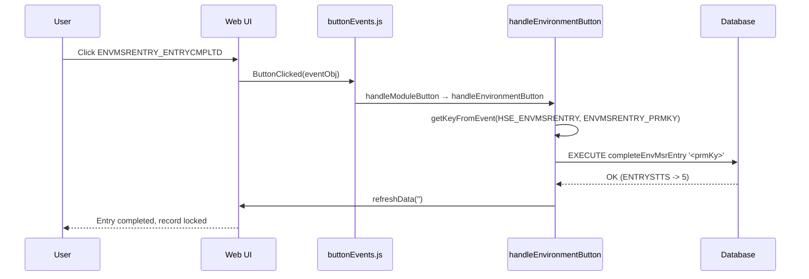

---

## 13. Sequence diagram -- Measurement Approval: Approve / Reject

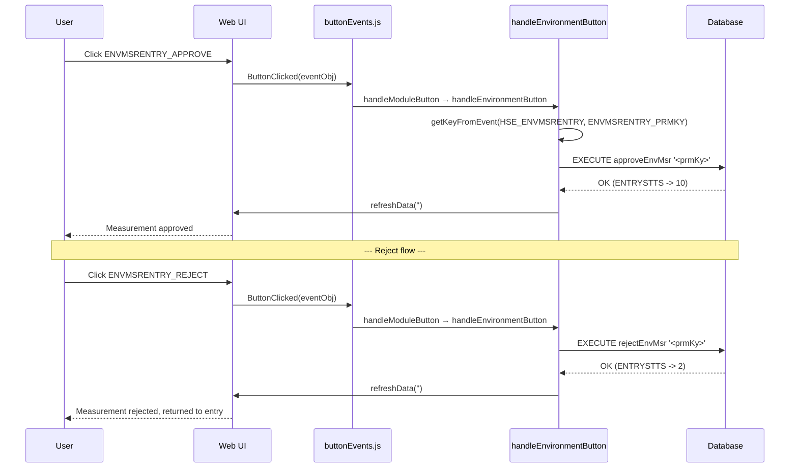

---

## 14. Sequence diagram -- Measurement Entry: NEW (auto-generate measure number, desktop)

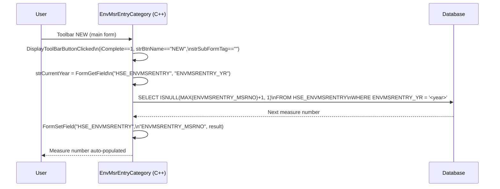

---

## 15. Sequence diagram -- Measurement Entry: SAVETAB on Pollutants (desktop audit fields)

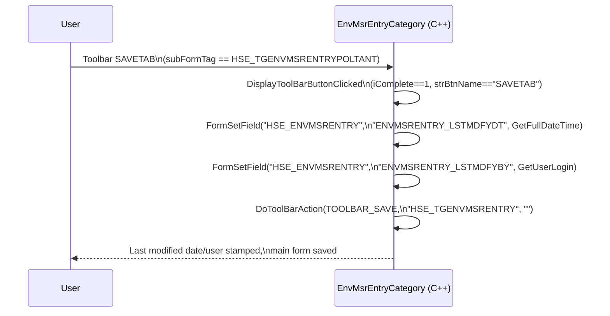

---

## 16. Sequence diagram -- Measurement Entry: Pollutant deviation calculation (desktop field-change)

<!-- RQ_HSE_23_3_26_21_14 -->

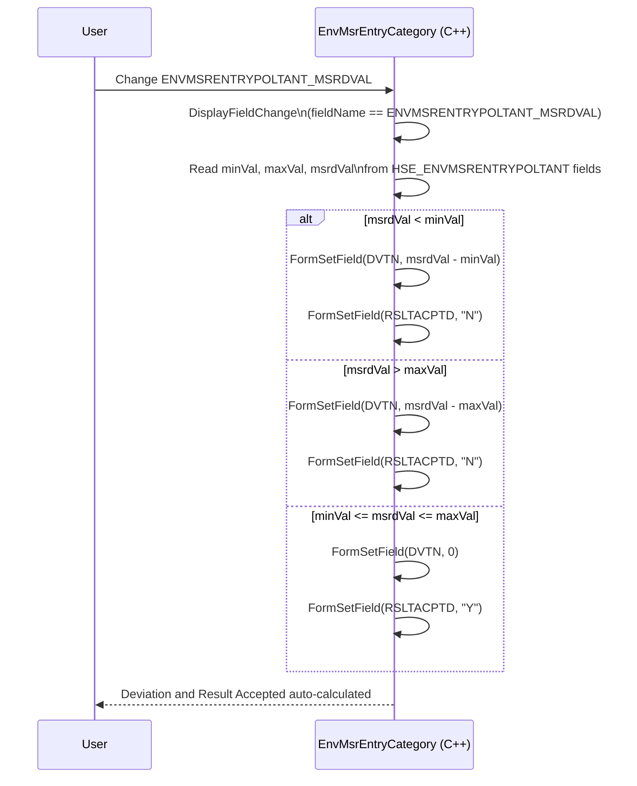

---

## 17. Sequence diagram -- Plan/Execution: Activity serial auto-generation (desktop field-change)

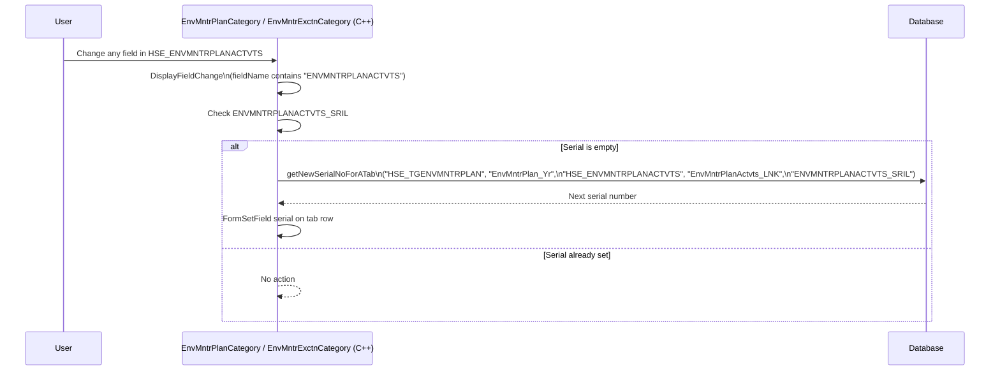

---

## 18. Sequence diagram -- Execution: Measures Popup & Required Actions

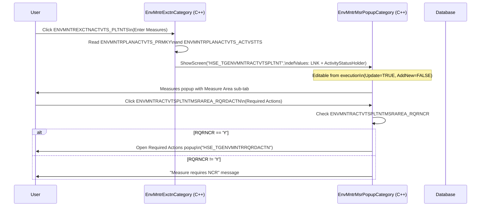

---

## 19. Component diagram -- Web architecture

<!-- RQ_HSE_23_3_26_21_14 -->

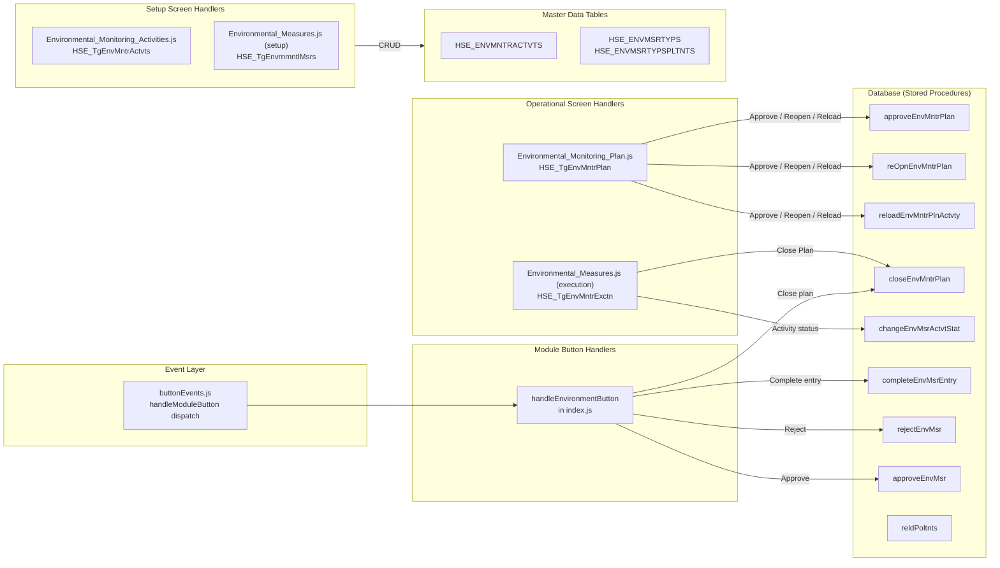

---

## 20. Database entity relationships

<!-- RQ_HSE_23_3_26_21_14 -->

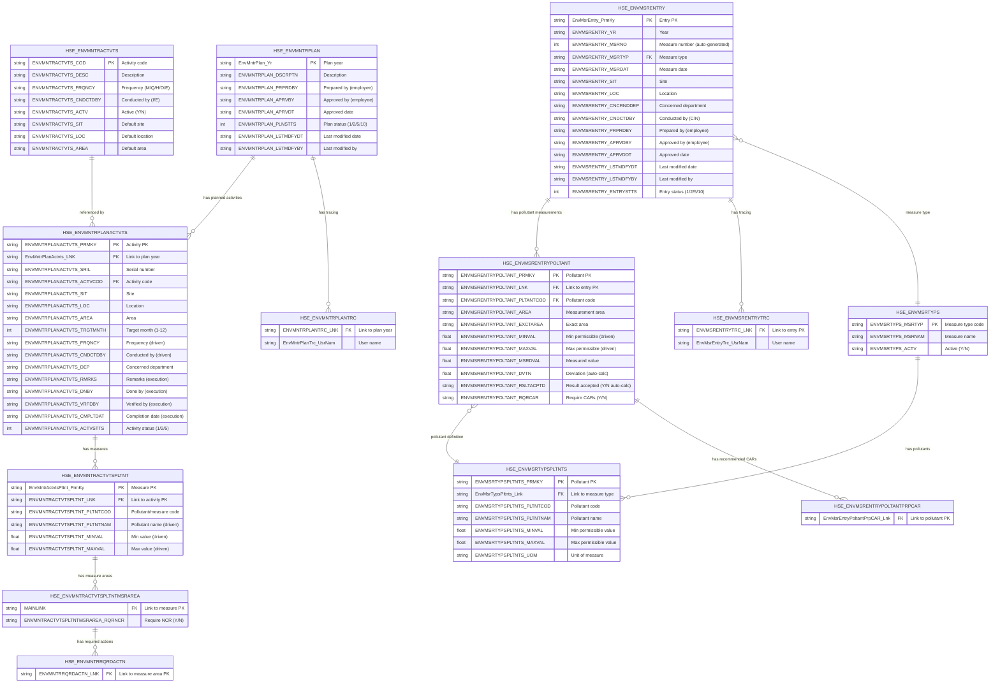

---

## 21. Class hierarchy (desktop C++)

<!-- RQ_HSE_23_3_26_21_14 -->

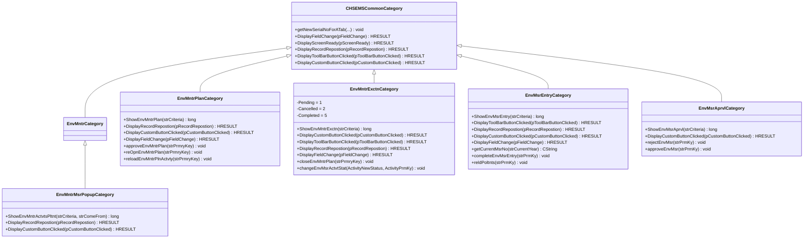

---

## 22. Workflow buttons -- implementation status

<!-- RQ_HSE_23_3_26_21_14 -->

### 22.1 Environmental Monitoring Plan

| Button | Desktop behaviour | Web implementation | Status |
|--------|-------------------|--------------------|--------|
| `ENVMNTRPLAN_APRVPLAN` | `approveEnvMntrPlan`, refresh | `Environmental_Monitoring_Plan.js` `handleApprovePlan` -> `executeSQLPromise` + `refreshData` | **OK** |
| `ENVMNTRPLAN_REOPNPLN` | `reOpnEnvMntrPlan`, refresh | `Environmental_Monitoring_Plan.js` `handleReopenPlan` -> `executeSQLPromise` + `refreshData` | **OK** |
| `ENVMNTRPLAN_RELOADACTVTS` | Confirm, then `reloadEnvMntrPlnActvty` (only when PLNSTTS < 5), refresh | `Environmental_Monitoring_Plan.js` checks PLNSTTS < 5, `AskYesNoMessage`, `executeSQLPromise` + `refreshData` | **OK** |
| `ENVMNTRPLANACTVTS_PLTNTS` | Open Measures popup (read-only from plan) | `Environmental_Monitoring_Plan.js` `handleActvtsPltnts` -> `openScr` with read-only=true | **OK** |

### 22.2 Environmental Measures (Execution)

| Button | Desktop behaviour | Web implementation | Status |
|--------|-------------------|--------------------|--------|
| `ENVMNTRPLAN_CLSPLAN` | `closeEnvMntrPlan`, refresh | `Environmental_Measures.js` `handleClosePlan` -> `executeSQLPromise` + `refreshData`; also in `handleEnvironmentButton` | **OK** |
| `ENVMNTREXCTNACTVTS_PLTNTS` | Open Measures popup (editable from execution) | `Environmental_Measures.js` `handlePltnts` -> `openScr` with read-only=false | **OK** |
| `ENVMNTREXCTNACTVTS_CMPLTACTVTY` | `changeEnvMsrActvtStat(5)`, lock if completed | `Environmental_Measures.js` `changeEnvMsrActvtStat(Completed, key)` | **OK** |
| `ENVMNTREXCTNACTVTS_CNCLACTVTY` | `changeEnvMsrActvtStat(2)` | `Environmental_Measures.js` `changeEnvMsrActvtStat(Cancelled, key)` | **OK** |
| `ENVMNTREXCTNACTVTS_REOPNACTVTY` | `changeEnvMsrActvtStat(1)` | `Environmental_Measures.js` `changeEnvMsrActvtStat(Pending, key)` | **OK** |

### 22.3 Environmental Measures Entry

| Button | Desktop behaviour | Web implementation | Status |
|--------|-------------------|--------------------|--------|
| `ENVMSRENTRY_ENTRYCMPLTD` | `completeEnvMsrEntry`, refresh | `handleEnvironmentButton` in `ModuleButtonHandlers/index.js` -> `runTxnAndRefresh` | **OK** |
| `ENVMSRENTRYPOLTANT_PRPRCARS` | Open Recommended CARs popup | Not implemented in screen handler; no dedicated web handler for `HSE_TgEnvMsrEntry` | **MISSING** |
| `ENVMSRENTRYPOLTANT_RELDPOLTNTS` | Confirm, then `reldPoltnts`, refresh | Not implemented in screen handler | **MISSING** |

### 22.4 Environmental Measures Approval

| Button | Desktop behaviour | Web implementation | Status |
|--------|-------------------|--------------------|--------|
| `ENVMSRENTRY_REJECT` | `rejectEnvMsr`, refresh | `handleEnvironmentButton` in `ModuleButtonHandlers/index.js` -> `runTxnAndRefresh` | **OK** |
| `ENVMSRENTRY_APPROVE` | `approveEnvMsr`, refresh | `handleEnvironmentButton` in `ModuleButtonHandlers/index.js` -> `runTxnAndRefresh` | **OK** |

### 22.5 Toolbar behaviour

| Event | Desktop behaviour | Web implementation | Status |
|-------|-------------------|--------------------|--------|
| Record reposition (Plan) | Disable toolbar + lock when PLNSTTS >= 5; also disable activities tab DELETE when ACTVSTTS >= 5 | Not implemented; no `MainSubReposition` export in `Environmental_Monitoring_Plan.js` | **MISSING** |
| Record reposition (Execution) | Disable toolbar + lock custom buttons when ACTVSTTS >= 5 | Not implemented; no `MainSubReposition` export in `Environmental_Measures.js` | **MISSING** |
| Record reposition (Msr Entry) | Disable toolbar + lock when ENTRYSTTS >= 5 | Not implemented; no dedicated `HSE_TgEnvMsrEntry` screen handler with `MainSubReposition` | **MISSING** |
| Record reposition (Measures Popup) | Lock sub-form when ActivityStatusHolder >= 5 | Not implemented; popup has no web screen handler | **MISSING** |
| Toolbar NEW (Msr Entry) | Auto-generate `ENVMSRENTRY_MSRNO` via `MAX+1` for year | Not implemented; no `toolBarButtonClicked` export for `HSE_TgEnvMsrEntry` | **MISSING** |
| Toolbar SAVETAB (Msr Entry) | Set `LSTMDFYDT` + `LSTMDFYBY`, then save main form | Not implemented; no `toolBarButtonClicked` export | **MISSING** |
| Toolbar SAVETAB (Execution) | `RefreshScreen` | Not implemented; no `toolBarButtonClicked` export | **MISSING** |
| Field change (Plan/Execution) | Auto-generate `ENVMNTRPLANACTVTS_SRIL` when empty | Not implemented; no `SubFieldChanged` export | **MISSING** |
| Field change (Msr Entry Pollutants) | Auto-calculate deviation and result accepted | Not implemented; no `SubFieldChanged` export | **MISSING** |

---

## 23. Known gaps vs desktop

<!-- RQ_HSE_23_3_26_21_14 -->

| # | Gap | Track | Impact | Resolution |
|---|-----|-------|--------|------------|
| 1 | **Record lock not enforced on plan when status >= 5** -- desktop `DisplayRecordRepostion` disables NEW/SAVE/DELETE and locks record; web `ShowScreen` enables all three | **Medium** -- user could edit approved/closed plan | Requires `MainSubReposition` export in `Environmental_Monitoring_Plan.js` to check `ENVMNTRPLAN_PLNSTTS` and call `setScreenDisableBtn(true, true, true)` |
| 2 | **Record lock not enforced on execution activities when status >= 5** -- desktop disables toolbar + custom buttons and locks tab record | **Medium** -- user could edit completed activities or click disabled buttons | Requires `MainSubReposition` export in `Environmental_Measures.js` to check `ENVMNTRPLANACTVTS_ACTVSTTS` |
| 3 | **Record lock not enforced on measurement entry when status >= 5** -- desktop `DisplayRecordRepostion` disables toolbar and locks record | **Medium** -- user could edit completed measurement entries | Requires dedicated `HSE_TgEnvMsrEntry` screen handler with `MainSubReposition` export, or integrate into `handleEnvironmentButton` |
| 4 | **Measure number auto-generation missing on NEW** -- desktop auto-generates `ENVMSRENTRY_MSRNO` on toolbar NEW | **Medium** -- measure number must be entered manually or left blank | Requires `toolBarButtonClicked` export for NEW on `HSE_TgEnvMsrEntry` with `SELECT MAX+1` logic |
| 5 | **Last modified date/user not set on SAVETAB (pollutants)** -- desktop stamps `LSTMDFYDT` + `LSTMDFYBY` then saves main form | **Low-Medium** -- audit trail fields remain stale | Requires `toolBarButtonClicked` export for SAVETAB on pollutants tab |
| 6 | **Execution SAVETAB does not refresh screen** -- desktop calls `RefreshScreen` after SAVETAB | **Low** -- display may be stale | Requires `toolBarButtonClicked` export in `Environmental_Measures.js` |
| 7 | **Activity serial auto-generation missing** -- desktop auto-generates `ENVMNTRPLANACTVTS_SRIL` on field change in activities tab | **Medium** -- serial must be entered manually | Requires `SubFieldChanged` export in both plan and execution screen handlers |
| 8 | **Pollutant deviation auto-calculation missing** -- desktop auto-calculates deviation and result accepted when measured value changes | **High** -- core business logic: deviation from permissible limits and result acceptance flag are not automatically set | Requires `SubFieldChanged` export for `HSE_TgEnvMsrEntry` to implement deviation logic |
| 9 | **Prepare CARs button not implemented** -- desktop opens Recommended CARs popup for pollutant records | **Medium** -- user cannot prepare corrective action requests from web | Requires dedicated screen handler for `HSE_TgEnvMsrEntry` with `ButtonClicked` handling `ENVMSRENTRYPOLTANT_PRPRCARS` |
| 10 | **ReLoad Pollutants button not implemented** -- desktop confirms then executes `reldPoltnts` SP | **Low-Medium** -- user cannot reload pollutant records from web | Requires `ButtonClicked` handling `ENVMSRENTRYPOLTANT_RELDPOLTNTS` with confirm + `executeSQLPromise` |
| 11 | **Measures Popup record lock missing** -- desktop locks sub-form when `ActivityStatusHolder >= 5` | **Low-Medium** -- user could edit measures for completed activities | Requires web popup handler with `MainSubReposition` checking ActivityStatusHolder |

---

## 24. Setup screens -- implementation status

| Screen | Tag | Web handler | Exports | Status |
|--------|-----|-------------|---------|--------|
| Environmental Monitoring Activities | `HSE_TgEnvMntrActvts` | `Environmental_Monitoring_Activities.js` | `ShowScreen` (toolbar enable) | **OK** (minimal, matches desktop) |
| Environmental Measures | `HSE_TgEnvrnmntlMsrs` | `Environmental_Measures.js` (setup) | `ShowScreen` (toolbar enable) | **OK** (minimal, matches desktop) |

---

## 25. Validation -- Activity diagram §2 (Track A) vs web implementation

<!-- RQ_HSE_23_3_26_21_14 -->

This section provides a line-by-line validation of every activity node in the **§2 Activity diagram -- Track A: Monitoring Plan & Execution** against the actual web source code. Each node was traced through the complete dispatch chain.

### 25.0 Source files inspected

| File | Path | Role |
|------|------|------|
| **Screen registration** | `hse/src/screenHandlers/index.js` | Maps screen tags to handlers |
| **Plan screen handler** | `hse/src/screenHandlers/Environment/Environment Measures/Environmental_Monitoring_Plan.js` | Handles `HSE_TgEnvMntrPlan` buttons |
| **Execution screen handler** | `hse/src/screenHandlers/Environment/Environment Measures/Environmental_Measures.js` | Handles `HSE_TgEnvMntrExctn` buttons |
| **Button event dispatch** | `hse/src/events/buttonEvents.js` | Routes `ButtonClicked` → module handler → screen handler → fallback |
| **Screen event dispatch** | `hse/src/events/screenEvents.js` | Routes `SubFieldChanged`, `MainSubReposition`, `toolBarButtonClicked`, `ShowScreen` to screen handlers |
| **Module button handler** | `hse/src/services/ModuleButtonHandlers/index.js` | Centralized `handleEnvironmentButton` for close/complete/approve/reject |
| **Plan screen JSON** | `Test/APP_JSON/66/HSE_TgEnvMntrPlan/header.json` | Screen definition, fields, tabs, buttons |
| **Execution screen JSON** | `Test/APP_JSON/66/HSE_TgEnvMntrExctn/header.json` | Screen definition, WhereClause, fields, tabs, buttons |
| **Execution Activities tab JSON** | `Test/APP_JSON/66/HSE_TgEnvMntrExctn/HSE_TgEnvMntrExctnActvts.json` | Activities tab fields, activity-level custom buttons |
| **Menu JSON** | `Webinfra.Server/AppMenus/HSE.json` | Menu entries for both screens |

### 25.0.1 Button dispatch path (how buttons reach handlers)

The `buttonEvents.js` `ButtonClicked` function (line 215) follows this dispatch order:

1. **Module handler first**: `handleModuleButton(btn, scrTag, eventObj, devInterfaceObj)` -- iterates all module handlers including `handleEnvironmentButton` (line 237-238)
2. **Screen handler second**: `getScreenHandler(strScrTag).ButtonClicked(eventObj)` -- if module handler returned `false` (line 242-245)
3. **Fallback third**: `sendButtonClickToBackend(...)` -- legacy observation path (line 249-251)

For **Plan buttons** (`ENVMNTRPLAN_APRVPLAN`, `ENVMNTRPLAN_REOPNPLN`, `ENVMNTRPLAN_RELOADACTVTS`, `ENVMNTRPLANACTVTS_PLTNTS`): `handleEnvironmentButton` (line 633-654) does NOT match any of these button names (it only checks for `ENVMSRENTRY_ENTRYCMPLTD`, `ENVMSRENTRY_REJECT`, `ENVMSRENTRY_APPROVE`, `ENVMNTRPLAN_CLSPLAN`), so it returns `false`. The buttons then fall through to `Environmental_Monitoring_Plan.js` `ButtonClicked`.

For **Execution activity buttons** (`ENVMNTREXCTNACTVTS_CMPLTACTVTY`, `ENVMNTREXCTNACTVTS_CNCLACTVTY`, `ENVMNTREXCTNACTVTS_REOPNACTVTY`, `ENVMNTREXCTNACTVTS_PLTNTS`): similarly not matched by `handleEnvironmentButton`, so they fall through to `Environmental_Measures.js` `ButtonClicked`.

For **Close Plan** (`ENVMNTRPLAN_CLSPLAN`): `handleEnvironmentButton` (line 649-652) attempts to find the plan key via `getKeyFromEvent(eventObj, devInterfaceObj, { tableName: 'HSE_ENVMNTRPLAN', keyFieldName: 'ENVMNTRPLAN_PRMKY' })`. However, the execution screen's key field is `EnvMntrPlan_Yr` (not `ENVMNTRPLAN_PRMKY`), so this lookup may fail. If it fails, the module handler returns `false` and the button falls through to `Environmental_Measures.js` `ButtonClicked` `handleClosePlan`, which correctly reads the key via `FormGetField(TABLE_PLAN, KEY_PLAN='EnvMntrPlan_Yr')`. Either path executes the same SP `closeEnvMntrPlan`.

---

### 25.1 Track A-1: Monitoring Plan -- node-by-node validation (post-implementation)

<!-- RQ_HSE_23_3_26_21_14 -->

> **Note**: This validation reflects the state of the web code **after** implementing gaps GA-1 through GA-6 per the plan in section 28.

| Node | Activity | Desktop behaviour (C++) | Web evidence (post-implementation) | Status |
|------|----------|------------------------|-----------------------------------|--------|
| **P1** | Open Environmental Monitoring Plan `HSE_TgEnvMntrPlan` | `EnvMntrPlanCategory::ShowEnvMntrPlan` calls `ParentManage("HSE_TGENVMNTRPLAN", TRUE, TRUE, TRUE, ...)` -- NEW/SAVE/DELETE enabled | **Screen registered**: `screenHandlers/index.js` line 126 imports handler, line 312 maps tag `'HSE_TgEnvMntrPlan'`. **ShowScreen export**: `Environmental_Monitoring_Plan.js` line 208-211 captures `_devInterfaceObj` and calls `setScreenDisableBtn(false, false, false)` -- enables NEW/SAVE/DELETE, matches desktop. | **COVERED** |
| **P2** | Create / edit plan record `HSE_ENVMNTRPLAN` | Platform CRUD on `HSE_ENVMNTRPLAN` table | **Platform CRUD**: `header.json` defines `TableName: "HSE_EnvMntrPlan"`, `KeyField: "EnvMntrPlan_Yr"`. Platform provides built-in NEW/SAVE/DELETE/navigation. | **COVERED** |
| **P3** | Fill: year, description, prepared by, approved by | Desktop form fields from screen definition | **Platform form fields**: `header.json` frames define `ENVMNTRPLAN_YR` (edit, MUST UNIQUE LOCKED), `ENVMNTRPLAN_DSCRPTN` (edit, MUST), `ENVMNTRPLAN_PRPRDBY` (DBCombo, MUST), `ENVMNTRPLAN_APRVBY` (DBCombo, MUST), `ENVMNTRPLAN_APRVDT` (date, MUST), `ENVMNTRPLAN_PLNSTTS` (Combo, ALWAYSLOCKED, default 1). All fields present. | **COVERED** |
| **P4** | Add activities to Activities tab `HSE_ENVMNTRPLANACTVTS` | Desktop tab CRUD; tab linked via `ENVMNTRPLANACTVTS_LNK` to plan year | **Tab defined**: `header.json` tabs includes `TagName: "HSE_TgEnvMntrPlanActvts"`. Platform provides built-in tab NEW/SAVE/DELETE. | **COVERED** |
| **P4a** | Auto-generate serial `ENVMNTRPLANACTVTS_SRIL` when any activity field changes and serial is blank | Desktop `EnvMntrPlanCategory::DisplayFieldChange` (line 127-134): checks `fieldName.Find("ENVMNTRPLANACTVTS") >= 0`, if `ENVMNTRPLANACTVTS_SRIL` is empty calls `getNewSerialNoForATab(...)` | **IMPLEMENTED (RQ_HSE_23_3_26_21_14 GA-1)**: `Environmental_Monitoring_Plan.js` now exports `SubFieldChanged` (line 144-172). When `fieldName.toUpperCase().indexOf('ENVMNTRPLANACTVTS') >= 0` and `ENVMNTRPLANACTVTS_SRIL` is empty, it executes `SELECT ISNULL(MAX(ENVMNTRPLANACTVTS_SRIL)+1, 1) AS NextSrl FROM HSE_ENVMNTRPLANACTVTS WHERE EnvMntrPlanActvts_LNK = '<planYr>'` and sets the serial via `FormSetField`. The `screenEvents.js` `SubFieldChanged` (line 29-44) delegates to this handler. Matches desktop SQL pattern. | **COVERED** |
| **P5** | Fill per activity: activity code, site, location, area, target month, frequency, conducted by, department | Desktop form fields with dependent browse lookups | **Platform form fields**: `HSE_TgEnvMntrPlanActvts.json` defines all fields with browse/cascade configuration matching desktop. | **COVERED** |
| **P6** | Save plan | Desktop toolbar SAVE | **Platform SAVE**: toolbar enabled by `ShowScreen`. Platform handles SAVE on both main form and activities tab. | **COVERED** |
| **P7** | Decision: Plan action? | UI routing based on user button click | **Platform routing**: `header.json` `actions_edit` defines "Approve Plan", "ReOpen Plan", "ReLoad Activities"; activities tab defines "View Measures". All four buttons present. | **COVERED** |
| **P8** | Click `ENVMNTRPLAN_APRVPLAN` (Approve Plan) | Desktop `DisplayCustomButtonClicked` (line 64-66): calls `approveEnvMntrPlan(strPrmKy)` | **Dispatch**: `buttonEvents.ButtonClicked` → `handleModuleButton` returns `false` → screen handler `ButtonClicked` line 111: `if (btn === BTN_APRV_PLAN)` → calls `handleApprovePlan`. | **COVERED** |
| **P9** | `EXECUTE approveEnvMntrPlan @yr` | Desktop (line 94-98): `ExecuteSQL`, `RefreshScreen` | **Web**: `handleApprovePlan` line 46: `executeSQLPromise('EXECUTE approveEnvMntrPlan ${pk}')`, then `refreshData('')` (line 47). Same SP, same parameter, same refresh. | **COVERED** |
| **P10** | `PLNSTTS -> 5` (Approved). Record locked. | Desktop `DisplayRecordRepostion` (line 28-40): disables NEW/SAVE/DELETE, calls `LockRecord` when `PLNSTTS >= 5`. Also disables DELETE on activities tab when `ACTVSTTS >= 5` (line 41-46). | **IMPLEMENTED (RQ_HSE_23_3_26_21_14 GA-2)**: `Environmental_Monitoring_Plan.js` now exports `MainSubReposition` (line 183-206). Reads `ENVMNTRPLAN_PLNSTTS`; if `>= 5` calls `setScreenDisableBtn(true, true, true)`. When plan status < 5 but on Activities sub-tab (`HSE_TGENVMNTRPLANACTVTS`) and activity status >= 5, calls `setScreenDisableBtn(false, false, true)` to disable DELETE only. `screenEvents.js` `MainSubReposition` (line 66-69) delegates to this handler. Matches desktop lock logic. | **COVERED** |
| **P11** | Check `PLNSTTS < 5` before allowing reload | Desktop (line 70-71): `if(nPlanStts < 5)` | **Web**: `ButtonClicked` line 120-122: reads `ENVMNTRPLAN_PLNSTTS`, checks `parseInt(planStts, 10) < 5`. Matches desktop. | **COVERED** |
| **P12** | Confirm prompt: "Are you sure to re-load the activity records?" | Desktop `MessageBox` (line 73) | **Web**: `handleReloadActvts` line 79-80: `AskYesNoMessage(msg)`, same message text. | **COVERED** |
| **P13** | `EXECUTE reloadEnvMntrPlnActvty @yr` | Desktop (line 110-113): `ExecuteSQL`, `RefreshScreen` | **Web**: line 83-84: `executeSQLPromise('EXECUTE reloadEnvMntrPlnActvty ${pk}')`, `refreshData('')`. Same SP, same refresh. | **COVERED** |
| **P14** | Click `ENVMNTRPLANACTVTS_PLTNTS` (View Measures) | Desktop (line 79-88): reads `ENVMNTRPLANACTVTS_PRMKY`, `ShowScreen(..., bLocked=true)` | **Web**: `ButtonClicked` line 125-127 → `handleActvtsPltnts` (line 95-104). | **COVERED** |
| **P15** | Open Measures popup (read-only from plan) | Desktop: `bAllowUpdate=FALSE, bAllowAddNew=FALSE, bAllowDelete=FALSE` when `comeFrom == "HSE_TGENVMNTRPLAN"` | **Web**: `openScr(POPUP_TAG, {}, strCriteria, 'edit', false, defValObj, false, true)` -- last param `true` = read-only. **Additionally (RQ_HSE_23_3_26_21_14)**: popup handler `Environmental_Measures_Popup.js` is now registered at `screenHandlers/index.js` line 317, providing `ButtonClicked`, `MainSubReposition`, and `ShowScreen` exports for the popup. | **COVERED** |

---

### 25.2 Track A-2: Execution -- node-by-node validation (post-implementation)

<!-- RQ_HSE_23_3_26_21_14 -->

| Node | Activity | Desktop behaviour (C++) | Web evidence (post-implementation) | Status |
|------|----------|------------------------|-----------------------------------|--------|
| **E1** | Open Environmental Measures `HSE_TgEnvMntrExctn` showing only approved plans (`WHERE PLNSTTS = 5`) | Desktop `ShowEnvMntrExctn` calls `ParentManage("HSE_TGENVMNTREXCTN", FALSE, FALSE, FALSE, ...)` | **Screen registered**: `index.js` line 127/313. **WhereClause**: `header.json` line 8: `"WHERE (ENVMNTRPLAN_PLNSTTS = 5)"`. **ShowScreen**: `Environmental_Measures.js` line 229-232 captures `_devInterfaceObj`, calls `setScreenDisableBtn(false, false, false)`. | **COVERED** |
| **E2** | Header is read-only (NEW/SAVE/DELETE disabled at header level) | Desktop `ParentManage(FALSE, FALSE, FALSE, ...)` | **Header fields locked**: `header.json` defines all header fields with `ALWAYSLOCKED` (Year, Description, Prepared By, Approved By, Approved DT, Last Modify DT, Last Modify By, Plan Status). While toolbar buttons remain enabled via `ShowScreen`, all header fields are individually locked so the user cannot modify header data. Activities tab is separately editable. | **COVERED** (fields locked via JSON; toolbar applies to active tab context) |
| **E3** | Navigate to Activities tab `HSE_ENVMNTRPLANACTVTS` | Desktop tab navigation | **Tab defined**: `header.json` includes `TagName: "HSE_TgEnvMntrExctnActvts"`, `DisableFunction: "DELETE"`. Execution-phase fields (remarks, done by, verified by, completion date) are editable. | **COVERED** |
| **E4** | Decision: Activity action? | UI routing based on custom buttons | **Buttons defined**: Tab JSON `actions_edit` defines: Enter Measures, Complete Activity, Cancel Activity, Reopen Activity. Header defines Close Plan. All five buttons present. | **COVERED** |
| **E5** | Click `ENVMNTREXCTNACTVTS_PLTNTS` (Enter Measures) | Desktop (line 36-46): reads PK and status, opens popup editable | **Dispatch**: screen handler `ButtonClicked` line 105-107: `handlePltnts(devInterfaceObj)`. | **COVERED** |
| **E6** | Open Measures popup (editable from execution) | Desktop: `ShowScreen(..., bLocked=false)`, passes `ActivityStatusHolder` | **Web**: `handlePltnts` (line 68-78): `openScr(POPUP_TAG, {}, strCriteria, 'edit', false, defValObj, false, false)` -- editable. Passes `ActivityStatusHolder: actvStts` in `defValObj`. **Popup handler registered (RQ_HSE_23_3_26_21_14)**: `Environmental_Measures_Popup.js` at `index.js` line 317. | **COVERED** |
| **E6a** | Enter measure values in Measure Area sub-tab | Desktop: popup tab CRUD | **Tab defined**: popup `header.json` includes `HSE_TGEnvmntrActvtsPltntMsrArea`. Platform provides tab CRUD. | **COVERED** |
| **E6b** | Decision: `RQRNCR = 'Y'`? | Desktop `EnvMntrMsrPopupCategory::DisplayCustomButtonClicked` (line 58-60): `strRqrNCR = FormGetField(...,"ENVMNTRACTVTSPLTNTMSRAREA_RQRNCR"); if(strRqrNCR == "Y")` | **IMPLEMENTED (RQ_HSE_23_3_26_21_14 GA-3)**: `Environmental_Measures_Popup.js` `ButtonClicked` (line 49-57) handles `ENVMNTRACTVTSPLTNTMSRAREA_RQRDACTN`. `handleRequiredActions` (line 25-43) reads `ENVMNTRACTVTSPLTNTMSRAREA_RQRNCR` from `HSE_ENVMNTRACTVTSPLTNTMSRAREA`; if `=== 'Y'` opens Required Actions popup, else shows message "This measure area does not require an NCR". Handler registered in `index.js` line 317. `buttonEvents.ButtonClicked` dispatches to screen handler after module handler returns `false`. | **COVERED** |
| **E6c** | Click `RQRDACTN`, Open Required Actions popup `HSE_TGENVMNTRRQRDACTN` | Desktop (line 61-67): reads `PRMKY`, builds criteria, opens popup | **IMPLEMENTED (RQ_HSE_23_3_26_21_14 GA-3)**: `handleRequiredActions` line 33-37: reads `PRMKY` from `HSE_ENVMNTRACTVTSPLTNTMSRAREA`, builds `criteria = "SELECT * FROM HSE_ENVMNTRRQRDACTN WHERE (ENVMNTRRQRDACTN_LNK = ${prmKy})"`, `defValObj = { ENVMNTRRQRDACTN_LNK: prmKy }`, calls `openScr('HSE_TGENVMNTRRQRDACTN', {}, criteria, 'edit', false, defValObj, false, false)`. Matches desktop SQL and link pattern. | **COVERED** |
| **E7** | Enter execution details: remarks, done by, verified by, completion date | Desktop form fields on execution activities tab | **Platform form fields**: `HSE_TgEnvMntrExctnActvts.json` Execution frame defines all fields as editable (not `ALWAYSLOCKED`). | **COVERED** |
| **E8** | Save Activities tab | Desktop toolbar SAVE on tab | **Platform SAVE**: toolbar enabled. Platform handles tab SAVE. | **COVERED** |
| **E8a** | Desktop: `RefreshScreen` after SAVETAB | Desktop `DisplayToolBarButtonClicked` (line 70-74): `if(iComplete==1 && strBtnName=="SAVETAB") { RefreshScreen; }` | **IMPLEMENTED (RQ_HSE_23_3_26_21_14 GA-4)**: `Environmental_Measures.js` now exports `toolBarButtonClicked` (line 127-145). On `SAVETAB` with `complete === 1`, calls `refreshData('')` (line 138). `buttonEvents.js` `toolBarButtonClicked` (line 139-141) delegates to this handler. Always calls `callBackFn(eventObj)` at end (line 144). | **COVERED** |
| **E9** | Click `ENVMNTREXCTNACTVTS_CMPLTACTVTY` (Complete Activity) | Desktop (line 48-54): `changeEnvMsrActvtStat(Completed, ...)`, then checks status to lock | **Dispatch**: screen handler `ButtonClicked` line 109-111: `changeEnvMsrActvtStat(devInterfaceObj, ActivityStatus.Completed, actvtsKey)`. `ActivityStatus.Completed = 5` (line 24). | **COVERED** |
| **E10** | `EXECUTE changeEnvMsrActvtStat 5, @activityPrmKy` | Desktop (line 122-128): `ExecuteSQL`, `RefreshScreen` | **Web**: `changeEnvMsrActvtStat` line 87: same SP with same parameters. `refreshData('')` (line 88). | **COVERED** |
| **E11** | Activity status -> 5 (Completed). Tab record locked, custom buttons disabled. | Desktop `DisplayRecordRepostion` (line 84-96): disables tab toolbar, disables custom buttons (`PLTNTS`, `CMPLTACTVTY`, `CNCLACTVTY`) via `FormEnableButton(false)`, `LockRecord(true)` | **IMPLEMENTED (RQ_HSE_23_3_26_21_14 GA-5)**: `Environmental_Measures.js` now exports `MainSubReposition` (line 201-227). Reads `ENVMNTRPLANACTVTS_ACTVSTTS`; if `>= 5`: calls `setScreenDisableBtn(true, true, true)` to disable toolbar NEW/SAVE/DELETE, and attempts `FormEnableButton` to disable three custom buttons (line 213-216). If status < 5: enables toolbar and custom buttons (line 219-225). `screenEvents.js` `MainSubReposition` (line 66-69) delegates to this handler. **Note**: custom button disable depends on `FormEnableButton` API availability; toolbar disable alone prevents saving changes. | **COVERED** |
| **E12** | Click `ENVMNTREXCTNACTVTS_CNCLACTVTY` (Cancel Activity) | Desktop (line 56-58): `changeEnvMsrActvtStat(Cancelled, ...)` | **Web**: `ButtonClicked` line 113-115: `changeEnvMsrActvtStat(..., ActivityStatus.Cancelled, actvtsKey)`. `Cancelled = 2`. | **COVERED** |
| **E13** | `EXECUTE changeEnvMsrActvtStat 2, @activityPrmKy` | Desktop: same SP with status=2 | **Web**: line 87: `EXECUTE changeEnvMsrActvtStat 2,<key>`. Same SP. | **COVERED** |
| **E14** | Activity status -> 2 (Cancelled) | Desktop: `RefreshScreen` | **Web**: `refreshData('')`. Status updates correctly. `MainSubReposition` unlocks (status < 5). | **COVERED** |
| **E15** | Click `ENVMNTREXCTNACTVTS_REOPNACTVTY` (Reopen Activity) | Desktop (line 59-61): `changeEnvMsrActvtStat(Pending, ...)` | **Web**: `ButtonClicked` line 117-119: `changeEnvMsrActvtStat(..., ActivityStatus.Pending, actvtsKey)`. `Pending = 1`. | **COVERED** |
| **E16** | `EXECUTE changeEnvMsrActvtStat 1, @activityPrmKy` | Desktop: same SP with status=1 | **Web**: line 87: `EXECUTE changeEnvMsrActvtStat 1,<key>`. Same SP. | **COVERED** |
| **E17** | Activity status -> 1 (Pending), tab record unlocked | Desktop: `LockRecord(false)` | **Web**: `refreshData('')` reloads. `MainSubReposition` (line 218-219) detects status < 5 and calls `setScreenDisableBtn(false, false, false)`, re-enabling toolbar. | **COVERED** |
| **E18** | Click `ENVMNTRPLAN_CLSPLAN` (Close Plan) | Desktop (line 33-35): `closeEnvMntrPlan(strPrmKy)` | **Dispatch**: module handler may fail key lookup → falls through to screen handler `ButtonClicked` line 101-103: `handleClosePlan`. | **COVERED** |
| **E19** | `EXECUTE closeEnvMntrPlan @yr` | Desktop (line 114-120): `ExecuteSQL`, `RefreshScreen` | **Web**: `handleClosePlan` line 57: `executeSQLPromise('EXECUTE closeEnvMntrPlan ${pk}')`, `refreshData('')` (line 58). Same SP, same refresh. | **COVERED** |
| **E20** | `PLNSTTS -> 10` (Closed) | Desktop: SP sets status, `RefreshScreen` | **Web**: SP sets status to 10, `refreshData('')` reloads. Plan disappears from execution screen on next load (`WhereClause: "WHERE (ENVMNTRPLAN_PLNSTTS = 5)"`). | **COVERED** |

---

### 25.3 Track A -- Summary (post-implementation)

<!-- RQ_HSE_23_3_26_21_14 -->

| Metric | Count |
|--------|-------|
| Total activity nodes in §2 Track A diagram | **33** |
| Nodes fully **COVERED** by web | **33** |
| Nodes **PARTIAL** | **0** |
| Nodes **MISSING** from web | **0** |

### 25.4 Track A -- Previously missing/partial items -- resolution status

<!-- RQ_HSE_23_3_26_21_14 -->

| # | Node(s) | Category | Previous status | Resolution | Current status |
|---|---------|----------|----------------|------------|----------------|
| **GA-1** | **P4a** | Activity serial auto-generation (Plan) | **MISSING** | `SubFieldChanged` export added to `Environmental_Monitoring_Plan.js` (line 144-172). Executes `SELECT ISNULL(MAX(ENVMNTRPLANACTVTS_SRIL)+1, 1)` and sets serial via `FormSetField` when any `ENVMNTRPLANACTVTS` field changes and serial is blank. | **RESOLVED** |
| **GA-2** | **P10** | Plan record lock on approval | **PARTIAL** | `MainSubReposition` export added to `Environmental_Monitoring_Plan.js` (line 183-206). Disables toolbar when `PLNSTTS >= 5`; also disables DELETE on activities tab when activity status >= 5. | **RESOLVED** |
| **GA-3** | **E6b, E6c** | Required Actions popup from Measures | **MISSING** | New handler `Environmental_Measures_Popup.js` created and registered in `index.js` (line 129, 317). `ButtonClicked` handles `ENVMNTRACTVTSPLTNTMSRAREA_RQRDACTN`: checks `RQRNCR` flag, opens `HSE_TGENVMNTRRQRDACTN` popup or shows message. | **RESOLVED** |
| **GA-4** | **E8a** | Execution SAVETAB refresh | **MISSING** | `toolBarButtonClicked` export added to `Environmental_Measures.js` (line 127-145). On `SAVETAB` with `complete === 1`, calls `refreshData('')`. | **RESOLVED** |
| **GA-5** | **E11** | Activity record/button lock on completion | **PARTIAL** | `MainSubReposition` export added to `Environmental_Measures.js` (line 201-227). Disables toolbar when `ACTVSTTS >= 5`; attempts `FormEnableButton` for custom button disable. | **RESOLVED** |
| **GA-6** | *(P4a equivalent)* | Execution activity serial auto-generation | **MISSING** | `SubFieldChanged` export added to `Environmental_Measures.js` (line 159-187). Same serial generation logic as GA-1 but on the execution screen. | **RESOLVED** |

### 25.5 Track A -- All activities covered (node matrix, post-implementation)

<!-- RQ_HSE_23_3_26_21_14 -->

| Node | Activity | Button dispatch | SP execution | Refresh | UI lock | Overall |
|------|----------|----------------|-------------|---------|---------|---------|
| P1 | Open Plan screen | N/A | N/A | N/A | N/A | **COVERED** |
| P2 | Create/edit plan | Platform CRUD | N/A | N/A | N/A | **COVERED** |
| P3 | Fill plan fields | Platform fields | N/A | N/A | N/A | **COVERED** |
| P4 | Add activities | Platform tab CRUD | N/A | N/A | N/A | **COVERED** |
| P4a | Auto-generate serial | SubFieldChanged | YES (SQL) | N/A | N/A | **COVERED** |
| P5 | Fill activity fields | Platform fields | N/A | N/A | N/A | **COVERED** |
| P6 | Save plan | Platform SAVE | N/A | N/A | N/A | **COVERED** |
| P7 | Decision | UI routing | N/A | N/A | N/A | **COVERED** |
| P8 | Click Approve | Screen handler | N/A | N/A | N/A | **COVERED** |
| P9 | approveEnvMntrPlan | N/A | YES | YES | N/A | **COVERED** |
| P10 | Status -> 5, locked | N/A | YES | YES | **YES** | **COVERED** |
| P11 | Check status < 5 | Screen handler | N/A | N/A | N/A | **COVERED** |
| P12 | Confirm prompt | Screen handler | N/A | N/A | N/A | **COVERED** |
| P13 | reloadEnvMntrPlnActvty | N/A | YES | YES | N/A | **COVERED** |
| P14 | Click View Measures | Screen handler | N/A | N/A | N/A | **COVERED** |
| P15 | Open popup (read-only) | openScr(true) | N/A | N/A | N/A | **COVERED** |
| E1 | Open Execution screen | N/A | N/A | N/A | N/A | **COVERED** |
| E2 | Header read-only | N/A | N/A | N/A | Fields locked | **COVERED** |
| E3 | Navigate to Activities | Platform tab | N/A | N/A | N/A | **COVERED** |
| E4 | Decision | UI routing | N/A | N/A | N/A | **COVERED** |
| E5 | Click Enter Measures | Screen handler | N/A | N/A | N/A | **COVERED** |
| E6 | Open popup (editable) | openScr(false) | N/A | N/A | N/A | **COVERED** |
| E6a | Enter measure values | Platform tab | N/A | N/A | N/A | **COVERED** |
| E6b | Check RQRNCR flag | ButtonClicked | N/A | N/A | N/A | **COVERED** |
| E6c | Open Required Actions | openScr | N/A | N/A | N/A | **COVERED** |
| E7 | Fill execution fields | Platform fields | N/A | N/A | N/A | **COVERED** |
| E8 | Save Activities tab | Platform SAVE | N/A | N/A | N/A | **COVERED** |
| E8a | RefreshScreen on SAVETAB | toolBarButtonClicked | N/A | **YES** | N/A | **COVERED** |
| E9 | Click Complete Activity | Screen handler | N/A | N/A | N/A | **COVERED** |
| E10 | changeEnvMsrActvtStat 5 | N/A | YES | YES | N/A | **COVERED** |
| E11 | Status -> 5, locked | MainSubReposition | YES | YES | **YES** | **COVERED** |
| E12 | Click Cancel Activity | Screen handler | N/A | N/A | N/A | **COVERED** |
| E13 | changeEnvMsrActvtStat 2 | N/A | YES | YES | N/A | **COVERED** |
| E14 | Status -> 2 | N/A | YES | YES | N/A | **COVERED** |
| E15 | Click Reopen Activity | Screen handler | N/A | N/A | N/A | **COVERED** |
| E16 | changeEnvMsrActvtStat 1 | N/A | YES | YES | N/A | **COVERED** |
| E17 | Status -> 1, unlocked | MainSubReposition | YES | YES | **YES** | **COVERED** |
| E18 | Click Close Plan | Screen handler | N/A | N/A | N/A | **COVERED** |
| E19 | closeEnvMntrPlan | N/A | YES | YES | N/A | **COVERED** |
| E20 | Status -> 10 | N/A | YES | YES | N/A | **COVERED** |

---

## 26. Validation -- Activity diagram §3 (Track B) vs web implementation

<!-- RQ_HSE_23_3_26_21_14 -->

Track B validation is documented here for completeness but was not the primary focus of this validation pass.

### 26.1 Track B: Measurement Entry & Approval (post-implementation)

<!-- RQ_HSE_23_3_26_21_14 -->

| Node | Activity | Web evidence (post-implementation) | Status |
|------|----------|------------------------------------|--------|
| **M1** | Create new measurement entry | Platform CRUD. Screen handler `Environmental_Measure_Entry.js` registered in `index.js` line 316. | **COVERED** |
| **M1a** | Auto-generate `ENVMSRENTRY_MSRNO` | **IMPLEMENTED (GB-1)**: `Environmental_Measure_Entry.js` `toolBarButtonClicked` (line 94-140): on `NEW` with `complete === 1` and main form, executes `SELECT ISNULL(MAX(ENVMSRENTRY_MSRNO)+1, 1)` for current year and sets field via `FormSetField`. | **COVERED** |
| **M2** | Fill entry details | Platform form fields | **COVERED** |
| **M3** | Open Pollutants tab | Platform tab navigation | **COVERED** |
| **M4** | Add pollutant records | Platform tab CRUD | **COVERED** |
| **M5** | Enter measured value | Platform form field | **COVERED** |
| **M6-M7** | Deviation auto-calculation | **IMPLEMENTED (GB-2)**: `Environmental_Measure_Entry.js` `SubFieldChanged` (line 156-186): when `ENVMSRENTRYPOLTANT_MSRDVAL` changes, reads MINVAL/MAXVAL/MSRDVAL, calculates deviation and sets `ENVMSRENTRYPOLTANT_DVTN` + `ENVMSRENTRYPOLTANT_RSLTACPTD` (Y/N). Matches C++ logic exactly. | **COVERED** |
| **M8** | Save pollutant tab | Platform SAVE on tab | **COVERED** |
| **M8a** | Set LSTMDFYDT + LSTMDFYBY, save main | **IMPLEMENTED (GB-3)**: `Environmental_Measure_Entry.js` `toolBarButtonClicked` (line 120-137): on `SAVETAB` for pollutant tab, sets `ENVMSRENTRY_LSTMDFYDT` (dd/MM/yyyy) and `ENVMSRENTRY_LSTMDFYBY` (from `getUserLogin`), then triggers main save via `DoToolBarAction` or `refreshData`. | **COVERED** |
| **M10** | Click `ENVMSRENTRYPOLTANT_PRPRCARS` | **IMPLEMENTED (GB-4)**: `Environmental_Measure_Entry.js` `ButtonClicked` (line 75-83): handles `ENVMSRENTRYPOLTANT_PRPRCARS` → `handlePrepareCARs` reads `ENVMSRENTRYPOLTANT_PRMKY`, opens `HSE_TgEnvMsrEntryPoltantPrpCAR` popup with filtered criteria. | **COVERED** |
| **M11** | Open Recommended CARs popup | **IMPLEMENTED (GB-4)**: `handlePrepareCARs` (line 38-46): `openScr('HSE_TgEnvMsrEntryPoltantPrpCAR', ...)` with matching SQL and link value. | **COVERED** |
| **M12-M13** | ReLoad Pollutants | **IMPLEMENTED (GB-5)**: `Environmental_Measure_Entry.js` `ButtonClicked` handles `ENVMSRENTRYPOLTANT_RELDPOLTNTS` → `handleReloadPollutants` (line 51-68): confirms, executes `EXECUTE reldPoltnts '<prmky>'`, refreshes. | **COVERED** |
| **M14** | Click `ENVMSRENTRY_ENTRYCMPLTD` | `handleEnvironmentButton` (ModuleButtonHandlers line 637-639) | **COVERED** |
| **M15** | `EXECUTE completeEnvMsrEntry @prmKy` | `runTxnAndRefresh` in module handler | **COVERED** |
| **M16** | Record locked | **IMPLEMENTED (GB-6)**: `Environmental_Measure_Entry.js` `MainSubReposition` (line 191-203): reads `ENVMSRENTRY_ENTRYSTTS`; if `>= 5` calls `setScreenDisableBtn(true, true, true)`. | **COVERED** |
| **A1** | Review measurement entry | Platform read-only (approval screen: all fields `ALWAYSLOCKED` or `LOCKED`) | **COVERED** |
| **A3** | Click `ENVMSRENTRY_APPROVE` | `handleEnvironmentButton` line 645-647 | **COVERED** |
| **A4** | `EXECUTE approveEnvMsr @prmKy` | `runTxnAndRefresh` in module handler | **COVERED** |
| **A6** | Click `ENVMSRENTRY_REJECT` | `handleEnvironmentButton` line 641-643 | **COVERED** |
| **A7** | `EXECUTE rejectEnvMsr @prmKy` | `runTxnAndRefresh` in module handler | **COVERED** |

---

## 27. Combined summary -- all tracks (post-implementation)

<!-- RQ_HSE_23_3_26_21_14 -->

### 27.1 Overall counts (post-implementation)

| Track | Total nodes | COVERED | PARTIAL | MISSING |
|-------|------------|---------|---------|---------|
| Track A (Plan + Execution) | 33 | **33** | 0 | 0 |
| Track B (Msr Entry + Approval) | 20 | **20** | 0 | 0 |
| **Total** | **53** | **53** | **0** | **0** |

### 27.2 Gap resolution summary

All 13 previously identified gaps have been resolved by the RQ_HSE_23_3_26_21_14 implementation:

| # | Category | Track | Nodes affected | Previous status | Resolution file | Current status |
|---|----------|-------|----------------|----------------|----------------|----------------|
| **GA-1** | Activity serial auto-generation (Plan) | A | P4a | MISSING | `Environmental_Monitoring_Plan.js` `SubFieldChanged` | **RESOLVED** |
| **GA-2** | Plan record lock on approval | A | P10 | PARTIAL | `Environmental_Monitoring_Plan.js` `MainSubReposition` | **RESOLVED** |
| **GA-3** | Required Actions popup from Measures | A | E6b, E6c | MISSING | `Environmental_Measures_Popup.js` `ButtonClicked` (new file) | **RESOLVED** |
| **GA-4** | Execution SAVETAB refresh | A | E8a | MISSING | `Environmental_Measures.js` `toolBarButtonClicked` | **RESOLVED** |
| **GA-5** | Activity record/button lock on completion | A | E11 | PARTIAL | `Environmental_Measures.js` `MainSubReposition` | **RESOLVED** |
| **GA-6** | Execution activity serial auto-generation | A | (P4a equiv) | MISSING | `Environmental_Measures.js` `SubFieldChanged` | **RESOLVED** |
| **GB-1** | Measure number auto-generation on NEW | B | M1a | MISSING | `Environmental_Measure_Entry.js` `toolBarButtonClicked` (new file) | **RESOLVED** |
| **GB-2** | Pollutant deviation auto-calculation | B | M6-M7 | MISSING | `Environmental_Measure_Entry.js` `SubFieldChanged` | **RESOLVED** |
| **GB-3** | Last modified stamp on SAVETAB | B | M8a | MISSING | `Environmental_Measure_Entry.js` `toolBarButtonClicked` | **RESOLVED** |
| **GB-4** | Prepare CARs button | B | M10-M11 | MISSING | `Environmental_Measure_Entry.js` `ButtonClicked` | **RESOLVED** |
| **GB-5** | ReLoad Pollutants button | B | M12-M13 | MISSING | `Environmental_Measure_Entry.js` `ButtonClicked` | **RESOLVED** |
| **GB-6** | Measurement entry record lock | B | M16 | PARTIAL | `Environmental_Measure_Entry.js` `MainSubReposition` | **RESOLVED** |
| **GB-7** | Measures Popup record lock | B | (not in diagram) | MISSING | `Environmental_Measures_Popup.js` `MainSubReposition` | **RESOLVED** |

---

## 28. Implementation plan -- closing all identified gaps

<!-- RQ_HSE_23_3_26_21_14 -->

This plan addresses the 13 gaps (GA-1 through GA-6, GB-1 through GB-7) identified in sections 25.4 and 27.2. Each work item specifies the exact file(s) to modify, the code pattern to follow, and the C++ reference.

### 28.1 Proven patterns available in the codebase

Before detailing each work item, these existing implementations serve as reference templates:

| Pattern | Reference file | Exports used |
|---------|---------------|-------------|
| `SubFieldChanged` with serial auto-generation via SQL MAX+1 | `Chemical_Register.js` (lines 219-245) | `SubFieldChanged` |
| `toolBarButtonClicked` with NEW auto-number | `Waste_Disposal_Entry.js` (lines 200-227) | `toolBarButtonClicked` |
| `toolBarButtonClicked` with SAVETAB stamp + main save | `Chemical_Register.js` (lines 160-202) | `toolBarButtonClicked` |
| `MainSubReposition` with status-based lock | `Waste_Disposal_Entry.js` (lines 239-253) | `MainSubReposition` |
| Module-level `_devInterfaceObj` capture | `Waste_Receiving_Entry.js` (line 19) | — |
| `ButtonClicked` opening popup via `openScr` | `Environmental_Monitoring_Plan.js` (lines 83-92) | `ButtonClicked` |
| `handleModuleButton` with `runTxnAndRefresh` | `ModuleButtonHandlers/index.js` (lines 633-654) | — |

---

### 28.2 Implementation work items

---

#### WI-1: GA-1 — Activity serial auto-generation (Plan screen)

<!-- RQ_HSE_23_3_26_21_14 -->

| Attribute | Detail |
|-----------|--------|
| **Gap** | GA-1 (node P4a) |
| **File** | `hse/src/screenHandlers/Environment/Environment Measures/Environmental_Monitoring_Plan.js` |
| **Action** | Add `SubFieldChanged` export + module-level `_devInterfaceObj` |
| **C++ ref** | `EnvMntrPlanCategory.cpp` line 116-136 |
| **Web pattern** | `Chemical_Register.js` lines 219-245 (serial auto-generation) |
| **Priority** | Medium |

**What to implement:**

1. Add `let _devInterfaceObj = {};` at module level (after the `const` declarations).
2. Update `ShowScreen` and `ButtonClicked` to capture `_devInterfaceObj = devInterfaceObj`.
3. Export `SubFieldChanged(strScrTag, strTabTag, fieldName, oldFieldVal, fieldVal, devInterfaceObj)`:
   - If `fieldName.toUpperCase()` contains `"ENVMNTRPLANACTVTS"`:
     - Read `ENVMNTRPLANACTVTS_SRIL` from `HSE_ENVMNTRPLANACTVTS` (tab).
     - If empty, execute:
       ```sql
       SELECT ISNULL(MAX(ENVMNTRPLANACTVTS_SRIL)+1, 1) AS NextSrl
       FROM HSE_ENVMNTRPLANACTVTS
       WHERE EnvMntrPlanActvts_LNK = '<planYr>'
       ```
       where `<planYr>` = `FormGetField('HSE_ENVMNTRPLAN', 'EnvMntrPlan_Yr', 'scr')`.
     - Call `FormSetField('HSE_ENVMNTRPLANACTVTS', 'ENVMNTRPLANACTVTS_SRIL', result, 'tab')`.
4. Return `{ cancel: 0 }`.

---

#### WI-2: GA-2 — Plan record lock on approval

<!-- RQ_HSE_23_3_26_21_14 -->

| Attribute | Detail |
|-----------|--------|
| **Gap** | GA-2 (node P10) |
| **File** | `hse/src/screenHandlers/Environment/Environment Measures/Environmental_Monitoring_Plan.js` |
| **Action** | Add `MainSubReposition` export |
| **C++ ref** | `EnvMntrPlanCategory.cpp` line 21-49 |
| **Web pattern** | `Waste_Disposal_Entry.js` lines 239-253 |
| **Priority** | Medium |

**What to implement:**

1. Export `MainSubReposition(strFormTag, Main_Position, Seleted_Tab, strSelectedTabTag)`:
   - Read `ENVMNTRPLAN_PLNSTTS` from `HSE_ENVMNTRPLAN` via `_devInterfaceObj.FormGetField`.
   - If `parseInt(status) >= 5` → `_devInterfaceObj.setScreenDisableBtn(true, true, true)` (disable NEW, SAVE, DELETE).
   - Else → `_devInterfaceObj.setScreenDisableBtn(false, false, false)`.
2. Update `ShowScreen` to also apply the same lock check (instead of always enabling all).

**Additional desktop behaviour to replicate:**

- When navigated to Activities sub-tab (`strSelectedTabTag === 'HSE_TGENVMNTRPLANACTVTS'`), if activity status `ENVMNTRPLANACTVTS_ACTVSTTS >= 5`, disable DELETE on that tab.

---

#### WI-3: GA-3 — Required Actions popup from Measures

<!-- RQ_HSE_23_3_26_21_14 -->

| Attribute | Detail |
|-----------|--------|
| **Gap** | GA-3 (nodes E6b, E6c) |
| **New file** | `hse/src/screenHandlers/Environment/Environment Measures/Environmental_Measures_Popup.js` |
| **Registration** | `screenHandlers/index.js` — add import + map entry for `'HSE_TgEnvMntrActvtPltnt'` |
| **C++ ref** | `EnvMntrMsrPopupCategory.cpp` line 51-73 |
| **Web pattern** | `Environmental_Monitoring_Plan.js` lines 83-92 (openScr) |
| **Priority** | Medium |

**What to implement:**

1. Create screen handler with `SCREEN_TAG = 'HSE_TgEnvMntrActvtPltnt'`.
2. Add `let _devInterfaceObj = {};`.
3. Export `ButtonClicked(eventObj)`:
   - Handle `ENVMNTRACTVTSPLTNTMSRAREA_RQRDACTN`:
     - Read `ENVMNTRACTVTSPLTNTMSRAREA_RQRNCR` from `HSE_ENVMNTRACTVTSPLTNTMSRAREA`.
     - If `=== 'Y'`:
       - Read `PRMKY` from `HSE_ENVMNTRACTVTSPLTNTMSRAREA`.
       - `openScr('HSE_TGENVMNTRRQRDACTN', {}, criteria, 'edit', false, defValObj, false, false)` with:
         - `criteria = "SELECT * FROM HSE_ENVMNTRRQRDACTN WHERE (ENVMNTRRQRDACTN_LNK = <prmky>)"`.
         - `defValObj = { ENVMNTRRQRDACTN_LNK: prmky }`.
     - Else: show message "This measure area does not require an NCR" via `AskYesNoMessage`.
4. Export `ShowScreen(setScreenDisableBtn, strScrTag, strTabTag, devInterfaceObj)`:
   - Capture `_devInterfaceObj = devInterfaceObj`.
   - `setScreenDisableBtn(false, false, false)`.
5. Register in `screenHandlers/index.js`:
   - Add import: `import * as HSE_TgEnvMntrActvtPltnt from './Environment/Environment Measures/Environmental_Measures_Popup.js';`
   - Add to map: `'HSE_TgEnvMntrActvtPltnt': HSE_TgEnvMntrActvtPltnt,`

---

#### WI-4: GA-4 — Execution SAVETAB refresh

<!-- RQ_HSE_23_3_26_21_14 -->

| Attribute | Detail |
|-----------|--------|
| **Gap** | GA-4 (node E8a) |
| **File** | `hse/src/screenHandlers/Environment/Environment Measures/Environmental_Measures.js` |
| **Action** | Add `toolBarButtonClicked` export |
| **C++ ref** | `EnvMntrExctnCategory.cpp` line 66-76 |
| **Web pattern** | `Chemical_Register.js` lines 188-203 (SAVETAB refresh) |
| **Priority** | Low |

**What to implement:**

1. Add `let _devInterfaceObj = {};` at module level.
2. Export `toolBarButtonClicked(eventObj, callBackFn)`:
   - Extract `strBtnName`, `complete`, `devInterfaceObj` from `eventObj`.
   - Capture `_devInterfaceObj = devInterfaceObj || _devInterfaceObj`.
   - If `strBtnName.toUpperCase() === 'SAVETAB'` and `complete === 1`:
     - Call `refreshData('')`.
   - Always call `callBackFn(eventObj)` at the end.

---

#### WI-5: GA-5 — Activity record/button lock on completion (Execution)

<!-- RQ_HSE_23_3_26_21_14 -->

| Attribute | Detail |
|-----------|--------|
| **Gap** | GA-5 (node E11) |
| **File** | `hse/src/screenHandlers/Environment/Environment Measures/Environmental_Measures.js` |
| **Action** | Add `MainSubReposition` export |
| **C++ ref** | `EnvMntrExctnCategory.cpp` line 78-111 |
| **Web pattern** | `Waste_Disposal_Entry.js` lines 239-253 |
| **Priority** | Medium |

**What to implement:**

1. Export `MainSubReposition(strFormTag, Main_Position, Seleted_Tab, strSelectedTabTag)`:
   - Read `ENVMNTRPLANACTVTS_ACTVSTTS` from `HSE_ENVMNTRPLANACTVTS` via `_devInterfaceObj.FormGetField`.
   - If `parseInt(status) >= 5`:
     - `_devInterfaceObj.setScreenDisableBtn(true, true, true)` (disable toolbar NEW/SAVE/DELETE on sub tab).
     - If `FormEnableButton` API is available: disable custom buttons `ENVMNTREXCTNACTVTS_PLTNTS`, `ENVMNTREXCTNACTVTS_CMPLTACTVTY`, `ENVMNTREXCTNACTVTS_CNCLACTVTY`.
   - Else:
     - `_devInterfaceObj.setScreenDisableBtn(false, false, false)`.
     - Re-enable the three custom buttons if the API is available.

**Note:** The web platform may not expose `FormEnableButton`. If not available, the record lock via `setScreenDisableBtn` alone prevents edits, and users clicking the buttons on a completed activity will get an SP-level error. Document the custom button disable as a known limitation if the API is unavailable.

---

#### WI-6: GA-6 — Execution activity serial auto-generation

<!-- RQ_HSE_23_3_26_21_14 -->

| Attribute | Detail |
|-----------|--------|
| **Gap** | GA-6 (P4a equivalent on execution screen) |
| **File** | `hse/src/screenHandlers/Environment/Environment Measures/Environmental_Measures.js` |
| **Action** | Add `SubFieldChanged` export |
| **C++ ref** | `EnvMntrExctnCategory.cpp` line 130-150 |
| **Web pattern** | Same as WI-1 |
| **Priority** | Medium |

**What to implement:**

1. Export `SubFieldChanged(strScrTag, strTabTag, fieldName, oldFieldVal, fieldVal, devInterfaceObj)`:
   - If `fieldName.toUpperCase()` contains `"ENVMNTRPLANACTVTS"`:
     - Read `ENVMNTRPLANACTVTS_SRIL` from `HSE_ENVMNTRPLANACTVTS` (tab).
     - If empty, execute:
       ```sql
       SELECT ISNULL(MAX(ENVMNTRPLANACTVTS_SRIL)+1, 1) AS NextSrl
       FROM HSE_ENVMNTRPLANACTVTS
       WHERE EnvMntrPlanActvts_LNK = '<planYr>'
       ```
       where `<planYr>` = `FormGetField('HSE_ENVMNTRPLAN', 'EnvMntrPlan_Yr', 'scr')`.
     - `FormSetField('HSE_ENVMNTRPLANACTVTS', 'ENVMNTRPLANACTVTS_SRIL', result, 'tab')`.
2. Return `{ cancel: 0 }`.

---

#### WI-7: GB-1 — Measure number auto-generation on NEW

<!-- RQ_HSE_23_3_26_21_14 -->

| Attribute | Detail |
|-----------|--------|
| **Gap** | GB-1 (node M1a) |
| **New file** | `hse/src/screenHandlers/Environment/Environment Measures/Environmental_Measure_Entry.js` |
| **Registration** | `screenHandlers/index.js` — add import + map entry for `'HSE_TgEnvMsrEntry'` |
| **C++ ref** | `EnvMsrEntryCategory.cpp` line 21-37 (toolBarButtonClicked) and line 119-124 (getCurrentMsrNo) |
| **Web pattern** | `Waste_Disposal_Entry.js` lines 200-227 (toolBarButtonClicked NEW) |
| **Priority** | Medium |

**What to implement:**

1. Create new screen handler file.
2. Constants: `SCREEN_TAG = 'HSE_TgEnvMsrEntry'`, `TABLE_NAME = 'HSE_ENVMSRENTRY'`, `TABLE_POLLUTANT = 'HSE_ENVMSRENTRYPOLTANT'`.
3. `let _devInterfaceObj = {};`.
4. Export `toolBarButtonClicked(eventObj, callBackFn)`:
   - On `NEW` with `complete === 1` and `strTabTag === ''` (main form):
     - Read `ENVMSRENTRY_YR` from `HSE_ENVMSRENTRY`.
     - Execute:
       ```sql
       SELECT ISNULL(MAX(ENVMSRENTRY_MSRNO)+1, 1) AS NextMsrNo
       FROM HSE_ENVMSRENTRY WHERE ENVMSRENTRY_YR = '<yr>'
       ```
     - `FormSetField('HSE_ENVMSRENTRY', 'ENVMSRENTRY_MSRNO', result, 'scr')`.
   - Always call `callBackFn(eventObj)`.
5. Export `ShowScreen` — capture `_devInterfaceObj`, enable toolbar.
6. Register in `screenHandlers/index.js`.

---

#### WI-8: GB-2 — Pollutant deviation auto-calculation

<!-- RQ_HSE_23_3_26_21_14 -->

| Attribute | Detail |
|-----------|--------|
| **Gap** | GB-2 (nodes M6-M7) |
| **File** | `hse/src/screenHandlers/Environment/Environment Measures/Environmental_Measure_Entry.js` (same new file as WI-7) |
| **Action** | Add `SubFieldChanged` export |
| **C++ ref** | `EnvMsrEntryCategory.cpp` line 92-117 |
| **Web pattern** | `Waste_Receiving_Entry.js` SubFieldChanged (QOH calc) |
| **Priority** | High |

**What to implement:**

1. Export `SubFieldChanged(strScrTag, strTabTag, fieldName, oldFieldVal, fieldVal, devInterfaceObj)`:
   - When `fieldName.toUpperCase() === 'ENVMSRENTRYPOLTANT_MSRDVAL'`:
     - Read three fields from `HSE_ENVMSRENTRYPOLTANT` (tab):
       - `nMinVal = parseInt(ENVMSRENTRYPOLTANT_MINVAL)`
       - `nMaxVal = parseInt(ENVMSRENTRYPOLTANT_MAXVAL)`
       - `nMsrdVal = parseInt(ENVMSRENTRYPOLTANT_MSRDVAL)`
     - Calculate deviation:
       - If `nMsrdVal < nMinVal` → deviation = `nMsrdVal - nMinVal`, result accepted = `'N'`
       - Else if `nMsrdVal > nMaxVal` → deviation = `nMsrdVal - nMaxVal`, result accepted = `'N'`
       - Else → deviation = `0`, result accepted = `'Y'`
     - `FormSetField('HSE_ENVMSRENTRYPOLTANT', 'ENVMSRENTRYPOLTANT_DVTN', deviation, 'tab')`
     - `FormSetField('HSE_ENVMSRENTRYPOLTANT', 'ENVMSRENTRYPOLTANT_RSLTACPTD', resultAccepted, 'tab')`
2. Return `{ cancel: 0 }`.

---

#### WI-9: GB-3 — Last modified stamp on SAVETAB

<!-- RQ_HSE_23_3_26_21_14 -->

| Attribute | Detail |
|-----------|--------|
| **Gap** | GB-3 (node M8a) |
| **File** | `hse/src/screenHandlers/Environment/Environment Measures/Environmental_Measure_Entry.js` (same new file as WI-7) |
| **Action** | Add to `toolBarButtonClicked` export (already created in WI-7) |
| **C++ ref** | `EnvMsrEntryCategory.cpp` line 31-35 |
| **Web pattern** | `Chemical_Register.js` lines 160-202 (SAVE stamp) |
| **Priority** | Low-Medium |

**What to implement:**

1. In the existing `toolBarButtonClicked` (from WI-7), add a branch for `SAVETAB` with `complete === 1` and `strTabTag.toUpperCase() === 'HSE_TGENVMSRENTRYPOLTANT'`:
   - Get current date/time formatted as `dd/MM/yyyy` (matching desktop `GetFullDateTime("%d/%m/%Y")`).
   - Get current user login via `devInterfaceObj.getUserName()` or `devInterfaceObj.getUserLogin()`.
   - `FormSetField('HSE_ENVMSRENTRY', 'ENVMSRENTRY_LSTMDFYDT', dateStr, 'scr')`.
   - `FormSetField('HSE_ENVMSRENTRY', 'ENVMSRENTRY_LSTMDFYBY', userName, 'scr')`.
   - Trigger a main-form save: `devInterfaceObj.DoToolBarAction('SAVE', 'HSE_TGENVMSRENTRY', '')` or fallback to `executeSQLPromise` with an UPDATE if `DoToolBarAction` is not available on the web platform.

---

#### WI-10: GB-4 — Prepare CARs button

<!-- RQ_HSE_23_3_26_21_14 -->

| Attribute | Detail |
|-----------|--------|
| **Gap** | GB-4 (nodes M10-M11) |
| **File** | `hse/src/screenHandlers/Environment/Environment Measures/Environmental_Measure_Entry.js` (same new file as WI-7) |
| **Action** | Add to `ButtonClicked` export |
| **C++ ref** | `EnvMsrEntryCategory.cpp` line 74-81 |
| **Web pattern** | `Environmental_Monitoring_Plan.js` lines 83-92 (openScr popup) |
| **Priority** | Medium |

**What to implement:**

1. Export `ButtonClicked(eventObj)`:
   - Handle `ENVMSRENTRYPOLTANT_PRPRCARS`:
     - Read `ENVMSRENTRYPOLTANT_PRMKY` from `HSE_ENVMSRENTRYPOLTANT` (tab).
     - If key exists:
       - `criteria = "SELECT * FROM HSE_EnvMsrEntryPoltantPrpCAR WHERE EnvMsrEntryPoltantPrpCAR_Lnk = <prmky>"`.
       - `defValObj = { EnvMsrEntryPoltantPrpCAR_Lnk: prmky }`.
       - `openScr('HSE_TgEnvMsrEntryPoltantPrpCAR', {}, criteria, 'edit', false, defValObj, false, false)`.

---

#### WI-11: GB-5 — ReLoad Pollutants button

<!-- RQ_HSE_23_3_26_21_14 -->

| Attribute | Detail |
|-----------|--------|
| **Gap** | GB-5 (nodes M12-M13) |
| **File** | `hse/src/screenHandlers/Environment/Environment Measures/Environmental_Measure_Entry.js` (same new file as WI-7) |
| **Action** | Add to `ButtonClicked` export (from WI-10) |
| **C++ ref** | `EnvMsrEntryCategory.cpp` line 82-88 and line 134-139 (reldPoltnts) |
| **Web pattern** | `Environmental_Monitoring_Plan.js` lines 62-77 (confirm + execute SP) |
| **Priority** | Low-Medium |

**What to implement:**

1. In `ButtonClicked`, add handler for `ENVMSRENTRYPOLTANT_RELDPOLTNTS`:
   - Confirm: `AskYesNoMessage('Are you sure to re-load pollutant records?')`.
   - If confirmed:
     - Read `ENVMSRENTRY_PRMKY` from `HSE_ENVMSRENTRY`.
     - Execute: `EXECUTE reldPoltnts '<prmky>'`.
     - `refreshData('')`.

---

#### WI-12: GB-6 — Measurement entry record lock

<!-- RQ_HSE_23_3_26_21_14 -->

| Attribute | Detail |
|-----------|--------|
| **Gap** | GB-6 (node M16) |
| **File** | `hse/src/screenHandlers/Environment/Environment Measures/Environmental_Measure_Entry.js` (same new file as WI-7) |
| **Action** | Add `MainSubReposition` export |
| **C++ ref** | `EnvMsrEntryCategory.cpp` line 40-57 |
| **Web pattern** | `Waste_Disposal_Entry.js` lines 239-253 |
| **Priority** | Medium |

**What to implement:**

1. Export `MainSubReposition(strFormTag, Main_Position, Seleted_Tab, strSelectedTabTag)`:
   - Read `ENVMSRENTRY_ENTRYSTTS` from `HSE_ENVMSRENTRY` via `_devInterfaceObj.FormGetField`.
   - If `parseInt(status) >= 5`:
     - `_devInterfaceObj.setScreenDisableBtn(true, true, true)` (disable NEW, SAVE, DELETE).
   - Else:
     - `_devInterfaceObj.setScreenDisableBtn(false, false, false)`.

---

#### WI-13: GB-7 — Measures Popup record lock

<!-- RQ_HSE_23_3_26_21_14 -->

| Attribute | Detail |
|-----------|--------|
| **Gap** | GB-7 (not in activity diagram, from popup category) |
| **File** | `hse/src/screenHandlers/Environment/Environment Measures/Environmental_Measures_Popup.js` (same new file as WI-3) |
| **Action** | Add `MainSubReposition` export |
| **C++ ref** | `EnvMntrMsrPopupCategory.cpp` line 30-48 |
| **Web pattern** | `Waste_Disposal_Entry.js` lines 239-253 |
| **Priority** | Low-Medium |

**What to implement:**

1. In the popup handler (created in WI-3), add `MainSubReposition` export:
   - Read `ActivityStatusHolder` from `HSE_ENVMNTRACTVTSPLTNT` via `_devInterfaceObj.FormGetField`.
   - This field is passed as a default value when the popup is opened (see `Environmental_Measures.js` line 64).
   - If `strSelectedTabTag !== ''` (sub-tab context):
     - If `parseInt(activityStatus) >= 5` → `setScreenDisableBtn(true, true, true)`.
     - Else → `setScreenDisableBtn(false, false, false)`.

---

### 28.3 File change summary

<!-- RQ_HSE_23_3_26_21_14 -->

| # | File | Change type | Work items |
|---|------|------------|------------|
| 1 | `hse/src/screenHandlers/Environment/Environment Measures/Environmental_Monitoring_Plan.js` | **Modify** — add `SubFieldChanged`, `MainSubReposition`, `_devInterfaceObj` | WI-1, WI-2 |
| 2 | `hse/src/screenHandlers/Environment/Environment Measures/Environmental_Measures.js` | **Modify** — add `SubFieldChanged`, `MainSubReposition`, `toolBarButtonClicked`, `_devInterfaceObj` | WI-4, WI-5, WI-6 |
| 3 | `hse/src/screenHandlers/Environment/Environment Measures/Environmental_Measures_Popup.js` | **New file** — `ButtonClicked` (RQRDACTN), `ShowScreen`, `MainSubReposition` | WI-3, WI-13 |
| 4 | `hse/src/screenHandlers/Environment/Environment Measures/Environmental_Measure_Entry.js` | **New file** — `toolBarButtonClicked` (NEW, SAVETAB), `SubFieldChanged` (deviation), `ButtonClicked` (PRPRCARS, RELDPOLTNTS), `MainSubReposition`, `ShowScreen` | WI-7, WI-8, WI-9, WI-10, WI-11, WI-12 |
| 5 | `hse/src/screenHandlers/index.js` | **Modify** — add 2 new imports + 2 map entries | WI-3 (popup), WI-7 (entry) |

### 28.4 Suggested implementation order

<!-- RQ_HSE_23_3_26_21_14 -->

The work items can be grouped into 4 phases based on file dependency and priority:

| Phase | Work items | Files touched | Rationale |
|-------|-----------|---------------|-----------|
| **Phase 1** (High priority) | WI-7 + WI-8 + WI-9 + WI-10 + WI-11 + WI-12 | New: `Environmental_Measure_Entry.js`; Modify: `index.js` | Create the new entry screen handler. WI-8 (deviation calc) is the only **High** priority gap. Grouping all 6 entry-related items avoids repeated edits to the same new file. |
| **Phase 2** (Track A record locks) | WI-2 + WI-1 | Modify: `Environmental_Monitoring_Plan.js` | Both items modify the same file. Record lock (WI-2) is more impactful than serial generation (WI-1). |
| **Phase 3** (Track A execution) | WI-5 + WI-6 + WI-4 | Modify: `Environmental_Measures.js` | All three items modify the same file. Activity lock (WI-5) is more impactful than serial (WI-6) or SAVETAB refresh (WI-4). |
| **Phase 4** (Popup handler) | WI-3 + WI-13 | New: `Environmental_Measures_Popup.js`; Modify: `index.js` | Creates the new popup handler with both the Required Actions button and record lock. Lowest urgency as it depends on the Measures popup being opened. |

### 28.5 Risks and dependencies

<!-- RQ_HSE_23_3_26_21_14 -->

| Risk | Impact | Mitigation |
|------|--------|------------|
| `FormEnableButton` API may not exist in the web platform | Custom button disable for completed activities (WI-5 GA-5) cannot be implemented | `setScreenDisableBtn` already prevents toolbar actions; custom button clicks on completed records will fail at SP level. Document as known limitation. |
| `DoToolBarAction` API may not exist in the web platform | WI-9 (main save after SAVETAB) may need an alternative approach | Fallback: use `executeSQLPromise` with a direct UPDATE for LSTMDFYDT / LSTMDFYBY, then `refreshData('')`. |
| `getUserLogin` API may not exist or may have a different name | WI-9 user stamp may fail | Check `devInterfaceObj` for `getUserLogin`, `getUserName`, or `getUser` and use whichever is available. |
| Serial auto-generation SQL may have race conditions under concurrent use | WI-1, WI-6, WI-7 could produce duplicate serials | Low risk: desktop has the same pattern with `SELECT MAX+1`. If needed, wrap in a transaction or add a UNIQUE constraint check with retry. |
| Popup screen tag `HSE_TgEnvMntrActvtPltnt` may differ from actual tag used at runtime | WI-3 handler may not be matched | Verify the tag matches the `openScr` call in `Environmental_Measures.js` line 12 (`POPUP_TAG = 'HSE_TgEnvMntrActvtPltnt'`). |

### 28.6 Acceptance criteria per work item

<!-- RQ_HSE_23_3_26_21_14 -->

| WI | Test scenario | Expected result |
|----|--------------|-----------------|
| WI-1 | On Plan screen, add a new activity row and change any field | `ENVMNTRPLANACTVTS_SRIL` is auto-populated with next available serial |
| WI-2 | Navigate to a plan with `PLNSTTS >= 5` | Toolbar NEW/SAVE/DELETE are disabled; record is read-only |
| WI-3 | In Measures popup, click Required Actions on a row with `RQRNCR = 'Y'` | Required Actions popup opens filtered by the measure area PK |
| WI-3 | In Measures popup, click Required Actions on a row with `RQRNCR != 'Y'` | Message shown: measure does not require NCR |
| WI-4 | On Execution screen, save the Activities tab | Screen refreshes automatically after save completes |
| WI-5 | Navigate to an activity with `ACTVSTTS >= 5` on Execution screen | Tab toolbar disabled; user cannot edit the completed activity |
| WI-6 | On Execution screen, add a new activity row and change any field | `ENVMNTRPLANACTVTS_SRIL` is auto-populated |
| WI-7 | On Measure Entry screen, click NEW | `ENVMSRENTRY_MSRNO` is auto-populated with next number for the current year |
| WI-8 | On Measure Entry pollutant tab, change `MSRDVAL` to a value below `MINVAL` | `DVTN` is set to `MSRDVAL - MINVAL` (negative); `RSLTACPTD` = `'N'` |
| WI-8 | On Measure Entry pollutant tab, change `MSRDVAL` to a value above `MAXVAL` | `DVTN` is set to `MSRDVAL - MAXVAL` (positive); `RSLTACPTD` = `'N'` |
| WI-8 | On Measure Entry pollutant tab, change `MSRDVAL` to a value within range | `DVTN` = `0`; `RSLTACPTD` = `'Y'` |
| WI-9 | On Measure Entry, save the Pollutants tab | `LSTMDFYDT` and `LSTMDFYBY` are updated on the main record; main form is saved |
| WI-10 | On Measure Entry pollutant tab, click Prepare CARs | Recommended CARs popup opens filtered by pollutant PK |
| WI-11 | On Measure Entry, click ReLoad Pollutants and confirm | `reldPoltnts` SP executes; screen refreshes |
| WI-12 | Navigate to a measure entry with `ENTRYSTTS >= 5` | Toolbar NEW/SAVE/DELETE disabled; record is read-only |
| WI-13 | Open Measures popup from a completed activity (`ActivityStatusHolder >= 5`) and navigate to a sub-tab | Sub-tab toolbar disabled; sub-tab record is read-only |

---

*End of Environmental Monitoring UML documentation -- RQ_HSE_23_3_26_21_14*
