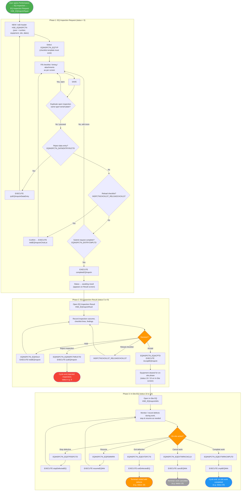
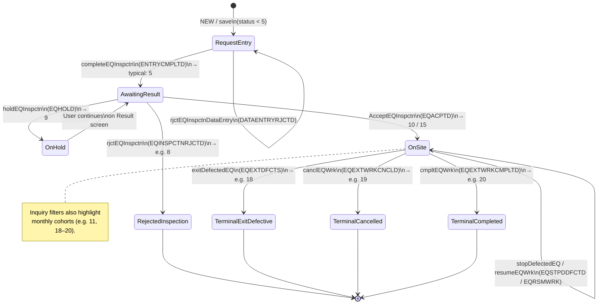
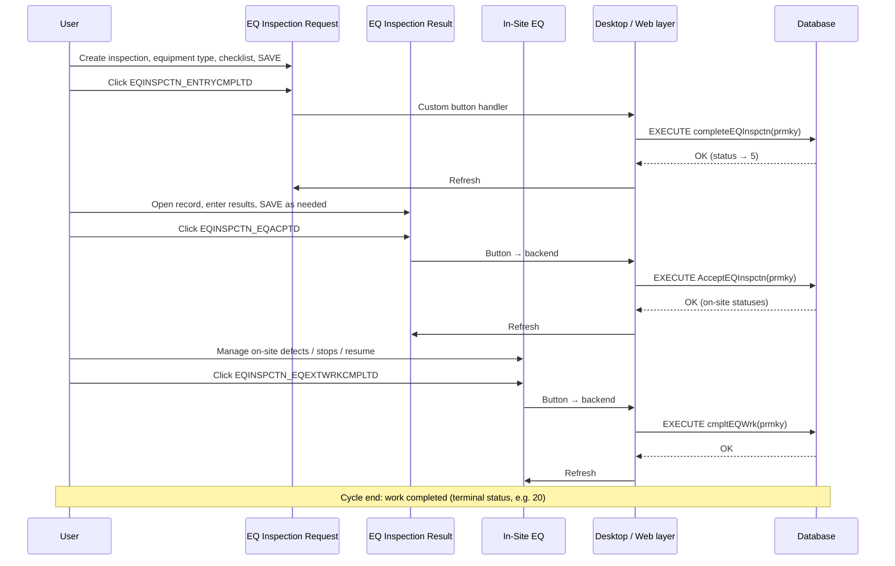
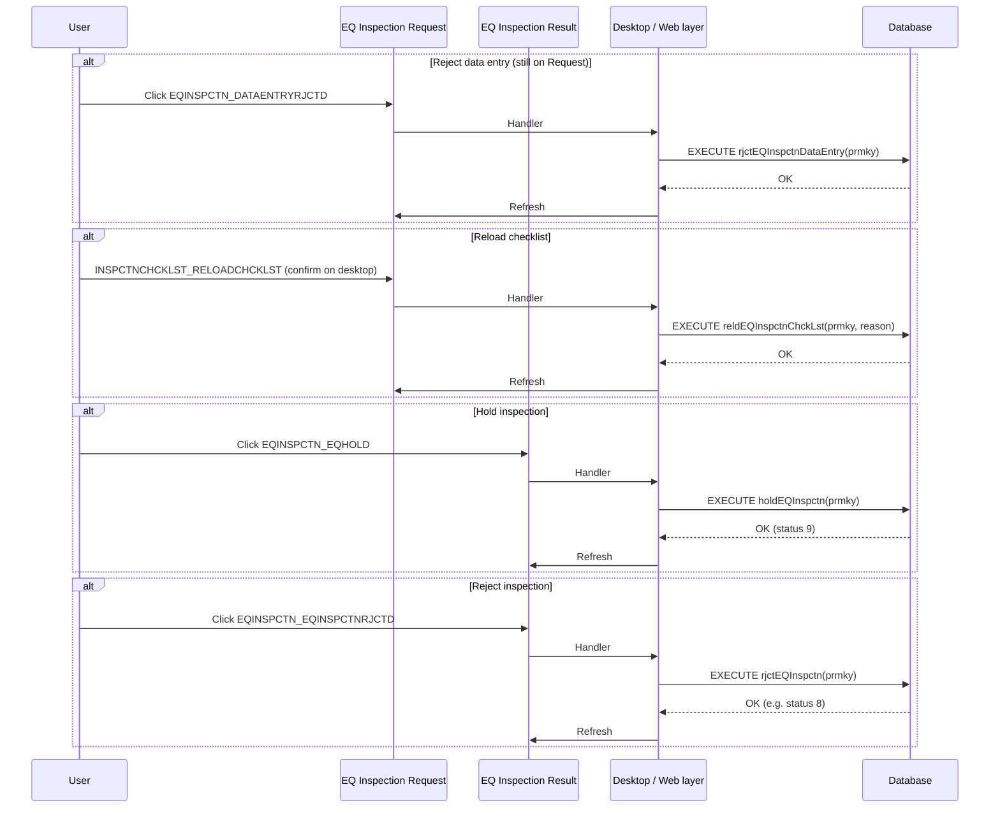

# Equipment Inspections Process -- UML Documentation

<!-- RQ_HSE_23_3_26_23_15 -->

> **Source**: HSEMS C++ Desktop (`HSEMS-Win`, `EQInspctnCategory.cpp`) + Web (`hse` module screen handlers, `ModuleButtonHandlers`) + app metadata (`Test/APP_JSON/66` HSE EQ Inspection screens)
> **Scope**: Equipment inspection lifecycle from **EQ Inspection Request** (entry) through **EQ Inspection Result**, **In-Site EQ** (on-site work), until **terminal exit outcomes** (work completed, cancelled, or exit-with-defects paths driven by the database)
> **Date**: March 2026
> **See also**: [`HSEMS_Use_Cases_From_Desktop_Code.md`](./HSEMS_Use_Cases_From_Desktop_Code.md) §4.2, §11 (stored procedures summary)

---

## 1. Process overview

The **Equipment Inspection** module tracks **equipment brought onto a work site** under **Performance → EQ Inspection**. One header row in **`HSE_EQINSPCTN`** is shared across **Request**, **Result**, **In-Site**, and **Inquiry** screens; each screen filters by **`EQINSPCTN_INSPCTNSTTUS`**. Users capture **checklist lines**, optional **defects during work**, and **inspection timing** on sub-forms. Status transitions and business rules are enforced mainly by **stored procedures** invoked from **custom buttons** (`EQInspctnCategory::DisplayCustomButtonClicked` on desktop; web handlers delegate `EQINSPCTN_*` / `INSPCTNCHCKLST_*` actions to the backend where configured).

### 1.1 Operational screens

| Phase | Screen (caption) | Tag | C++ category (reference) | Primary table | Status filter (from app JSON) |
|-------|------------------|-----|---------------------------|---------------|-------------------------------|
| Request / entry | EQ Inspection Request | `HSE_EQInspctnRqust` | `EQInspctnCategory` | `HSE_EQINSPCTN` | `EQINSPCTN_INSPCTNSTTUS < 5` |
| Inspection result | EQ Inspection Result | `HSE_EQInspctnRsult` | `EQInspctnCategory` | (same) | `= 5` **or** `= 9` |
| On-site work | In-Site EQ | `HSE_EQInspctnWrk` | `EQInspctnCategory` | (same) | `= 10` **or** `= 15` |
| Inquiry | EQ Inspection Inquiry | `HSE_EQInspctnInqry` | Read-only + filter buttons | (same) | (dynamic `ChangeCriteria` / user filters) |

**Key field** (header): `EQINSPCTN_PRMKY` (listed as `EQInspctn_PrmKy` in metadata). **Business key**: `EQINSPCTN_INSPCTNYR` + `EQINSPCTN_INSPCTNN`. On **NEW**, desktop assigns the next inspection number for the current year (`getCurrentEQInspctnNo`).

### 1.2 Sub-forms and related data

| Artefact | Typical tags / tables | Purpose |
|----------|------------------------|---------|
| Inspection checklist | `HSE_EQINSPCTN_INSPCTNCHCKLST` (per-screen JSON under Request / Result / Inquiry) | Per-line checklist for the selected **equipment type**; field-change logic can set **accepted** flags from **defect found** / **action done** (see `EQInspctnCategory::DisplayFieldChange`) |
| Inspection time | `HSE_EQINSPCTN_INSPCTNTM` | Timing details for the inspection |
| Defects during work | `HSE_EQINSPCTN_DFCTSDURNGWRK` | Defect lines while equipment is on site; desktop auto-assigns line number via `getCurrentEQInspctnDfctNo` when appropriate |
| Tracing | `HSE_EQINSPCTN` tracing sub-form | Audit trail of actions on the inspection |

**Master data**: Checklist templates come from **`HSE_EQTYPS_INSPCTNCHCKLST`** (by `EQINSPCTN_EQTYP`). Choosing an equipment type with **no** related checklist rows triggers a desktop message (`IDS_INSPCTN_RQST_EMPTY_CHKLST`).

### 1.3 Cross-cutting validation (request entry)

On **SAVE** (desktop), the category runs a **duplicate open inspection** check: the same **equipment type + serial (+ plate when present)** must not already exist with **`EQInspctn_InspctnSttus < 5`**. If a match exists, the user is warned (*"This Equipment entered before!"*).

**Expected exit date** is derived from **entry date**, **working days**, and **working hours** (`DisplayFieldChange` on `EQINSPCTN_EQENTRYDT` / `EQINSPCTN_EQWRKNGDYS` / `EQINSPCTN_EQWRKNGHURS` → `EQINSPCTN_EXPCTDEXTDT`).

### 1.4 Stored procedures (transactional)

| Procedure | Typical phase | Purpose |
|-----------|---------------|---------|
| `completeEQInspctn` | Request | Complete request / data entry; advances status so the record appears on **EQ Inspection Result** (status **5**) |
| `rjctEQInspctnDataEntry` | Request | Reject **data entry**; returns record for correction on the request side |
| `reldEQInspctnChckLst` | Request / Result | Reload checklist from equipment type (desktop prompts for confirmation; comment text passed as in C++) |
| `rjctEQInspctn` | Result | Reject the **inspection** (equipment not accepted) |
| `holdEQInspctn` | Result | Put inspection **on hold** (status **9** — still visible on Result screen) |
| `AcceptEQInspctn` | Result | **Accept** inspection; equipment cleared to proceed to **on-site** handling (status moves toward **10** / **15** per business rules) |
| `stopDefectedEQ` | In-Site | Stop defective equipment on site |
| `resumeEQWrk` | In-Site | Resume work after stop |
| `exitDefectedEQ` | In-Site | Exit flow for defective equipment |
| `canclEQWrk` | In-Site | Cancel on-site work / job |
| `cmpltEQWrk` | In-Site | Complete on-site work — **cycle completion** path |

Exact numeric **`EQINSPCTN_INSPCTNSTTUS`** values for each transition are defined in the database; inquiry **quick filters** on desktop use statuses **8** (rejected), **9** (on hold), **10** (working on site), **11** (stopped defective, current month), **18** / **19** / **20** (monthly exit categories for defective / cancelled / completed).

### 1.5 Custom buttons (desktop reference)

| Button | Purpose |
|--------|---------|
| `EQINSPCTN_ENTRYCMPLTD` | `EXECUTE completeEQInspctn` |
| `EQINSPCTN_DATAENTRYRJCTD` | `EXECUTE rjctEQInspctnDataEntry` |
| `INSPCTNCHCKLST_RELOADCHCKLST` | `EXECUTE reldEQInspctnChckLst` |
| `EQINSPCTN_EQINSPCTNRJCTD` | `EXECUTE rjctEQInspctn` |
| `EQINSPCTN_EQHOLD` | `EXECUTE holdEQInspctn` |
| `EQINSPCTN_EQACPTD` | `EXECUTE AcceptEQInspctn` |
| `EQINSPCTN_EQSTPDDFCTD` | `EXECUTE stopDefectedEQ` |
| `EQINSPCTN_EQRSMWRK` | `EXECUTE resumeEQWrk` |
| `EQINSPCTN_EQEXTDFCTS` | `EXECUTE exitDefectedEQ` |
| `EQINSPCTN_EQEXTWRKCNCLD` | `EXECUTE canclEQWrk` |
| `EQINSPCTN_EQEXTWRKCMPLTD` | `EXECUTE cmpltEQWrk` |
| `EQINSPCTN_VWINSPCTNRQSTHSTRY` | Open inquiry filtered to **prior completed** inspections for same type/serial/plate |

**Web note** (**RQ_HSE_23_3_26_23_15**): All lifecycle and inquiry buttons in §1.5 are handled by **`handleEQInspectionModuleButtons`** in [`eqInspectionButtonHandlers.js`](hse/src/services/ModuleButtonHandlers/eqInspectionButtonHandlers.js) (via **`ModuleButtonHandlers`**). SAVE-time duplicate warning and **`SubFieldChanged`** rules are on the EQ Request / Result / In-Site screen handlers. Validation: [`Equipment_Inspections_Activity_Web_Validation.md`](./Equipment_Inspections_Activity_Web_Validation.md).

---

## 2. Activity diagram -- Equipment inspection (entry to cycle end)

<!-- RQ_HSE_23_3_26_23_15 -->

**Web implementation check** (§2 nodes vs `hse`): [`Equipment_Inspections_Activity_Web_Validation.md`](./Equipment_Inspections_Activity_Web_Validation.md) — **RQ_HSE_23_3_26_23_15**.

---

## 3. State machine -- Inspection status (logical)

<!-- RQ_HSE_23_3_26_23_15 -->

Numeric **`EQINSPCTN_INSPCTNSTTUS`** values are authoritative in the database. The diagram summarizes **stages** implied by screen `WhereClause` filters and inquiry shortcuts in `EQInspctnCategory.cpp`.

---

## 4. Sequence diagram -- Happy path (request → accept → complete work)

<!-- RQ_HSE_23_3_26_23_15 -->

---

## 5. Sequence diagram -- Reject / hold / reload checklist

<!-- RQ_HSE_23_3_26_23_15 -->

---

## 6. Use case summary (actors vs system)

| Actor step | System response |
|------------|-----------------|
| User registers equipment for site entry on **EQ Inspection Request** | Persist `HSE_EQINSPCTN`; load checklist from equipment type; validate duplicates (open inspections) |
| User completes request | `completeEQInspctn`; record moves to **EQ Inspection Result** queue |
| User rejects own data entry | `rjctEQInspctnDataEntry`; correct on Request |
| Inspector records results | Update checklist / timing / defects sub-forms; optional `reldEQInspctnChckLst` |
| Inspector holds | `holdEQInspctn`; status **9** |
| Inspector rejects equipment | `rjctEQInspctn`; inspection rejected (e.g. status **8**) |
| Inspector accepts | `AcceptEQInspctn`; equipment eligible for **In-Site EQ** |
| Site team manages on-site work | `stopDefectedEQ`, `resumeEQWrk`, `exitDefectedEQ`, `canclEQWrk`, `cmpltEQWrk` |
| User views history for same equipment | `EQINSPCTN_VWINSPCTNRQSTHSTRY` opens inquiry with SQL for **completed** prior inspections |

---

*End of document*
