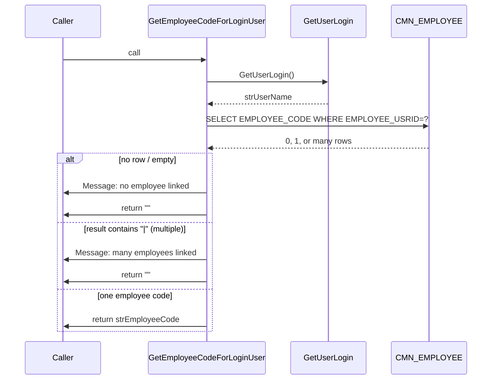

# GetEmployeeCodeForLoginUser – Desktop Behaviour

This document describes what the **desktop (C++)** function `GetEmployeeCodeForLoginUser()` does. It is used to resolve the **current login user** to an **employee code** from the `CMN_EMPLOYEE` table. The web implementation should match this behaviour (including validation and user messages).

---

## 1. Location and signature

- **File:** `HSEMS-Win\HSEMS.DLL\HSEMSCommonCategory.cpp`
- **Class:** `CHSEMSCommonCategory`
- **Declaration:** `HSEMSCommonCategory.h` line 309  
  `CString GetEmployeeCodeForLoginUser();`
- **Return:** `CString` – the **employee code** for the current login user, or **empty string** if none/multiple/invalid.

---

## 2. Purpose

Resolve the **logged-in user** (login ID / user name) to the corresponding **employee code** in `CMN_EMPLOYEE`. Used where the system needs an employee identity (e.g. Observation Approval Close, Audit flows). If there is no linked employee or the link is ambiguous, the function shows a message and returns empty.

---

## 3. Algorithm (flow)

```mermaid
flowchart TD
    A[GetEmployeeCodeForLoginUser] --> B[strUserName = GetUserLogin]
    B --> C[SQL: SELECT EMPLOYEE_CODE FROM CMN_EMPLOYEE<br/>WHERE EMPLOYEE_USRID = strUserName]
    C --> D[Execute query, get first row]
    D --> E[strEmployeeCode = GetRecordSetData strSql, 1]
    E --> F{strEmployeeCode empty?}
    F -->|Yes| G[AfxMessageBox: There is no employee linked with the login id,<br/>Please solve the problem and try again]
    G --> H[return ""]
    F -->|No| I{strEmployeeCode contains '|'?}
    I -->|Yes| J[AfxMessageBox: There are many employees linked with the login id,<br/>Please solve the problem and try again]
    J --> K[return ""]
    I -->|No| L[return strEmployeeCode]
```

---

## 4. Step-by-step behaviour

| Step | Desktop action | Details |
|------|----------------|--------|
| 1 | Get login user | `strUserName = GetUserLogin()` – current Windows/login user ID. |
| 2 | Build SQL | `SELECT EMPLOYEE_CODE FROM CMN_EMPLOYEE WHERE EMPLOYEE_USRID='%s'` with `strUserName` (escaped). |
| 3 | Execute and read | Run the query; get the **first column** of the first row via `GetRecordSetData(strSql, 1)` → `strEmployeeCode`. |
| 4 | No employee | If `strEmployeeCode == ""`: show **“There is no employee linked with the login id, Please solve the problem and try again”**, return `""`. |
| 5 | Multiple employees | If `strEmployeeCode` contains **`|`** (pipe): treat as “multiple rows” / concatenated values; show **“There are many employees linked with the login id, Please solve the problem and try again”**, return `""`. |
| 6 | Success | Otherwise return `strEmployeeCode` (single employee code). |

---

## 5. Data model (conceptual)

```mermaid
erDiagram
    LOGIN_USER ..> CMN_EMPLOYEE : "EMPLOYEE_USRID"
    CMN_EMPLOYEE {
        string EMPLOYEE_CODE PK
        string EMPLOYEE_USRID "links to login user"
    }
```

- **Table:** `CMN_EMPLOYEE`
- **Link to login:** `EMPLOYEE_USRID` = login user ID (from `GetUserLogin()`).
- **Returned value:** `EMPLOYEE_CODE` (first column in the SELECT).
- **Note:** In some schemas the column may be named `EMPLOYEE_LOGINNAME` or similar; the web implementation should use the column that corresponds to “login user” in the actual database.

---

## 6. Validation and user messages

| Condition | Message (desktop) | Return value |
|-----------|-------------------|--------------|
| No row / empty result | “There is no employee linked with the login id, Please solve the problem and try again” | `""` |
| Multiple rows (result contains `\|`) | “There are many employees linked with the login id, Please solve the problem and try again” | `""` |
| Exactly one employee code | (no message) | That employee code |

---

## 7. C++ code reference

```cpp
CString CHSEMSCommonCategory::GetEmployeeCodeForLoginUser()
{
    CString strSql;
    CString strUserName = GetUserLogin();
    strSql.Format("select EMPLOYEE_CODE from CMN_EMPLOYEE where EMPLOYEE_USRID='%s'",strUserName);
    CString strEmployeeCode=GetRecordSetData(strSql,1);
    if(strEmployeeCode=="")
    {
        AfxMessageBox("There is no employee linked with the login id, Please solve the problem and try again");
        strEmployeeCode="";
    }
    else if(strstr(strEmployeeCode,"|"))
    {
        AfxMessageBox("There are many employees linked with the login id, Please solve the problem and try again");
        strEmployeeCode="";
    }
    return strEmployeeCode;
}
```

- **GetUserLogin()** – returns the current login user ID (from the framework/category).
- **GetRecordSetData(strSql, 1)** – executes the SQL and returns the value of the **first column** of the first row (column index 1 = first column in this codebase). Returns empty if no row.

---

## 8. Where it is used (desktop)

- **NearMissFollowUpCategory::DisplayCustomButtonClicked** (Observation Approval Close): if `GetEmployeeCodeForLoginUser()` returns empty, the Close logic does **not** run `closeNearMissTXN`; only refresh is performed.
- **AuditModuleCategory** and possibly other flows that need the current user’s employee code.

---

## 9. Web implementation notes

- **Input:** Current login user – use the same source as the rest of the app (e.g. from auth/session or existing `getUserLogin` / `getUserID`).
- **Database:** Query `CMN_EMPLOYEE`:
  - Use the column that links to login user: **`EMPLOYEE_USRID`** (desktop) or **`EMPLOYEE_LOGINNAME`** (or equivalent) depending on the server schema.
  - Select **`EMPLOYEE_CODE`**.
- **Validation:**  
  - No row or empty → show the “no employee linked” message, return empty.  
  - If the result (or concatenation of multiple rows) contains `|` → show the “many employees linked” message, return empty.  
  - Otherwise return the single employee code (first row, first column).
- **API shape:** Can be a server endpoint (e.g. `GET /api/.../employee-code-for-login`) or a shared SQL helper used by the client through the existing execute-SQL mechanism; the important part is to replicate the logic and messages above.

---

## 11. Web implementation (BUG_HSE_HSM_14_3_26)

All web code for this behaviour is tagged with **ClickUp ID: BUG_HSE_HSM_14_3_26**.

- **Util:** `hse/src/utils/getEmployeeCodeForLoginUser.js`  
  - `getEmployeeCodeForLoginUser(devInterface)` – async, returns `Promise<string>`.  
  - Uses `devInterface.getUserName`, `executeSQLPromise`, `toast`.  
  - Tries `EMPLOYEE_USRID` then `EMPLOYEE_LOGINNAME` for schema compatibility.  
  - No row or empty → toast “There is no employee linked with the login id…”, return `""`.  
  - More than one row → toast “There are many employees linked…”, return `""`.  
  - Value contains `|` → same “many employees” toast, return `""`.  
  - Otherwise returns the single employee code.
- **Exposure:** `hse/hse.js` adds `devInterfaceObj.getEmployeeCodeForLoginUser = () => getEmployeeCodeForLoginUserImpl(devInterfaceObj)`.
- **Use:** Observation Approval Close in `ObservationButtonHandlers.js` awaits `getEmployeeCodeForLoginUser()` and, if it returns empty, only refreshes (no `closeNearMissTXN`).

---

## 10. Summary diagram


