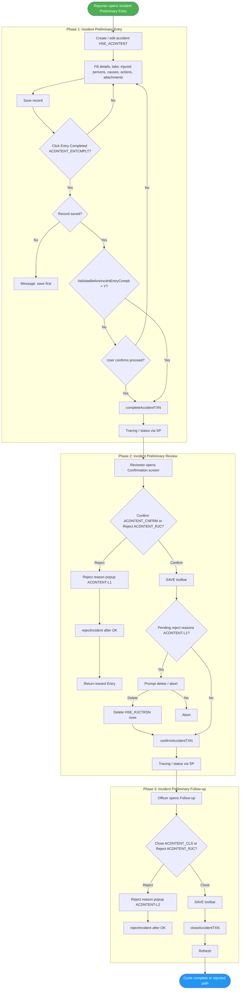
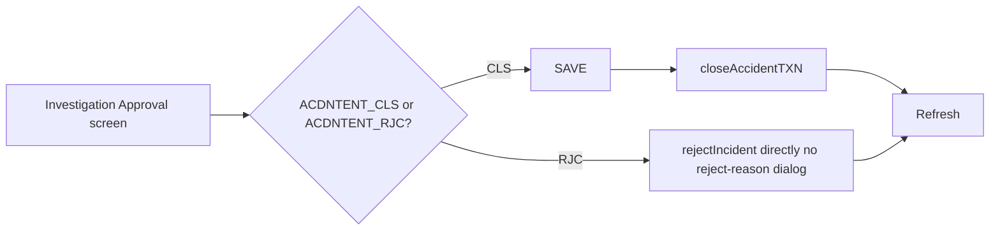
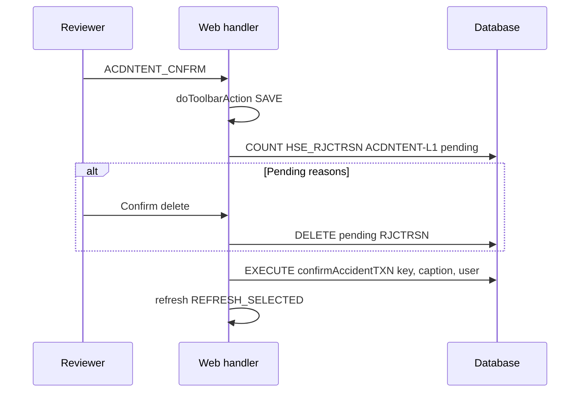

# Incident / Accident (Preliminary) Process – UML Documentation

<!-- RQ_HSE_23_3_26_3_36 -->

> **Source**: HSEMS C++ Desktop (`HSEMS-Win`) + Web (`hse` module)  
> **Scope**: Preliminary incident lifecycle (`HSE_ACDNTENT`), investigation entry/approval, plus pointers to Flash & Medical tracks  
> **Date**: March 2026  
> **See also**: [`Incident_to_CAR_End_to_End_UML.md`](./Incident_to_CAR_End_to_End_UML.md) — **register incident → CAR → close cycle** (activity, state, sequence, component diagrams).

---

## 1. Process overview

The **Incident Preliminary** track covers: **Entry → Complete → Review (Confirm) → Follow-up (Close)**, with **Reject** paths from Review and Follow-up using the reject-reason dialog (`ACDNTENT-L1` / `ACDNTENT-L2`).

**Separate tracks** (different tables / SPs):

| Track | Web screen tags (examples) | Primary SPs |
|-------|----------------------------|-------------|
| Flash report | `HSE_TgIncdntFlshRprt`, `HSE_TgIncdntFlshRprtRvew` | `CompleteFlashEntry`, `RejectFlashFromReview`, `AccptFlashFromReview` |
| Medical report | `HSE_TgIncdntMdclRprt`, `HSE_TgIncdntMdclRprtFlwUp` | `completeIncdntMdclRprt`, `closeIncdntMdclRprt` |
| Investigation | `HSE_TgIncdntInvstgtnEntry`, `HSE_TgIncdntInvstgtnAprvl` | `completeAccidentTXN` (entry), `closeAccidentTXN` / **direct** `rejectIncident` (approval) |

---

## 2. Activity diagram – Preliminary incident (end-to-end)

**Policy (not shown as nodes):** Desktop permits **Preliminary Review** only if HSE policy **Accident Confirmation** is enabled (`HSEPLC_ACDNTCNFRMTNRQRD`). Web mirrors this in [`Incident_Preliminary_Review.js`](../hse/src/screenHandlers/Safety/Incident/Incident_Preliminary_Review.js) `ShowScreen`.

---

## 3. Activity diagram – Investigation approval (subset)

*C++ reference*: `IncdntInvstgtnAprvCategory.cpp` — `CloseAccident` / `RejectAccident` (no `Reject()` helper).

---

## 4. State machine (conceptual)

Exact numeric statuses are enforced in DB / SPs (`completeAccidentTXN`, `confirmAccidentTXN`, `closeAccidentTXN`, `rejectIncident`). Typical pattern (verify against your DB):

| Phase | Action | Direction |
|-------|--------|-------------|
| Entry | Complete | Incomplete → Submitted for review |
| Review | Confirm | → Approved for follow-up |
| Review | Reject | → Back for correction |
| Follow-up | Close | → Closed |
| Follow-up | Reject | → Prior state per SP |

---

## 5. Sequence diagram – Preliminary confirm (desktop parity)

---

## 6. Stored procedure reference (preliminary + investigation)

| Procedure | Typical parameters | Called from |
|-----------|-------------------|-------------|
| `completeAccidentTXN` | key, screen caption, user | Preliminary Entry (`ACDNTENT_ENTCMPLT`), Investigation Entry (`ACDNTENT_ENTRYCMPLTD`) |
| `confirmAccidentTXN` | key, screen caption, user | Preliminary Review (`ACDNTENT_CNFRM` / `ACDNTENT_APRV`) |
| `closeAccidentTXN` | key, user, screen caption | Follow-up (`ACDNTENT_CLS`), Investigation Approval (`ACDNTENT_CLS`) |
| `rejectIncident` | key, screen caption, user | After reject-reason OK (L1/L2), or **direct** from Investigation Approval |

### Flash / Medical (handlers in screen JS)

| Procedure | Screen |
|-----------|--------|
| `CompleteFlashEntry` | Flash Entry |
| `RejectFlashFromReview` / `AccptFlashFromReview` | Flash Review |
| `completeIncdntMdclRprt` | Medical Entry |
| `closeIncdntMdclRprt` | Medical Follow-up |

---

## 7. Reject reason module types (HSE_RJCTRSN)

| Screen | `RJCTRSN_MODULETYPE` |
|--------|----------------------|
| Preliminary Review | `ACDNTENT-L1` |
| Preliminary Follow-up | `ACDNTENT-L2` |

**Investigation Approval** does not use this popup in desktop; it calls `rejectIncident` immediately.

---

## 8. C++ reference files

| File | Responsibility |
|------|----------------|
| `AccidentEntryCategory.cpp` | `ACDNTENT_ENTCMPLT`, validations, `CompleteAccident` |
| `AccidentConfirmationCategory.cpp` | SAVE, `ACDNTENT_CNFRM`, reject reasons, `confirmAccidentTXN` |
| `AccidentFollowUpCategory.cpp` | SAVE, `ACDNTENT_CLS`, `closeAccidentTXN` |
| `AccidentCategory.cpp` | `ACDNTENT_RJC`, `rejectRecord` → L1/L2, `rejectIncident` after dialog |
| `IncdntInvstgtnEntryCategory.cpp` | `ACDNTENT_ENTRYCMPLTD`, `completeAccidentTXN` |
| `IncdntInvstgtnAprvCategory.cpp` | `ACDNTENT_CLS`, `ACDNTENT_RJC` direct SPs |

---

*End of document*
