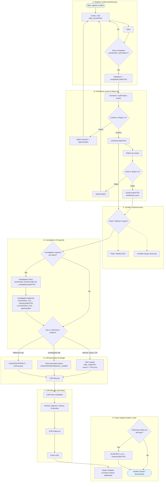
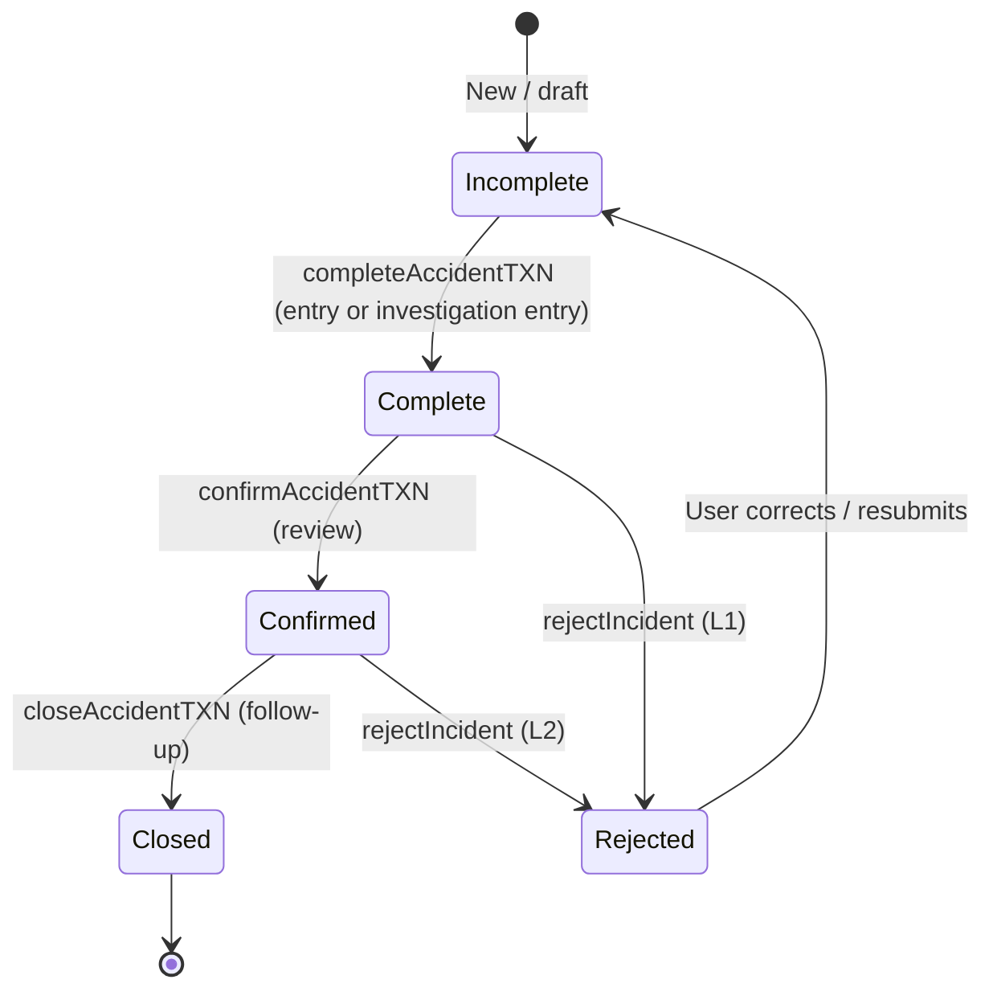
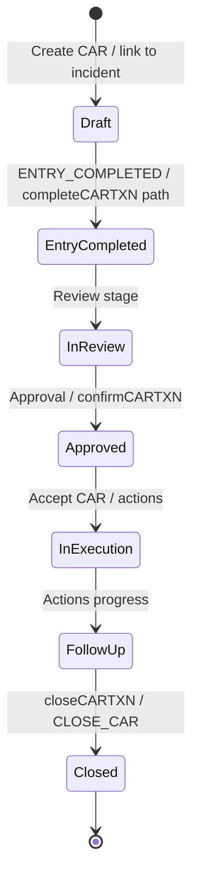
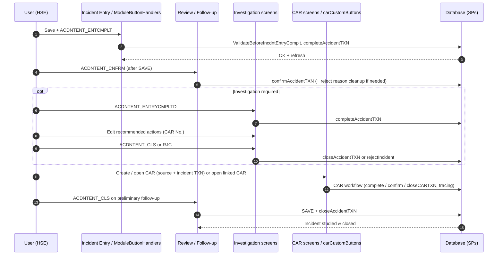
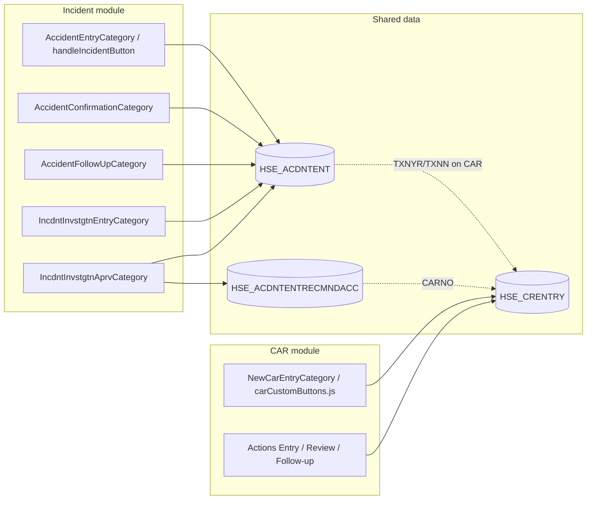

# Incident / Accident → CAR → Closure — UML Documentation

> **Purpose**: Model **registering an incident**, **generating / tracking a Corrective Action Request (CAR)**, and **closing the cycle** so the original incident is **studied** (investigation) and **closed**.  
> **Sources**: HSEMS C++ (`HSEMS-Win\HSEMS.DLL`), Web (`hse` module), [`HSEMS_Use_Cases_From_Desktop_Code.md`](./HSEMS_Use_Cases_From_Desktop_Code.md), [`Incident_Reporting_Process_UML.md`](./Incident_Reporting_Process_UML.md).  
> **Date**: March 2026
<!-- RQ_HSE_23_3_26_3_36 -->
---

## 1. Scope & actors

| Actor | Role |
|-------|------|
| **Reporter / Entry user** | Registers the incident on **Incident Preliminary Entry** (`HSE_TGACDNTENT`). |
| **Reviewer** | Confirms or rejects at **Preliminary Review** (`HSE_TGACDNTCNFRMTN`). |
| **HSE / Follow-up officer** | Closes preliminary follow-up or drives investigation completion. |
| **Investigator** | Completes **Investigation Entry**; maintains **recommended actions** (may link **CAR** numbers). |
| **Approver** | **Investigation Approval** — close or reject investigation (`HSE_TGINCDNTINVSTGTNAPRVL`). |
| **CAR owner / action owners** | **CAR Entry → Review → Approval → Actions → Execution → CAR Follow-up → Close CAR** (`HSE_CRENTRY` lifecycle). |

**Data anchor**: Main incident record is **`HSE_ACDNTENT`** (`ACDNTENT_ACDNTNUM`). CAR records live in **`HSE_CRENTRY`** and link back via **CAR source**, **transaction year/number** (`CRENTRY_TXNYR`, `CRENTRY_TXNN`), and/or **recommended-action** lines (`HSE_ACDNTENTRECMNDACC` / `ACDNTENTRECMNDACC_CARNO`).

---

## 2. High-level process (activity overview)

The end-to-end story has **three coupled threads**:

1. **Incident (preliminary)**: Entry → Complete → Review (Confirm/Reject) → Follow-up (**Close** = `closeAccidentTXN`).
2. **Investigation (optional, policy-gated)**: Investigation Entry (`completeAccidentTXN`) → Investigation Approval (`closeAccidentTXN` or `rejectIncident`).
3. **CAR**: Create/link CAR → complete CAR workflow → **Close CAR** (`closeCARTXN` / status per `CRENTRY_CRSTT` in web handlers).

CAR may be **created before, during, or after** preliminary close, depending on **procedure**, **manual CAR Entry**, and **recommended actions**. Closing the **incident preliminary follow-up** is the usual **business “cycle complete”** for the original registration once investigation/CAR work is satisfied.

---

## 3. Activity diagram — end-to-end (incident register → CAR → incident closed)

**Notes**

- **Order flexibility**: In many deployments, **F3** (preliminary close) happens **after** CAR execution; in others, **follow-up close** is the final gate. The diagram allows **CAR (E–F)** to run **overlapping** investigation **(D)**.
- **CAR auto-generation**: HSE Policy may trigger **`sp_Generate_CARs`** (and similar) when transactions close; **observations** have explicit web CAR generation — **incidents** often rely on **DB procedures** and **manual CAR Entry** with **source** and **TXN** fields. Verify in your database.
- **Desktop reference**: `IncdntInvstgtnAprvCategory.cpp` locks **recommended action** rows when **`ACDNTENTRECMNDACC_CARNO` ≠ "0"** — CAR is already tied.

---

## 4. State machine — incident (`HSE_ACDNTENT` conceptual)

Statuses are driven by **`completeAccidentTXN`**, **`confirmAccidentTXN`**, **`closeAccidentTXN`**, **`rejectIncident`** (exact codes are in DB/SPs). Typical pattern:

**Investigation** reuses **completeAccidentTXN** on investigation entry and **closeAccidentTXN** / **rejectIncident** on approval — states should be interpreted **together** with **screen** (preliminary vs investigation).

---

## 5. State machine — CAR (`HSE_CRENTRY` simplified)

Web handlers (`carCustomButtons.js`) transition **`CRENTRY_CRSTT`** (e.g. 05 Entry completed, 19 Accepted, 25 Closed). Desktop **`NewCarEntryCategory`** documents many of the same steps.

---

## 6. Sequence diagram — incident registration, CAR link, closure

---

## 7. Component view (logical modules)

---

## 8. Stored procedures (cross-reference)

| Concern | Procedures (typical) |
|---------|----------------------|
| Incident | `completeAccidentTXN`, `confirmAccidentTXN`, `closeAccidentTXN`, `rejectIncident` |
| CAR | `completeCARTXN`, `confirmCARTXN`, `closeCARTXN`, `rejectCARTXN`, `cancelCAR`, `sp_Generate_CARs` |
| Validation | `ValidateBeforeIncdntEntryComplt` |

See [§11 Appendix in HSEMS_Use_Cases_From_Desktop_Code.md](./HSEMS_Use_Cases_From_Desktop_Code.md) and [Incident_Reporting_Process_UML.md §6](./Incident_Reporting_Process_UML.md).

---

## 9. Web vs desktop notes

| Topic | Note |
|-------|------|
| **Incident buttons** | Centralized in **`handleIncidentButton`** (web); split by **category classes** (desktop). |
| **CAR from observation** | Web implements **client CAR insert** after close in **`ObservationButtonHandlers`**; **incident** CAR creation may be **SP/policy** or **manual** — align with DB. |
| **View Source TXN (CAR)** | Web **`carCustomButtons.js`** navigates **Observation / Near Miss / Audit**; extending to **Accident Inquiry** matches desktop intent for **incident-sourced** CARs. |
| **Medical / pop-ups** | Injury sub-flows may still be **partial** on web — see [`Incident_Process_Web_Validation.md`](./Incident_Process_Web_Validation.md). |

---

## 10. Diagram index

| # | Diagram type | Section |
|---|----------------|---------|
| 1 | **Activity** (flowchart) | §3 End-to-end |
| 2 | **State machine** | §4 Incident |
| 3 | **State machine** | §5 CAR |
| 4 | **Sequence** | §6 Registration → CAR → close |
| 5 | **Component** | §7 Modules & tables |

---

*End of document*
