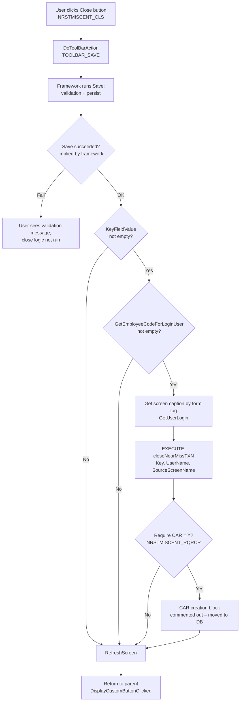
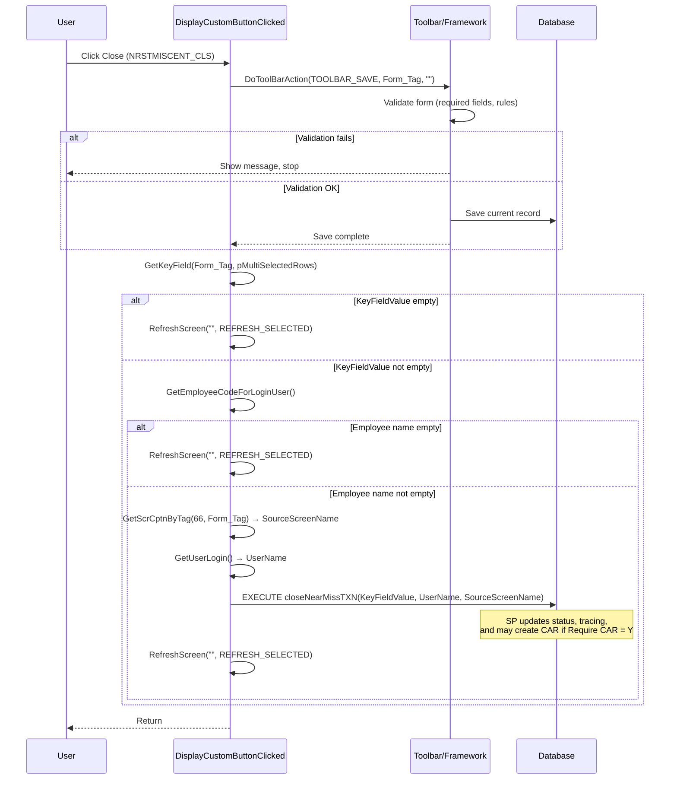
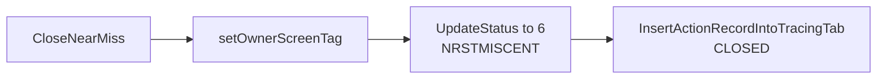

# Observation Approval Screen – Custom Close Button (Desktop Behavior)

This document describes what the **desktop (C++) application** does when the **custom Close button** is clicked on the **Observation Approval** screen (Near Miss Follow-up: `HSE_TGNRSTMISCFLWUP`). It covers validations and actions, with diagrams where useful.

---

## 1. Entry Point

- **Button ID:** `NRSTMISCENT_CLS`
- **Handler:** `NearMissFollowUpCategory::DisplayCustomButtonClicked()` in `NearMissFollowUpCategory.cpp`

---

## 2. High-Level Flow (Diagram)

---

## 3. Validations

Validations are effectively done in two places: **before** any close-specific logic (via Save), and **inside** the close logic (checks that gate execution).

### 3.1 Validations via Save (DoToolBarAction TOOLBAR_SAVE)

Before any Close-specific code runs, the desktop app triggers the **toolbar Save** for the current form:

- **What runs:** The framework’s standard Save (e.g. `FormDoAction` with `SAVE_BUTTON`). This runs the **normal screen validation and persist** for the Observation Approval form (required fields, business rules, DB constraints, etc.).
- **Effect:** If Save fails (validation error or persist error), the framework typically shows a message and does **not** continue. The Close-specific logic (e.g. `closeNearMissTXN`, tracing, refresh) is only run **after** a successful Save.

So in practice:

- **Validation:** All validations that apply to **saving** the current Observation Approval record (main form + any validated tabs) are performed first.
- **No explicit “close-only” validation** is coded in C++ beyond the checks below; the main gate is “Save must succeed.”

### 3.2 Validations in the Close Logic

After Save, the Close handler does the following **checks** (no user-facing validation messages in code; they just skip part of the logic):

| Check | Location | Effect if condition not met |
|-------|----------|-----------------------------|
| **Selected record key non-empty** | `KeyFieldValue = GetKeyField(...)` | The whole block that calls `closeNearMissTXN` and optional CAR logic is skipped; only `RefreshScreen` runs. |
| **Employee code for login user non-empty** | `GetEmployeeCodeForLoginUser()` | The block that runs `closeNearMissTXN` (and CAR logic if applicable) is skipped; only `RefreshScreen` runs. |

So:

- **Validation (implicit):** There must be a **selected record** (non-empty key) and a **valid employee code for the current user** for the close transaction and CAR logic to run.
- **No extra UI validation** is done in C++ for the Close button beyond what Save already enforces.

---

## 4. Actions (In Order)

What the desktop does when the Close button is clicked, in sequence:

### 4.1 Step-by-Step List

1. **Trigger Save**
   - `DoToolBarAction(TOOLBAR_SAVE, pCustomButtonClicked->Form_Tag, "")`
   - Framework runs normal **validation** and **save** for the Observation Approval screen. If this fails, the rest of the Close logic does not run.

2. **Ensure a record is selected**
   - `KeyFieldValue = GetKeyField(strFormTag, pCustomButtonClicked->pMultiSelectedRows)`
   - If `KeyFieldValue` is empty, skip to step 6 (refresh only).

3. **Ensure user has employee code**
   - `strEmployeeName = GetEmployeeCodeForLoginUser()`
   - If empty, skip to step 6 (refresh only).

4. **Resolve source screen and user for tracing**
   - `strSourceScreenName = GetScrCptnByTag(66, strFormTag, "")`  (screen **caption**, not form tag)
   - `strUserName = GetUserLogin()`

5. **Run close transaction**
   - `EXECUTE closeNearMissTXN 'KeyFieldValue','strUserName','strSourceScreenName'`
   - The stored procedure is responsible for:
     - Updating the observation record (e.g. status to Closed = 6),
     - Inserting a **tracing** record (e.g. action “Closed”, source screen name, user),
     - Any **CAR creation** when “Require CAR” = Y (CAR logic was moved from C++ into DB, so it may be inside this SP or a related one).

6. **Refresh the grid**
   - `RefreshScreen("", REFRESH_SELECTED)` so the UI shows the updated status.

7. **Return**
   - `return NearMissCategory::DisplayCustomButtonClicked(pCustomButtonClicked);`

---

## 5. Legacy “CloseNearMiss” (Not Used in Close Button)

The C++ class also has a helper `CloseNearMiss()` that is **not** called from the Close button path. It illustrates the original, non-SP behavior:

- **UpdateStatus(..., 6, "NRSTMISCENT", "NRSTMISCENT_NRSTMISCNUM")**  
  Sets record status to **6 (Closed)** for the selected row(s).

- **InsertActionRecordIntoTracingTab("NRSTMISCENT", "NRSTMISCNUM", CLOSED)**  
  Inserts a tracing row with action **“Closed”**, using:
  - Source screen **caption** (from `GetScrCptnByTag`),
  - Current user from `GetUserLogin()`,
  - Link to the observation record.

In the **actual** Close button flow, the same outcome (status update + tracing “Closed”) is done inside **`closeNearMissTXN`** (and possibly CAR creation there if Require CAR = Y).

---

## 6. Summary Table

| Phase        | Validations / checks                    | Actions |
|-------------|------------------------------------------|---------|
| **Save**    | All form validations required for save  | Persist current Observation Approval record |
| **Close**   | KeyFieldValue non-empty; employee code non-empty | Get source screen caption and user; run `closeNearMissTXN`; refresh grid |

**Stored procedure `closeNearMissTXN`** is responsible for:

- Updating observation status to **Closed (6)**,
- Inserting the **tracing** record (action “Closed”, source screen name, user),
- Any **CAR creation** when “Require CAR” = Y (if implemented in DB).

---

## 7. References (Desktop Code)

- **File:** `HSEMS-Win\HSEMS.DLL\NearMissFollowUpCategory.cpp`
- **Method:** `DisplayCustomButtonClicked()` (button name `NRSTMISCENT_CLS`)
- **Helper (unused in this flow):** `CloseNearMiss()` in same file
- **Framework:** `DoToolBarAction(TOOLBAR_SAVE, ...)` → `CommonCategoryWrapper.cpp`; Save validation and persist are framework behavior.
- **Tracing / status:** `HSEMSCommonCategory::InsertActionRecordIntoTracingTab`, `UpdateStatus` (conceptually replicated inside `closeNearMissTXN` in the active flow).

---

## 8. Web implementation (BUG_HSE_HSM_14_3_26)

The same behaviour is implemented on the web; every change is tagged with **ClickUp ID: BUG_HSE_HSM_14_3_26**.

- **Close handler:** `hse/src/services/Observation service/ObservationButtonHandlers.js` → `handleCloseButton()`
  - Triggers Save first via `doToolbarAction('SAVE', formTag, '')`.
  - If key is empty: show message and `refreshData('', 'REFRESH_SELECTED')` only.
  - If `getEmployeeCodeForLoginUser` is present and returns empty: `refreshData` only (no SP call).
  - Source screen for tracing: `getScreenCaption(formTag)` or fallback screen name.
  - Calls `closeNearMissTXN`; no manual tracing insert (SP does status + tracing).
  - Single `refreshData('', 'REFRESH_SELECTED')` after success.
- **Routing:** `hse/src/services/Observation service/ObservationService.js` → `sendButtonClickToBackend()` routes `NRSTMISCENT_CLS` to `handleCloseButton`.
- **Screen handler:** `hse/src/screenHandlers/Safety/Observation/Observation_Approval.js` → `ButtonClicked()` delegates to `sendButtonClickToBackend`.
