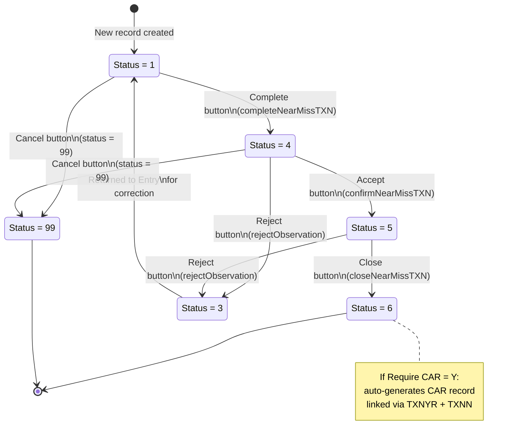
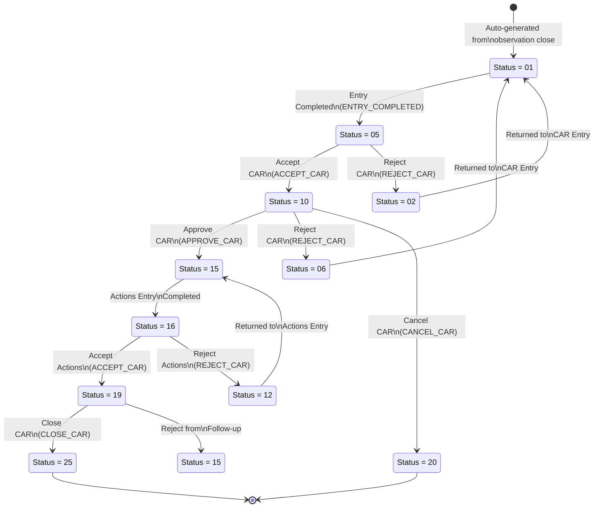
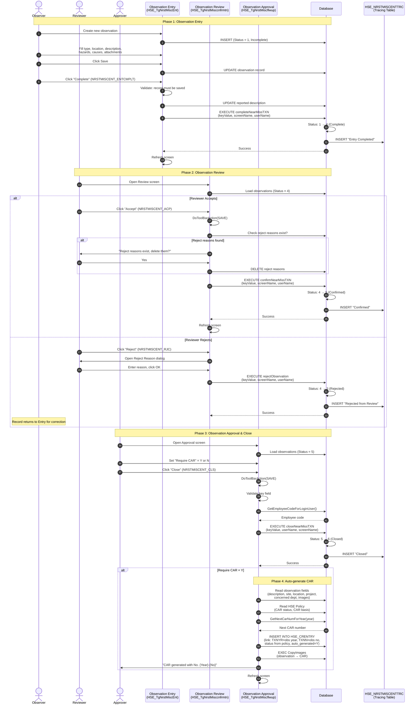
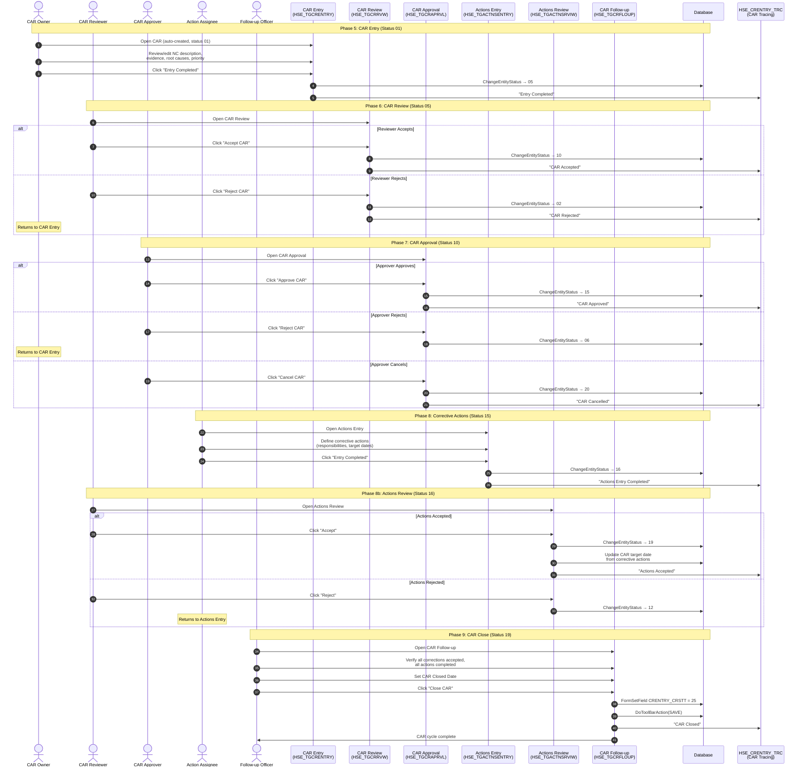
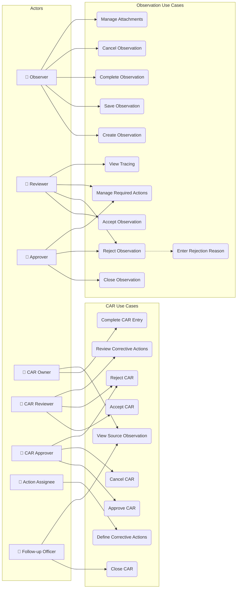
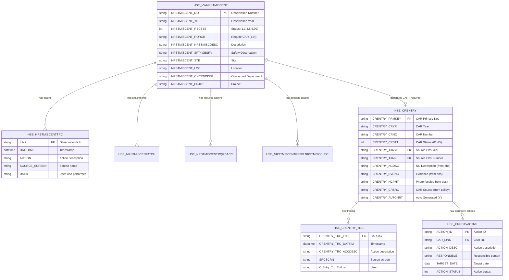

# Observation Reporting Process – UML Documentation

> **Source**: HSEMS C++ Desktop (`HSEMS-Win`) + Web (`hse` module)
> **Scope**: Full lifecycle from initial observation to CAR generation and closure
> **Date**: March 2026

---

## Table of Contents

1. [Process Overview](#1-process-overview)
2. [Activity Diagram – End-to-End Process](#2-activity-diagram--end-to-end-process)
3. [State Machine – Observation Status](#3-state-machine--observation-status)
4. [State Machine – CAR Status](#4-state-machine--car-status)
5. [Sequence Diagram – Observation Entry to Close](#5-sequence-diagram--observation-entry-to-close)
6. [Sequence Diagram – CAR Lifecycle](#6-sequence-diagram--car-lifecycle)
7. [Use Case Diagram](#7-use-case-diagram)
8. [Data Flow & Linking](#8-data-flow--linking)
9. [Stored Procedure Reference](#9-stored-procedure-reference)

---

## 1. Process Overview

The Observation reporting process involves **two linked lifecycles**:

1. **Observation Lifecycle**: Entry → Complete → Review (Confirm) → Approval (Close)
2. **CAR Lifecycle** (if required): Entry → Review → Approval → Actions Entry → Actions Review → Follow-up → Close

When an observation is closed with **"Require CAR" = Yes**, a Corrective Action Request is automatically generated. The CAR then goes through its own multi-stage approval process until all corrective actions are verified and the CAR is closed.

### Actors

| Actor | Role |
|-------|------|
| **Observer** | Employee who witnesses and reports the observation |
| **Reviewer** | Safety officer who reviews and confirms the observation |
| **Approver** | Manager who approves and closes the observation, decides if CAR is needed |
| **CAR Owner** | Department responsible for the CAR |
| **CAR Reviewer** | Reviews the CAR details |
| **CAR Approver** | Approves the CAR and assigns corrective actions |
| **Action Assignee** | Executes the corrective actions |
| **CAR Follow-up** | Verifies all actions are complete and closes the CAR |

---

## 2. Activity Diagram – End-to-End Process

```mermaid
flowchart TD
    Start([Observer witnesses<br/>safety issue]) --> A1

    subgraph OBS_ENTRY ["Phase 1: Observation Entry"]
        A1[Create new observation<br/>in Entry screen]
        A1 --> A2[Fill details:<br/>type, location, description,<br/>hazards, causes, images]
        A2 --> A3[Save record<br/>Status = 1 Incomplete]
        A3 --> A4{Ready to<br/>submit?}
        A4 -- No --> A2
        A4 -- Yes --> A5[Click Complete<br/>NRSTMISCENT_ENTCMPLT]
        A5 --> A6["completeNearMissTXN<br/>Status: 1 → 4 (Complete)"]
        A6 --> A7[Tracing: Entry Completed]
    end

    A7 --> B1

    subgraph OBS_REVIEW ["Phase 2: Observation Review"]
        B1[Reviewer opens<br/>Review screen]
        B1 --> B2{Accept or<br/>Reject?}
        B2 -- Reject --> B3[Click Reject<br/>NRSTMISCENT_RJC]
        B3 --> B4[Enter rejection reason<br/>in Reject Reason dialog]
        B4 --> B5["rejectObservation<br/>Status: 4 → 3 (Rejected)"]
        B5 --> B6[Tracing: Rejected from Review]
        B6 --> B7[Record returns<br/>to Entry for correction]
        B7 --> A2
        B2 -- Accept --> B8[Click Accept<br/>NRSTMISCENT_ACP]
        B8 --> B9{Reject reasons<br/>exist?}
        B9 -- Yes --> B10[Prompt: Delete<br/>reject reasons?]
        B10 -- Yes --> B11[Delete reject reasons]
        B10 -- No --> B12[Abort accept]
        B11 --> B13
        B9 -- No --> B13["confirmNearMissTXN<br/>Status: 4 → 5 (Confirmed)"]
        B13 --> B14[Tracing: Confirmed]
    end

    B14 --> C1

    subgraph OBS_APPROVAL ["Phase 3: Observation Approval"]
        C1[Approver opens<br/>Approval screen]
        C1 --> C2{Close or<br/>Reject?}
        C2 -- Reject --> C3[Click Reject<br/>NRSTMISCENT_RJC]
        C3 --> C4[Enter rejection reason]
        C4 --> C5["rejectObservation<br/>Status: 5 → 3 (Rejected)"]
        C5 --> C6[Tracing: Rejected from Approval]
        C6 --> B7
        C2 -- Close --> C7[Set Require CAR = Y or N]
        C7 --> C8[Click Close<br/>NRSTMISCENT_CLS]
        C8 --> C9[Save first<br/>DoToolBarAction SAVE]
        C9 --> C10{Key field<br/>valid?}
        C10 -- No --> C11[Abort close]
        C10 -- Yes --> C12{Employee code<br/>found?}
        C12 -- No --> C11
        C12 -- Yes --> C13["closeNearMissTXN<br/>Status: 5 → 6 (Closed)"]
        C13 --> C14[Tracing: Closed]
    end

    C14 --> D1

    subgraph CAR_DECISION ["Phase 4: CAR Generation Decision"]
        D1{Require CAR<br/>= Y?}
        D1 -- No --> D2([Observation cycle<br/>COMPLETE])
        D1 -- Yes --> D3[Auto-generate CAR]
        D3 --> D4["INSERT INTO HSE_CRENTRY<br/>Link: CRENTRY_TXNYR = OBS Year<br/>CRENTRY_TXNN = OBS Number"]
        D4 --> D5[Set CAR fields from<br/>observation + policy]
        D5 --> D6[Copy images from<br/>observation to CAR]
        D6 --> D7["Toast: CAR generated<br/>with No. {Year}-{No}"]
        D7 --> D8[Tracing: CAR Created]
    end

    D8 --> E1

    subgraph CAR_ENTRY ["Phase 5: CAR Entry"]
        E1["CAR Owner opens<br/>CAR Entry (HSE_TGCRENTRY)<br/>Status = 01 (Draft)"]
        E1 --> E2[Review auto-filled data,<br/>add NC description, evidence,<br/>root causes]
        E2 --> E3[Click Entry Completed<br/>ENTRY_COMPLETED]
        E3 --> E4["Status: 01 → 05<br/>Tracing: Entry Completed"]
    end

    E4 --> F1

    subgraph CAR_REVIEW ["Phase 6: CAR Review"]
        F1["CAR Reviewer opens<br/>CAR Review (HSE_TGCRRVW)"]
        F1 --> F2{Accept or<br/>Reject?}
        F2 -- Reject --> F3["REJECT_CAR<br/>Status: 05 → 02 (Rejected)"]
        F3 --> F4[Returns to CAR Entry]
        F4 --> E2
        F2 -- Accept --> F5["ACCEPT_CAR<br/>Status: 05 → 10 (Accepted)"]
        F5 --> F6[Tracing: CAR Accepted]
    end

    F6 --> G1

    subgraph CAR_APPROVAL ["Phase 7: CAR Approval"]
        G1["CAR Approver opens<br/>CAR Approval (HSE_TGCRAPRVL)"]
        G1 --> G2{Approve, Reject,<br/>or Cancel?}
        G2 -- Reject --> G3["REJECT_CAR<br/>Status: 10 → 06 (Rejected)"]
        G3 --> G4[Returns to CAR Entry]
        G4 --> E2
        G2 -- Cancel --> G5["CANCEL_CAR<br/>Status: 10 → 20 (Cancelled)"]
        G5 --> G6([CAR Cancelled])
        G2 -- Approve --> G7["APPROVE_CAR<br/>Status: 10 → 15 (Approved)"]
        G7 --> G8[Tracing: CAR Approved]
    end

    G8 --> H1

    subgraph CAR_ACTIONS ["Phase 8: Corrective Actions"]
        H1["Action Assignee opens<br/>Actions Entry (HSE_TGACTNSENTRY)"]
        H1 --> H2[Define corrective actions<br/>with responsibilities and dates]
        H2 --> H3[Click Entry Completed<br/>ENTRY_COMPLETED]
        H3 --> H4["Status: 15 → 16<br/>Tracing: Actions Entry Completed"]
        H4 --> H5["Actions Reviewer opens<br/>Actions Review (HSE_TGACTNSRVIW)"]
        H5 --> H6{Accept or<br/>Reject actions?}
        H6 -- Reject --> H7["Status: 16 → 12<br/>Returns to Actions Entry"]
        H7 --> H1
        H6 -- Accept --> H8["ACCEPT_CAR<br/>Status: 16 → 19"]
        H8 --> H9[Tracing: Actions Accepted]
    end

    H9 --> I1

    subgraph CAR_CLOSE ["Phase 9: CAR Follow-up & Close"]
        I1["Follow-up officer opens<br/>CAR Follow-up (HSE_TGCRFLOUP)"]
        I1 --> I2{All corrections<br/>verified?}
        I2 -- No --> I3["REJECT_CAR<br/>Status: 19 → 15"]
        I3 --> H1
        I2 -- Yes --> I4[Set CAR Closed Date]
        I4 --> I5[Click Close CAR<br/>CLOSE_CAR]
        I5 --> I6["Status: 19 → 25 (Closed)<br/>Tracing: CAR Closed"]
    end

    I6 --> J1([Full observation &<br/>CAR cycle COMPLETE])

    style Start fill:#4CAF50,color:white
    style D2 fill:#2196F3,color:white
    style G6 fill:#f44336,color:white
    style J1 fill:#4CAF50,color:white
```

---

## 3. State Machine – Observation Status

### Status Code Reference

| Code | Status | Screen Where Set | Stored Procedure |
|------|--------|-----------------|-----------------|
| 1 | Incomplete | Entry (new record) | — |
| 3 | Rejected | Review / Approval | `rejectObservation` |
| 4 | Complete | Entry (Complete btn) | `completeNearMissTXN` |
| 5 | Confirmed | Review (Accept btn) | `confirmNearMissTXN` |
| 6 | Closed | Approval (Close btn) | `closeNearMissTXN` |
| 99 | Cancelled | Entry / Review | Manual status update |

---

## 4. State Machine – CAR Status

### CAR Status Code Reference

| Code | Status | Screen | Trigger |
|------|--------|--------|---------|
| 01 | Draft / New | CAR Entry | Auto-created or manual |
| 02 | Rejected (from Review) | CAR Review | REJECT_CAR |
| 05 | Entry Completed | CAR Entry | ENTRY_COMPLETED |
| 06 | Rejected (from Approval) | CAR Approval | REJECT_CAR |
| 10 | Accepted (Review) | CAR Review | ACCEPT_CAR |
| 15 | Approved | CAR Approval | APPROVE_CAR |
| 16 | Actions Entry Completed | Actions Entry | ENTRY_COMPLETED |
| 12 | Rejected (from Actions Review) | Actions Review | REJECT_CAR |
| 19 | Actions Accepted | Actions Review | ACCEPT_CAR |
| 20 | Cancelled | CAR Approval | CANCEL_CAR |
| 25 | Closed | CAR Follow-up | CLOSE_CAR |

---

## 5. Sequence Diagram – Observation Entry to Close

---

## 6. Sequence Diagram – CAR Lifecycle

---

## 7. Use Case Diagram

---

## 8. Data Flow & Linking

### How Observation links to CAR

### Fields Copied from Observation to CAR

| CAR Field | Source | Value |
|-----------|--------|-------|
| CRENTRY_CRYR | System | Current year |
| CRENTRY_CRNO | DB | `GetNextCarNumForYear(year)` |
| CRENTRY_CRSTT | Policy | `HSEOBSRVTN_GnrCrStt` |
| CRENTRY_TXNYR | Observation | `NRSTMISCENT_YR` |
| CRENTRY_TXNN | Observation | `NRSTMISCENT_NO` |
| CRENTRY_NCDSC | Observation | `NRSTMISCENT_NRSTMISCDESC` |
| CRENTRY_EVDNC | Observation | `NRSTMISCENT_SFTYOBSRV` |
| CRENTRY_NCPHT | Observation | Copied via `EXEC CopyImages` |
| CRENTRY_STE | Observation | Site |
| CRENTRY_LOC | Observation | Location |
| CRENTRY_CNCRNDDEP | Observation | Concerned Department |
| CRENTRY_PRJCT | Observation | Project |
| CRENTRY_CRSRC | Policy | `HSEOBSRVTN_CrBss` (CAR Basis) |
| CRENTRY_AUTGNRT | Hardcoded | `"Y"` |
| CRENTRY_PRRT | Hardcoded | `"Medium"` |
| CRENTRY_DPRT | Policy | Owner Department |
| CRENTRY_EMP | System | `GetEmployeeCodeForLoginUser()` |

---

## 9. Stored Procedure Reference

### Observation Stored Procedures

| Procedure | Parameters | Transition | Called From |
|-----------|-----------|------------|------------|
| `completeNearMissTXN` | keyValue, screenName, userName | 1 → 4 | Entry: Complete button |
| `confirmNearMissTXN` | keyValue, screenName, userName | 4 → 5 | Review: Accept button |
| `rejectObservation` | keyValue, screenName, userName | → 3 | Review/Approval: Reject button |
| `closeNearMissTXN` | keyValue, userName, screenName | 5 → 6 | Approval: Close button |

### CAR Stored Procedures

| Procedure | Parameters | Transition | Called From |
|-----------|-----------|------------|------------|
| `ChangeEntityStatus` | keyValue, screenName, userName, table prefix, status field, key field, '02', newStatus | Various | Most CAR status changes |
| `closeCARTXN` | keyValue, screenName, userName | → 25 | Legacy CAR Follow-up |
| `cancelCAR` | — | → 20 | CAR Approval: Cancel |
| `AcceptCARExe` | — | Action accepted | Actions Received |
| `RejectCARExe` | — | Action rejected | Actions Received |
| `CARJobCmpltd` | — | Job completed | Actions Under Execution |
| `CARJobPndng` | — | Job pending | Actions Under Execution |
| `CARJobAcptd` | — | Job accepted | Job Verification |

### Policy Tables

| Table | Key Fields | Purpose |
|-------|-----------|---------|
| `HSE_HSEOBSRVTN` | `HSEOBSRVTN_GnrCrStt`, `HSEOBSRVTN_CrBss` | CAR status and basis for observations |
| `HSE_HSEPLCCAR` | `HSEPLCCAR_DFLRQRCR`, `HSEPLCCAR_SkpExcDpr` | Default Require CAR, skip execution dept |

---

*End of document*
