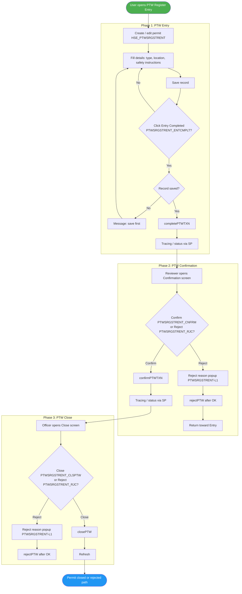
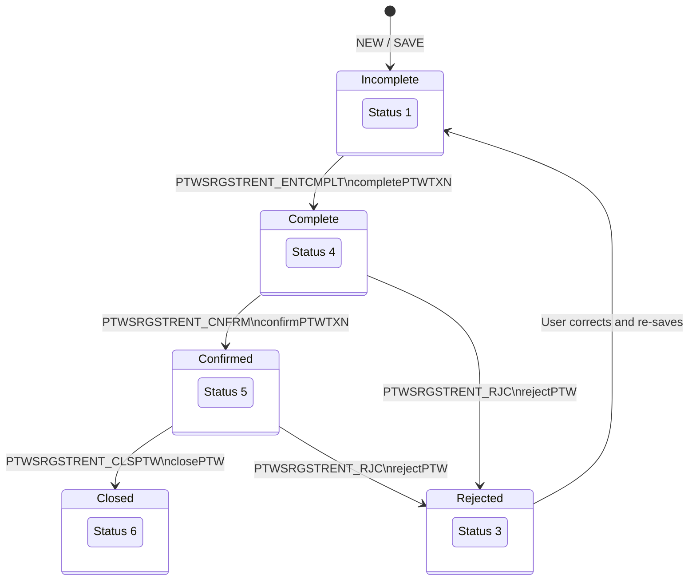
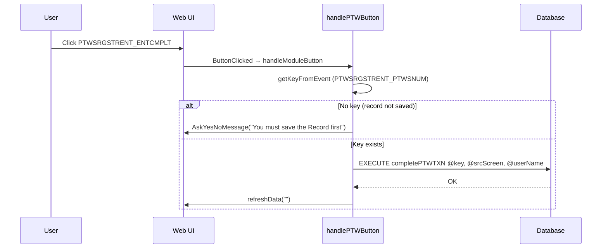
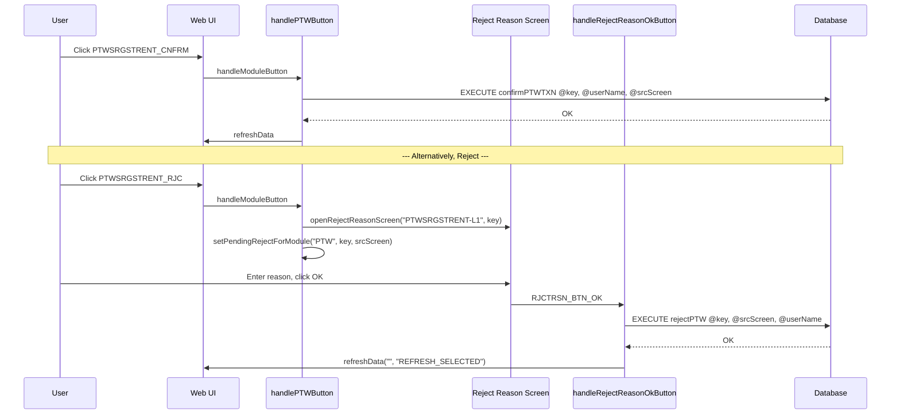
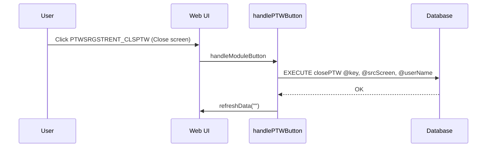
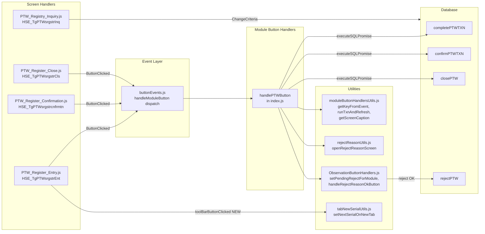

# Permit to Work (PTW) Process – UML Documentation

<!-- RQ_HSE_23_3_26_3_36 -->

> **Source**: HSEMS C++ Desktop (`HSEMS-Win`) + Web (`hse` module)
> **Scope**: PTW lifecycle (`HSE_PTWSRGSTRENT`): Entry → Confirmation → Close, with Reject path
> **Date**: March 2026
> **See also**: [`HSEMS_Use_Cases_From_Desktop_Code.md`](./HSEMS_Use_Cases_From_Desktop_Code.md) §2.7

---

## 1. Process overview

The **Permit to Work** track covers: **Entry → Complete → Confirmation (Confirm) → Close**, with a **Reject** path using the reject-reason dialog (`PTWSRGSTRENT-L1`).

PTW has a **three-screen** workflow (Entry, Confirmation, Close) rather than the four-phase pattern used by some other modules. The "Confirmation" screen confirms the permit; the same screen (or a dedicated Close screen) later closes it.

**Screens and tags:**

| Screen | Web screen tag | C++ Category | Primary SPs | Screen handler |
|--------|----------------|--------------|-------------|----------------|
| Entry | `HSE_TgPTWsrgstrEnt` (`HSE_TGPTWSRGSTRENT`) | `PtwCategory` | `completePTWTXN` | `PTW_Register_Entry.js` |
| Confirmation | `HSE_TgPTWsrgstrcnfrmtn` (`HSE_TGPTWSRGSTRCNFRMTN`) | `PtwConfirmationCategory` | `confirmPTWTXN` | `PTW_Register_Confirmation.js` |
| Close | `HSE_TgPTWsrgstrCls` (`HSE_TGPTWSRGSTRCLS`) | `PtwClsCategory` | `closePTW` | `PTW_Register_Close.js` (RQ_HSE_23_3_26_6_00) |
| Inquiry | `HSE_TgPTWsrgstrInq` | `PTWInquiry` | (read-only filters) | `PTW_Registry_Inquiry.js` |

**Custom Buttons** (desktop): `PTWSRGSTRENT_ENTCMPLT`, `PTWSRGSTRENT_CNFRM`, `PTWSRGSTRENT_CLSPTW`, `PTWSRGSTRENT_RJC`

**Table**: `HSE_PTWSRGSTRENT`; key field: `PTWSRGSTRENT_PTWSNUM`

---

## 2. Activity diagram – Permit to Work (end-to-end)



---

## 3. State machine

Status values enforced by stored procedures (`completePTWTXN`, `confirmPTWTXN`, `closePTW`, `rejectPTW`):



---

## 4. Sequence diagram – Entry Complete



---

## 5. Sequence diagram – Confirmation with reject flow



---

## 6. Sequence diagram – Close



---

## 7. Component diagram – Web architecture



---

## 8. Entry sub-features

### Safety Instructions tab serial

`PTW_Register_Entry.js` handles `toolBarButtonClicked`: when NEW on the Safety Instructions tab (`HSE_TGPTWSRGSTRENTSFTYINSTRCTNS`), it sets the next serial number on `HSE_PTWSRGSTRSFTYINSTRCTNS.PTWSRGSTRSFTYINSTRCTNS_SRLNO` via `setNextSerialOnNewTab`.

### Transaction number generation

On `SAVE` when the record is in new mode, `buttonEvents.js` generates a transaction number for `HSE_TGPTWSRGSTRENT`:

```
SCREEN_TAGS_REQUIRING_TXN_NO includes 'HSE_TGPTWSRGSTRENT'
getTXNKeyFldVal → { table: 'HSE_PTWSRGSTRENT', keyFld: 'PTWSRGSTRENT_PTWSNUM' }
→ EXECUTE generateNewTXNNum ...
```

---

## 9. Workflow buttons – implementation status

| Button | Desktop behaviour | Web implementation | Status |
|--------|-------------------|--------------------|--------|
| `PTWSRGSTRENT_ENTCMPLT` | `completePTWTXN` with "save first" guard | `handlePTWButton`: key check + `runTxnAndRefresh` | **OK** |
| `PTWSRGSTRENT_CNFRM` | `confirmPTWTXN` | `handlePTWButton`: `runTxnAndRefresh` | **OK** |
| `PTWSRGSTRENT_CLSPTW` | `closePTW` | `handlePTWButton`: `runTxnAndRefresh` | **OK** |
| `PTWSRGSTRENT_RJC` | Reject with reason (`rejectPTW`) | `handlePTWButton`: `openRejectReasonScreen` + `setPendingRejectForModule('PTW')` → `handleRejectReasonOkButton` `case 'PTW'` → `EXECUTE rejectPTW` | **OK** |

---

## 10. Inquiry screen

`PTW_Registry_Inquiry.js` (`HSE_TgPTWsrgstrInq`) filters on `PTWSRGSTRENT_RECSTS`:

| Button | Filter | Status |
|--------|--------|--------|
| `PTWSRGSTRENT_VWINCMPLT` | `WHERE (PTWSRGSTRENT_RECSTS=1)` | Incomplete |
| `PTWSRGSTRENT_VWRJCT` | `WHERE (PTWSRGSTRENT_RECSTS=3)` | Rejected |
| `PTWSRGSTRENT_VWCMPLT` | `WHERE (PTWSRGSTRENT_RECSTS=4)` | Complete |
| `PTWSRGSTRENT_VWCNFRM` | `WHERE (PTWSRGSTRENT_RECSTS=5)` | Confirmed |
| `PTWSRGSTRENT_VWCLSD` | `WHERE (PTWSRGSTRENT_RECSTS=6)` | Closed |
| `PTWSRGSTRENT_VWALL` | (no filter) | All |

---

## 11. Setup screens (master data)

| Screen | Tag | Purpose | Handler |
|--------|-----|---------|---------|
| PTW Type | `HSE_TgPTWsTyp` | Define permit types | `PTW_Type.js` (toolbar only) |
| PTW Responsibility | `HSE_TgPTWsRspnsblty` | Define responsibility roles | `PTW_Responsibility.js` (toolbar only) |

---

## 12. Known gaps vs desktop

| # | Gap | Impact | Resolution |
|---|-----|--------|------------|
| 1 | ~~**No SAVE before Confirm / Close**~~ | ~~Medium~~ | **Resolved (RQ_HSE_23_3_26_6_00):** Added `doToolbarAction('SAVE')` before `confirmPTWTXN` and `closePTW` in `handlePTWButton`, matching the Risk Assessment pattern. |
| 2 | ~~**No dedicated Close screen handler**~~ | ~~Low~~ | **Resolved (RQ_HSE_23_3_26_6_00):** Created `PTW_Register_Close.js` for `HSE_TgPTWsrgstrCls` and registered in `screenHandlers/index.js`. |

---

*End of PTW UML documentation*
