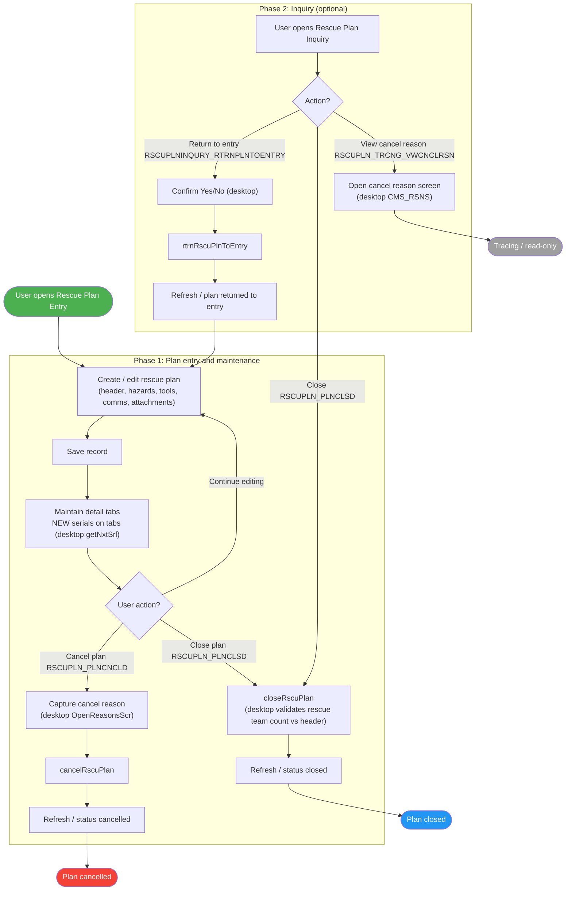
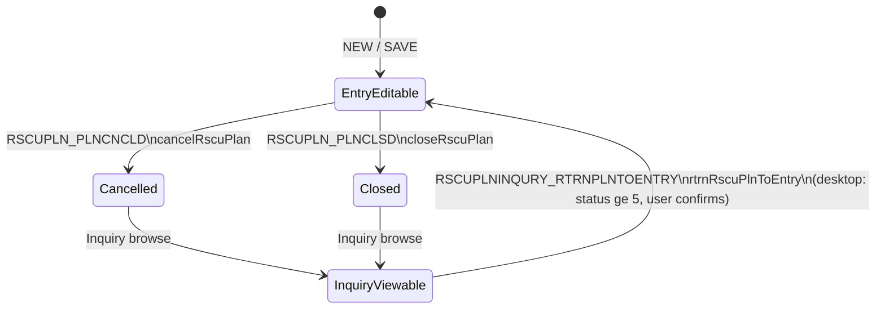
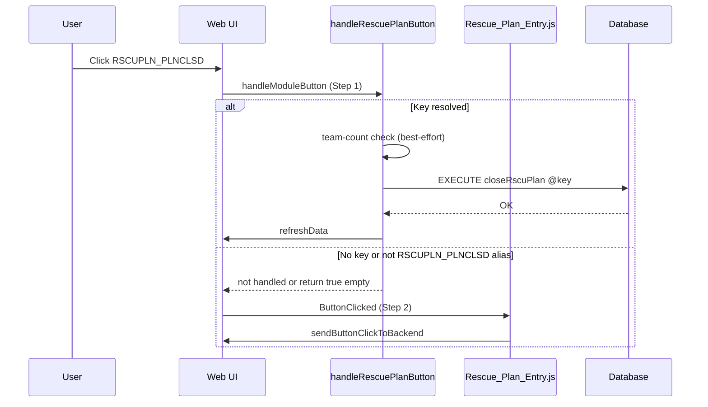
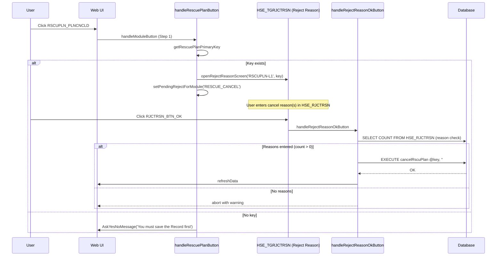
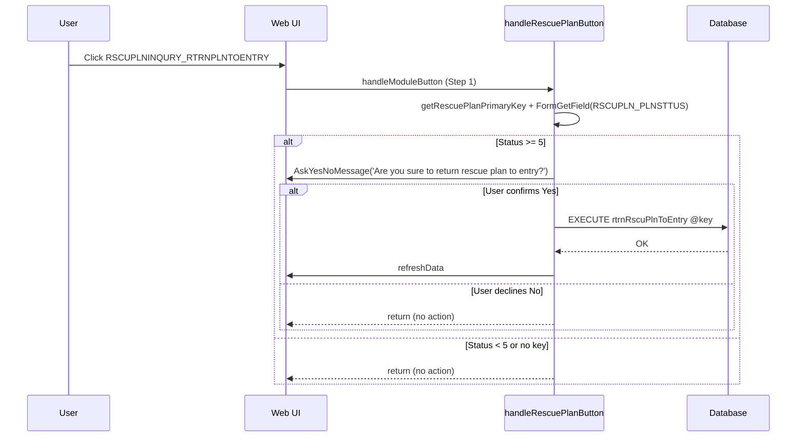
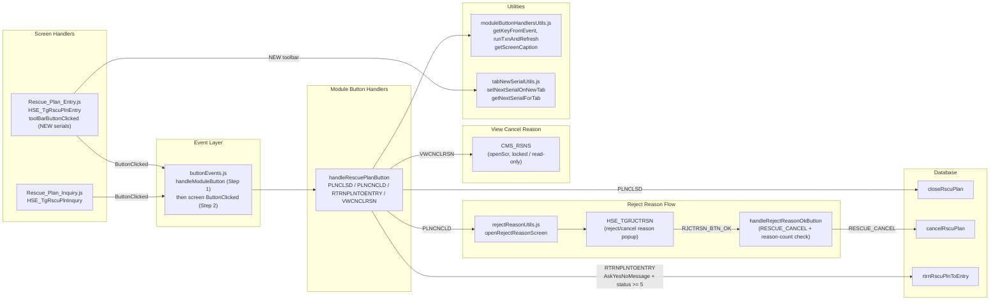

# Rescue Plans Process – UML Documentation

<!-- RQ_HSE_23_3_26_17_05 -->

> **Source**: HSEMS C++ Desktop (`HSEMS-Win`, `RscuPlnCategory.cpp`) + Web (`hse` module)
> **Scope**: Rescue plan lifecycle from **Entry** through **Cancel**, **Close**, **Inquiry return-to-entry**, and **view cancel reason**
> **Date**: March 2026
> **See also**: [`HSEMS_Use_Cases_From_Desktop_Code.md`](./HSEMS_Use_Cases_From_Desktop_Code.md) §2.9

---

## 1. Process overview

The **Rescue Plan** track is **not** a multi-phase approve/confirm workflow like PTW or Awareness. It is centred on **creating and maintaining a plan** (`HSE_RSCUPLN` on desktop; web form metadata may expose `HSE_RSCUPLNENT` for the entry screen), then **cancelling** or **closing** the plan, with **inquiry** actions to **return a plan to entry** or **view cancel reasons** from tracing.

**Primary stored procedures** (from desktop + use-case matrix):

| SP | Purpose |
|----|---------|
| `cancelRscuPlan` | Cancel plan (after cancel reason captured on desktop) |
| `closeRscuPlan` | Close completed plan |
| `rtrnRscuPlnToEntry` | Reopen plan for editing from inquiry |

**Screens and tags (web):**

| Screen | Web handler key | C++ `ParentManage` / card | Role |
|--------|-----------------|----------------------------|------|
| Rescue Plan Entry | `HSE_TgRscuPlnEntry` | `HSE_TGRSCUPLNENTRY` | Create/edit plan, cancel, close, tracing view cancel reason |
| Rescue Plan Inquiry | `HSE_TgRscuPlnInqury` | `HSE_TGRSCUPLNINQURY` | Close, return to entry, view cancel reason |

**Custom buttons** (desktop `DisplayCustomButtonClicked`):

| Button | Behaviour (desktop) |
|--------|---------------------|
| `RSCUPLN_PLNCNCLD` | `OpenReasonsScr` -> `cancelRscuPlan` |
| `RSCUPLN_PLNCLSD` | `closeRscuPlan` |
| `RSCUPLNINQURY_RTRNPLNTOENTRY` | Yes/No prompt -> `rtrnRscuPlnToEntry` (if status >= 5) |
| `RSCUPLN_TRCNG_VWCNCLRSN` | Open `CMS_RSNS` for cancel reason reference |

**Web close path (centralized):** [`handleRescuePlanButton`](hse/src/services/ModuleButtonHandlers/index.js) handles `RSCUPLN_PLNCLSD` and `RSCUPLNENT_CLS` -> `EXECUTE closeRscuPlan` using key from `HSE_RSCUPLNENT` / `RSCUPLNENT_RSCUPLNNO`.

---

## 2. Activity diagram -- Rescue Plans (end-to-end)

---

## 3. State machine (informative -- from desktop comments)

Desktop comments in `RscuPlnCategory.cpp` reference numeric **plan status** values. Exact labels depend on database metadata; the diagram captures the **intent** of transitions.

---

## 4. Sequence diagram -- Close plan (`RSCUPLN_PLNCLSD`)

---

## 5. Sequence diagram -- Cancel plan (`RSCUPLN_PLNCNCLD`)

<!-- RQ_HSE_23_3_26_17_05: updated to reflect handleRescuePlanButton + reject-reason + handleRejectReasonOkButton flow -->

---

## 6. Sequence diagram -- Return plan to entry (inquiry)

<!-- RQ_HSE_23_3_26_17_05: updated to reflect handleRescuePlanButton with status gate + AskYesNoMessage -->

---

## 7. Component diagram -- Web architecture

<!-- RQ_HSE_23_3_26_17_05: reflects all four buttons handled in handleRescuePlanButton, reject-reason flow, CMS_RSNS view, and toolBarButtonClicked serials -->

---

## 8. Entry sub-features (desktop parity notes)

From `RscuPlnCategory::DisplayToolBarButtonClicked` (desktop), **NEW** on the header sets next serial for `RSCUPLN_PLNN` (year-based). Tab **NEW** sets serials for:

- Potential hazards (`HSE_TGRSCUPLNENTRY_PTNTLHZRDS`)
- Attachments (`HSE_TGRSCUPLNENTRY_ATTCHMNTS`)
- Required details (`HSE_TGRSCUPLNENTRY_RQURDTLS`)
- Communication methods (`HSE_TGRSCUPLNENTRY_CMMUNCTNMTHDS`)

**RQ_HSE_23_3_26_17_05:** `Rescue_Plan_Entry.js` implements `toolBarButtonClicked` with `getNextSerialForTab` / `setNextSerialOnNewTab` for the main plan number (`RSCUPLN_PLNN` by `RSCUPLN_PLNYR`) and the four detail tabs listed above (parity with `RscuPlnCategory::DisplayToolBarButtonClicked`).

---

## 9. Setup screens (master data)

| Screen | Tag (web registry) | Handler |
|--------|-------------------|---------|
| Rescue Entities | `HSE_TgRscuEntts` | `Rescue_Entities.js` |
| Confined Space Types | `HSE_TgCnfndSpcTyps` | `Confined_Space_Types.js` |
| Rescue Hazards | `HSE_TgRscuHzrds` | `Rescue_Hazards.js` |
| Rescue Tools | `HSE_TgRscuTls` | `Rescue_Tools.js` |
| Rescue Communication Methods | `HSE_TgRscuCmmunctnMthds` | `Rescue_Communication_Methods.js` |

---

## 10. Workflow buttons -- web implementation status

| Button | Desktop | Web | Status |
|--------|---------|-----|--------|
| `RSCUPLN_PLNCLSD` | `closeRscuPlan` | `handleRescuePlanButton` (team-count pre-check + `closeRscuPlan` SP) | **OK** -- RQ_HSE_23_3_26_17_05 |
| `RSCUPLNENT_CLS` | (alias / form-specific close) | `handleRescuePlanButton` -> `closeRscuPlan` | **OK** if APP emits this button name |
| `RSCUPLN_PLNCNCLD` | `OpenReasonsScr` -> `cancelRscuPlan` | `handleRescuePlanButton` -> `openRejectReasonScreen` (`RSCUPLN-L1`) + `handleRejectReasonOkButton` (reason-count check) -> `EXECUTE cancelRscuPlan` | **OK** -- RQ_HSE_23_3_26_17_05 |
| `RSCUPLNINQURY_RTRNPLNTOENTRY` | Yes/No + status check -> `rtrnRscuPlnToEntry` | `handleRescuePlanButton`: `AskYesNoMessage`, `RSCUPLN_PLNSTTUS >= 5`, `EXECUTE rtrnRscuPlnToEntry` | **OK** -- RQ_HSE_23_3_26_17_05 |
| `RSCUPLN_TRCNG_VWCNCLRSN` | `ShowScreen` `CMS_RSNS` | `handleRescuePlanButton` -> `openScr('CMS_RSNS')` on `RSCUPLN_TRCNG_REFCLOSRSN` | **OK** -- RQ_HSE_23_3_26_17_05 |

---

## 11. Known gaps / risks vs desktop

<!-- RQ_HSE_23_3_26_17_05: updated after closing gaps -->

| # | Topic | Status | Notes |
|---|--------|--------|--------|
| 1 | **Cancel reason dialog** | **Resolved** | Web uses `HSE_TGRJCTRSN` / `openRejectReasonScreen` with `RSCUPLN-L1` module type. `handleRejectReasonOkButton` verifies `COUNT > 0` in `HSE_RJCTRSN` before calling SP (mirrors desktop `OpenReasonsScr` returning `false` when no reason entered). -- RQ_HSE_23_3_26_17_05 |
| 2 | **Return to entry confirmation** | **Resolved** | `handleRescuePlanButton`: `AskYesNoMessage` + `RSCUPLN_PLNSTTUS >= 5` gate. -- RQ_HSE_23_3_26_17_05 |
| 3 | **Close validation (team count)** | **Resolved (best-effort)** | Client-side check queries `HSE_RSCUPLN_RSCUTM` count vs `RSCUPLN_NORSCUTMMMBRS` header field. try/catch falls through to SP if table/field missing. Desktop C++ code delegates to SP without client check; comment describes SP-level intent. -- RQ_HSE_23_3_26_17_05 |
| 4 | **Table / key field naming** | **UAT** | Close uses `HSE_RSCUPLNENT`/`RSCUPLNENT_RSCUPLNNO`; cancel/return/view-reason use `getRescuePlanPrimaryKey` (`HSE_RSCUPLN`/`RSCUPLN_PRMRYKY` with fallback). Verify APP JSON binds both to the same logical key. |
| 5 | **`cancelRscuPlan` SP second argument** | **Accepted deviation** | Desktop passes `m_strFinal` (random 18-char ref linking `CMS_RSNS` rows). Web stores reasons in `HSE_RJCTRSN` (different table/linking pattern); SP receives `''` as second arg (same pattern as Awareness `AwrnsPlnRejected`). Adapt DB-side if SP needs the ref. -- RQ_HSE_23_3_26_17_05 |
| 6 | **Cancel reason table difference** | **Accepted deviation** | Desktop `OpenReasonsScr` writes to `CMS_RSNS`; web `openRejectReasonScreen` writes to `HSE_RJCTRSN`. Both capture reasons in different tables. Consistent with how all other web modules (Awareness, PTW, Risk, Incident) handle `OpenReasonsScr` parity. -- RQ_HSE_23_3_26_17_05 |

---

## 12. Web validation vs section 2 Activity diagram (end-to-end)

<!-- RQ_HSE_23_3_26_17_05 -->

This section maps each section 2 activity node to the current web implementation (`hse` screen handlers + [`handleRescuePlanButton`](hse/src/services/ModuleButtonHandlers/index.js) + [`buttonEvents.js`](hse/src/events/buttonEvents.js) dispatch order).

### Phase 1 -- Plan entry and maintenance

| Node | Activity (diagram) | Web coverage | Verdict |
|------|-------------------|--------------|---------|
| **Start** | User opens Rescue Plan Entry | `Rescue_Plan_Entry.js` registered as `HSE_TgRscuPlnEntry`; `ShowScreen` enables toolbar | **OK** |
| **A1** | Create / edit plan (header, hazards, tools, comms, attachments) | Host form / CRUD on plan and tabs | **OK** |
| **A2** | Save record | Standard host `SAVE` toolbar | **OK** |
| **A3** | Maintain detail tabs; NEW serials (`getNxtSrl` on desktop) | `Rescue_Plan_Entry.js` `toolBarButtonClicked` + `tabNewSerialUtils` (main `RSCUPLN_PLNN` + four tabs) -- RQ_HSE_23_3_26_17_05 | **OK** |
| **A4** | User action decision | Custom buttons routed via `handleModuleButton` then screen `ButtonClicked` | **OK** |
| **B1** | Capture cancel reason (`OpenReasonsScr`) | `openRejectReasonScreen` + pending `RESCUE_CANCEL` + reason-count pre-check -- RQ_HSE_23_3_26_17_05 | **OK** |
| **B2** | `cancelRscuPlan` | `handleRejectReasonOkButton` -> `EXECUTE cancelRscuPlan` (only if reasons exist) -- RQ_HSE_23_3_26_17_05 | **OK** |
| **B3** | Refresh / status cancelled | `refreshData` after SP success | **OK** |
| **C1** | `closeRscuPlan` (desktop validates rescue team count) | `handleRescuePlanButton`: best-effort team-count check then `EXECUTE closeRscuPlan` -- RQ_HSE_23_3_26_17_05 | **OK** |
| **C2** | Refresh / status closed | `runTxnAndRefresh` / host refresh | **OK** |
| **End1 / End2** | Plan cancelled / closed | Logical end states after SPs | **OK** |

### Phase 2 -- Inquiry (optional)

| Node | Activity (diagram) | Web coverage | Verdict |
|------|-------------------|--------------|---------|
| **D1** | User opens Rescue Plan Inquiry | `Rescue_Plan_Inquiry.js` / `HSE_TgRscuPlnInqury` | **OK** |
| **D2** | Action choice | Buttons wired in `ButtonClicked` | **OK** |
| **D2 -> C1** | Close from inquiry (`RSCUPLN_PLNCLSD`) | Same as entry: `handleRescuePlanButton` runs first (Step 1), then screen handler fallback | **OK** |
| **E1** | Confirm Yes/No (desktop) | `handleRescuePlanButton` -> `AskYesNoMessage` -- RQ_HSE_23_3_26_17_05 | **OK** |
| **E2** | `rtrnRscuPlnToEntry` | `handleRescuePlanButton` -> `EXECUTE rtrnRscuPlnToEntry` after gates -- RQ_HSE_23_3_26_17_05 | **OK** |
| **E3** | Refresh / returned to entry | `runTxnAndRefresh` / host refresh | **OK** |
| **F1** | Open cancel reason screen (`CMS_RSNS`) | `handleRescuePlanButton` -> `openScr('CMS_RSNS')` -- RQ_HSE_23_3_26_17_05 | **OK** |
| **End3** | Tracing / read-only | Host + `CMS_RSNS` popup | **OK** |

### Summary verdict (RQ_HSE_23_3_26_17_05)

- **All section 2 activity diagram nodes** (A1-A4, B1-B3, C1-C2, D1-D2, E1-E3, F1) are implemented in HSE web JS.
- **Resolved:** A3 (tab NEW serials), B1-B2 (cancel with reason pre-check), C1 (close with team-count pre-check), E1 (Yes/No confirmation), E2 (status >= 5 gate), F1 (CMS_RSNS popup).
- **Accepted deviations:** SP second argument (`cancelRscuPlan` receives `''` instead of `m_strFinal`); cancel reasons stored in `HSE_RJCTRSN` instead of `CMS_RSNS`.
- **UAT items:** Table/key field naming; team-count field names (`HSE_RSCUPLN_RSCUTM`, `RSCUPLN_NORSCUTMMMBRS`) may need adjustment per DB schema.

---

*End of Rescue Plans UML documentation*

<!-- RQ_HSE_23_3_26_17_05 -->
