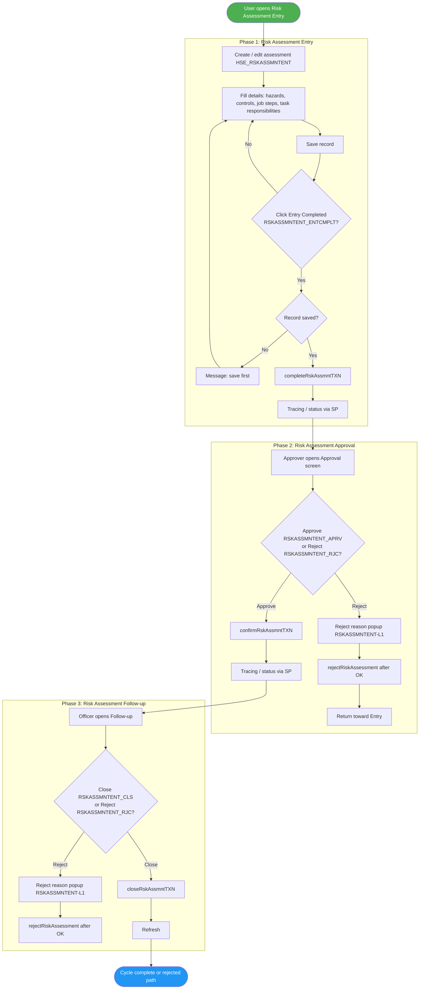
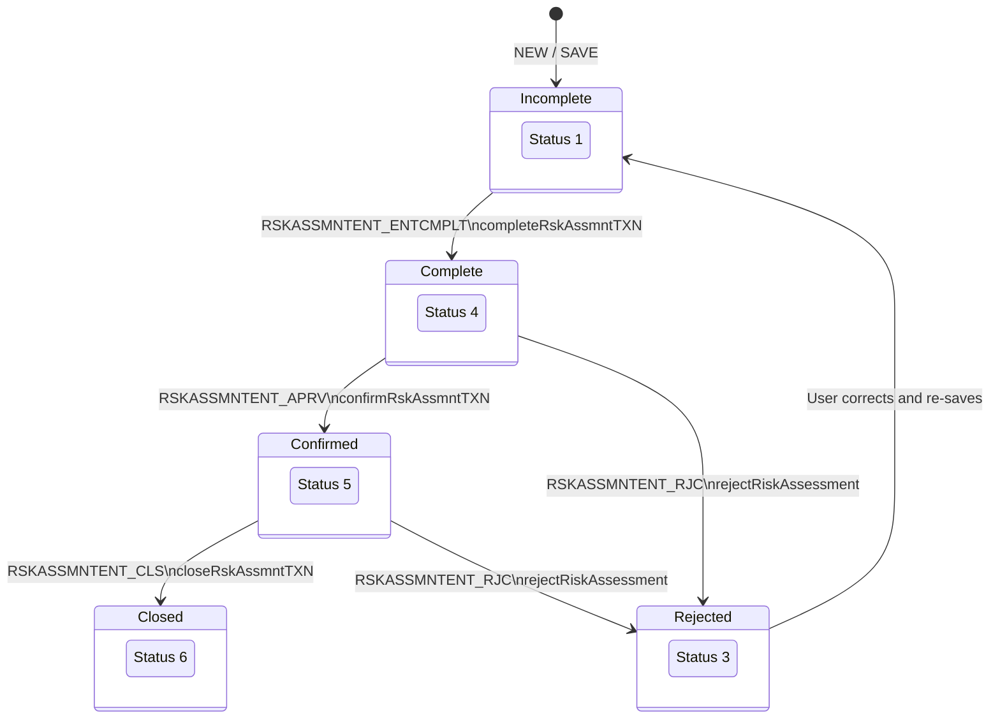
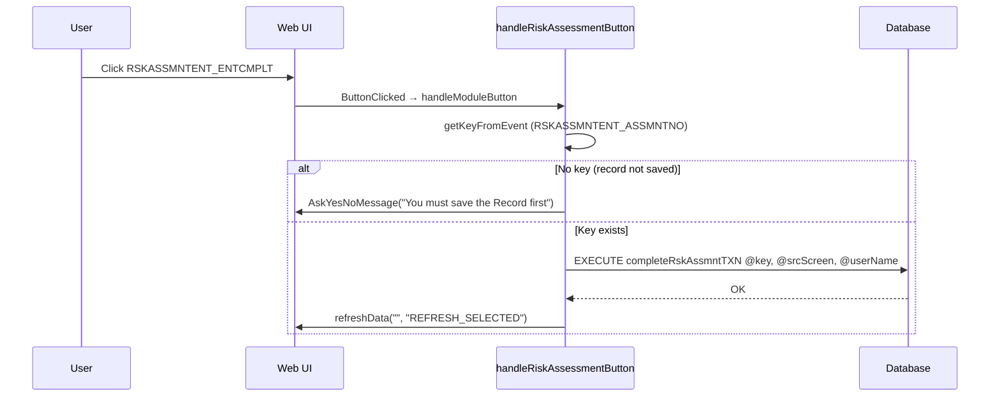
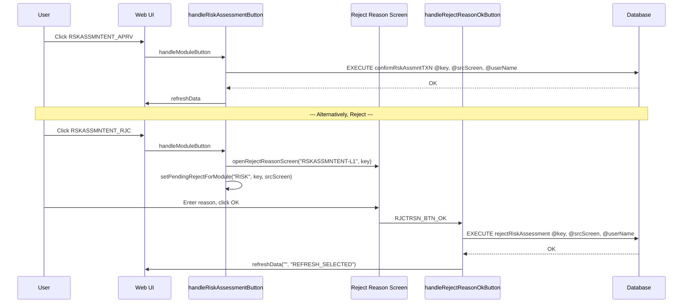
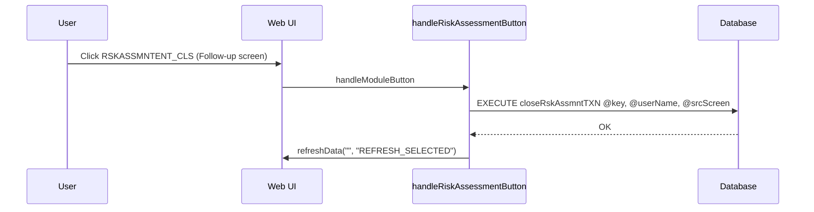
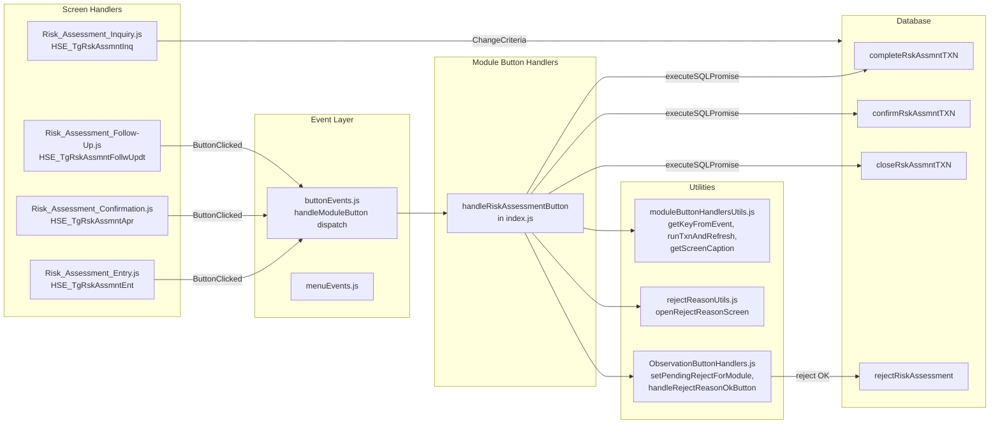

# Risk Assessment Process – UML Documentation

<!-- RQ_HSE_23_3_26_3_36 -->

> **Source**: HSEMS C++ Desktop (`HSEMS-Win`) + Web (`hse` module)
> **Scope**: Risk Assessment lifecycle (`HSE_RSKASSMNTENT`): Entry → Approval → Follow-up (Close), with Reject paths
> **Date**: March 2026
> **See also**: [`HSEMS_Use_Cases_From_Desktop_Code.md`](./HSEMS_Use_Cases_From_Desktop_Code.md) §2.5

---

## 1. Process overview

The **Risk Assessment** track covers: **Entry → Complete → Approval (Confirm) → Follow-up (Close)**, with a **Reject** path from Approval/Follow-up using the reject-reason dialog (`RSKASSMNTENT-L1`).

**Screens and tags:**

| Screen | Web screen tag | C++ Category | Primary SPs | Screen handler |
|--------|----------------|--------------|-------------|----------------|
| Entry | `HSE_TgRskAssmntEnt` (`HSE_TGRSKASSMNTENT`) | `RiskAssessmentEntryCategory` | `completeRskAssmntTXN` | `Risk_Assessment_Entry.js` |
| Approval | `HSE_TgRskAssmntApr` (`HSE_TGRSKASSMNTAPR`) | `RiskAssessmentApprovalCategory` | `confirmRskAssmntTXN` | `Risk_Assessment_Confirmation.js` |
| Follow-up | `HSE_TgRskAssmntFollwUpdt` (`HSE_TGRSKASSMNTFOLLWUPDT`) | `RiskAssessmentFollowUpCategory` | `closeRskAssmntTXN` | `Risk_Assessment_Follow-Up.js` **RQ_HSE_23_3_26_6_00** |
| Inquiry | `HSE_TgRskAssmntInq` | `RiskAssesmentInquiry` | (read-only filters) | `Risk_Assessment_Inquiry.js` |

**Custom Buttons** (desktop): `RSKASSMNTENT_ENTCMPLT`, `RSKASSMNTENT_APRV`, `RSKASSMNTENT_CLS`, `RSKASSMNTENT_RJC`, `RSKASSMNTENT_SHOWMATRIX`, `POTENTIAL_HAZARDS`, `TASK_RESPONSIBILITY`

**Table**: `HSE_RSKASSMNTENT`; key field: `RSKASSMNTENT_ASSMNTNO`

---

## 2. Activity diagram – Risk Assessment (end-to-end)



---

## 3. State machine

Status values enforced by stored procedures (`completeRskAssmntTXN`, `confirmRskAssmntTXN`, `closeRskAssmntTXN`, `rejectRiskAssessment`):



---

## 4. Sequence diagram – Entry Complete (desktop parity)



---

## 5. Sequence diagram – Approval with reject flow



---

## 6. Sequence diagram – Follow-up Close



---

## 7. Component diagram – Web architecture



---

## 8. Entry sub-features (desktop custom buttons)

Desktop `RiskAssessmentEntryCategory` exposes additional custom buttons beyond the workflow transitions:

| Button | Desktop behaviour | Web status |
|--------|-------------------|------------|
| `RSKASSMNTENT_ENTCMPLT` | `completeRskAssmntTXN` | **Implemented** in `handleRiskAssessmentButton` |
| `RSKASSMNTENT_APRV` | SAVE + `confirmRskAssmntTXN` | **Implemented** — `doToolbarAction('SAVE')` before SP **RQ_HSE_23_3_26_6_00** |
| `RSKASSMNTENT_CLS` | SAVE + `closeRskAssmntTXN` | **Implemented** — `doToolbarAction('SAVE')` before SP **RQ_HSE_23_3_26_6_00** |
| `RSKASSMNTENT_SHOWMATRIX` | Opens `RiskAssessment.jpg` from working folder | **Handled** (returns `true`, no-op in web; could open an asset) |
| `POTENTIAL_HAZARDS` | Opens potential hazard popup (`HSE_TGPTNLHZRD`) via `openScr` | **Implemented** — `openScr('HSE_TGPTNLHZRD', '', true, key)` **RQ_HSE_23_3_26_6_00** |
| `TASK_RESPONSIBILITY` | Opens task responsibility popup (`HSE_TGTskRsp`) via `openScr` | **Implemented** — `openScr('HSE_TGTskRsp', '', true, key)` **RQ_HSE_23_3_26_6_00** |
| `RSKASSMNTENT_RJC` | Reject with reason | **Implemented** in `handleRiskAssessmentButton` |

---

## 9. Inquiry screen

`Risk_Assessment_Inquiry.js` (`HSE_TgRskAssmntInq`) filters on `RSKASSMNTENT_RECSTS`:

| Button | Filter | Status |
|--------|--------|--------|
| `RSKASSMNTENT_VWINCMPLT` | `WHERE (RSKASSMNTENT_RECSTS=1)` | Incomplete |
| `RSKASSMNTENT_VWRJCT` | `WHERE (RSKASSMNTENT_RECSTS=3)` | Rejected |
| `RSKASSMNTENT_VWCMPLT` | `WHERE (RSKASSMNTENT_RECSTS=4)` | Complete |
| `RSKASSMNTENT_VWAPPRV` | `WHERE (RSKASSMNTENT_RECSTS=5)` | Approved |
| `RSKASSMNTENT_VWCLSD` | `WHERE (RSKASSMNTENT_RECSTS=6)` | Closed |
| `RSKASSMNTENT_VWALL` | (no filter) | All |

---

## 10. Setup screens (master data)

| Screen | Tag | Purpose |
|--------|-----|---------|
| Risk Level | `HSE_TgRskLvl` | Define risk severity levels |
| Risk Matrix | `HSE_TgRskRnkDesc` | Define risk ranking descriptions (severity x likelihood) |
| Risk Type | `HSE_TgRskTyp` | Define risk type categories |

These are data-entry screens with toolbar only (`ShowScreen` enables New/Save/Delete).

---

## 11. Transaction number generation

On `SAVE` when the record is in new mode, `buttonEvents.js` generates a transaction number for `HSE_TGRSKASSMNTENT`:

```
SCREEN_TAGS_REQUIRING_TXN_NO includes 'HSE_TGRSKASSMNTENT'
getTXNKeyFldVal → { table: 'HSE_RSKASSMNTENT', keyFld: 'RSKASSMNTENT_ASSMNTNO' }
→ EXECUTE generateNewTXNNum ...
```

This mirrors the C++ `Rsk_Asmnt_entry_Save` / `generateNewTXNNum` pattern.

---

*End of Risk Assessment UML documentation*
