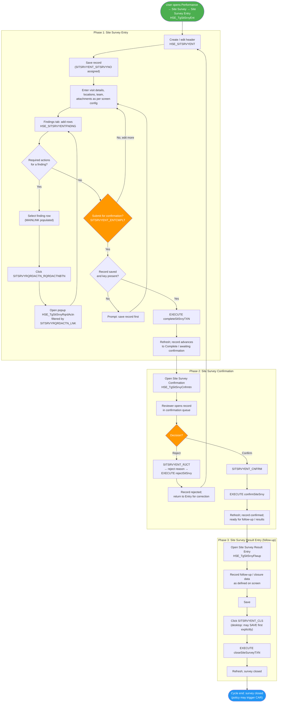
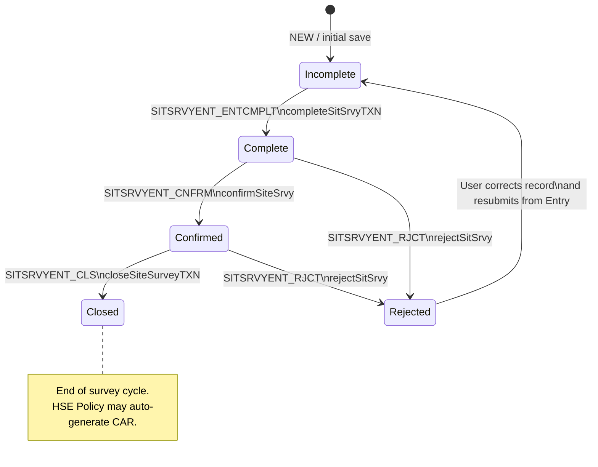
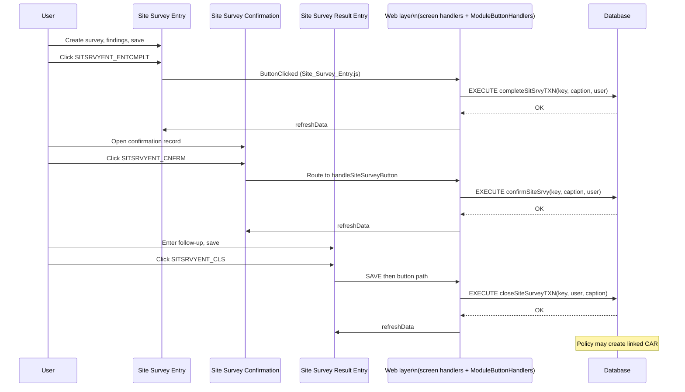

# Site Surveys Process -- UML Documentation

<!-- RQ_HSE_23_3_26_22_44 -->

> **Source**: HSEMS C++ Desktop (`HSEMS-Win`, `SitSrvyEntCategory.cpp`, `SitSrvyCnfrmtnCategory.cpp`, `SitSrvyFlwupCategory.cpp`, `SitSrvyCategory.cpp`) + Web (`hse` module)
> **Scope**: Site survey lifecycle from **Site Survey Entry** through **Confirmation**, **Result / Follow-up**, and **Close**, including **Reject** and **Required Actions** on findings
> **Date**: March 2026
> **See also**: [`HSEMS_Use_Cases_From_Desktop_Code.md`](./HSEMS_Use_Cases_From_Desktop_Code.md) §4.1, §10.4 (CAR auto-generation), §11 (stored procedures)

---

## 1. Process overview

The **Site Survey** module records **site visits** under **Performance → Site Survey**. A single header transaction (`HSE_SITSRVYENT`, key `SITSRVYENT_SITSRVYNO`) moves through **Entry → Complete → Confirm → Close**, with **Reject** returning the record for correction. **Findings** and **required actions** are captured on sub-forms and a popup linked to each finding line.

### 1.1 Operational screens

| Phase | Screen (caption) | Tag | C++ category (reference) | Primary table | Key field |
|-------|------------------|-----|----------------------------|---------------|-----------|
| Entry | Site Survey Entry | `HSE_TgSitSrvyEnt` | `SitSrvyEntCategory` / `SitSrvyCategory` | `HSE_SITSRVYENT` | `SITSRVYENT_SITSRVYNO` |
| Confirmation | Site Survey Confirmation | `HSE_TgSitSrvyCnfrmtn` | `SitSrvyCnfrmtnCategory` / `SitSrvyCategory` | (same header) | (same) |
| Follow-up / result | Site Survey Result Entry | `HSE_TgSitSrvyFlwup` | `SitSrvyFlwupCategory` | (same header) | (same) |
| Inquiry | Site Survey Inquiry | `HSE_TgSitSrvyInq` | Read-only filters | (same) | (same) |

### 1.2 Sub-forms and popup (findings & actions)

| Artefact | Tag / table | Purpose |
|----------|-------------|---------|
| Findings tab | `HSE_SITSRVYENTFNDNG` (`HSE_TGSITSRVYENTFNDNG`); link field `MAINLINK` | Site visit findings; desktop auto-assigns `SITSRVYENTFNDNG_SRIL` when finding fields change |
| Required actions popup | `HSE_TgSitSrvyRqrdActn` → `HSE_SITSRVYRQRDACTN` | Corrective actions per finding; `SITSRVYRQRDACTN_LNK` ties to finding; action number auto-serial on desktop |

Default **TXNSTS** passed when opening Required Actions from Entry vs Confirmation differs on desktop (`1` vs `4`), reflecting the survey’s workflow stage.

### 1.3 Stored procedures

| Procedure | Typical phase | Purpose |
|-----------|---------------|---------|
| `completeSitSrvyTXN` | Entry | Submit survey for confirmation (after record saved) |
| `confirmSiteSrvy` | Confirmation | Confirm survey findings |
| `closeSiteSurveyTXN` | Result / follow-up | Close the survey (end of cycle) |
| `rejectSitSrvy` | Entry / Confirmation / shared handler | Reject with reason (after reject-reason flow on desktop) |

Parameters match desktop/web pattern: survey key, **source screen caption**, and **user name** (argument order matches each `EXECUTE` in C++/web).

### 1.4 Custom buttons

| Button | Screen(s) | Behaviour |
|--------|-----------|-----------|
| `SITSRVYENT_ENTCMPLT` | Site Survey Entry | Validate saved record → `EXECUTE completeSitSrvyTXN` → refresh |
| `SITSRVYENT_CNFRM` | Site Survey Confirmation | `EXECUTE confirmSiteSrvy` → refresh (web: `ModuleButtonHandlers`) |
| `SITSRVYENT_CLS` | Site Survey Result Entry | Desktop: save then close; web: `SAVE` toolbar then `EXECUTE closeSiteSurveyTXN` |
| `SITSRVYENT_RJCT` | Entry / Confirmation / category | Reject reason → `EXECUTE rejectSitSrvy` (web: `ModuleButtonHandlers`) |
| `SITSRVYRQRDACTN_RQRDACTNBTN` | Entry / Confirmation / Inquiry | Open Required Actions popup filtered by current finding `MAINLINK` |

### 1.5 Cross-cutting behaviour

- **Tracing**: Status-changing actions are traced like other HSEMS transactions (`InsertRecIntoTracingTab` / `updateTXNSts` patterns; see use-case appendix).
- **CAR auto-generation**: When the survey is **closed** (and per **HSE Policy**), the system may **auto-generate a CAR** linked to the originating survey (see [`HSEMS_Use_Cases_From_Desktop_Code.md`](./HSEMS_Use_Cases_From_Desktop_Code.md) §10.4).

---

## 2. Activity diagram -- Site survey (entry to cycle end)

<!-- RQ_HSE_23_3_26_22_44 -->

**Web implementation check** (parity vs this diagram): [`Site_Surveys_Activity_Web_Validation.md`](./Site_Surveys_Activity_Web_Validation.md) — §2 nodes **Start–End** covered, including **E4** finding serials and required-action serials on the popup (**RQ_HSE_23_3_26_22_44**).



---

## 3. State machine -- Transaction lifecycle (logical)

Inquiry screens use filters aligned with **Incomplete, Rejected, Complete, Confirmed, Closed** (see use-case §5). Exact numeric **TXNSTS** values are defined in the database and updated by the stored procedures below; the diagram names **business states** those stages represent.

<!-- RQ_HSE_23_3_26_22_44 -->



---

## 4. Sequence diagram -- Happy path (complete → confirm → close)

<!-- RQ_HSE_23_3_26_22_44 -->



---

## 5. Sequence diagram -- Reject path

<!-- RQ_HSE_23_3_26_22_44 -->

```mermaid
sequenceDiagram
    participant User
    participant UI as Entry or Confirmation
    participant Web as Web layer\n(ModuleButtonHandlers / reject flow)
    participant DB as Database

    User->>UI: Click SITSRVYENT_RJCT
    UI->>Web: Button event with current key
    Note over Web: Desktop: rejectRecord + reason dialog;\nWeb: same SP after reason captured
    Web->>DB: EXECUTE rejectSitSrvy(key, caption, user)
    DB-->>Web: OK
    Web->>UI: refreshData
    User->>UI: Return to Site Survey Entry\nto correct and complete again
```

---

## 6. Use case summary (actors vs system)

| Actor step | System response |
|------------|-----------------|
| HSE user creates site survey and findings | Persist `HSE_SITSRVYENT` / `HSE_SITSRVYENTFNDNG`; optional required actions in `HSE_SITSRVYRQRDACTN` |
| User completes entry | `completeSitSrvyTXN`; status moves toward confirmation queue |
| Reviewer confirms | `confirmSiteSrvy` |
| Owner records follow-up and closes | `closeSiteSurveyTXN`; cycle ends; CAR may be generated |
| Reviewer rejects | `rejectSitSrvy`; record returns for correction at entry |

---

*End of document*
