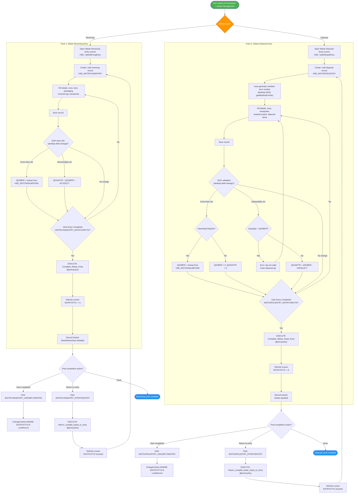
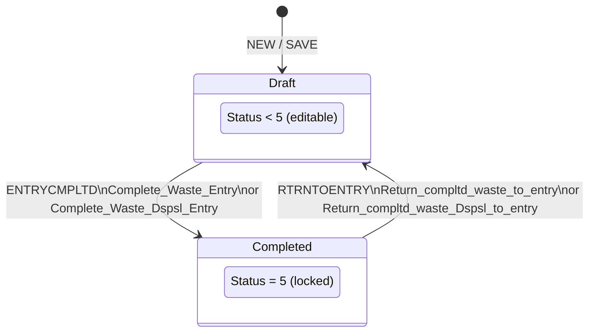
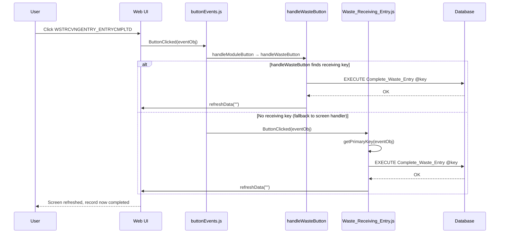
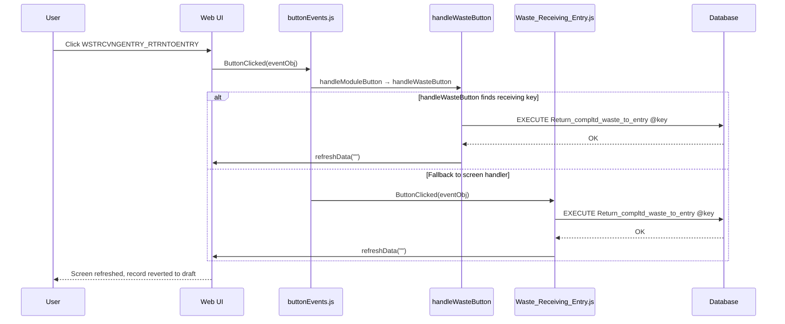
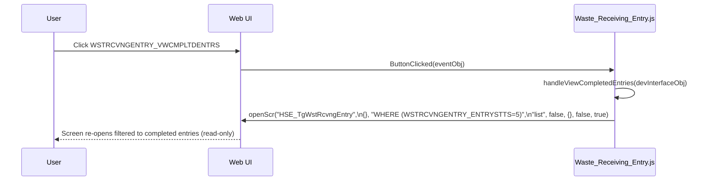
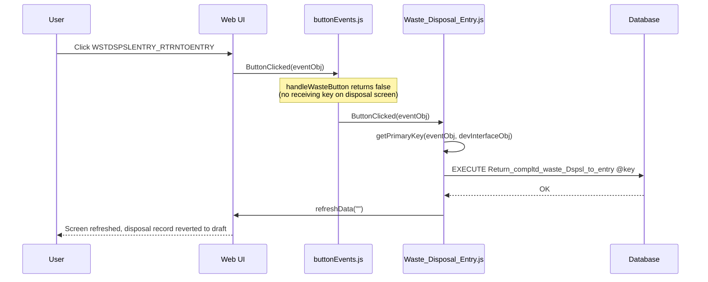
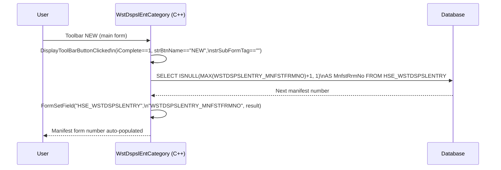
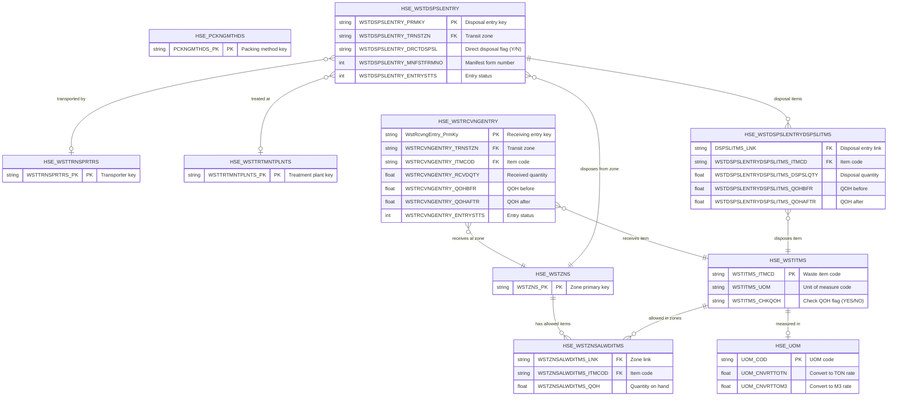
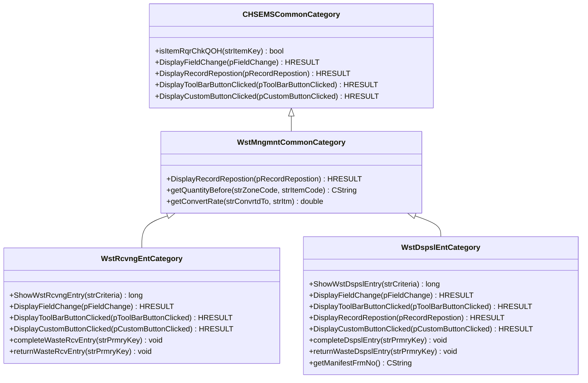

# Waste Management Process -- UML Documentation

<!-- RQ_HSE_23_3_26_18_00 -->

> **Source**: HSEMS C++ Desktop (`HSEMS-Win`, `WstRcvngEntCategory.cpp`, `WstDspslEntCategory.cpp`, `WstMngmntCommonCategory.cpp`) + Web (`hse` module)
> **Scope**: Waste lifecycle from **Setup** through **Receiving Entry**, **Disposal Entry**, **Completion**, and **Return-to-Entry**, covering both tracks
> **Date**: March 2026
> **See also**: [`HSEMS_Use_Cases_From_Desktop_Code.md`](./HSEMS_Use_Cases_From_Desktop_Code.md) §3.1

---

## 1. Process overview

The **Waste Management** module manages two parallel operational tracks under **Environment -> Waste Management**, supported by five **Setup** master-data screens under **Setup -> Waste**.

Unlike PTW or Rescue Plans, Waste Management does **not** follow a multi-phase approval workflow. Each track has a simple **Entry -> Complete** lifecycle with a **Return to Entry** rollback path and a **View Completed Entries** read-only filter.

### 1.1 Setup screens (master data)

| Screen | Tag | Table / Entity | Purpose |
|--------|-----|----------------|---------|
| Packing Methods | `HSE_TgPckngMthds` | `HSE_PCKNGMTHDS` | Define packaging/wrapping methods for waste items |
| Waste Items | `HSE_TgWstItms` | `HSE_WSTITMS` | Define waste material catalogue (item code, UOM, QOH check flag) |
| Waste Zones | `HSE_TgWstZns` | `HSE_WSTZNS` | Define waste collection/storage zones and allowed items per zone |
| Waste Transporters | `HSE_TgWstTrnsprtrs` | `HSE_WSTTRNSPRTRS` | Define authorized waste transport companies |
| Waste Treatment/Disposal Plant | `HSE_TgWstTrtmntPlnts` | `HSE_WSTTRTMNTPLNTS` | Define licensed treatment and disposal facilities |

### 1.2 Operational screens

| Screen | Tag | C++ Category | Table | Key field | Handler |
|--------|-----|--------------|-------|-----------|---------|
| Waste Receiving Entry | `HSE_TgWstRcvngEntry` | `WstRcvngEntCategory` | `HSE_WSTRCVNGENTRY` | `WstRcvngEntry_PrmKy` | `Waste_Receiving_Entry.js` |
| Waste Disposal Entry | `HSE_TgWstDspslEntry` | `WstDspslEntCategory` | `HSE_WSTDSPSLENTRY` | `WSTDSPSLENTRY_PRMKY` | `Waste_Disposal_Entry.js` |

### 1.3 Stored procedures

| SP | Track | Purpose |
|----|-------|---------|
| `Complete_Waste_Entry` | Receiving | Mark receiving entry as completed (status -> 5) |
| `Return_compltd_waste_to_entry` | Receiving | Revert completed receiving entry back to draft |
| `Complete_Waste_Dspsl_Entry` | Disposal | Mark disposal entry as completed (status -> 5) |
| `Return_compltd_waste_Dspsl_to_entry` | Disposal | Revert completed disposal entry back to draft |

### 1.4 Custom buttons

| Button | Track | Behaviour (desktop) |
|--------|-------|---------------------|
| `WSTRCVNGENTRY_VWCMPLTDENTRS` | Receiving | `ChangeCriteria` WHERE ENTRYSTTS=5, `LockRecord` |
| `WSTRCVNGENTRY_RTRNTOENTRY` | Receiving | `Return_compltd_waste_to_entry`, `RefreshScreen` |
| `WSTRCVNGENTRY_ENTRYCMPLTD` | Receiving | `Complete_Waste_Entry`, `RefreshScreen` |
| `WSTDSPSLENTRY_VWCMPLTDENTRS` | Disposal | `ChangeCriteria` WHERE ENTRYSTTS=5, `LockRecord` |
| `WSTDSPSLENTRY_RTRNTOENTRY` | Disposal | `Return_compltd_waste_Dspsl_to_entry`, `RefreshScreen` |
| `WSTDSPSLENTRY_ENTRYCMPLTD` | Disposal | `Complete_Waste_Dspsl_Entry`, `RefreshScreen` |

---

## 2. Activity diagram -- Waste Management (end-to-end)



---

## 3. State machine -- Entry status (both tracks)

Status field: `WSTRCVNGENTRY_ENTRYSTTS` (receiving) / `WSTDSPSLENTRY_ENTRYSTTS` (disposal).

The only status value explicitly used in the C++ desktop code is **5** (Completed). Other values (e.g. 1 = Draft/Incomplete) are inferred from database defaults and SP behaviour.



### 3.1 Record behaviour by status (desktop)

| Status | Toolbar DELETE | Toolbar NEW | Toolbar SAVE | Record Lock |
|--------|---------------|-------------|--------------|-------------|
| < 5 (Draft) | Enabled | Enabled | Enabled | Unlocked |
| >= 5 (Completed) | **Disabled** | **Disabled** | **Disabled** | **Locked** |

The `WstMngmntCommonCategory::DisplayRecordRepostion` base class enforces this lock for both screens. Additionally:
- **Receiving**: `DisplayToolBarButtonClicked` disables DELETE on click if status >= 5
- **Disposal**: `DisplayRecordRepostion` override disables DELETE if status >= 5

---

## 4. Sequence diagram -- Waste Receiving: Complete Entry



---

## 5. Sequence diagram -- Waste Receiving: Return to Entry



---

## 6. Sequence diagram -- Waste Receiving: View Completed Entries



---

## 7. Sequence diagram -- Waste Disposal: Complete Entry

```mermaid
sequenceDiagram
    participant User
    participant WebUI as Web UI
    participant BtnEvt as buttonEvents.js
    participant ModHandler as handleWasteButton
    participant ScrHandler as Waste_Disposal_Entry.js
    participant DB as Database

    User->>WebUI: Click WSTDSPSLENTRY_ENTRYCMPLTD
    WebUI->>BtnEvt: ButtonClicked(eventObj)
    BtnEvt->>ModHandler: handleModuleButton → handleWasteButton

    Note over ModHandler: Bug: handleWasteButton tries receiving<br/>key first; if not found returns false<br/>→ falls through to screen handler

    BtnEvt->>ScrHandler: ButtonClicked(eventObj)
    ScrHandler->>ScrHandler: getPrimaryKey(eventObj, devInterfaceObj)
    ScrHandler->>DB: EXECUTE Complete_Waste_Dspsl_Entry @key
    DB-->>ScrHandler: OK
    ScrHandler->>WebUI: refreshData("")
    WebUI-->>User: Screen refreshed, disposal record completed
```

---

## 8. Sequence diagram -- Waste Disposal: Return to Entry



---

## 9. Sequence diagram -- Waste Disposal: Manifest Number on NEW (desktop only)



---

## 10. Component diagram -- Web architecture

<!-- RQ_HSE_23_3_26_18_00 -->

```mermaid
flowchart LR
    subgraph SetupScreens ["Setup Screen Handlers"]
        Packing["Packing_Methods.js\nHSE_TgPckngMthds"]
        WstItems["Waste_Items.js\nHSE_TgWstItms"]
        WstZones["Waste_Zones.js\nHSE_TgWstZns"]
        WstTrans["Waste_Transporters.js\nHSE_TgWstTrnsprtrs"]
        WstPlant["Waste_TreatmentDisposal_Plant.js\nHSE_TgWstTrtmntPlnts"]
    end

    subgraph OpScreens ["Operational Screen Handlers"]
        RcvScr["Waste_Receiving_Entry.js\nHSE_TgWstRcvngEntry"]
        DspScr["Waste_Disposal_Entry.js\nHSE_TgWstDspslEntry"]
    end

    subgraph Events ["Event Layer"]
        BtnEvt["buttonEvents.js\nhandleModuleButton dispatch"]
    end

    subgraph Handlers ["Module Button Handlers"]
        WasteHandler["handleWasteButton\nin index.js"]
    end

    subgraph Utils ["Utilities"]
        ModUtils["moduleButtonHandlersUtils.js\ngetKeyFromEvent, runTxnAndRefresh"]
    end

    subgraph DB ["Database (Stored Procedures)"]
        SP_CompleteRcv["Complete_Waste_Entry"]
        SP_ReturnRcv["Return_compltd_waste_to_entry"]
        SP_CompleteDsp["Complete_Waste_Dspsl_Entry"]
        SP_ReturnDsp["Return_compltd_waste_Dspsl_to_entry"]
    end

    subgraph MasterTables ["Master Data Tables"]
        TblItems["HSE_WSTITMS"]
        TblZones["HSE_WSTZNS\nHSE_WSTZNSALWDITMS"]
        TblTrans["HSE_WSTTRNSPRTRS"]
        TblPlant["HSE_WSTTRTMNTPLNTS"]
        TblPack["HSE_PCKNGMTHDS"]
    end

    RcvScr -->|ButtonClicked| BtnEvt
    DspScr -->|ButtonClicked| BtnEvt
    BtnEvt --> WasteHandler
    WasteHandler --> ModUtils
    WasteHandler -->|executeSQLPromise| SP_CompleteRcv
    WasteHandler -->|executeSQLPromise| SP_ReturnRcv

    RcvScr -->|fallback ButtonClicked| SP_CompleteRcv
    RcvScr -->|fallback ButtonClicked| SP_ReturnRcv
    DspScr -->|fallback ButtonClicked| SP_CompleteDsp
    DspScr -->|fallback ButtonClicked| SP_ReturnDsp

    RcvScr -->|openScr (view completed)| DB
    DspScr -->|openScr (view completed)| DB

    SetupScreens -->|CRUD| MasterTables
```

---

## 11. Desktop field-change logic (client-side calculations)

### 11.1 Receiving -- QOH calculations (`WstRcvngEntCategory::DisplayFieldChange`)

| Trigger field | Action |
|---------------|--------|
| `WSTRCVNGENTRY_TRNSTZN` or `WSTRCVNGENTRY_ITMCOD` | If both zone and item are set: `QOHBFR = getQuantityBefore(zone, item)` from `HSE_WSTZNSALWDITMS` |
| `WSTRCVNGENTRY_RCVDQTY` | `QOHAFTR = QOHBFR + RCVDQTY` (UOM conversion code is commented out) |

The desktop also has a **commented-out** `isItemRqrChkQOH` validation block that would reject received qty when `CHKQOH = YES` and qty is invalid.

### 11.2 Disposal -- QOH validation (`WstDspslEntCategory::DisplayFieldChange`)

| Trigger field | Condition | Action |
|---------------|-----------|--------|
| `WSTDSPSLENTRY_TRNSTZN` or `WSTDSPSLENTRYDSPSLITMS_ITMCD` | `DRCTDSPSL = 'N'` and `isItemRqrChkQOH(item) = true` | `QOHBFR = getQuantityBefore(zone, item)` |
| Same | `DRCTDSPSL = 'N'` and `isItemRqrChkQOH(item) = false` | `QOHBFR = 0`, `QOHAFTR = 0` |
| `WSTDSPSLENTRYDSPSLITMS_DSPSLQTY` | `isItemRqrChkQOH` and `DSPSLQTY > QOHBFR` | **Error** (`IDS_WST_QTY_NOT_VALID`), clear qty |
| Same | `isItemRqrChkQOH` and `DSPSLQTY <= QOHBFR` | `QOHAFTR = QOHBFR - DSPSLQTY` |

### 11.3 `isItemRqrChkQOH` helper (`HSEMSCommonCategory.cpp`)

```sql
SELECT ISNULL(WSTITMS_CHKQOH, 'YES') FROM HSE_WSTITMS WHERE WSTITMS_ITMCD = @itemCode
```

Returns `false` when the item's `CHKQOH` flag is `'NO'` (quantity-on-hand tracking not required).

---

## 12. Workflow buttons -- implementation status

<!-- RQ_HSE_23_3_26_18_00 -->

### 12.1 Waste Receiving Entry

| Button | Desktop behaviour | Web implementation | Status |
|--------|-------------------|--------------------|--------|
| `WSTRCVNGENTRY_ENTRYCMPLTD` | `Complete_Waste_Entry`, refresh | `handleWasteButton` -> `runTxnAndRefresh` + screen handler fallback | **OK** |
| `WSTRCVNGENTRY_RTRNTOENTRY` | `Return_compltd_waste_to_entry`, refresh | `handleWasteButton` -> `runTxnAndRefresh` + screen handler fallback | **OK** |
| `WSTRCVNGENTRY_VWCMPLTDENTRS` | `ChangeCriteria` WHERE ENTRYSTTS=5, `LockRecord` | Screen handler `openScr` with criteria and read-only flag | **OK** |

### 12.2 Waste Disposal Entry

| Button | Desktop behaviour | Web implementation | Status |
|--------|-------------------|--------------------|--------|
| `WSTDSPSLENTRY_ENTRYCMPLTD` | `Complete_Waste_Dspsl_Entry`, refresh | Screen handler `ButtonClicked` (see note below) | **OK** |
| `WSTDSPSLENTRY_RTRNTOENTRY` | `Return_compltd_waste_Dspsl_to_entry`, refresh | Screen handler `ButtonClicked` (see note below) | **OK** |
| `WSTDSPSLENTRY_VWCMPLTDENTRS` | `ChangeCriteria` WHERE ENTRYSTTS=5, `LockRecord` | Screen handler `openScr` with criteria and read-only flag | **OK** |

> **Note -- `handleWasteButton` disposal path issue**: The centralized `handleWasteButton` in `index.js` (line 573) calls `getKeyFromEvent` with the **receiving** table config first. When no receiving key is found, it returns `false` without reaching the disposal branches below. This means disposal buttons are always handled by the screen handler fallback path, which works correctly. The module handler disposal code is effectively dead code.

---

## 13. Known gaps vs desktop

<!-- RQ_HSE_23_3_26_18_00 -->

| # | Gap | Track | Impact | Resolution |
|---|-----|-------|--------|------------|
| 1 | ~~**No QOH auto-calculation on field change**~~ | Both | ~~Medium~~ | **Resolved (RQ_HSE_23_3_26_18_00):** Added `SubFieldChanged` export to `Waste_Receiving_Entry.js` (zone+item -> QOHBFR lookup from `HSE_WSTZNSALWDITMS`; received qty -> QOHAFTR = QOHBFR + RCVDQTY). Extended `SubFieldChanged` in `screenEvents.js` to delegate to screen handlers. |
| 2 | ~~**No manifest form number auto-generation on NEW**~~ | Disposal | ~~Low-Medium~~ | **Resolved (RQ_HSE_23_3_26_18_00):** Added `toolBarButtonClicked` export to `Waste_Disposal_Entry.js` -- on NEW (main form, complete==1): `SELECT ISNULL(MAX(WSTDSPSLENTRY_MNFSTFRMNO)+1, 1)` -> `FormSetField`. |
| 3 | ~~**No DELETE toolbar guard when status >= 5**~~ | Both | ~~Low~~ | **Resolved (RQ_HSE_23_3_26_18_00):** Added `MainSubReposition` export to both `Waste_Receiving_Entry.js` and `Waste_Disposal_Entry.js` -- reads `ENTRYSTTS`, if >= 5 calls `setScreenDisableBtn(true, true, true)` to disable New/Save/Delete. |
| 4 | ~~**No record lock when status = 5**~~ | Both | ~~Medium~~ | **Resolved (RQ_HSE_23_3_26_18_00):** Same `MainSubReposition` implementation as gap 3 -- disables all toolbar buttons on completed records, mirroring `WstMngmntCommonCategory::DisplayRecordRepostion`. |
| 5 | **`handleWasteButton` disposal branch unreachable** -- early return on missing receiving key prevents disposal buttons from being handled by the centralized module handler | Disposal | **Low** -- screen handler fallback works correctly; only affects code maintainability | Cosmetic / refactor item. Screen handler `ButtonClicked` handles all disposal buttons correctly. |
| 6 | ~~**Disposal `isItemRqrChkQOH` validation missing**~~ | Disposal | ~~Medium~~ | **Resolved (RQ_HSE_23_3_26_18_00):** Added `SubFieldChanged` export to `Waste_Disposal_Entry.js` with `isItemRqrChkQOH` SQL check. When disposal qty > QOH before, shows error and clears field (mirrors `IDS_WST_QTY_NOT_VALID`). Zone/item changes set QOHBFR from `HSE_WSTZNSALWDITMS` or zero when `CHKQOH = NO`. |

---

## 14. Setup screens -- implementation status

| Screen | Tag | Web handler | Exports | Status |
|--------|-----|-------------|---------|--------|
| Packing Methods | `HSE_TgPckngMthds` | `Packing_Methods.js` | `ShowScreen` (toolbar enable) | **OK** (minimal, matches desktop) |
| Waste Items | `HSE_TgWstItms` | `Waste_Items.js` | `ShowScreen` (toolbar enable) | **OK** (minimal, matches desktop) |
| Waste Zones | `HSE_TgWstZns` | `Waste_Zones.js` | `ShowScreen` (toolbar enable) | **OK** (minimal, matches desktop) |
| Waste Transporters | `HSE_TgWstTrnsprtrs` | `Waste_Transporters.js` | `ShowScreen` (toolbar enable) | **OK** (minimal, matches desktop) |
| Waste Treatment/Disposal Plant | `HSE_TgWstTrtmntPlnts` | `Waste_TreatmentDisposal_Plant.js` | `ShowScreen` (toolbar enable) | **OK** (minimal, matches desktop) |

---

## 15. Database entity relationships

<!-- RQ_HSE_23_3_26_18_00 -->



---

## 16. Class hierarchy (desktop C++)

<!-- RQ_HSE_23_3_26_18_00 -->



---

## 17. Validation -- Activity diagram §2 vs web implementation

<!-- RQ_HSE_23_3_26_18_00 -->

Each node in the §2 activity diagram was traced against the actual web source files:

- `Waste_Receiving_Entry.js` (screen handler)
- `Waste_Disposal_Entry.js` (screen handler)
- `handleWasteButton` in `ModuleButtonHandlers/index.js` (centralized handler)
- `buttonEvents.js` (event dispatch layer)
- `screenHandlers/index.js` (screen registration)

### 17.1 Track 1: Waste Receiving Entry

| Node | Activity | Web evidence | Status |
|------|----------|-------------|--------|
| **R1** | Open Waste Receiving Entry screen `HSE_TgWstRcvngEntry` | Registered in `screenHandlers/index.js`; menu entry `HSE_TgWstRcvngEntry` in `HSE.json` line 1610 | **COVERED** |
| **R2** | Create / edit receiving record `HSE_WSTRCVNGENTRY` | Platform CRUD; `ShowScreen` enables New/Save/Delete via `setScreenDisableBtn(false, false, false)` | **COVERED** |
| **R3** | Fill details: zone, item, packaging, received qty, transporter | Platform form fields from screen definition | **COVERED** |
| **R4** | Save record | Platform SAVE toolbar | **COVERED** |
| **R5** | QOH auto-calc (desktop field-change)? | **Resolved (RQ_HSE_23_3_26_18_00):** `SubFieldChanged` export added to `Waste_Receiving_Entry.js`; `screenEvents.js` extended to delegate to screen handlers | **COVERED** |
| **R5a** | QOHBFR = lookup from `HSE_WSTZNSALWDITMS` | **Resolved:** `getQuantityBefore()` queries `HSE_WSTZNSALWDITMS` for zone+item, sets via `FormSetField` | **COVERED** |
| **R5b** | QOHAFTR = QOHBFR + RCVDQTY | **Resolved:** Computed in `SubFieldChanged` when `WSTRCVNGENTRY_RCVDQTY` changes | **COVERED** |
| **R6** | Click Entry Completed `WSTRCVNGENTRY_ENTRYCMPLTD` | `Waste_Receiving_Entry.js` line 12 (constant), line 93-95 (`ButtonClicked`); `handleWasteButton` line 576-577 | **COVERED** |
| **R7** | `EXECUTE Complete_Waste_Entry @primaryKey` | `Waste_Receiving_Entry.js` line 73; `handleWasteButton` line 577 | **COVERED** |
| **R8** | Refresh screen, ENTRYSTTS -> 5 | `refreshData('')` called in `Waste_Receiving_Entry.js` line 74; `runTxnAndRefresh` in handler | **COVERED** |
| **R9** | Record locked: Delete/New/Save disabled | **Resolved (RQ_HSE_23_3_26_18_00):** `MainSubReposition` export added; reads `WSTRCVNGENTRY_ENTRYSTTS`, if >= 5 calls `setScreenDisableBtn(true, true, true)` | **COVERED** |
| **RV1** | Click `WSTRCVNGENTRY_VWCMPLTDENTRS` | `Waste_Receiving_Entry.js` line 10 (constant), line 85-87 (`ButtonClicked`) | **COVERED** |
| **RV2** | ChangeCriteria WHERE ENTRYSTTS=5, LockRecord | `openScr("HSE_TgWstRcvngEntry", {}, "WHERE (WSTRCVNGENTRY_ENTRYSTTS=5)", "list", false, {}, false, true)` -- line 42; last `true` = read-only | **COVERED** |
| **RR1** | Click `WSTRCVNGENTRY_RTRNTOENTRY` | `Waste_Receiving_Entry.js` line 11 (constant), line 89-91; `handleWasteButton` line 579-580 | **COVERED** |
| **RR2** | `EXECUTE Return_compltd_waste_to_entry @primaryKey` | `Waste_Receiving_Entry.js` line 55; `handleWasteButton` line 580 | **COVERED** |
| **RR3** | Refresh screen, ENTRYSTTS reverted | `refreshData('')` called after SP in both paths | **COVERED** |

### 17.2 Track 2: Waste Disposal Entry

| Node | Activity | Web evidence | Status |
|------|----------|-------------|--------|
| **D1** | Open Waste Disposal Entry screen `HSE_TgWstDspslEntry` | Registered in `screenHandlers/index.js`; menu entry `HSE_TgWstDspslEntry` in `HSE.json` line 1621 | **COVERED** |
| **D2** | Create / edit disposal record `HSE_WSTDSPSLENTRY` | Platform CRUD; `ShowScreen` enables toolbar | **COVERED** |
| **D2a** | Auto-generate manifest form number (desktop NEW: `getManifestFrmNo`) | **Resolved (RQ_HSE_23_3_26_18_00):** `toolBarButtonClicked` export added; on NEW (main form, complete==1): `SELECT ISNULL(MAX(WSTDSPSLENTRY_MNFSTFRMNO)+1, 1)` -> `FormSetField` | **COVERED** |
| **D3** | Fill details: zone, transporter, treatment plant, disposal items | Platform form fields | **COVERED** |
| **D4** | Save record | Platform SAVE toolbar | **COVERED** |
| **D5** | QOH validation (desktop field-change)? | **Resolved (RQ_HSE_23_3_26_18_00):** `SubFieldChanged` export added to `Waste_Disposal_Entry.js` with full `isItemRqrChkQOH` + QOH validation | **COVERED** |
| **D5a** | isItemRqrChkQOH? | **Resolved:** `isItemRqrChkQOH()` queries `HSE_WSTITMS.WSTITMS_CHKQOH`; returns false when `'NO'` | **COVERED** |
| **D5b** | QOHBFR = lookup from `HSE_WSTZNSALWDITMS` | **Resolved:** `getQuantityBefore()` queries `HSE_WSTZNSALWDITMS`, sets via `FormSetField(..., 'tab')` | **COVERED** |
| **D5c** | QOHBFR = 0, QOHAFTR = 0 (when item does not require QOH) | **Resolved:** When `isItemRqrChkQOH` returns false, both fields set to `'0'` | **COVERED** |
| **D5d** | DspslQty > QOHBFR? | **Resolved:** Comparison in `SubFieldChanged` when `WSTDSPSLENTRYDSPSLITMS_DSPSLQTY` changes | **COVERED** |
| **D5e** | Error: qty not valid, clear disposal qty | **Resolved:** `AskYesNoMessage` shown, disposal qty cleared, returns `{ cancel: 1 }` | **COVERED** |
| **D5f** | QOHAFTR = QOHBFR - DSPSLQTY | **Resolved:** Computed and set via `FormSetField` when qty is valid | **COVERED** |
| **D6** | Click Entry Completed `WSTDSPSLENTRY_ENTRYCMPLTD` | `Waste_Disposal_Entry.js` line 12 (constant), line 97-99 (`ButtonClicked`) | **COVERED** |
| **D7** | `EXECUTE Complete_Waste_Dspsl_Entry @primaryKey` | `Waste_Disposal_Entry.js` line 77 | **COVERED** |
| **D8** | Refresh screen, ENTRYSTTS -> 5 | `refreshData('')` line 78 | **COVERED** |
| **D9** | Record locked: Delete disabled | **Resolved (RQ_HSE_23_3_26_18_00):** `MainSubReposition` export added; reads `WSTDSPSLENTRY_ENTRYSTTS`, if >= 5 calls `setScreenDisableBtn(true, true, true)` | **COVERED** |
| **DV1** | Click `WSTDSPSLENTRY_VWCMPLTDENTRS` | `Waste_Disposal_Entry.js` line 10 (constant), line 89-91 | **COVERED** |
| **DV2** | ChangeCriteria WHERE ENTRYSTTS=5, LockRecord | `openScr("HSE_TgWstDspslEntry", {}, "WHERE (WSTDSPSLENTRY_ENTRYSTTS=5)", "list", false, {}, false, true)` -- line 46 | **COVERED** |
| **DR1** | Click `WSTDSPSLENTRY_RTRNTOENTRY` | `Waste_Disposal_Entry.js` line 11 (constant), line 93-95 | **COVERED** |
| **DR2** | `EXECUTE Return_compltd_waste_Dspsl_to_entry @primaryKey` | `Waste_Disposal_Entry.js` line 59 | **COVERED** |
| **DR3** | Refresh screen, ENTRYSTTS reverted | `refreshData('')` line 60 | **COVERED** |

### 17.3 Summary

<!-- RQ_HSE_23_3_26_18_00: updated after gap resolution -->

| Metric | Count |
|--------|-------|
| Total activity nodes in §2 diagram | **33** |
| Nodes COVERED by web implementation | **33** |
| Nodes MISSING from web implementation | **0** |

### 17.4 Resolved gaps (RQ_HSE_23_3_26_18_00)

All four implementation gaps have been resolved:

| # | Category | Nodes | Resolution |
|---|----------|-------|------------|
| **G1** | ~~QOH auto-calculation on receiving field change~~ | R5, R5a, R5b | **Resolved:** `SubFieldChanged` added to `Waste_Receiving_Entry.js`; `screenEvents.js` extended to delegate field changes to screen handlers. Zone+item -> QOHBFR lookup; received qty -> QOHAFTR = QOHBFR + RCVDQTY. |
| **G2** | ~~Record lock and toolbar disable on completion~~ | R9, D9 | **Resolved:** `MainSubReposition` added to both handlers; reads ENTRYSTTS, disables New/Save/Delete when >= 5 via `setScreenDisableBtn(true, true, true)`. |
| **G3** | ~~Manifest form number auto-generation on NEW~~ | D2a | **Resolved:** `toolBarButtonClicked` added to `Waste_Disposal_Entry.js`; on NEW (main form): `SELECT MAX+1` -> `FormSetField(WSTDSPSLENTRY_MNFSTFRMNO)`. |
| **G4** | ~~QOH validation on disposal field change~~ | D5, D5a-D5f | **Resolved:** `SubFieldChanged` added to `Waste_Disposal_Entry.js` with `isItemRqrChkQOH` SQL check. Zone/item -> QOHBFR; disposal qty > QOHBFR -> error + clear; valid qty -> QOHAFTR = QOHBFR - DSPSLQTY. |

### 17.5 Remaining items

| # | Item | Impact | Notes |
|---|------|--------|-------|
| 5 | `handleWasteButton` disposal branch unreachable in `ModuleButtonHandlers/index.js` | **Low** | Cosmetic / refactor only. Screen handler `ButtonClicked` handles all disposal buttons correctly via fallback. |

### 17.6 All activities covered

All 33 activity nodes across both tracks are now implemented in the web:

| Action | Receiving | Disposal |
|--------|-----------|---------|
| Entry Completed (SP execution + refresh) | R6, R7, R8 | D6, D7, D8 |
| Return to Entry (SP execution + refresh) | RR1, RR2, RR3 | DR1, DR2, DR3 |
| View Completed Entries (filter + read-only) | RV1, RV2 | DV1, DV2 |
| QOH calculation / validation (field change) | R5, R5a, R5b | D5, D5a-D5f |
| Record lock on completion (MainSubReposition) | R9 | D9 |
| Manifest auto-generation (toolbar NEW) | -- | D2a |

### 17.7 Files modified (RQ_HSE_23_3_26_18_00)

| File | Changes |
|------|---------|
| `hse/src/events/screenEvents.js` | Extended `SubFieldChanged` to delegate to screen handlers via `getScreenHandler()` |
| `hse/src/screenHandlers/Environment/Waste Management/Waste_Receiving_Entry.js` | Added `SubFieldChanged` (G1), `MainSubReposition` (G2), module-level `_devInterfaceObj` capture |
| `hse/src/screenHandlers/Environment/Waste Management/Waste_Disposal_Entry.js` | Added `SubFieldChanged` (G4), `toolBarButtonClicked` (G3), `MainSubReposition` (G2), module-level `_devInterfaceObj` capture |

---

*End of Waste Management UML documentation -- RQ_HSE_23_3_26_18_00*
