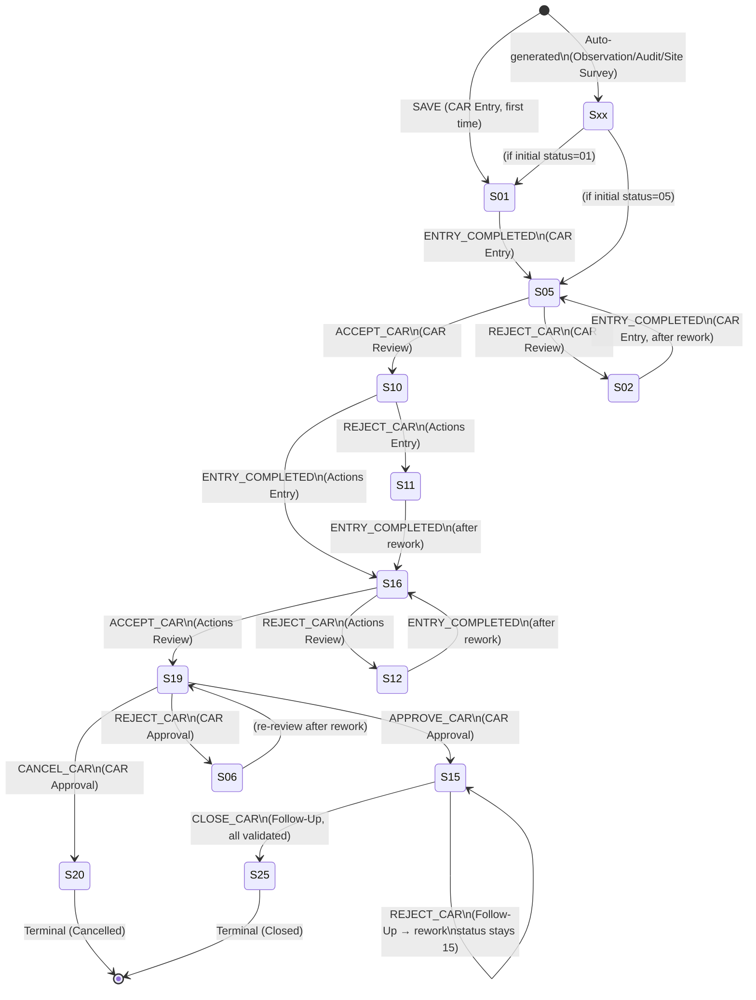
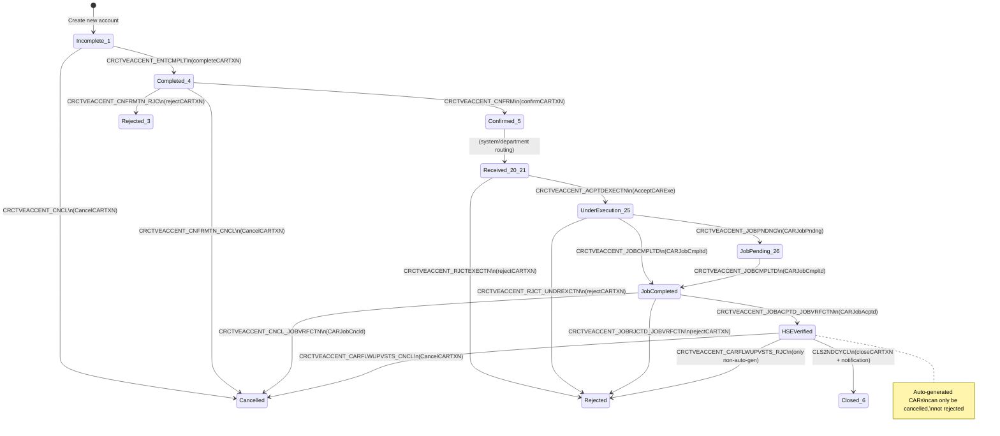

# CARs — Legacy Desktop (C++) Full Lifecycle Report

Reverse-engineering report for **CARs (Corrective Action Reports / Requests)** in the legacy **HSEMS** C++ DLL (`HSEMS_WEB_Original\HSEMS-Win\HSEMS.DLL`).

**Analysis sources:** `NewCarEntryCategory.cpp/.h`, `CorrectiveActionEntry.cpp/.h`, `CARCategory.cpp/.h`, `CAREntryCategory.cpp/.h`, `CARConfirmationCategory.cpp/.h`, `CARRcvdCategory.cpp/.h`, `CARUndrExctnCategory.cpp/.h`, `CARFlwupVstCategory.cpp/.h`, `CARJobVrfctnCategory.cpp/.h`, `CARInquiry.cpp/.h`, `ApproveCAR.cpp/.h`, `SitSrvyRqrdActn.cpp`, `Definitions.h`, `resource.h`, plus web parity files (`carCustomButtons.js`, `carTransitionGuard.js`, `carFoundationTxnButtons.js`, etc.).

**Purpose:** Interpret low-level C++ and SQL calls as **business lifecycle** and **migration** guidance for a modern web stack.

---

## Architecture overview — two CAR concept layers

The codebase implements **two related but architecturally distinct entities** that together form the complete "CARs" domain:

| Layer | Primary table | Status field | C++ class hierarchy | Business meaning |
|-------|--------------|--------------|---------------------|-----------------|
| **Layer 1 — Action Tracking CAR** | `HSE_CRENTRY` | `CRENTRY_CRSTT` | `CNewCarEntryCategory` → `CAuditModuleCategory` → `CHSEMSCommonCategory` | The **case file**: header data, NC description, evidence, review/approval workflow, corrections planning, root cause analysis |
| **Layer 2 — Corrective Action Account** | `HSE_CRCTVEACCENT` | `CRCTVEACCENT_RECSTS` | `CarCategory` → `CHSEMSCommonCategory` (and subclasses: `CarEntryCategory`, `CarConfirmationCategory`, `CARRcvdCategory`, `CARUndrExctnCategory`, `CarFlwupVstCategory`, `CARJobVrfctnCategory`, `CARInquiry`) | The **execution account**: department ownership, job tracking, verification, closure with notifications |

### Class hierarchy diagram

```
CHSEMSCommonCategory
├── CAuditModuleCategory
│   └── CNewCarEntryCategory          ← Layer 1: HSE_CRENTRY workflow
│       └── CCorrectiveActionEntry    ← Corrective action popup (per root cause)
├── CarCategory                       ← Layer 2 base: HSE_CRCTVEACCENT
│   ├── CarEntryCategory              ← Account entry + completeCARTXN
│   ├── CarConfirmationCategory       ← Review/confirm step (policy-gated)
│   ├── CARRcvdCategory               ← Actions received + AcceptCARExe
│   ├── CARUndrExctnCategory          ← Under execution + CARJobCmpltd/Pndng
│   ├── CarFlwupVstCategory           ← Follow-up visit/approval + closeCARTXN
│   ├── CARJobVrfctnCategory          ← HSE job verification + CARJobAcptd
│   └── CARInquiry                    ← Read-only inquiry (all statuses)
└── CApproveCAR                       ← Popup: CAR Approval Info (1:1 record)
```

---

## LAYER 1 — Action Tracking CAR (`HSE_CRENTRY`)

---

### 1. Business lifecycle description

A **CAR** in the Action Tracking sense is a **formal corrective-action case** stored in `HSE_CRENTRY`. It captures **what went wrong** (the Non-Conformance), **where the problem was raised** (CAR source — observation, audit, incident, etc.), and owns **child planning**: **Corrections** (immediate containment), **Root Causes** (analysis), and per-root-cause **Corrective Actions** (long-term fixes).

The case advances through a multi-stage review-and-approval pipeline involving **four distinct user roles/screens**, with an audit trail (`HSE_CRENTRY_TRC`) recorded at every transition and reject reasons (`HSE_RJCTRSN`) captured on negative paths.

**The purpose of each stage:**

| Stage | Business purpose |
|-------|-----------------|
| **Draft (01)** | Initial data capture: site, department, NC description, evidence, photos |
| **Submitted (05)** | Signifies the CAR header is complete and ready for technical review |
| **Reviewed (10)** | A reviewer has validated the NC is legitimate and documented review findings |
| **Actions Planned (16)** | Root causes identified, corrections defined, corrective actions assigned with target dates |
| **Actions Reviewed (19)** | All corrections and corrective actions validated by reviewer; target date rolled up |
| **Approved (15)** | Management has approved the action plan; concerned department and project assigned |
| **Closed (25)** | All actions executed, verified, and accepted; CAR close date recorded |
| **Rejected (02/06/11/12)** | Sent back for rework at various stages |
| **Cancelled (20)** | Permanently cancelled during approval (with documented reasons) |

**Auto-generation paths:** CARs can be created automatically from:
- **Observation close** (when `NRSTMISCENT_RQRCR = Y`) via `closeNearMissTXN`
- **Audit result confirmation** (per finding with CAR required) via `AuditConfirmation_AddRecordToCAREntry`
- **Site survey required actions** via `sp_Generate_CARs`

Auto-generated CARs are marked with `CRENTRY_ATGNR = 'Y'` and **cannot be deleted** by users.

---

### 2. State machine / workflow

#### 2.1 Complete status code catalog

| `CRENTRY_CRSTT` | Business name | Set by screen | Meaning |
|-----------------|---------------|---------------|---------|
| `01` | Draft | `HSE_TGCRENTRY` (SAVE) | First successful save of a new CAR |
| `05` | Entry Completed | `HSE_TGCRENTRY` (ENTRY_COMPLETED) | Header entry finished; moves to review queue |
| `02` | Rejected at Review | `HSE_TGCRRVW` (REJECT_CAR) | Reviewer found issues; returns to CAR Entry for rework |
| `10` | Review Accepted | `HSE_TGCRRVW` (ACCEPT_CAR) | Review passed; moves to actions planning |
| `11` | Rejected at Actions Entry | `HSE_TGACTNSENTRY` (REJECT_CAR) | Actions planner rejects; returns to entry |
| `16` | Actions Entry Completed | `HSE_TGACTNSENTRY` (ENTRY_COMPLETED) | All root causes, corrections, corrective actions defined |
| `12` | Rejected at Actions Review | `HSE_TGACTNSRVIW` (REJECT_CAR) | Actions reviewer finds issues with the plan |
| `19` | Actions Review Accepted | `HSE_TGACTNSRVIW` (ACCEPT_CAR) | Plan validated; target date rolled up; moves to approval |
| `06` | Rejected at Approval | `HSE_TGCRAPRVL` (REJECT_CAR) | Management rejects the plan |
| `20` | Cancelled | `HSE_TGCRAPRVL` (CANCEL_CAR) | Management permanently cancels the CAR |
| `15` | Approved | `HSE_TGCRAPRVL` (APPROVE_CAR) | Management approves; also set on follow-up REJECT (rework) |
| `25` | Closed | `HSE_TGCRFLOUP` (CLOSE_CAR) | All actions accepted + close date entered |

**Initial status for auto-generated CARs:**
- From Observation: `HSEOBSRVTN_GnrCrStt` policy value (left-padded to 2 chars)
- From Audit: `HSEPLC_ADT_GNRCRSTT` policy value

#### 2.2 State diagram



#### 2.3 Transition table with conditions and triggers

| From | To | Button/event | Screen tag | Conditions | Actor |
|------|----|-------------|------------|------------|-------|
| (new) | `01` | SAVE (complete) | `HSE_TGCRENTRY` | `FormSetField CRENTRY_CRSTT=01`; `##TEMP_HSE_TABLE` seeded with "Creating new CAR" / "CAR Entry"; year/serial computed if empty | User (CAR Entry) |
| `01` | `05` | ENTRY_COMPLETED | `HSE_TGCRENTRY` | Trace: "Entry Completed" / "CAR Entry"; SAVE | User (CAR Entry) |
| `05` | `10` | ACCEPT_CAR | `HSE_TGCRRVW` | **If** policy `HSEPLC_ADT_ENBCRRVWINF=Y` **and** `CRENTRY_CRSRC` matches `HSEPLC_ADT_CRBSS`: must have exactly 1 row in `HSE_CRRVWINF` for this key; trace: "CAR Accepted" / "CAR Review"; SAVE | User (CAR Reviewer) |
| `05` | `02` | REJECT_CAR | `HSE_TGCRRVW` | Open `HSE_TGRJCTRSN` (module: `CRCTVEACCENT-RV`); user enters at least 1 reason; trace: "Entry Rejected"; SAVE | User (CAR Reviewer) |
| `10` | `16` | ENTRY_COMPLETED | `HSE_TGACTNSENTRY` | **Validation 1:** ≥1 root cause record in `HSE_ACTNSENTRY_RTCSS`; **Validation 2:** each root cause linked to ≥1 corrective action in `HSE_CRRCTVACTNS`; **Validation 3:** ≥1 correction record in `HSE_ACTNSENTRY_CRR`; **Side effects:** mass UPDATE sets corrections as Accepted (`CRRCTVACTNS_LnkCss_Acc=Y`, `ACTNSENTRY_Crr_ActStt=A`), corrective actions accepted (`CRRCTVACTNS_Acc=Y`, `CRRCTVACTNS_ACTSTT=3`); trace: "Entry Completed" / "Actions Entry"; CRENTRY_CRSTT=16; SAVE | User (Actions Planner) |
| `10` | `11` | REJECT_CAR | `HSE_TGACTNSENTRY` | Reject reason flow (module: `CRCTVEACCENT-AE`); trace: "Entry Rejected" | User (Actions Planner) |
| `16` | `19` | ACCEPT_CAR | `HSE_TGACTNSRVIW` | **Validation 1:** no corrections with `CRRCTVACTNS_LNKCSS_ACC ≠ 'Y'`; **Validation 2:** no corrective actions with `CRRCTVACTNS_acc='N'` under this CAR's root causes; **Side effect:** UPDATE `HSE_CRENTRY.CRENTRY_CRTRGDT` to `MAX(CRRCTVACTNS_trgDt)` if any revised target date exceeds current; trace: "CAR Accepted" / "Actions Review"; SAVE | User (Actions Reviewer) |
| `16` | `12` | REJECT_CAR | `HSE_TGACTNSRVIW` | Reject reason flow (module: `ACTION-RV`); trace: "CAR Rejected" | User (Actions Reviewer) |
| `19` | `15` | APPROVE_CAR | `HSE_TGCRAPRVL` | **If** policy `HSEPLC_ADT_ENBCRAPPINF=Y` **and** source matches basis: must have exactly 1 row in `HSE_CRAPPRVLINF`; **Side effect:** copy `CRAPPRVLINF_CNCDPR` → `CRENTRY_CNCDPR`, `CRAPPRVLINF_RLTPRJ` → `CRENTRY_PRJ`; trace: "CAR Approved" / "CAR Approval"; SAVE | User (Management) |
| `19` | `06` | REJECT_CAR | `HSE_TGCRAPRVL` | Reject reason flow (module: `CRCTVEACCENT-AP`); trace: "Entry Rejected" / "CAR Approval"; SAVE | User (Management) |
| `19` | `20` | CANCEL_CAR | `HSE_TGCRAPRVL` | Reject reason flow (reuses reject popup); trace: "CAR Cancelled" / "CAR Approval"; SAVE | User (Management) |
| `15` | `25` | CLOSE_CAR | `HSE_TGCRFLOUP` | **Validation 1:** all corrections accepted (`ACTNSENTRY_CRR_ACTACC = 'Y'`); **Validation 2:** all corrective actions accepted (`CRRCTVACTNS_ACTACC = 'y'` — note: case-insensitive in legacy SQL); **Validation 3:** `CRENTRY_CRCLSDT` not empty; SAVE | User (Follow-Up) |
| `15` | `15` | REJECT_CAR | `HSE_TGCRFLOUP` | Reject reason flow (module: `CARFLOWUP-RV`); trace: "CAR Rejected" / screen caption; **status stays 15** — semantically "send back for rework within approved state" | User (Follow-Up) |

**Policy-driven gates (audit tab policies):**

| Policy field | Table | Controls |
|-------------|-------|----------|
| `HSEPLC_ADT_CRBSS` | `HSE_HSEPLC_ADT` | The CAR source that triggers info-popup requirements |
| `HSEPLC_ADT_ENBCRRVWINF` | `HSE_HSEPLC_ADT` | Whether CAR Review Info popup is mandatory |
| `HSEPLC_ADT_ENBCRAPPINF` | `HSE_HSEPLC_ADT` | Whether CAR Approval Info popup is mandatory |
| `HSEPLC_DFLST` | `HSE_HSEPLC` | Default site for new CAR entries |

---

### 3. Sequence flows

#### 3.1 Creating a CAR

**Path A — Manual CAR Entry**

```
Actor           User
Participant     "CAR Entry (HSE_TGCRENTRY)"              as UI
Participant     "CNewCarEntryCategory"                     as Cat
Participant     "SQL Server"                               as DB

User    -> UI   : Click NEW
Cat     -> DB   : EXEC GetPolicyValue 'HSE_HSEPLC','HSEPLC_DFLST'
Cat     -> UI   : Set CRENTRY_ST = default site
Cat     -> DB   : getEmpDep(login, true)
Cat     -> UI   : Set CRENTRY_DPR = user's department

User    -> UI   : Fill NC data (source, description, evidence, photos)
User    -> UI   : Click SAVE

        [Pre-save phase (iComplete=0)]
Cat     -> DB   : CREATE ##TEMP_HSE_TABLE if not exists
Cat     -> DB   : INSERT 'ActionDescription' = 'Creating new CAR'
Cat     -> DB   : INSERT 'SrcScreen' = 'CAR Entry'
Cat     -> Cat  : If CRENTRY_CRYR empty → parse year from CRENTRY_CRDT
Cat     -> Cat  : UpdateYearAndSerial(year) → getNxtSrl for serial

        [Post-save phase (iComplete=1)]
Cat     -> UI   : Set CRENTRY_CRSTT = '01'

User    -> UI   : Click ENTRY_COMPLETED
Cat     -> DB   : INSERT HSE_CRENTRY_TRC ('Entry Completed', 'CAR Entry', user, GETDATE())
Cat     -> UI   : Set CRENTRY_CRSTT = '05'
Cat     -> UI   : SAVE (toolbar action)
```

**Path B — Auto-generated from Observation close**

```
User closes observation where NRSTMISCENT_RQRCR = 'Y'
  → NearMissFollowUpCategory triggers closeNearMissTXN
  → Policy reads: HSEOBSRVTN_CrBss (CAR basis), HSEOBSRVTN_GnrCrStt (initial status)
  → INSERT into HSE_CRENTRY with:
      CRENTRY_ATGNR = 'Y'
      CRENTRY_CRSRC = policy CAR basis
      CRENTRY_CRSTT = policy initial status (left-padded to 2 chars)
      CRENTRY_CRYR  = observation year
      CRENTRY_CRN   = next serial
      CRENTRY_TXNYR, CRENTRY_TXNN = observation year/number
      + CopyImages → CRENTRY_NCPHT
      + ##TEMP_HSE_TABLE seeded for trigger context
  → Message to user: "CAR No. = {year}-{CRN}"
```

**Path C — Auto-generated from Audit result confirmation**

```
Audit result confirmation for plan with findings where CAR required
  → AuditModuleCategory::AuditConfirmation_AddRecordToCAREntry
  → For EACH qualifying finding:
      INSERT into HSE_CRENTRY with:
        CRENTRY_ATGNR = 'Y'
        CRENTRY_CRSTT = HSEPLC_ADT_GNRCRSTT (policy)
        CRENTRY_CRSRC = HSEPLC_ADT_CRBSS
        CRENTRY_DPR   = HSEPLC_OWNRDPRT
        Serial/year logic
        CRENTRY_CLUS_LVLRSULTPPUP_FNDNGS_PK = finding PK
        + CopyImages per finding
        + ##TEMP_HSE_TABLE seeded
```

**Path D — Site Survey required actions**

```
User on Site Survey Required Actions screen
  → SitSrvyRqrdActn toggles visibility of buttons:
      SITSRVYENTRQRDACTN_GENERATECAR → generates CAR via sp_Generate_CARs
      SitSrvyEntRQRDACTN_ViewRelatedCAR → opens related CAR
      SitSrvyEntRQRDACTN_UpdtCAR → updates existing CAR (sp_Update_CARs)
      SitSrvyEntRQRDACTN_CnlCAR → cancels related CAR (cancelCAR)
      SitSrvyEntRQRDACTN_WrkAcptd / WrkNotAcptd → accept/reject work
  (Exact INSERT logic in stored procedures, not fully in C++)
```

#### 3.2 Updating a CAR

```
User edits any CAR screen (Entry, Review, Actions Entry, Actions Review, Approval, Follow-up, Editing)

  Field change handlers:
    CRENTRY_CRDT changed → extract year → if different from CRENTRY_CRYR:
      UpdateYearAndSerial → new serial via getNxtSrl
    CRENTRY_CRSRC changed on Review → recompute CRENTRY_CRSRLN
      for combination (CRENTRY_CRYR, CRENTRY_CRSRC)

  Subform new-record handlers:
    NEW on HSE_ACTNSENTRY_CRR (corrections) → auto-increment ACTNSENTRY_Crr_Srl
    NEW on HSE_ACTNSENTRY_RTCSS (root causes) → auto-increment ACTNSENTRY_RtCss_Srl
    NEW on HSE_CRRCTVACTNS (corrective actions) → auto-increment serial

  Actions Review field rules:
    CRRCTVACTNS_LNKCSS_ACC = 'Y' → lock reject reason field, set ACTNSENTRY_CRR_ACTSTT = 'A'
    CRRCTVACTNS_LNKCSS_ACC = 'N' → unlock reject reason (MUST), set ACTNSENTRY_CRR_ACTSTT = 'R'

  Delete guards:
    HSE_TGCRENTRY: if CRENTRY_ATGNR = 'Y' → "Record cannot be deleted" → cancel
    HSE_TGCRFLOUP: NEW and DELETE disabled on corrections and root-causes tabs

  Screen-ready defaults:
    HSE_TGACTNSRVIW: set CRENTRY_RVWDT = server date (if empty on first open)
    HSE_TGCRFLOUP: corrections/root-causes actual follow-up date → server date if empty
```

#### 3.3 Review and approval process

**CAR Review — Accept flow**

```
Reviewer opens CAR Review (HSE_TGCRRVW) for a CAR with CRSTT=05

  [Optional, policy-gated: CAR Review Info]
  Reviewer -> CAR_REVIEW_INFO button
    System checks: CRENTRY_CRSRC matches HSEPLC_ADT_CRBSS?
    System checks: HSEPLC_ADT_ENBCRRVWINF = 'Y'?
    If yes → open HSE_CRRVWINF popup (1:1 record, allows one entry)
    If no  → "According to current System Policy. This function is not allowed"

  Reviewer -> ACCEPT_CAR button
    If policy requires review info:
      System checks: exactly 1 row in HSE_CRRVWINF for this CAR key
      If 0 → "Please insert a CAR Review Information" → cancel
    On success:
      EXECUTE ChangeEntityStatus (tracing: 'CAR Accepted', 'CAR Review')
      Set CRENTRY_CRSTT = '10'
      SAVE → Refresh
```

**CAR Approval — Approve/Reject/Cancel**

```
Manager opens CAR Approval (HSE_TGCRAPRVL) for CAR with CRSTT=19

  [Optional: CAR Approval Info]
  Manager -> CAR_APPROVAL_INFO button
    Policy gate identical to review info pattern
    Opens HSE_CRAPPRVLINF popup (1:1)
    On exit: globals gstrCncrnDprt/gstrProject set from popup fields

  Manager -> APPROVE_CAR:
    If policy requires approval info:
      Verify 1 row in HSE_CRAPPRVLINF
      If missing → "Please insert a CAR Approval Information"
    Trace: 'CAR Approved', 'CAR Approval'
    Set CRENTRY_CRSTT = '15'
    Copy: CRENTRY_CNCDPR = concerned dept, CRENTRY_PRJ = project
    SAVE → Refresh

  Manager -> REJECT_CAR:
    Open reject reasons popup (module: CRCTVEACCENT-AP)
    Trace: 'Entry Rejected', 'CAR Approval'
    Set CRENTRY_CRSTT = '06'
    SAVE → Refresh

  Manager -> CANCEL_CAR:
    Open reject reasons popup (same UX)
    Trace: 'CAR Cancelled', 'CAR Approval'
    Set CRENTRY_CRSTT = '20'
    SAVE → Refresh
```

#### 3.4 Closing a CAR

```
User opens Follow-Up screen (HSE_TGCRFLOUP) for CAR with CRSTT=15

User -> CLOSE_CAR:
  [Validation 1] Count corrections where ACTNSENTRY_CRR_ACTACC ≠ 'Y'
    If any unaccepted → "Some actions are not accepted, check Corrections TAB" → cancel
  [Validation 2] Count corrective actions where CRRCTVACTNS_ACTACC ≠ 'y'
    under root causes for this CAR
    If any unaccepted → "Some actions are not accepted, check Corrective Actions" → cancel
  [Validation 3] Check CRENTRY_CRCLSDT
    If empty → "Please enter CAR closed date" → cancel
  On success:
    Set CRENTRY_CRSTT = '25'
    SAVE → Refresh

User -> REJECT_CAR (from follow-up):
  Reject reasons (module: CARFLOWUP-RV)
  Trace: 'CAR Rejected', screen caption
  Set CRENTRY_CRSTT = '15' (remains approved, signals rework needed)
  SAVE → Refresh
```

---

### 4. Data model extraction

#### 4.1 Primary table — `HSE_CRENTRY` (CAR header)

| Field | Type (inferred) | Role | Required/Optional |
|-------|----------------|------|-------------------|
| `PrmKy` | int (PK) | Primary key (auto-generated) | System |
| `CRENTRY_CRSTT` | varchar(2) | Lifecycle status code | System-managed |
| `CRENTRY_CRDT` | date | CAR date | Required |
| `CRENTRY_CRYR` | varchar(4) | Calendar year (extracted from CRDT) | Auto-computed |
| `CRENTRY_CRN` | int | CAR number within year | Auto-serial |
| `CRENTRY_CRSRLN` | int | Serial per year + source combination | Auto-serial |
| `CRENTRY_CRSRC` | varchar | CAR source (Observation, Internal Audit, etc.) | Required |
| `CRENTRY_ATGNR` | char(1) | Auto-generated flag (Y/N) — delete guard | System |
| `CRENTRY_TXNYR` | varchar | Source transaction year | For auto-gen CARs |
| `CRENTRY_TXNN` | varchar | Source transaction number | For auto-gen CARs |
| `CRENTRY_DTLN` | varchar | Source detail number (e.g., audit No.) | For auto-gen CARs |
| `CRENTRY_ST` | varchar | Site | Default from policy |
| `CRENTRY_LCT` | varchar | Location | Optional |
| `CRENTRY_AR` | varchar | Area | Optional |
| `CRENTRY_EXCAR` | varchar | Exact area | Optional |
| `CRENTRY_DPR` | varchar | Owner department | Auto from user login |
| `CRENTRY_CNCDPR` | varchar | Concerned department | Set on approval |
| `CRENTRY_PRJ` | varchar | Project | Set on approval |
| `CRENTRY_NM` | varchar | Employee name | Optional |
| `CRENTRY_NCDSC` | text | NC description | Expected |
| `CRENTRY_EVD` | text | Evidence | Optional |
| `CRENTRY_NCPHT` | image/blob | NC photos | Auto-copied on gen |
| `CRENTRY_CRTRGDT` | date | CAR target date (max rollup from corrective actions) | System-managed |
| `CRENTRY_RVWDT` | date | Review date (defaults to server date on first open) | Auto-default |
| `CRENTRY_CRCLSDT` | date | CAR close date | **Required for close** |
| `CRENTRY_CRPRR` | char(1) | Priority (e.g., 'M') | Optional |
| `CRENTRY_CLUS_LVLRSULTPPUP_FNDNGS_PK` | int | Audit-finding link (for audit-generated CARs) | For audit gen |

#### 4.2 Child tables

| Table | Purpose | Key fields |
|-------|---------|------------|
| `HSE_ACTNSENTRY_CRR` | **Corrections** (immediate containment actions) | `PrmKy` (link to parent), `ACTNSENTRY_Crr_Srl` (serial), `CRRCTVACTNS_LnkCss_Acc` (accepted Y/N), `CRRCTVACTNS_LnkCss_RjcRsn` (reject reason), `ACTNSENTRY_CRR_ACTSTT` (A/R status), `ACTNSENTRY_CRR_ACTACC` (action accepted), `ACTNSENTRY_CRR_ACTFLLDT` (actual follow-up date) |
| `HSE_ACTNSENTRY_RTCSS` | **Root causes** | `PrmKy` (link to parent), `ACTNSENTRY_RtCss_Srl` (serial), `AutoFieldNum` (used to link corrective actions) |
| `HSE_CRRCTVACTNS` | **Corrective actions** (per root cause) | `CrrctvActns_LnkWthMn` (link to root cause AutoFieldNum), `CRRCTVACTNS_ACC` (accepted Y/N by review), `CRRCTVACTNS_ACTSTT` (action status code), `CRRCTVACTNS_trgDt` (target date), `CRRCTVACTNS_RVSTRGDT` (revised target date), `CRRCTVACTNS_ACTACC` (action accepted for close), `CRRCTVACTNS_CMPDT` (completion date), `CRRCTVACTNS_EXCBY` (executed by), `CRRCTVACTNS_PndRsn` (pending reason), `CRRCTVACTNS_RJCRSN` (reject reason) |

#### 4.3 Satellite / support tables

| Table | Purpose |
|-------|---------|
| `HSE_CRENTRY_TRC` | **Tracing / audit trail** — `CRENTRY_TRC_LNK` (FK), `CRENTRY_TRC_DATTIM`, `CRENTRY_TRC_ACCDESC`, `SRCSCRN`, `CrEntry_Trc_EntUsr` |
| `HSE_RJCTRSN` | **Reject reasons** — `RJCTRSN_LINKWITHMAIN`, `RJCTRSN_MODULETYPE` (screen identifier), `RJCTRSN_TRACINGLNK` |
| `HSE_CRRVWINF` | **CAR Review Info** (1:1 popup) — `CrRvwInf_LnkWthMn`, `CRRVWINF_MDLTYP` |
| `HSE_CRAPPRVLINF` | **CAR Approval Info** (1:1 popup) — `CrApprvlInf_LnkWthMn`, `CRAPPRVLINF_CNCDPR`, `CRAPPRVLINF_RLTPRJ` |
| `##TEMP_HSE_TABLE` | **Session-scoped temp table** for trigger context — `KEYrec`, `VALUErec` (ActionDescription, SrcScreen) |

#### 4.4 Corrective Action status codes (`CRRCTVACTNS_ACTSTT`)

| Code | Meaning | Set by screen/button |
|------|---------|---------------------|
| `2` | Rejected by Review | Review popup: `CRRCTVACTNS_ACC = 'N'` |
| `3` | Accepted by Review | Review popup: `CRRCTVACTNS_ACC = 'Y'`; also mass-set on Actions Entry complete |
| `4` | Rejected (at execution) | `REJECT_ACTION` on CAR Received/Under Execution |
| `5` | Action Accepted (at execution) | `ACCEPT_ACTION` — sets accepted date |
| `6` | Kept Pending | `KEEP_ACTION_PENDING` — requires pending reason |
| `7` | Not Accepted (follow-up) | Follow-up: `CRRCTVACTNS_ACTACC = 'N'` |
| `8` | Action Completed | `ACTION_COMPLETED` — requires completion date + executed by |
| `9` | Accepted (follow-up) | Follow-up: `CRRCTVACTNS_ACTACC = 'Y'` |

#### 4.5 Reject reason module types

| Module type string | Source screen |
|-------------------|--------------|
| `CRCTVEACCENT-RV` | CAR Review |
| `CRCTVEACCENT-AP` | CAR Approval |
| `CRCTVEACCENT-AE` | Actions Entry |
| `ACTION-RV` | Actions Review |
| `CARFLOWUP-RV` | Follow-Up |
| `CRCTVEACCENT-L1` | Corrective Action Confirmation (Layer 2) |
| `CRCTVEACCENT-L2` | Corrective Action Follow-Up Visit (Layer 2) |

---

### 5. Rules and business logic

#### 5.1 Validation rules

| Rule | Screen | Message on failure |
|------|--------|-------------------|
| ≥1 root cause record | Actions Entry, ENTRY_COMPLETED | "Must enter root causes" |
| Each root cause has ≥1 corrective action | Actions Entry, ENTRY_COMPLETED | "Each root cause must at least have 1 action" |
| ≥1 correction record | Actions Entry, ENTRY_COMPLETED | "User MUST enter at least (1) record in Corrections tab" |
| All corrections accepted | Actions Review, ACCEPT_CAR | "Please check the corrections TAB" |
| All corrective actions accepted | Actions Review, ACCEPT_CAR | "Please check the Root Causes TAB & related corrective actions" |
| All corrections action-accepted | Close CAR | "Some actions are not accepted, check Corrections TAB" |
| All corrective actions action-accepted | Close CAR | "Some actions are not accepted, check Corrective Actions" |
| Close date not empty | Close CAR | "Please enter CAR closed date" |
| Review Info exists (policy) | CAR Review, ACCEPT_CAR | "Please insert a CAR Review Information" |
| Approval Info exists (policy) | CAR Approval, APPROVE_CAR | "Please insert a CAR Approval Information" |
| Auto-generated → cannot delete | CAR Entry, DELETE | "Record can not be deleted because it is automatically generated" |
| Corrective action revised date ≥ CAR date | Corrective Actions popup | "Entered date must be >= CAR Date :[{date}]" |
| Completion date required | Action Completed | "Please enter Completion Date" |
| Executed By required | Action Completed | "Please enter Executed By" |
| Pending reason required | Keep Action Pending | "Please enter pending reason" |
| Reject reason required | Reject Action | "Please enter reject reason" |

#### 5.2 Auto-computation rules

| Rule | Trigger | Logic |
|------|---------|-------|
| Year from date | `CRENTRY_CRDT` changed | Parse year → if ≠ `CRENTRY_CRYR` → `UpdateYearAndSerial` |
| Serial per source | `CRENTRY_CRSRC` changed on review | `getNxtSrl('CRENTRY_CRSRLN', table, WHERE year AND source)` |
| Target date rollup | Actions Review ACCEPT | `UPDATE CRENTRY_CRTRGDT = MAX(CRRCTVACTNS_trgDt)` when max > current |
| Review date default | Actions Review screen open | `CRENTRY_RVWDT = GETDATE()` if empty |
| Follow-up date default | Corrections tab on follow-up | `ACTNSENTRY_CRR_ACTFLLDT = GETDATE()` if empty |
| Default site | NEW on CAR Entry | `GetPolicyValue('HSE_HSEPLC','HSEPLC_DFLST')` |
| Default department | NEW on CAR Entry | `getEmpDep(login, true)` |
| Mass-set on entry complete | Actions Entry ENTRY_COMPLETED | Corrections: `Acc=Y`, `ActStt=A`; Corrective Actions: `Acc=Y`, `ACTSTT=3` |

#### 5.3 Tracing / audit trail

Every significant transition inserts into `HSE_CRENTRY_TRC`:
- Via **direct INSERT** (on CAR Entry save and entry_completed): `INSERT INTO HSE_CRENTRY_TRC(…LNK, …DATTIM, …ACCDESC, SRCSCRN, …EntUsr) VALUES(PrmKy, GETDATE(), action, screen, user)`
- Via **`EXECUTE ChangeEntityStatus`** (on all other transitions): passes `'HSE_CRENTRY_','CRENTRY_CRSTT','PRMKEY','02', actionDesc` — the SP internally creates the trace record

---

## LAYER 2 — Corrective Action Account (`HSE_CRCTVEACCENT`)

---

### 6. Business lifecycle description

The **Corrective Action Account** entity (`HSE_CRCTVEACCENT`) represents the **execution-side tracking** of corrective actions. While Layer 1 manages the **planning and approval** workflow, Layer 2 tracks the **operational lifecycle** — from initial entry through departmental handoff, physical execution, HSE verification, and final closure with notifications.

This layer has its own status field (`CRCTVEACCENT_RECSTS`), its own set of screens, and a separate class hierarchy inheriting from `CarCategory`.

#### 6.1 Account status codes

| `CRCTVEACCENT_RECSTS` | Business name (inferred) | Screen / purpose |
|-----------------------|--------------------------|-----------------|
| `1` | Incomplete / Draft | Initial entry; allows deletion; shown in "View Incomplete" inquiry |
| `3` | Rejected | Shown in "View Rejected" inquiry |
| `4` | Completed (entry) | Shown in "View Completed" inquiry |
| `5` | Confirmed (review) | Shown in "View Confirmed" inquiry |
| `6` | Closed | Shown in "View Closed" inquiry |
| `20` | Pending Receipt (dept) | Received screen filter: shown to the owning department |
| `21` | Received | Received screen filter: visible to all |
| `25` | Pending Execution (dept) | Under Execution screen filter: shown to the owning department |
| `26` | Job Pending | Under Execution screen: kept pending with reason |

**Assumption:** Additional status values exist in stored procedures (`completeCARTXN`, `confirmCARTXN`, `AcceptCARExe`, `CARJobCmpltd`, `CARJobAcptd`, `closeCARTXN`, etc.) — the C++ code delegates the actual status updates to these SPs in most cases.

#### 6.2 Account state flow



#### 6.3 Account screen mapping

| Screen | C++ class | Table tag | Key capabilities |
|--------|-----------|-----------|-----------------|
| Corrective Action Entry | `CarEntryCategory` | `HSE_TGCRCTVEACCENT` | Create, fill location/dept from CAR basis TXN, complete, cancel |
| Corrective Action Review (Confirmation) | `CarConfirmationCategory` | `HSE_TGCRCTVEACCCNFRMTN` | Confirm, reject, cancel — **policy-gated** by `HSEPLC_CRCTVEACCCNFRMTNRQRD` |
| Corrective Actions Received | `CARRcvdCategory` | `HSE_TGCRCTVEACCRCVD` | Accept for execution, reject — **department-filtered** |
| Corrective Actions Under Execution | `CARUndrExctnCategory` | `HSE_TGCRCTVEACCUNDREXCTN` | Job completed, job pending, reject — **department-filtered** |
| Corrective Action Job Verification | `CARJobVrfctnCategory` | `HSE_TGCRCTVEACCJOBVRFCTN` | HSE job accepted, rejected, cancelled |
| Corrective Action Approval (Follow-Up Visit) | `CarFlwupVstCategory` | `HSE_TGCARFLWUPVSTS` | Close CAR with follow-up, reject (non-auto only), cancel — **policy-gated** by `HSEPLC_CRCTVEACCFLW_UPRQRD` |
| Corrective Action Inquiry | `CARInquiry` | `HSE_TGCRCTVEACCINQ` | Read-only filtering by status |

#### 6.4 Account data model — `HSE_CRCTVEACCENT`

| Field | Role |
|-------|------|
| `CRCTVEACCENT_CARMODELNUM` | Unique account number |
| `CRCTVEACCENT_RECSTS` | Account lifecycle status |
| `CRCTVEACCENT_CARMODELBAS` | CAR basis code (links to source TXN type: 1=Perf, 2=Audit, 3=Obs, etc.) |
| `CRCTVEACCENT_AUTOGNRTD` | Auto-generated flag (Y/N) |
| `CRCTVEACCENT_NO` | CAR serial number (used in notifications) |
| `CRCTVEACCENT_DPRT` | Department |
| `CRCTVEACCENT_SIT` | Site |
| `CRCTVEACCENT_LOCTYP` | Location type |
| `CRCTVEACCENT_WRKLOC` | Work location |
| `CRCTVEACCENT_AREA` | Area |
| `CRCTVEACCENT_CASESDESC` | Case description (auto-filled from source TXN) |
| `CRCTVEACCENT_ACCDNTNUM` | Source accident/TXN number |
| `CRCTVEACCENT_ADTYR` | Audit year (for audit-based CARs) |
| `CRCTVEACCENT_NRMSNUM` | Near-miss/observation number |
| `CRCTVEACCENT_PTNHZRDNUM` | Potential hazard number |

#### 6.5 CAR basis → Source TXN mapping

The `OpenTXNInquiryScreen` method maps `CRCTVEACCENT_CARMODELBAS` to source transaction screens:

| Basis code | Module | TXN screen tag | Key field |
|-----------|--------|---------------|-----------|
| `1` | Performance Measurement | `HSE_TgperfMsrmntInq` | `PERFMSRMNTENT_VSTNO` |
| `2` | Audit | `HSE_TgAdtPlnInq` | `MAINLINK` |
| `3` | Observation | `HSE_TgNrstMiscInq` | `NRSTMISCENT_NRSTMISCNUM` |
| `4` | Potential Hazard | `HSE_TgptnlhzrdInq` | `PTNLHZRDENT_PTNLHZRDNO` |
| `5` | Vehicle Accident | `HSE_TgVclAcdntInqtn` | `VCLACDNTENT_VCLACDNTNO` |
| `6` | Incident | `HSE_TgAcdntInq` | `ACDNTENT_ACDNTNUM` |
| `7` | Loss Accident | `HSE_TgLossAcdntInq` | `LOSSACDNTENT_ACTHZRDNO` |
| `8` | Risk Assessment | `HSE_TgrskassmntInq` | `RSKASSMNTENT_ASSMNTNO` |
| `9` | Management Review | — (return, no inquiry) | — |
| `10` | Others | — (return, no inquiry) | — |
| `11` | Site Survey | `HSE_TGSITSRVYINQ` | `SITSRVYENT_SITSRVYNO` |
| `12` | Drill | `HSE_DRLLPLNINQ` | `DRLLPLN_PRMRYKY` |
| `13` | ENV-Measure | `HSE_TGENVMNTREXCTN` | `ENVMNTRPLAN_YR` |

#### 6.6 Account-specific business rules

- **CAR Not Accepted flow:** `setCARNotAcptd` SP + email notification via `sendCARNotAccptdNotification(departmentMail, CARSerial)`
- **CAR Accepted flow:** `setCARAcptd` SP + screen refresh
- **Close with follow-up:** `closeCARTXN` SP + `closeCARNotification(departmentMail, CARSerial)` email
- **Auto-generated CAR restriction:** On follow-up visit, auto-generated CARs (`CRCTVEACCENT_AUTOGNRTD = 'Y'`) **can only be cancelled, not rejected** — "Automatic generated CARs can be cancelled only."
- **Confirmation screen policy gate:** `Is_CAR_Confirmation_Required` = `HSEPLC_CRCTVEACCCNFRMTNRQRD`; if unchecked → "CAR Confirmation checkbox must be checked to open this screen"
- **Follow-up visit policy gate:** `Is_CAR_Follow_Up_Required` = `HSEPLC_CRCTVEACCFLW_UPRQRD`; if unchecked → blocked with policy message
- **Browsing filters:** HSE verified-by fields (`HSEVRFDBY`) filtered by site → company → owner department
- **Delete prevention:** `CarEntryCategory` disables DELETE toolbar for records with `CRCTVEACCENT_RECSTS ≠ '1'` (only incomplete records can be deleted)
- **Department-based work queues:** Received shows `RECSTS=21 OR (dept IN user's depts AND RECSTS=20)`; Under Execution shows `RECSTS=26 OR (dept IN user's depts AND RECSTS=25)`

---

### 7. External dependencies

| Dependency | Role | Referenced in |
|------------|------|---------------|
| **Observation** | Close flow → auto-generate CAR; `CopyImages`; `closeNearMissTXN` | `NearMissFollowUpCategory.cpp` |
| **Audit** | Result confirmation → bulk CAR creation from findings | `AuditModuleCategory.cpp` |
| **Site Survey** | Required-action CAR buttons (generate, update, cancel, view) | `SitSrvyRqrdActn.cpp` |
| **Incident / Accident** | Source TXN for CAR basis codes 5, 6, 7 | `CAREntryCategory.cpp`, `CarCategory.cpp` |
| **Risk Assessment** | Source TXN for CAR basis code 8 | `CarCategory.cpp` |
| **Performance Measurement** | Source TXN for CAR basis code 1 | `CarCategory.cpp` |
| **Drill / ENV-Measure** | Source TXN for CAR basis codes 12, 13 | `CarCategory.cpp` |
| **Policy system** | `HSE_HSEPLC`, `HSE_HSEPLC_ADT`, `HSE_HSEOBSRVTN` — gates screens, defaults, CAR generation params | Multiple files |
| **HR / Organization** | `getEmpDep`, `getOwnerDept`, `getCmpnyNamFrmSit`, `getDepMail` — department resolution, ownership, email | Multiple files |
| **Email notifications** | `sendCARNotAccptdNotification`, `closeCARNotification` — department email on not-accepted / close | `CARCategory.cpp`, `CARFlwupVstCategory.cpp` |
| **SQL Server** | Dynamic SQL, temp tables, stored procedures | All files |
| **UI framework** | `CHSEMSCommonCategory` parent — `ShowScreen`, `FormGetField/SetField`, `DoToolBarAction`, `RefreshScreen`, `EnableToolbar`, `ChangeCriteria` | All files |

#### 7.1 Stored procedures referenced

| Procedure | Purpose | Called from |
|-----------|---------|------------|
| `ChangeEntityStatus` | Insert tracing record + status context | `NewCarEntryCategory` (all transitions) |
| `GetPolicyValue` | Read system policy values | CAR Entry defaults |
| `completeCARTXN` | Complete corrective action entry | `CarEntryCategory` |
| `rejectCARTXN` | Reject CAR at any layer-2 screen (3 or 5 args) | `CarCategory`, all subclasses |
| `confirmCARTXN` | Confirm at review stage | `CarConfirmationCategory` |
| `CancelCARTXN` | Cancel a CAR | `CarEntryCategory`, `CarFlwupVstCategory`, `CARJobVrfctnCategory` |
| `AcceptCARExe` | Accept for execution | `CARRcvdCategory` |
| `CARJobCmpltd` | Mark job as completed | `CARUndrExctnCategory` |
| `CARJobPndng` | Mark job as pending (with reason) | `CARUndrExctnCategory` |
| `CARJobAcptd` | HSE accepts completed job | `CARJobVrfctnCategory` |
| `CARJobCncld` | Cancel from job verification | `CARJobVrfctnCategory` |
| `closeCARTXN` | Close CAR with follow-up | `CarFlwupVstCategory` |
| `setCARNotAcptd` | Mark CAR not accepted + update initiator TXN | `CarCategory` |
| `setCARAcptd` | Mark CAR accepted + update initiator TXN | `CarCategory` |
| `closeNearMissTXN` | Close observation → generate CAR | `NearMissFollowUpCategory` |
| `CopyImages` | Copy images from source TXN to CAR | Observation/Audit gen paths |
| `sp_Generate_CARs` | Generate CAR from site survey | `carTxnRequiredActionsSP.js` |
| `sp_Update_CARs` | Update existing CAR from site survey | `carTxnRequiredActionsSP.js` |

---

### 8. Suggested modernization mapping

#### 8.1 REST API design

**Layer 1 — Action Tracking CAR**

| Operation | Endpoint | Method | Notes |
|-----------|----------|--------|-------|
| Create draft CAR | `/api/cars` | POST | Set defaults from policy; return with `CRSTT=01` |
| Get CAR by ID | `/api/cars/{id}` | GET | Include computed fields |
| Update header fields | `/api/cars/{id}` | PATCH | Field change validation rules |
| Submit from entry | `/api/cars/{id}/transitions` | POST | `{ action: "ENTRY_COMPLETED", screen: "CAR_ENTRY" }` |
| Accept at review | `/api/cars/{id}/transitions` | POST | `{ action: "ACCEPT_CAR", screen: "CAR_REVIEW" }` |
| Reject | `/api/cars/{id}/transitions` | POST | `{ action: "REJECT_CAR", screen: "...", reasons: [...] }` |
| Cancel | `/api/cars/{id}/transitions` | POST | `{ action: "CANCEL_CAR", reasons: [...] }` |
| Approve | `/api/cars/{id}/transitions` | POST | `{ action: "APPROVE_CAR" }` |
| Close | `/api/cars/{id}/transitions` | POST | `{ action: "CLOSE_CAR", closeDate: "..." }` |
| Review info (1:1) | `/api/cars/{id}/review-info` | GET/POST | Policy-gated |
| Approval info (1:1) | `/api/cars/{id}/approval-info` | GET/POST | Policy-gated |
| Corrections | `/api/cars/{id}/corrections` | GET/POST/PATCH/DELETE | Serial auto-increment |
| Root causes | `/api/cars/{id}/root-causes` | GET/POST/PATCH/DELETE | Serial auto-increment |
| Corrective actions | `/api/cars/{id}/root-causes/{rcId}/actions` | GET/POST/PATCH/DELETE | Nested 1:M |
| Tracing / history | `/api/cars/{id}/history` | GET | Read-only |
| View Source TXN | `/api/cars/{id}/source-transaction` | GET | Returns link based on CAR source |

**Layer 2 — Corrective Action Account**

| Operation | Endpoint | Method |
|-----------|----------|--------|
| Complete entry | `/api/corrective-actions/{id}/transitions` | POST |
| Confirm | `/api/corrective-actions/{id}/transitions` | POST |
| Accept for execution | `/api/corrective-actions/{id}/transitions` | POST |
| Job completed / pending | `/api/corrective-actions/{id}/transitions` | POST |
| HSE verify | `/api/corrective-actions/{id}/transitions` | POST |
| Close with follow-up | `/api/corrective-actions/{id}/transitions` | POST |
| View source TXN | `/api/corrective-actions/{id}/source-transaction` | GET |
| Work queues (dept-filtered) | `/api/corrective-actions?queue={received|execution|verification}` | GET |

**Cross-module generation**

| Operation | Endpoint | Method |
|-----------|----------|--------|
| Generate CAR from observation | `/api/observations/{id}/generate-car` | POST |
| Bulk generate from audit | `/api/audits/{planId}/generate-cars` | POST |
| Generate from site survey | `/api/site-surveys/{id}/required-actions/{raId}/generate-car` | POST |

#### 8.2 Backend architecture (Node.js)

```
src/
├── modules/
│   ├── car/
│   │   ├── car.routes.ts              ← Express/Fastify routes
│   │   ├── car.controller.ts          ← Request handling
│   │   ├── car.service.ts             ← Business logic (CarWorkflowService)
│   │   ├── car.repository.ts          ← SQL queries / SP calls
│   │   ├── car.transitions.ts         ← State machine definition
│   │   ├── car.validators.ts          ← Validation rules from Section 5
│   │   └── car.types.ts               ← TypeScript interfaces
│   ├── corrective-action/
│   │   ├── ca.routes.ts
│   │   ├── ca.service.ts              ← Account workflow service
│   │   ├── ca.repository.ts
│   │   └── ca.transitions.ts
│   └── shared/
│       ├── tracing.service.ts         ← ChangeEntityStatus wrapper
│       ├── reject-reason.service.ts   ← HSE_RJCTRSN management
│       ├── policy.service.ts          ← Policy lookups
│       └── serial.service.ts          ← getNxtSrl equivalent (with concurrency handling)
```

**Key design decisions:**

1. **State machine in code:** Define transitions as a declarative matrix (e.g., XState or custom):

```typescript
const CAR_TRANSITIONS = {
  '01': { ENTRY_COMPLETED: '05' },
  '05': { ACCEPT_CAR: '10', REJECT_CAR: '02' },
  '10': { ENTRY_COMPLETED: '16', REJECT_CAR: '11' },
  '16': { ACCEPT_CAR: '19', REJECT_CAR: '12' },
  '19': { APPROVE_CAR: '15', REJECT_CAR: '06', CANCEL_CAR: '20' },
  '15': { CLOSE_CAR: '25', REJECT_CAR: '15' },  // follow-up reject stays 15
};
```

2. **Validation middleware:** Each transition has pre-conditions (from Section 5.1) enforced server-side before the status update.
3. **Tracing as events:** Every transition emits an event to `HSE_CRENTRY_TRC` (or a new `car_events` table) with timestamp, user, screen, action description.
4. **Policy service:** Cached reads from `HSE_HSEPLC_ADT` for review/approval info gates.
5. **Serial allocation:** Use `SELECT MAX+1 ... WITH (UPDLOCK, HOLDLOCK)` or a dedicated sequence table to prevent concurrency collisions.

#### 8.3 Frontend architecture (React)

```
src/
├── features/
│   ├── car/
│   │   ├── pages/
│   │   │   ├── CarEntryPage.tsx       ← Maps to HSE_TGCRENTRY
│   │   │   ├── CarReviewPage.tsx      ← Maps to HSE_TGCRRVW
│   │   │   ├── ActionsEntryPage.tsx   ← Maps to HSE_TGACTNSENTRY
│   │   │   ├── ActionsReviewPage.tsx  ← Maps to HSE_TGACTNSRVIW
│   │   │   ├── CarApprovalPage.tsx    ← Maps to HSE_TGCRAPRVL
│   │   │   ├── CarFollowUpPage.tsx    ← Maps to HSE_TGCRFLOUP
│   │   │   ├── CarEditingPage.tsx     ← Maps to HSE_TGCREDTNG
│   │   │   └── CarInquiryPage.tsx     ← Read-only, filterable
│   │   ├── components/
│   │   │   ├── CarHeaderForm.tsx
│   │   │   ├── CorrectionsTab.tsx
│   │   │   ├── RootCausesTab.tsx
│   │   │   ├── CorrectiveActionsPopup.tsx
│   │   │   ├── ReviewInfoModal.tsx
│   │   │   ├── ApprovalInfoModal.tsx
│   │   │   ├── RejectReasonModal.tsx
│   │   │   └── TracingTab.tsx
│   │   ├── hooks/
│   │   │   ├── useCarTransition.ts    ← API call + optimistic update
│   │   │   └── useCarPolicy.ts        ← Policy-gated UI decisions
│   │   └── store/
│   │       └── carSlice.ts            ← Redux/Zustand state
```

**UX mapping from desktop:**

| Desktop pattern | Modern equivalent |
|----------------|-------------------|
| Custom buttons (ENTRY_COMPLETED, ACCEPT_CAR, etc.) | Action buttons in toolbar, disabled based on server-driven `allowedActions` |
| Popup screens (Review Info, Approval Info) | Modal dialogs |
| Reject reason popup | Modal with reason list (1:M), MUST have ≥1 |
| Corrective Actions popup (per root cause) | Slide-over panel or nested table expansion |
| Tab-based subforms (Corrections, Root Causes) | Tabs within the CAR detail page |
| Locked/read-only views (VIEW_CAR_REVIEW_INFO) | Same component with `readOnly` prop |
| `RefreshScreen` after action | React Query invalidation / re-fetch |
| `ChangeCriteria` for work queues | Server-side filtered list endpoints |

#### 8.4 State management approach

1. **Server-authoritative:** `CRENTRY_CRSTT` lives in the database. The API returns `allowedTransitions[]` with each GET response, so the frontend knows which buttons to enable.
2. **Optimistic updates:** For sub-record edits (corrections, root causes) use optimistic UI; for **status transitions** always wait for server confirmation.
3. **Event-driven:** Consider WebSocket or polling for multi-user scenarios where one user's approval needs to reflect on another's screen.

---

### 9. Assumptions (explicit)

1. **Display names** for `CRENTRY_CRSTT` codes should be confirmed against lookup table or UI resource strings in the database.
2. **`ChangeEntityStatus` vs `FormSetField`:** Both run on several paths. The **authoritative persisted state** should be confirmed with SQL Profiler on representative flows. The SP likely handles the tracing insert, while the form save persists the actual status field.
3. **Follow-up `REJECT_CAR` → `15`** is semantically distinct from approval: tracing says "CAR Rejected" but status matches "Approved." Business interpretation: "approved but sent back for rework/verification."
4. **Layer 2 status transitions** are mostly handled inside stored procedures (`completeCARTXN`, `confirmCARTXN`, etc.) — the exact from/to values should be extracted from `sys.sql_modules` for complete parity.
5. **Site Survey CAR generation:** The C++ code manages button visibility; the actual INSERT logic resides in SQL stored procedures (`sp_Generate_CARs`, `sp_Update_CARs`).
6. **Internal Audit `VIEW_SOURCE_TXN`:** The C++ branch for `strCARSrc == "INTERNAL AUDIT"` appears as a comment stub — implementation may be in a different layer or incomplete in the reviewed version.
7. **Email notification** implementation details (SMTP, template) are not in the C++ code — likely configured at the infrastructure level.
8. **`##TEMP_HSE_TABLE`** is a **global temp table** used for cross-procedure communication within a connection — in a connection-pooled web environment, this requires `SESSION_CONTEXT` or trigger hardening to prevent cross-request leakage.

---

### 10. Source files (traceability)

| Area | Primary files under `HSEMS.DLL` |
|------|----------------------------------|
| **Layer 1 — CAR header lifecycle** | `NewCarEntryCategory.cpp/.h` |
| **Layer 1 — Corrective action popup** | `CorrectiveActionEntry.cpp/.h` |
| **Layer 1 — Approval info UX** | `ApproveCAR.cpp/.h` |
| **Layer 1 — Observation → CAR** | `NearMissFollowUpCategory.cpp` |
| **Layer 1 — Audit → CAR** | `AuditModuleCategory.cpp` |
| **Layer 2 — Account base class** | `CARCategory.cpp/.h` |
| **Layer 2 — Account entry** | `CAREntryCategory.cpp/.h` |
| **Layer 2 — Account confirmation** | `CARConfirmationCategory.cpp/.h` |
| **Layer 2 — Account received** | `CARRcvdCategory.cpp/.h` |
| **Layer 2 — Account under execution** | `CARUndrExctnCategory.cpp/.h` |
| **Layer 2 — Account follow-up/approval** | `CARFlwupVstCategory.cpp/.h` |
| **Layer 2 — Account HSE verification** | `CARJobVrfctnCategory.cpp/.h` |
| **Layer 2 — Account inquiry** | `CARInquiry.cpp/.h` |
| **Shared — Policy definitions** | `Definitions.h` |
| **Shared — Site survey integration** | `SitSrvyRqrdActn.cpp` |
| **Shared — Navigation / work queues** | `HSEMSCommonCategory.cpp` |
| **Web parity — Button handlers** | `carCustomButtons.js`, `carFoundationTxnButtons.js` |
| **Web parity — Transition guard** | `carTransitionGuard.js` |
| **Web parity — Save parity** | `carEntrySaveDesktopParity.js` |

---

### 11. Migration risk summary

| Risk | Severity | Mitigation |
|------|----------|-----------|
| DB transition guards not enforced on web | HIGH | Deploy `HSE_CRENTRY_CRSTT_transition_guard` trigger with whitelist |
| `##TEMP_HSE_TABLE` leakage in pooled connections | MEDIUM | Use `SESSION_CONTEXT` or trigger hardening |
| `ChangeEntityStatus` contract undocumented | MEDIUM | Extract from `sys.sql_modules`; compare with Profiler traces |
| Serial allocation concurrency | LOW | Use SP-wrapped allocation with `UPDLOCK` |
| Tracing row shape differs (SP vs direct INSERT) | MEDIUM | Audit compliance reports against both paths |
| Auto-generation (Audit, Site Survey) not byte-identical | HIGH | Validate SP joins/columns against desktop INSERT statements |
| Follow-up reject blocking dialog | LOW | Implement native confirmation in web shell |
| Department-filtered work queues SQL drift | MEDIUM | Compare list SQL with `HSEMSCommonCategory` `ChangeCriteria` |

---

*This document is produced from static analysis of the legacy C++ sources, cross-referenced with the web parity implementation. Validate against live database procedures, triggers, and form metadata before production migration.*

*Last updated: 2026-04-12*
